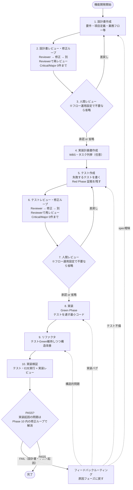

# 設計から実装までのフロー

## このドキュメントの目的

新規機能開発・機能追加時の **設計 → テスト → 実装 → レビュー** のフローを定義する。AI主導開発における品質ゲートを明示し、「動くように見えるが仕様を満たしていない」コードの混入を防ぐことを目的とする。

本フローは [VCSDD（Verified Coherence Spec-Driven Development）](https://github.com/sc30gsw/vcsdd-claude-code) の方法論をベースに、本プロジェクトの実情（商用Webアプリ・MVP1検証段階）に合わせてカスタマイズしたハイブリッド構成である。

---

## フロー全体図



---

## 10フェーズの詳細

### Phase 1. 設計書作成

| 項目 | 内容 |
| ---- | ---- |
| 入力 | 要件メモ・利用フロー・画面モック等 |
| 成果物 | `docs/設計/<画面名>/<画面名>_設計書.md`（「テストレベル判定」節を含む） |
| 実施者 | Builder AI（人間が伴走） |
| ツール | `flow-phase1-design-doc` skill |
| ゲート | なし（次フェーズでレビュー・修正ループ） |

**テストレベル判定（2026-07-12 追加）：** `docs/開発プロセス/テストレベル選定トリガー表.md` と照合し、影響度トリガー・発生可能性トリガーの該当有無を設計書に記載する。画面操作を伴う機能由来のシナリオも洗い出し、クリティカルパス業務トリガー該当分はE2E自動化対象、非該当分はE2E候補カタログの候補として一覧化する。

### Phase 2. 設計書レビュー（レビュー・修正ループ）

| 項目 | 内容 |
| ---- | ---- |
| 入力 | Phase 1 の設計書 |
| 成果物 | `docs/設計/<画面名>/_review/spec/findings.md`（各回の findings 一覧と severity） |
| 実施者 | Reviewer AI（**fresh context**・司令塔と分離）＋（Critical / Major がある場合）Fix Builder AI（fresh context） |
| ツール | `reviewer` 役割・`fix-builder` 役割（役割ファイル：`.claude/skills/flow-agent-roles/roles/reviewer.md`・同 `fix-builder.md`）／`flow-phase2-spec-review` skill |
| ゲート観点 | 仕様の曖昧性／要件の網羅／エッジケースの欠落／受け入れ条件の検証可能性／非ゴールの明確性／フォーマット準拠 |
| 出力形式 | severity（Critical / Major / Minor）の3段階と該当箇所を必ず明記。「全体的によい」等の感想は禁止 |
| ゲート | **Critical / Major が 0 件になるまでレビュー・修正ループを回す**（下記） |

**レビュー・修正ループ（2026-08-08 改訂）：** Reviewer が Critical / Major を報告した場合、司令塔は (1) `fix-builder`（初回作成者とは別の fresh context）に該当 findings のみを修正させ（指摘対象外の箇所は変更禁止＝デグレ防止）、(2) **前回とは別の** fresh context の Reviewer を新規起動して再レビュー（前回 findings の解消確認＋修正差分の新規欠陥検出に限定）させる。これを Critical / Major が 0 件になるまで繰り返す。修正サイクルは最大3回で、超えたら人間にエスカレーションする。

**重要：** Reviewer・Fix Builder は **毎回必ず新規エージェントとして起動** し、成果物ファイルを disk から読む。司令塔と同じ会話履歴を共有してはならない（VCSDD原則7「Entropy Resistance」）。

**findings 書き出しの運用：** Reviewer は Read 専用（Read / Glob / Grep のみ）として運用する（Phase 6/10 も同様）。findings は Reviewer の最終応答テキストとして返却され、司令塔（メイン会話のAI）が `_review/<phase>/findings.md` に Write する（各回を「第N回」として追記）。これは Claude Code harness レベルで「分析mdファイルの書き出し」が制限されるケースがあるため、Reviewer 側で書き出させる運用は採用しない。

### Phase 3. 人間レビュー（設計書承認ゲート・フロー運用設定で省略可）

| 項目 | 内容 |
| ---- | ---- |
| 入力 | 設計書 + Phase 2 の findings |
| 成果物 | 承認 or 差戻し判定 |
| 実施者 | **人間** |
| ゲート判断 | findings を材料に、設計書の修正要否を判断。Critical / Major findings が残っている場合は差戻し。**テスト記述に直接関わる未決事項が残っている場合も差戻し**（下記） |
| 省略可否 | `docs/開発プロセス/フロー運用設定.md` で「Phase 3 不要」と設定されている場合はスキップする。その場合、Phase 2 のループ収束（Critical / Major 0 件）をもって司令塔が設計書ステータスを「合意済」に更新し、findings.md にスキップ記録を追記して Phase 4 へ進む |

差戻し → Phase 1 に戻る（修正後、再度 Phase 2 でレビュー）。

**テスト記述に直接関わる未決事項の解消（必須ゲート項目）：** DB カラム名／デフォルト orderBy／enum 未知値のフォールバック挙動／バリデーションエラー時の error code など、**テストの期待値を確定させる事項**が未決のまま Phase 5 に入ると、曖昧さを温存したテストが書かれ Phase 6 で必ず指摘される（実走で確認済み）。Phase 3 の承認時にこれらの解消を必ず確認する。Phase 3 を省略する設定の場合は、Phase 2 のレビュー観点でこの種の未決事項を **Critical** として扱う（＝解消しない限りループが収束しない）ことで担保する。

### Phase 4. 実装計画書作成（任意）

| 項目 | 内容 |
| ---- | ---- |
| 入力 | 承認済み設計書 |
| 成果物 | `docs/設計/<画面名>/<画面名>_実装計画.md`（大規模機能の場合は実装スコープの決定を含む） |
| 実施者 | Builder AI（実装スコープは人間が最終決定） |
| ゲート | なし |
| 任意性 | 簡単な機能ならスキップ可。複雑・依存関係があればWBS化推奨 |

**実装スコープの決定（2026-07-12 追加。`docs/開発プロセス/ブランチ運用方針.md` 参照）：** 対象機能のボリュームが大きい場合、Phase 1-3 は機能全体を対象に一度で行うが、実装（Phase 4以降）は安全にマージできる単位に分割し、複数回に分けてdevelopへ直接マージしてよい。Builder AI が分割案（新規追加のみで完結する部分を優先／既存の挙動を変更する部分は依存が揃うまで後続へ）を提案し、人間が確定する。スコープが機能全体でなくなった場合はブランチ名（`add/<機能名>` 等）をスコープが分かる名前にリネームすることを検討する。

### Phase 5. テスト作成（Red Phase）

| 項目 | 内容 |
| ---- | ---- |
| 入力 | 承認済み設計書（テストレベル判定を含む） |
| 成果物 | テストファイル（Vitest: `*.test.ts` + 必要に応じて `*.integration.test.ts`）+ Red Phase log（テスト実行結果）+（該当時）E2Eシナリオ仕様の確定・E2E候補カタログへの追記 |
| 実施者 | ワーカーAI（`test-builder` 役割・**fresh context**）。影響度トリガー該当分はテスト仕様を人間が確定（結合DB込み：人間本記載／クリティカルパスE2E：AI起案→人間承認）。起動・ゲート独立検証・証拠記録は司令塔（メイン会話のAI） |
| ゲート | **新規テストが全件失敗** + **既存テスト（リグレッション）は全件成功** であることを実行ログで証明（司令塔が独立に再実行して確認） |

**サブステップ構成（2026-07-12 追加。`docs/開発プロセス/テストレベル選定トリガー表.md`・`テスト観点表テンプレート.md` 参照）：**

```
5-a. 該当トリガー確認（Phase 1「テストレベル判定」節を参照）
5-b. 【影響度トリガー該当分のみ】テスト仕様確定フロー（2026-07-21 改訂）
     結合(DB込み)：AI観点表生成 → 人間本記載 → Reviewer レビュー → 人間確定
     E2E（クリティカルパス）：AIが設計書を根拠にシナリオ仕様を全件起案 → Reviewer レビュー → 人間が修正・承認して確定
     （設計書承認の時点で担保すべきクリティカル機能は確定しているため、E2EはAIが起案して人間に提案する。人間の承認なしの凍結は不可）
5-c. 【発生可能性トリガーのみ／トリガーなし】現行どおり test-builder が機械的に導出
5-d. test-builder が確定仕様をコード化
     結合(DB込み)：ここでコード化・Red Phase証拠取得
     E2E（クリティカルパス）：ここで仕様凍結のみ完了。コード化・実行は Phase 10 内（後述「E2E：仕様凍結とコード化の分離」参照）
5-e. クリティカルパス外の画面操作シナリオを `docs/開発プロセス/E2E候補カタログ.md` に追記
```

新規フェーズ番号は追加せず、Phase 5 のサブステップとして位置づける（フロー全体の再定義・全skill改訂を避けるため）。

**「テスト先行」の原則：** 実装コードはこの時点ではまだ書かない。テストが失敗することの証拠を残すことで、後の Phase 8 で「テストを実装に合わせて作った」を防ぐ。

**Red Phase 証拠の粒度（スタブ最小実装方式）：** Phase 5 ではテスト対象関数の**スタブ最小実装**（シグネチャと固定ダミー返却のみ。条件分岐・整形・フィルタ等の実ロジックは書かない）を併せて作成し、新規テストは import エラーの一括失敗ではなく**期待値不一致で個別に FAIL** させる。これにより (1) Red Phase log に個々のテストの失敗が enumerate され、(2) スタブ段階で PASS してしまうテストを**トートロジー疑い**として Red Phase の時点で検出できる。import エラー型の Red Phase 証拠は原則不可とし、やむを得ず残る場合は対象と理由を証拠に明記する（2026-07-12 決定）。

Red Phase log のフォーマット（例）：

```
[Red Phase Evidence]
- Date: 2026-05-04 16:30:00
- new-feature-tests: FAIL (15 tests)
- regression-baseline: PASS (243 tests)
```

### Phase 6. テストレビュー（レビュー・修正ループ・本フロー固有・VCSDD canonical 拡張）

| 項目 | 内容 |
| ---- | ---- |
| 入力 | Phase 5 のテストファイル + 設計書 |
| 成果物 | `docs/設計/<画面名>/_review/test/findings.md`（各回の findings） |
| 実施者 | Reviewer AI（fresh context）＋（Critical / Major がある場合）Fix Builder AI（fresh context・Phase 5 の test-builder とは別インスタンス） |
| ツール | `reviewer` 役割・`fix-builder` 役割（役割ファイル：`.claude/skills/flow-agent-roles/roles/reviewer.md`・同 `fix-builder.md`）／`flow-phase6-test-review` skill |
| ゲート観点 | 設計書の各受け入れ条件にテストが対応しているか／**トートロジーテストの検出（モックが返す値をそのまま assert していないか）**／エッジケース・例外系の網羅／テストが過剰に実装詳細を縛っていないか／Red Phase log の妥当性（スタブ最小実装方式に従い期待値不一致で個別に FAIL しているか）／認可・PII等のセキュリティ観点が拾えているか |
| ゲート | **Critical / Major が 0 件になるまでレビュー・修正ループを回す**（Phase 2 と同じ方式。修正後は Red Phase の維持——新規テスト期待値不一致 FAIL＋既存 PASS——を司令塔が独立検証してから再レビュー）。修正サイクルは最大3回で、超えたら人間にエスカレーション。設計書の不備に起因する findings はループで解消せず Phase 1 へ差し戻す |

**なぜこのフェーズを置くか：** AIは「テスト先に書いて、後で実装をテストに合わせる」が起きやすい。テスト段階で独立レビューすることで、「テストが仕様を正しく表現していない」を実装前に検出する。VCSDD canonical の Phase 3（実装後のレビュー）でも検出できるが、その時点では実装が無駄になる。

### Phase 7. 人間レビュー（テスト承認ゲート・フロー運用設定で省略可）

| 項目 | 内容 |
| ---- | ---- |
| 入力 | テスト + Phase 6 findings |
| 成果物 | 承認 or 差戻し判定 |
| 実施者 | **人間** |
| ゲート判断 | テストが仕様を正しく表現しているかを最終確認。Critical/Major findings が残っている場合は差戻し |
| 省略可否 | `docs/開発プロセス/フロー運用設定.md` で「Phase 7 不要」と設定されている場合はスキップする。その場合、Phase 6 のループ収束（Critical / Major 0 件）をもって司令塔が findings.md に承認済み記録（スキップ記録）を追記して Phase 8 へ進む |

差戻し → Phase 5 に戻る。

### Phase 8. 実装（Green Phase）

| 項目 | 内容 |
| ---- | ---- |
| 入力 | 承認済みテスト + 設計書 |
| 成果物 | 実装コード + Green Phase log |
| 実施者 | ワーカーAI（`impl-builder` 役割・**fresh context**）。起動・ゲート独立検証・証拠記録は司令塔（メイン会話のAI） |
| ゲート | **対象機能のテスト全件成功** + **既存テスト（リグレッション）も全件成功**（司令塔が独立に再実行して確認）+ **テストファイル無変更**（git diff で確認） |
| 制約 | テストを通す **最小限のコード** を書く。過剰な抽象化・将来拡張は禁止（リファクタはPhase 9 で別途行う）。**テストファイルの変更・スキップは禁止** |

Green Phase log のフォーマット（例）：

```
[Green Phase Evidence]
- Date: 2026-05-04 18:00:00
- target-feature-tests: PASS (15 tests)
- regression-baseline: PASS (243 tests)
```

### Phase 9. リファクタ

| 項目 | 内容 |
| ---- | ---- |
| 入力 | Phase 8 のコード |
| 成果物 | リファクタ後のコード（テストGreen維持） |
| 実施者 | Builder AI |
| ゲート | リファクタ前後で全テスト成功維持 |
| 観点 | 重複削除（DRY）／命名改善／責務分離／抽象度の調整／可読性向上 |
| ツール | （TS/JS時）静的解析 **fallow**（fallow-rs）で候補を機械抽出（dupes / dead-code / health / 循環依存 → 5観点にマッピング）。**advisory・非ゲート**（採否は人間判断。指摘の有無で FAIL しない） |

**なぜ Phase 8 と分けるか：** 「動くこと」と「良いコード」の責任を分離する。Phase 8 で過剰に綺麗なコードを狙うと「テストを通す責務」と「設計品質の責務」が混ざってAIが迷子になる。リファクタフェーズを独立させることで、テストを安全網として構造変更できる。

簡単な機能ではスキップ可（lean運用）。

### Phase 10. 実装検証（テスト・E2E 実行＋実装レビュー）

| 項目 | 内容 |
| ---- | ---- |
| 入力 | リファクタ後のコード + テスト + 設計書 +（該当時）Phase 5 で凍結した E2E シナリオ仕様 |
| 成果物 | `docs/設計/<画面名>/_review/impl/verification-evidence.md`（実行検証の証拠）+ 同 `findings.md`（レビュー結果）+（該当時）E2E コード（`tests/*.spec.ts`） |
| 実施者 | 司令塔 AI（E2E コード化・実行検証）+ Reviewer AI（`reviewer` 役割・**fresh context**）＋（修正が必要な場合）Fix Builder AI（`fix-builder` 役割・fresh context・Phase 8 の impl-builder とは別インスタンス） |
| ツール | `flow-phase10-impl-review` skill／役割ファイル：`.claude/skills/flow-agent-roles/roles/reviewer.md`・同 `fix-builder.md` |
| ゲート（実行検証・主） | 全テスト（単体・結合・DB込み）PASS + テストファイル無改変 + **E2E PASS（当該機能分＋既存クリティカルパス全件）** + lint / 型 / build PASS。司令塔が自ら実行して確認 |
| ゲート（レビュー・従） | 仕様忠実性・セキュリティの2観点。findings は **Critical / Major / Minor の3段階**で報告（命名・構造・別解提案は原則 Minor＝ゲート対象外） |
| 判定・修正ループ | 実行検証すべて PASS かつ Critical / Major 0 件で総合 PASS。実装起因の実行失敗・Critical / Major findings は **Phase 10 内の修正ループ**（fix-builder → 機械ゲート全件再実行 → 別 Reviewer で再レビュー）で解消する（最大3サイクル・超過時は人間にエスカレーション）。設計書・テスト起因の問題はループで解消せずフィードバックルーティングへ |

**2026-07-20 改訂：** 従来の「5次元 敵対的レビュー」を「実行検証（主）＋レビュー（従）」に変更した。理由：Phase 10 の実装はレビュー済み設計書（Phase 1-3）と独立レビュー済みテスト（Phase 5-7）に挟まれており、第3のフルレビューは限界効用が低い一方、構造・命名等の Minor 指摘が量産されフローの回転を遅くしていた。品質保証の主役を「実行による証明」（全テスト＋E2E）に移し、レビューは実行では拾えない欠陥（仕様乖離・セキュリティ）に絞る。構造品質は Phase 9（リファクタ）の責務とする。

**2026-08-08 改訂：** レビュワーを `reviewer` 役割（3段階報告）に統一し、実装起因の問題は Phase 10 内のレビュー・修正ループ（Phase 2/6 と同じ方式。ただしテストファイル変更は禁止）で自動解消する方式に変更した。

**E2E コード化のタイミング：** Phase 5 で凍結したシナリオ仕様（操作手順・期待結果）を、本フェーズ内でコード化してから実行する（従来の「Phase 10 完了後」から前倒しし、実行を義務化）。凍結済み仕様の改変は禁止。実装との乖離を発見した場合は中断して人間に報告する。

#### FAIL時：フィードバックルーティング

実行失敗・findings の内容に応じて対応先を特定する。実装起因のものは Phase 10 内の修正ループで解消し、それ以外はフェーズを戻す：

| 失敗・findings の種類 | 対応先 |
| ----------------- | ------ |
| テスト・E2E の実行失敗（実装バグ） | Phase 10 内の修正ループ（fix-builder） |
| 実装の仕様乖離・セキュリティ欠陥 | Phase 10 内の修正ループ（fix-builder）※テストで再発防止すべきものは Phase 5 へのテスト追加を提案 |
| 仕様の曖昧性・要件不足 | Phase 1（設計書作成） |
| エッジケースの欠落 | Phase 1 + Phase 5 |
| テストの不備 | Phase 5（テスト作成） |
| 修正ループ上限（3サイクル）到達 | 人間にエスカレーション |

---

## 役割分担

| 役割 | 担当 | 制約 |
| ---- | ---- | ---- |
| 設計書作成・実装計画書作成・リファクタ・E2Eコード化と実行検証（Phase 10）・フェーズ遷移管理 | 司令塔 AI（メイン会話） | 一連の文脈を保持して作業。ワーカー・レビュワーの起動、ゲートの独立検証、証拠・findings の disk 書き出しも担当 |
| テスト作成（Phase 5）・実装（Phase 8） | ワーカーAI（`test-builder` / `impl-builder` 役割） | **必ず新規エージェント起動（fresh context）**。disk 上の承認済み成果物のみを仕様の根拠とする。判断できないことは推測せず質問として返す |
| レビュー（設計書／テスト／実装。Phase 2/6/10） | Reviewer AI（`reviewer` 役割） | **必ず毎回新規エージェント起動**（再レビューも前回とは別インスタンス）。司令塔と会話履歴を共有しない。ファイルのみ読む（Read 専用）。findings は Critical / Major / Minor の3段階で報告。Critical / Major には具体的な失敗シナリオ必須 |
| findings の修正（Phase 2/6/10 の修正ループ） | Fix Builder AI（`fix-builder` 役割） | **必ず新規エージェント起動**（初回作成者とは別インスタンス）。指定された Critical / Major findings のみを修正し、関係ない箇所は変更しない（デグレ防止）。実装修正時はテストファイル変更禁止 |
| 設計書承認・テスト承認（Phase 3/7。フロー運用設定で省略可） | **人間** | findings を材料に判断 |
| フィードバックルーティング判断 | 人間 + 司令塔 AI | findings の severity と原因フェーズを照合 |

**ワーカー分離の理由（Phase 5・8）：** テスト作成者が設計議論の記憶で設計書の曖昧さを補うと、設計書の不備が顕在化しない。実装者がテスト作成の文脈を持つと、テストの意図に合わせ込む余地が残る。fresh context のワーカーは disk 上の承認済み成果物だけを読むため、これらの余地が構造的に消え、同時に「成果物だけで次工程が成立するか」という自己完結性の検証を兼ねる。ワーカーの規律（テスト変更禁止・最小限実装等）は各役割ファイル（`.claude/skills/flow-agent-roles/roles/test-builder.md`・同 `impl-builder.md`）に固定し、ゲート検証は司令塔がワーカーの自己申告に頼らず独立に再実行する。

**役割定義の管理（役割ファイル方式・2026-07-13 変更）：** ワーカー・Reviewer・Fix Builder の役割定義は、特定ツールのカスタムエージェント形式に依存しないプレーンな Markdown の役割ファイル（`.claude/skills/flow-agent-roles/roles/`）を正本とする。起動時に fresh context のサブエージェントへ役割ファイルを最初に読み込ませることで、Claude Code / Codex / Cursor など汎用サブエージェント機能を持つ任意のツールで同じ役割を再現できる。ツール固有のカスタムエージェント定義（`.claude/agents/` 等）は使用しない。Reviewer の読み取り専用（Read / Glob / Grep 相当のみ）の制約は役割ファイル内の指示で担保する。

---

## 既存ドキュメント形式との対応

| 本フローのフェーズ | 本プロジェクトの既存形式 |
| ------------------ | -------------------- |
| Phase 1 設計書作成 | `docs/設計/<画面名>/<画面名>_設計書.md`（フォーマットは `docs/設計/設計書フォーマット.md`） |
| Phase 4 実装計画書作成 | `docs/設計/<画面名>/<画面名>_実装計画.md` |
| Phase 5 テスト作成 | Vitest（`__tests__/` 配下、`*.test.ts` + `*.integration.test.ts`） |
| Phase 8 実装 | 通常の実装（コーディング規約は `AGENTS.md` 参照） |
| レビュー findings（Phase 2/6/10） | `docs/設計/<画面名>/_review/<spec|test|impl>/findings.md` |
| Phase 10 実行検証証拠 | `docs/設計/<画面名>/_review/impl/verification-evidence.md` |

レビュー成果物の置き場所として、各設計フォルダに `_review/` サブディレクトリを設ける。

---

## ゲート運用ルール

### 厳格運用（safety-critical な機能）

- 全10フェーズを順守
- 各ゲートの差戻しは妥協しない
- レビュー findings の Critical / Major は必ず解消（修正ループの収束条件）

### lean 運用（プロトタイプ・MVP検証）

- Phase 4（実装計画書）は省略可
- Phase 9（リファクタ）は明らかに不要なら省略可
- レビュー findings の Minor は記録のみで通過可

ただし **以下のフェーズは省略不可**：

- Phase 2（設計書レビュー・修正ループ）
- Phase 5（テスト作成・Red Phase 証拠）
- Phase 6（テストレビュー・修正ループ）
- Phase 8（実装・Green Phase 証拠）
- Phase 10（実装検証：テスト・E2E 実行＋実装レビュー・修正ループ）

※Phase 3/7（人間承認）の省略は lean 運用とは独立に `docs/開発プロセス/フロー運用設定.md` で設定する。

### Severity 判定基準（レビュー共通・Phase 2/6/10）

Phase 2/6/10 のレビューはいずれも Critical / Major / Minor の3段階で findings を報告する（`reviewer` 役割ファイル参照）。**Critical / Major は修正ループの対象**であり、0 件になるまでフェーズは収束しない。

| Severity | 定義 | 扱い |
| ---- | ---- | ---- |
| Critical | 仕様違反・セキュリティ欠陥・トートロジーテストなど、放置するとフローの品質保証が成立しないもの | **修正必須**（修正ループで解消。解消まで次フェーズへ進めない） |
| Major | 品質・保守性・網羅性に実害があるが、回避策や後続対応が可能なもの | **修正必須**（同上） |
| Minor | 改善が望ましいが実害が限定的なもの（命名・構造・別解提案を含む） | 記録のみで通過可（対応は任意） |

修正ループが上限（3サイクル）に達しても Critical / Major が残る場合は人間にエスカレーションし、人間が残 findings の扱い（修正継続／対応方針の文書化による通過／差し戻し）を判定して findings.md に追記する。人間承認ゲート（Phase 3/7・設定により省略可）でも、この基準に基づき findings の扱いを判定し、判定結果を findings.md に追記する。

---

## このフローを採用する理由

### AI主導開発の構造的問題

- AIは「動くように見えるコード」を生成しやすい（surface plausibility）
- 仕様の曖昧性・テストの抜け穴・構造的負債は表層レビューでは検出されない
- 人間レビューだけでは AI の生成スピードに追いつかない

### 本フローの解決策

| 問題 | 対応 |
| ---- | ---- |
| 仕様の曖昧性 | Phase 2 で独立 Reviewer が網羅検出し、修正ループで解消 |
| テストが仕様を正しく表現していない | Phase 6 で独立レビューし、修正ループで解消 |
| 実装がテストに合わせ込まれる | Phase 5 で Red Phase 証拠を必須化 |
| 「動くけど構造が悪い」コード | Phase 9 リファクタを独立フェーズ化 |
| テストが検証していない欠陥（仕様乖離・セキュリティ） | Phase 10 の実行検証（全テスト＋E2E）＋仕様忠実性・セキュリティレビュー＋修正ループ |
| 作成者と Reviewer の認知バイアス共有 | Reviewer・Fix Builder を毎回 fresh context で起動（再レビューも別インスタンス） |
| 修正によるデグレ | fix-builder の修正範囲制限（指定 findings のみ）＋司令塔の差分検証＋別 Reviewer による再レビュー |

---

## メタ：本フロー自体の検証

本フローは **完成形ではない**。実際の機能開発で運用しながら、以下の観点で改善する：

- 各フェーズの所要時間・効果
- Reviewer findings の質（過剰検出 / 漏れ / severity の較正）
- 修正ループの収束回数・デグレ発生の有無
- 人間レビュー負荷（Phase 3/7 スキップ設定の妥当性を含む）
- ゲート差戻しの発生頻度

---

## テスト種別とフロー内での位置づけ

本フローで扱うテスト種別と、それぞれの実施タイミングを定義する。

### Phase 5（テスト作成）の対象

| テスト種別 | 対象 | ファイル命名 | 実行コマンド |
| ---- | ---- | ---- | ---- |
| 単体テスト | 純粋関数、ヘルパー関数 | `*.test.ts` | `npm run test` |
| 結合テスト（内部） | Route Handler（Prisma/auth モック化） | `*.test.ts` | `npm run test` |
| 結合テスト（DB込み） | 影響度トリガー（認可境界・PII等）または発生可能性トリガー（DB制約等）に該当する機能 | `*.integration.test.ts` | `npm run test:integration` |

**結合(DB込み)テストの判断基準（2026-07-12 改訂）**：`docs/開発プロセス/テストレベル選定トリガー表.md` の二軸トリガーで判定する。

- **発生可能性トリガー**（ユニーク制約・FK制約・実JOINクエリ・トランザクションの原子性・モックでは再現困難な状態遷移）：技術的検証のため test-builder が機械的に導出（5-c）
- **影響度トリガー**（認可境界・PII取扱い・認証セッション・不可逆操作・金銭契約）：人間本記載フロー（5-b）を経て test-builder がコード化

テストヘルパーは `src/test/db-helpers.ts` を使用する。

### E2E：仕様凍結とコード化の分離（2026-07-12 改訂）

E2Eは**自動化対象（クリティカルパス）**と**候補カタログ（それ以外の機能由来シナリオ）**の二層構造とする（`docs/開発プロセス/テストレベル選定トリガー表.md` 5章参照）。UIコンポーネント単位の独立レベル（RTL等）は新設せず、画面操作に関わるテストはすべてE2Eの枠内で扱う。

| 区分 | シナリオ仕様の確定 | コード化 | 実行コマンド |
| ---- | ---- | ---- | ---- |
| E2E（自動化・クリティカルパス業務トリガー該当） | Phase 5（AI起案→人間承認、5-b） | Phase 10 内・実行検証の前（`tests/*.spec.ts`） | `npm run test:e2e`（Phase 10 の実行検証ゲートで必須） |
| E2E候補（カタログ） | Phase 5（5-e、`docs/開発プロセス/E2E候補カタログ.md` に記録） | 行わない（人間が手動実施、または将来自動化に昇格） | ─ |

**コード化を実装完了後に分離する理由**：実装前にE2Eコードを書くと画面が存在せず一括失敗となり、Red Phase証拠の粒度（スタブ最小実装方式）で解決した「失敗理由を区別できない」問題が再発する。セレクタも実在DOMに依存するため実装前は書けない。**ただし仕様（操作手順・期待結果）はテスト先行の原則どおりPhase 5で凍結し、実装がテストに合わせ込まれることを防ぐ。**

**実行の義務化（2026-07-20 改訂）**：コード化した当該機能の E2E と既存の自動化済み E2E 全件（クリティカルパス常設スイート）は、Phase 10 の実行検証ゲートとして `npm run test:e2e` で全件 PASS を確認する。「PR 前に実行を推奨」ではなくフローの必須ゲートである。

CI では `playwright.yml` で PR 作成時に自動実行される（対象は自動化区分のみ）。

### Phase 8（実装）のゲート確認

Phase 8 の次フェーズ条件は以下のすべてを満たすこと：

```bash
npm run test              # 単体テスト + 結合テスト（内部）全件 PASS
npm run test:integration  # 結合テスト（DB込み）全件 PASS ※該当テストがある場合
npm run lint              # ESLint PASS
npm run check-types       # TypeScript 型チェック PASS
npm run build             # ビルド成功
```

---

## 本フロー未対応の論点（将来対応）

機能横断で扱うべき論点で、現状の10フェーズフローではカバーしきれていないもの。アジャイル開発の本格導入時等に方針策定する。

- **システム間結合テスト**：user/company/admin を横断するテスト。3リポジトリの同時起動・API仕様書整備・テストデータ整合性管理が前提。基盤未整備
- **非機能テスト**：k6（負荷）・OWASP ZAP（セキュリティ）。性能要件の確定・ベースライン計測が先。基盤未整備
- **テスト方針の蓄積場所**：論点が増えた場合は `docs/開発プロセス/テスト戦略.md` 等の専用ドキュメントへ分離する
- **non-Web プロジェクトへの適用**：本フローは Next.js の Web アプリを前提にしている。バッチ・CLI・モバイル等への適用は別途検討

---

## 参考

- VCSDD 公式: https://github.com/sc30gsw/vcsdd-claude-code
- AGENTS.md（本リポジトリ）: テストフレームワーク・コーディング規約
- `docs/設計/設計書フォーマット.md`: 設計書の最低限フォーマット
- `docs/設計/共通機能設計書.md`: システム全体共通仕様
- `docs/開発プロセス/フロー運用設定.md`: 人間承認ゲート（Phase 3/7）の要否設定
- `docs/開発プロセス/テストレベル選定トリガー表.md`: 結合(DB込み)・E2Eのレベル選定基準（トラックB-2）
- `docs/開発プロセス/テスト観点表テンプレート.md`: テスト仕様確定フロー（結合DB込み：人間本記載／E2E：AI起案→人間承認）の様式・E2E候補カタログの形式（トラックB-1）
- `docs/開発プロセス/ブランチ運用方針.md`: 大規模機能のブランチ分割・実装スコープ決定の基準（Phase 4）
