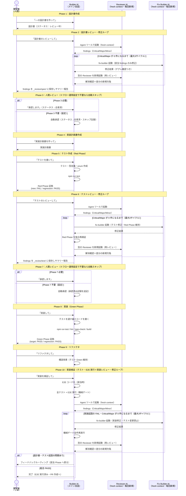

# 開発フロー実践ガイド（社内エンジニア向け）

## 1. このドキュメントの目的

本ドキュメントは、本プロジェクトで採用している **新規機能開発の10フェーズフロー** を、初めて使う開発者が **自分の手で実行できるようになる** ことを目的とする。

### 想定読者

- 本プロジェクトに参加した（する）社内エンジニア
- 機能設計から実装までを Claude Code（AI）と協働で進める前提

### 既存資料との関係

| 資料 | 役割 | 読むタイミング |
|---|---|---|
| **本ドキュメント** | 実践ガイド（手順書）| **最初に読む** |
| `設計から実装までのフロー.md` | フロー定義の正典 | より深く知りたい時 |
| `AGENTS.md` | テスト指針・skill 対応表 | フロー中に都度参照 |

### 完了後にできること

- 自分が担当する機能を Phase 1 から Phase 10 まで運用できる
- どの場面で人間が判断すべきか・AIに任せていいかが分かる
- AI レビュー・修正ループを使いこなして AI 主導開発の落とし穴を回避できる

---

## 2. 開発フロー全体図

10フェーズと4つの役割（**人間 / Builder AI / Reviewer AI / Fix Builder AI**）の関係を示す。



---

## 3. 役割分担の早見表

開発フローには **4つの役割** がある。誰が何をするかを最初に押さえる。

### 3.1 開発者（人間）

主な責務：**判断と承認**。

| やること | 具体例 |
|---|---|
| 機能の意図を伝える | 「○○画面の設計書を作って」と Builder に依頼 |
| Reviewer findings を読んで判断 | Critical/Major/Minor と修正ループの経緯を確認 |
| 仕様の最終承認（Phase 3 / Phase 7。フロー運用設定で省略可） | ステータス変更を依頼、承認記録を残す |
| 修正ループのエスカレーション対応 | 3サイクルで収束しない findings・仕様判断が必要な findings の扱いを決める |
| ビジネス・業務面の整合性確認 | AI が踏み込めない領域の妥当性判断 |
| つまずいたら止める | 「ここおかしいから戻って」と判断する |

**やらないこと**：

- Builder の代わりにコードを書く（Builder に任せる）
- Reviewer の代わりに自分で全網羅レビューする（Reviewer に任せて findings と収束結果を判断する）

### 3.2 Builder AI（メイン会話の Claude）

主な責務：**生成と実行**。

| やること | 具体例 |
|---|---|
| 設計書・実装計画書・テスト・実装コードの生成 | 開発者の指示に応じて成果物を作成 |
| Reviewer / Fix Builder を Agent ツールで起動 | 毎回新規の fresh context として呼び出す（再レビューも別インスタンス） |
| Reviewer の findings を disk に保存 | `_review/<phase>/findings.md` に Write（各回を「第N回」として追記） |
| 修正ループの制御 | Critical / Major が 0 件になるまで「修正 → 再レビュー」を回す（最大3サイクル） |
| テスト実行・Lint・型チェック・ビルド | コマンド実行と結果報告（修正後の差分検証・Red Phase 再検証を含む） |
| 次フェーズの案内 | 各 Phase 完了時に「次は〇〇です」と提案（Phase 3/7 スキップ設定時は自動で次へ） |

**やらないこと**：

- レビューや findings の修正を自分で代行する（fresh context が必須）
- 開発者の承認を自分で代行する（フロー運用設定でスキップが明示された場合を除き、人間の判断ポイントを侵食しない）

### 3.3 Reviewer AI（fresh context の Claude）— Phase 2 / 6 / 10

主な責務：**成果物の独立レビュー**。実害のある欠陥を確実に検出し、正確な severity で報告する。

| やること | 具体例 |
|---|---|
| 設計書・テスト・実装を独立レビュー | 呼び出し元が指定する観点（仕様/エッジケース/トートロジー/セキュリティ 等）で評価 |
| 具体的 findings を返す | severity（Critical / Major / Minor）の3段階と該当行を必ず明記。Critical / Major は失敗シナリオ必須 |
| 「全体的によい」を禁止 | 観点ごとに具体評価を出す（確認箇所の裏付けのない PASS は不可）|
| 再レビュー（修正ループ2周目以降） | 前回 findings の解消確認＋修正差分の新規欠陥検出に限定（指摘の積み増しをしない） |

**重要な制約**：

- **毎回新規の fresh context として起動**：Builder の会話履歴・反論を引き継がない。再レビューも前回とは別インスタンス
- **Read 専用**：findings の disk 書き出しは Builder が代行する（runtime 制約のため）
- 命名・構造・スタイル・別解提案は原則 Minor（Phase 10 ではゲート対象外）

### 3.4 Fix Builder AI（fresh context の Claude）— Phase 2 / 6 / 10 の修正ループ

主な責務：**Critical / Major findings の修正**。初回作成者（Phase 1 の Builder / Phase 5 の test-builder / Phase 8 の impl-builder）とは別のエージェントとして起動される。

| やること | 具体例 |
|---|---|
| 指定 findings のみを修正 | Critical / Major の該当箇所だけを最小限に変更 |
| デグレ防止 | findings に関係しない箇所は変更しない。リファクタ・「ついでの改善」禁止 |
| 修正の検証 | コード修正時はテスト実行、テスト修正時は Red Phase 維持を確認してから完了報告 |

**重要な制約**：

- **毎回新規の fresh context として起動**（初回作成者の思い込みを引き継がない）
- 実装修正時は**テストファイル変更禁止**。テスト修正時は**アサーション弱体化禁止**
- 仕様判断が必要な findings は修正せず中断・報告する（人間にエスカレーション）

---

## 4. 各フェーズの実践手順

各フェーズは以下の統一フォーマットで記述する：

- **開発者の役割**：観察 / 操作 / 判断 / 承認 のいずれか
- **入力**：前フェーズから受け取るもの
- **開発者のアクション**：実際に何をすればよいか（発話例つき）
- **出力**：このフェーズの成果物
- **次フェーズへ進む条件**：ゲート判定

---

### Phase 1：設計書作成

| 項目 | 内容 |
|---|---|
| **開発者の役割** | 操作（指示出し）+ 観察 |
| **入力** | 機能要件・利用フロー・画面モック等 |
| **開発者のアクション** | Builder に「**○○の設計書を作って**」と依頼。Builder から「単発利用 or フロー利用？」と聞かれたら「**フロー利用**」と答える。提示された構成案を確認し、機能特性に合わせて項目の追加・削減を依頼してもよい |
| **出力** | `docs/設計/<画面名>/<画面名>_設計書.md`（ステータス：レビュー中） |
| **次フェーズ条件** | 設計書ファイルが生成されている |

**コツ**：要件・画面モック等の参考資料があれば、Builder に最初に渡す。後から見つかると修正コストが上がる。

---

### Phase 2：設計書レビュー・修正ループ

| 項目 | 内容 |
|---|---|
| **開発者の役割** | 操作（指示出し）+ 観察 |
| **入力** | Phase 1 の設計書 |
| **開発者のアクション** | Builder に「**設計書のレビューして**」と依頼。Builder が Reviewer を fresh context で起動し、findings（Critical / Major / Minor）を受け取る。Critical / Major があれば Builder が fix-builder（fresh context）に修正させ、**別の** Reviewer で再レビュー——を 0 件になるまで自動で繰り返す（最大3サイクル）。**自分で Reviewer と会話しない** |
| **出力** | `_review/spec/findings.md`（各回の findings と収束経緯） |
| **次フェーズ条件** | Critical / Major 0 件で収束し、サマリーが手元に届いている |

**注意**：3サイクルで収束しない場合・仕様判断が必要な findings がある場合は Builder からエスカレーションされるので、扱いを判断する。

---

### Phase 3：人間レビュー（設計書承認ゲート・フロー運用設定で省略可）

| 項目 | 内容 |
|---|---|
| **開発者の役割** | **判断 + 承認**（このフェーズは人間が主役） |
| **入力** | 設計書 + Phase 2 の findings（Critical / Major は解消済み） |
| **開発者のアクション** | findings を **自分の目で読む**。修正ループの経緯・残 Minor を確認し、以下のいずれかを選択：<br/>1. 「**設計書を修正して。○○を反映**」 → Phase 1 に戻る<br/>2. 「**承認します**」 → Builder が設計書ステータスを「合意済」に更新<br/>3. 「**この未決事項は次回 MTG で決める**」 → 未決事項テーブルに追記して通過 |
| **出力** | 設計書ステータス「合意済」+ findings.md に Phase 3 判定セクションが追記される |
| **次フェーズ条件** | 開発者の承認 |

**省略設定時**：`docs/開発プロセス/フロー運用設定.md` で「Phase 3 不要」の場合、Phase 2 の収束をもって Builder が自動で「合意済」に更新し（スキップ記録つき）、Phase 4 へ進む。このフェーズの作業は発生しない。

---

### Phase 4：実装計画書作成

| 項目 | 内容 |
|---|---|
| **開発者の役割** | 操作（指示出し）+ 観察 |
| **入力** | 合意済み設計書 |
| **開発者のアクション** | 「**実装計画書を作って**」と依頼。Builder から「フル10フェーズ運用 or lean 運用？」を確認される。lean は Phase 4・Phase 9 を省略可。プロトタイプや MVP 検証なら lean を選ぶ |
| **出力** | `docs/設計/<画面名>/<画面名>_実装計画.md` |
| **次フェーズ条件** | 実装計画書が生成され、Phase 0（前提タスク）のブロック状況が分かっている |

**注意**：実装計画書には **Phase 0（前提タスク・他PR/他機能依存）** が含まれる。ブロックされている項目があると Phase 8 が完全実施できないため、ここでブロック状況を把握しておく。

---

### Phase 5：テスト作成（Red Phase）

| 項目 | 内容 |
|---|---|
| **開発者の役割** | 操作（指示出し）+ 観察 |
| **入力** | 合意済み設計書 + 実装計画書 |
| **開発者のアクション** | 「**テストを書いて**」と依頼。Builder が以下を実施：<br/>- 必要な enum 定数・型定義（実装ロジック以外）の追加<br/>- Vitest テストファイル作成（種別ごとに分離。下記「テスト種別の分け方」参照）<br/>- `npm run test` 実行<br/>- Red Phase 証拠の記録 |
| **出力** | テストファイル一式 + `_review/test/red-phase-evidence.md` |
| **次フェーズ条件** | **新規テスト全件 FAIL + 既存テスト全件 PASS** |

**テスト種別の分け方（policy doc / AGENTS.md 準拠）**

policy doc 「テスト自動化の方針」の分類に従い、**種別ごとに別ファイル** で書く：

| 対象コード | テスト種別 | ファイル配置例 | 実行コマンド |
|---|---|---|---|
| API Route Handler（`route.ts`）| **結合テスト（内部）** | `src/app/api/<endpoint>/__tests__/route.test.ts` | `npm run test` |
| ヘルパー関数（`buildXxxWhere`, `buildCsvRow` 等） | **単体テスト** | `src/app/api/<endpoint>/_lib/__tests__/<関数名>.test.ts` | `npm run test` |
| ユーティリティ関数（`_utils/` 配下）| **単体テスト** | `src/app/_utils/__tests__/<関数名>.test.ts` | `npm run test` |
| サービス層のビジネスロジック | **単体テスト** | サービス近傍の `__tests__/` | `npm run test` |
| DB制約・実JOIN・トランザクション検証 | **結合テスト（DB込み）** | `src/app/api/<endpoint>/__tests__/<対象>.integration.test.ts` | `npm run test:integration` |

**DB込み結合テストの判断基準**：以下のいずれかに該当する場合、`*.integration.test.ts` を追加する。

- ユニーク制約や外部キー制約の正しさを検証する必要がある
- 実DBに対するJOINクエリ（`is_deleted` フィルタ等のリレーション条件）の動作を確認する必要がある
- トランザクション（`prisma.$transaction`）の原子性を検証する必要がある
- モックでは再現が困難な状態遷移（ログインロック等）を検証する必要がある

DB込みテストのヘルパーは `src/test/db-helpers.ts` を参照（`truncateAllTables`, `createTestCompany`, `createTestCompanyLogin` 等）。サンプル実装は `src/app/api/_services/__tests__/auth.integration.test.ts` を参照。

**重要原則**：

- **テストが PASS してしまったらおかしい**。実装が無いのに通るテストはトートロジー。Builder に書き直しを依頼する
- 既存テストが FAIL したら **本機能と無関係な flaky test** か確認。本機能由来なら必ず原因を潰す
- このフェーズで実装コードは書かない（Phase 8 の責務）
- **設計書に登場するヘルパー関数ごとに独立した単体テストファイルを必ず作る**。Route Handler のテストだけだと条件分岐の網羅が不十分になりやすい

---

### Phase 6：テストレビュー・修正ループ

| 項目 | 内容 |
|---|---|
| **開発者の役割** | 操作（指示出し）+ 観察 |
| **入力** | Phase 5 のテストファイル + 設計書 + Red Phase 証拠 |
| **開発者のアクション** | 「**テストのレビューして**」と依頼。Reviewer が以下の観点で評価する：<br/>- 仕様の網羅性（受け入れ条件 vs テストの対応マトリクス）<br/>- エッジケース・例外系の網羅<br/>- **テストが実装に合わせ込まれていないか**<br/>- **トートロジーになっていないか**（モックが返さないだけで「除外できている」と誤認していないか。Critical 扱い）<br/>- AGENTS.md / 共通仕様への準拠<br/>Critical / Major があれば fix-builder が修正（Red Phase 維持を Builder が独立検証）→ 別 Reviewer で再レビュー——を 0 件になるまで自動で繰り返す（最大3サイクル）。設計書起因の findings は Phase 1 差し戻しが提案される |
| **出力** | `_review/test/findings.md`（各回の findings と収束経緯） |
| **次フェーズ条件** | Critical / Major 0 件で収束し、サマリーが手元に届いている |

**実例の警告**：本フローの検証で **Builder が書いた PII 除外テストがトートロジー** だった事例がある。独立レビューはこれを検出した。Phase 6 を省略すると見逃す。

---

### Phase 7：人間レビュー（テスト承認ゲート・フロー運用設定で省略可）

| 項目 | 内容 |
|---|---|
| **開発者の役割** | **判断 + 承認** |
| **入力** | テスト + Phase 6 の findings（Critical / Major は解消済み） |
| **開発者のアクション** | findings を読み、以下のいずれか：<br/>1. 「**テストを修正して**」 → Phase 5 に戻る<br/>2. 「**承認します**」 → Phase 8 に進む |
| **出力** | findings.md に Phase 7 判定セクション追記 |
| **次フェーズ条件** | 開発者の承認 |

**省略設定時**：`docs/開発プロセス/フロー運用設定.md` で「Phase 7 不要」の場合、Phase 6 の収束をもって Builder が承認済み記録を追記し（スキップ記録つき）、Phase 8 へ進む。このフェーズの作業は発生しない。

---

### Phase 8：実装（Green Phase）

| 項目 | 内容 |
|---|---|
| **開発者の役割** | 操作（指示出し）+ 観察 |
| **入力** | 承認済みテスト + 設計書 |
| **開発者のアクション** | 「**実装して**」「**Green Phase に入って**」と依頼。Builder がテストを通す **最小限のコード** を書く |
| **出力** | 実装コード + `_review/test/green-phase-evidence.md`（target/regression 両方 PASS のマーカー）+ Lint/型チェック/ビルド成功ログ |
| **次フェーズ条件** | **対象機能テスト全件 PASS + 既存テスト全件 PASS + Lint/型チェック/ビルド OK** |

**実行すべき検証コマンド**：

```bash
npm run test              # 単体テスト + 結合テスト（内部）
npm run test:integration  # 結合テスト（DB込み）※ テストDBが起動している場合
npm run lint              # ESLint
npm run check-types       # TypeScript 型チェック
npm run build             # ビルド
```

DB込み結合テスト（`*.integration.test.ts`）が Phase 5 で作成されている場合は、`npm run test:integration` も必ず実行して PASS を確認すること。

**重要原則**：

- 過剰な抽象化・将来拡張は禁止（Phase 9 で別途リファクタする）
- テストが通らない場合：原則は **実装を直す**。テストを変えるのは「テストが仕様を表現できていない」と判明した時だけ
- 前提タスク（Phase 0）がブロック中ならここで作業が止まる。ブロック解除を待つ

---

### Phase 9：リファクタ

| 項目 | 内容 |
|---|---|
| **開発者の役割** | 操作（指示出し）+ 観察 |
| **入力** | Phase 8 の実装コード |
| **開発者のアクション** | 「**リファクタして**」と依頼。Builder が以下を実施：<br/>- （TS/JS時）**fallow** で候補を機械抽出（参考・非ゲート）<br/>- 重複削除（DRY）<br/>- 命名改善・責務分離<br/>- 抽象度の調整<br/>- リファクタ前後で全テスト Green 維持 |
| **出力** | リファクタ後のコード（テスト Green 維持） |
| **次フェーズ条件** | リファクタ前後で全テスト PASS |

**lean 運用**：簡単な機能（行数少・依存少）ならスキップ可。

---

### Phase 10：実装検証（テスト・E2E 実行＋実装レビュー・修正ループ）

| 項目 | 内容 |
|---|---|
| **開発者の役割** | 操作（指示出し）+ 判断 |
| **入力** | リファクタ後のコード + テスト + 設計書 +（該当時）Phase 5 で凍結した E2E シナリオ仕様 |
| **開発者のアクション** | 「**実装を検証して**」と依頼。Builder が以下を実施：<br/>1. E2E コード化（クリティカルパス該当時。凍結済み仕様の改変は禁止）<br/>2. **実行検証（主ゲート）**：全テスト + E2E（当該機能分＋常設スイート）+ lint / 型 / build を自ら実行<br/>3. **実装レビュー（従ゲート）**：Reviewer を fresh context で起動し、仕様忠実性・セキュリティの2観点を確認（findings は Critical/Major/Minor の3段階。ゲートは Critical/Major のみ）<br/>4. **修正ループ**：実装起因の実行失敗・Critical/Major findings は fix-builder（fresh context・テスト変更禁止）が修正 → 機械ゲート全件再実行 → 別 Reviewer で再レビュー——を 0 件になるまで自動で繰り返す（最大3サイクル） |
| **出力** | `_review/impl/verification-evidence.md`（各回の実行検証の証拠）+ `_review/impl/findings.md` + 総合判定 |
| **次フェーズ条件** | **総合 PASS**（実行検証すべて PASS かつ Critical/Major 0 件）：完了・PR 作成へ / **設計書・テスト起因の問題あり**：フィードバックルーティングで該当 Phase に戻る |

### フィードバックルーティング

失敗・findings の種類で対応先を判定：

| 失敗・findings の種類 | 対応先 |
|---|---|
| テスト・E2E の実行失敗（実装バグ） | Phase 10 内の修正ループ（fix-builder） |
| 仕様乖離・セキュリティ欠陥 | Phase 10 内の修正ループ ※再発防止テストは Phase 5 への追加を提案 |
| 仕様の曖昧性 | Phase 1（設計書） |
| エッジケース欠落 | Phase 1 + Phase 5 |
| テスト不備 | Phase 5（テスト） |
| 修正ループ上限（3サイクル）到達 | 人間にエスカレーション |

---

### E2Eテストの実施タイミング

E2E テスト（Playwright）は **Phase 10 の中で実行する（必須ゲート）**。仕様の凍結とコード化のタイミングが分かれている点に注意：

| 項目 | 内容 |
|---|---|
| **仕様の凍結** | Phase 5（クリティカルパス該当分は AI が設計書を根拠に操作手順・期待結果を全件起案 → Reviewer レビュー → 人間が修正・承認して確定） |
| **コード化** | Phase 10 の実行検証の前（Builder が凍結済み仕様を Playwright コード化。仕様の改変は禁止） |
| **実行** | Phase 10 の実行検証ゲート：当該機能の E2E ＋ 既存の自動化済み E2E 全件（クリティカルパス常設スイート）を `npm run test:e2e` で全件 PASS 確認 |
| **ファイル配置** | `tests/<機能名>.spec.ts` |
| **CI** | `playwright.yml` で PR 作成時にも自動実行される |

コード化を Phase 5 でなく Phase 10 で行う理由：実装前は画面が存在せず E2E が一括失敗し、失敗理由を区別できないため（セレクタも実装後でないと書けない）。ただし**仕様（操作手順・期待結果）は Phase 5 で凍結**し、実装に合わせたテストの書き換えを防ぐ。

---

## 5. 落とし穴とよくあるつまずき

実走で発見された典型パターン。事前に知っておくと回避できる。

| つまずき | 症状 | 対策 |
|---|---|---|
| **未決事項のまま Phase 5 に進む** | テストが仕様の曖昧さを固定化してしまい、Phase 6 で「実装に合わせ込み可能」と指摘される | テスト記述に直接関わる未決事項（カラム名・orderBy・enum 値など）は Phase 2 で Critical として検出・解消される（Phase 3 承認時にも確認） |
| **Reviewer / fix-builder をメイン会話で実行** | Builder の主張を引き継いで甘い判定・雑な修正になる | 必ず Agent ツール経由で fresh context として起動する。再レビューも別インスタンス |
| **モックが PII を返さないことを「除外できた」と誤認** | テストは PASS するが、実装が PII を漏らしても検出されないトートロジー | モックに **意図的に PII を含めて返却**し、整形ロジックが弾くことを assert する |
| **既存実装の構造確認漏れ** | 既存規約（`apiHandler` ラッパー等）と整合しないテストを書いてしまう | Phase 5 の最初に既存類似 API の `route.ts` を読む |
| **修正ループが収束しない** | 3サイクル使い切っても Critical / Major が残る | Builder からエスカレーションされる。仕様判断が必要な findings が原因のことが多いので、人間が方針を決めて差し戻す |
| **修正でデグレが混入** | findings 対象外の箇所が変わってしまう | fix-builder の修正範囲制限＋Builder の git diff 検証＋別 Reviewer の再レビューの3段で防ぐ（ループの標準動作） |
| **Red Phase 証拠が import エラーで全テスト未実行** | トートロジー検出できず Phase 6 まで持ち越す | スタブ最小実装で個別テストが個別失敗するログを取る、または Phase 6 で集中検出する |
| **Reviewer の findings を Builder が書き出せず流れる** | findings.md が disk に残らない | 既知の harness 制約。Builder（メイン会話AI）が応答テキストを Write する運用が標準 |

---

## 6. 最初に試すなら（小さく始めるガイド）

### 6.1 おすすめの題材

最初は **小さく・典型的な機能** から始める。例：

- 既存パターン豊富な「一覧画面」
- API + 単純な検索条件
- フロント側はテスト対象外で済む構成

避けるべき題材：

- 横断的なリファクタ（影響範囲読みづらい）
- 複数チームに跨る複雑な機能
- 仕様未確定が多すぎる新規領域

### 6.2 lean 運用で省略可能なフェーズ

| Phase | 省略可否 |
|---|---|
| Phase 4 実装計画書 | **省略可**（小機能・依存少なら不要） |
| Phase 9 リファクタ | **省略可**（明らかに不要なら） |

**省略不可**：Phase 2 / Phase 5 / Phase 6 / Phase 8 / Phase 10。これらを抜くと品質ゲートが崩れる。

### 6.3 想定タイムライン（試走目安）

| Phase | 1 機能あたりの目安 |
|---|---|
| Phase 1〜3（設計フェーズ） | 1〜2 時間（レビュー・修正ループの回数次第） |
| Phase 4（実装計画） | 30 分 |
| Phase 5〜7（テストフェーズ） | 2〜3 時間 |
| Phase 8〜10（実装フェーズ） | 機能規模次第（半日〜数日） |

最初の 1 機能は **手探りで 1 日** 確保するのが現実的。

### 6.4 つまずいたら

- フロー定義書（`設計から実装までのフロー.md`）の該当 Phase を読む
- それでも解決しなければ社内チャットで相談

---

## 7. 関連資料

### フロー関連

- `docs/開発プロセス/設計から実装までのフロー.md` — フロー定義の正典
- `docs/開発プロセス/フロー運用設定.md` — 人間承認ゲート（Phase 3/7）の要否設定
- `AGENTS.md` — テスト指針 + ユーザー発話と skill 対応表

### 利用する skill

- `flow-phase1-design-doc` — Phase 1 設計書作成
- `flow-phase2-spec-review` — Phase 2 設計書レビュー・修正ループ
- `flow-phase4-impl-plan` — Phase 4 実装計画書
- `flow-phase5-tests` — Phase 5 テスト作成
- `flow-phase6-test-review` — Phase 6 テストレビュー・修正ループ
- `flow-phase8-impl` — Phase 8 実装（Green Phase）
- `flow-phase9-refactor` — Phase 9 リファクタ
- `flow-phase10-impl-review` — Phase 10 実装検証（テスト・E2E 実行＋実装レビュー・修正ループ）
- `flow-agent-roles` — 役割定義集（reviewer / fix-builder / test-builder / impl-builder。各 skill から参照される部品）

### 設計書フォーマット

- `docs/設計/設計書フォーマット.md` — 設計書のベースフォーマット
- `docs/設計/共通機能設計書.md` — システム全体共通仕様（存在する場合）
