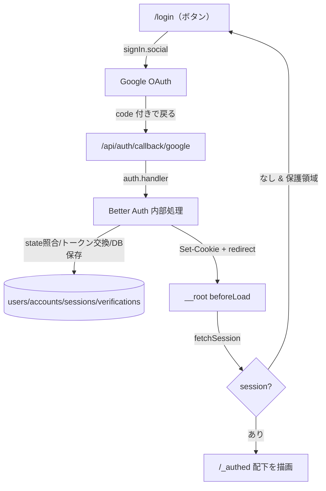
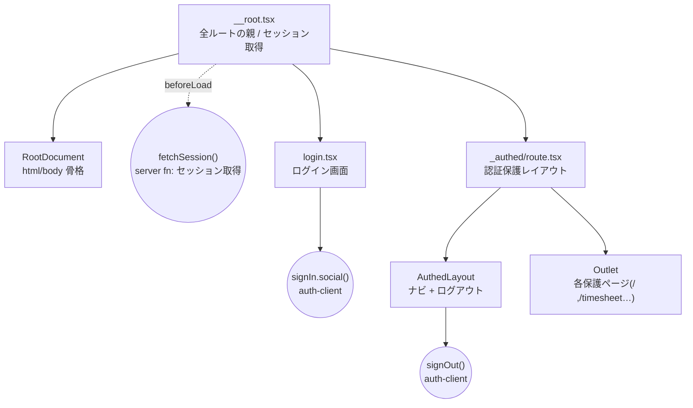
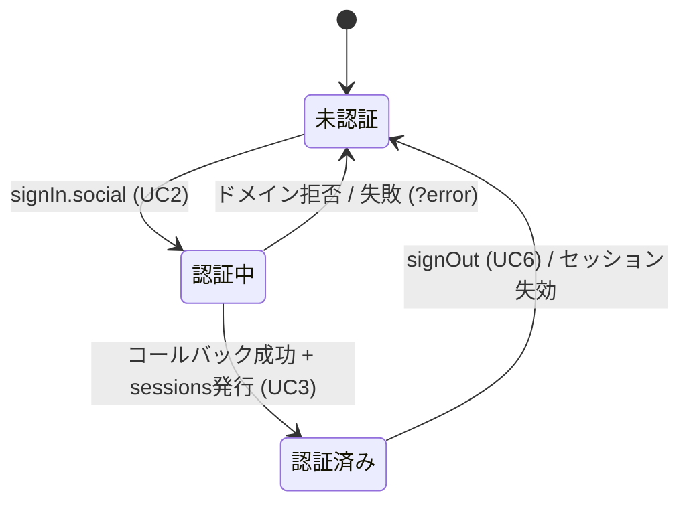

# ログイン機能（Google OAuth）フロー解説

- 作成日: 2026-05-31
- 対象画面: ログイン画面（`/login`）／認証保護レイアウト（`/_authed/*`）
- 対象範囲: ログインボタン押下 → Google OAuth → セッション確立 → 認証保護ルート／Server Function の保護まで
- 前提: Better Auth + Drizzle(pg) + TanStack Start（`docs/03_login_design.md` / `docs/04_login_implementation_plan.md`）

---

## ユースケース一覧

- **UC1: 初期描画とセッション解決** — 全ページ共通。ルート `beforeLoad` でセッションを1回取得し context に配る
- **UC2: ログイン開始** — `/login` でボタン押下 → Google へリダイレクト
- **UC3: OAuth コールバック処理** — Google から戻り、state照合・トークン交換・DB保存・Cookie発行（Better Auth 内部）
- **UC4: 画面の認証保護** — `/_authed` 配下の未認証アクセスを `/login` へ弾く（チラ見え防止）
- **UC5: Server Function の認証保護** — RPC エンドポイントを `authMiddleware` で保護し userId スコープを適用
- **UC6: ログアウト** — セッション破棄 → `/login` へ

---

## 全体像（データの流れ）



---

## コンポーネント包含関係（共通）



| 階層 | ファイル | 親 | 主な責務 |
|---|---|---|---|
| 1 | `routes/__root.tsx` | -（ルート） | `beforeLoad` でセッション取得し context に配布 |
| 2 | `routes/login.tsx` | `__root` | ログイン画面・既ログイン時の `/` リダイレクト |
| 2 | `routes/_authed/route.tsx` | `__root` | 未認証を `/login` へ弾く保護レイアウト |
| 補助 | `lib/auth-client.ts` | -（client） | `signIn` / `signOut` / `useSession` を提供 |
| 補助 | `server/auth-session.ts` | -（server fn） | `fetchSession`（Cookie からセッション解決） |
| 補助 | `server/auth-middleware.ts` | -（middleware） | Server Function 保護の実体 |
| 補助 | `server/auth.ts` | -（設定） | Better Auth 本体設定（プロバイダ・DB・ドメイン制限） |
| 補助 | `routes/api/auth/$.ts` | -（API） | `/api/auth/*` を Better Auth に委譲 |

---

## UC1: 初期描画とセッション解決

### トリガー
任意の URL への初回アクセス・リロード。全ルートの親 `__root` の `beforeLoad` が最初に走る。

### 起動条件・早期return条件
- 常に実行される（全ルート共通の親）。早期return は無い。
- ここで取得した `session` を全子ルートが `context.session` として参照する。

### ステップ詳細

#### Step UC1-1: `__root.tsx` — セッションを1回取得して配布

**ファイル**: `apps/web/src/routes/__root.tsx:13-17`

**呼び出し元（親）**: なし（ルート）。
**呼び出し先（子）**: `fetchSession()`（`server/auth-session.ts`）を呼ぶ。

**返り値 / 子に渡すprops**:
| 名前 | 型 | 用途 |
|---|---|---|
| `session` | `{ user, session } \| null` | 全子ルートの `context.session` |

**コード抜粋（__root.tsx:13-17）**:
```ts
// セッションを一度だけサーバ側で取得し、子ルート（_authed / login）へ context で配る
beforeLoad: async () => {
  const session = await fetchSession()
  return { session }
},
```

**解説**:
- セッション解決を親で1回だけ行い、子ルートは再取得せず context を読むだけ。重複した getSession 呼び出しを避ける設計。
- ★要注意: ここが `null` を返すと下流の `/login` / `/_authed` の分岐がすべて「未認証」側に倒れる。Cookie が正しく送られているかがこの1点に集約される。

#### Step UC1-2: `auth-session.ts` — Cookie からセッションを復元

**ファイル**: `apps/web/src/server/auth-session.ts:13-19`

**呼び出し元（親）**: `__root.tsx:15`、`login.tsx`（context経由）。
**呼び出し先（子）**: `auth.api.getSession({ headers })`。

**コード抜粋（auth-session.ts:15-17）**:
```ts
const headers = getRequestHeaders() as unknown as Headers
const session = await auth.api.getSession({ headers })
return session
```

**解説**:
- `getRequestHeaders()` でリクエストの Cookie を含むヘッダを取り出し、Better Auth に渡してセッションを復元する。
- クライアント遷移時もサーバ側で Cookie を読むため Server Function 化されている。

---

## UC2: ログイン開始

### トリガー
`/login` で「Googleでログイン」ボタンを押下（`login.tsx:44-50` の `onClick`）。

### 起動条件・早期return条件
| 入力状態 | 動作 | コード位置 |
|---|---|---|
| `context.session` あり（既ログイン） | `/` へ redirect（画面を見せない） | `login.tsx:6-10` |
| 未ログイン | ログイン画面を描画 | `login.tsx:18-54` |
| URL に `?error=...` あり | エラーメッセージを表示 | `login.tsx:36-42` |

### 入力パターン別の挙動（エラー表示）
| `error` の値 | 表示文言 |
|---|---|
| `access_denied` または `domain` を含む | このドメインのアカウントは利用できません |
| その他の文字列 | ログインに失敗しました。もう一度お試しください |
| なし（undefined） | エラー表示なし |

### ステップ詳細

#### Step UC2-1: `login.tsx` — ボタン押下で OAuth 開始

**ファイル**: `apps/web/src/routes/login.tsx:21-23`

**呼び出し元（親）**: `__root`（context 経由でセッション受領）。
**呼び出し先（子）**: `signIn.social()`（`lib/auth-client.ts`）。

**コード抜粋（login.tsx:21-23）**:
```ts
const handleGoogleLogin = () => {
  signIn.social({ provider: 'google', callbackURL: '/' })
}
```

**具体例**:
| 入力 | 結果 |
|---|---|
| ボタン押下 | Google 認可画面へリダイレクト、認証後 `/` に戻る指定 |

**解説**:
- `provider: 'google'` で `server/auth.ts` の `socialProviders.google` 設定が使われる。
- `callbackURL: '/'` は「OAuth 完了後にアプリ内のどこへ戻すか」。Google に登録するリダイレクトURI（`/api/auth/callback/google`）とは別物（後者は Better Auth 内部の固定受け口）。

#### Step UC2-2: `auth-client.ts` — クライアント側 Better Auth

**ファイル**: `apps/web/src/lib/auth-client.ts:4-6`

**コード抜粋（auth-client.ts:4-6）**:
```ts
export const authClient = createAuthClient()
export const { signIn, signOut, useSession } = authClient
```

**解説**:
- `createAuthClient()` を引数なしで生成しており、baseURL は同一オリジンを自動利用する。
- `signIn.social()` は内部で `/api/auth/sign-in/social` を叩き、state/codeVerifier を `verifications` に保存してから Google へリダイレクトさせる（この保存処理が、当初の DB 接続エラーで失敗していた箇所）。

---

## UC3: OAuth コールバック処理（Better Auth 内部）

### トリガー
Google での認証・許可後、ブラウザが `{BETTER_AUTH_URL}/api/auth/callback/google?code=...`（ローカルなら `http://localhost:3000/...`）に戻る。なおベースURLは `auth.ts:11` の `baseURL: process.env.BETTER_AUTH_URL` で決まり、ポート3000はコード上の固定値ではなく環境変数依存の一例。

### ステップ詳細

#### Step UC3-1: `api/auth/$.ts` — 全 auth リクエストを委譲

**ファイル**: `apps/web/src/routes/api/auth/$.ts:8-15`

**呼び出し元（親）**: なし（HTTP エンドポイント）。
**呼び出し先（子）**: `auth.handler(request)`。

**コード抜粋（api/auth/$.ts:9-14）**:
```ts
server: {
  handlers: {
    GET: ({ request }) => auth.handler(request),
    POST: ({ request }) => auth.handler(request),
  },
},
```

**解説**:
- このファイル自体にロジックは無く、`/api/auth/*`（コールバック含む）をすべて Better Auth に丸投げする窓口。
- 実際の state照合・トークン交換・ユーザー情報取得は Better Auth ライブラリ内部で行われる。

#### Step UC3-2: `auth.ts` — Better Auth 本体設定とドメイン制限

**ファイル**: `apps/web/src/server/auth.ts:10-57`

**コールバック時に効く設定（抜粋 auth.ts:29-34, 41-56）**:
```ts
socialProviders: {
  google: {
    clientId: process.env.GOOGLE_CLIENT_ID ?? '',
    clientSecret: process.env.GOOGLE_CLIENT_SECRET ?? '',
  },
},
// ...
databaseHooks: {
  user: {
    create: {
      before: async (user) => {
        // 許可ドメイン外のメールは初回ユーザー作成時にサーバ側で拒否する。
        // セッションは発行されない（残留 Cookie が出ない）。
        if (!user.email.endsWith(`@${ALLOWED_DOMAIN}`)) {
          throw new APIError('BAD_REQUEST', {
            message: 'このドメインのアカウントは利用できません',
          })
        }
        return { data: user }
      },
    },
  },
},
```

**コールバック時のDB操作（Better Auth 内部 → schema/auth.ts のテーブル）**:
| テーブル | タイミング | 内容 |
|---|---|---|
| `verifications` | 開始時に作成→完了時に消費 | state / codeVerifier（CSRF対策） |
| `users` | 初回ログイン時に作成 | name / email / image |
| `accounts` | 初回連携時に作成 | Google の accountId / token 群 |
| `sessions` | ログイン成功で発行 | token / expiresAt / userId |

**具体例（ドメイン制限）**:
| ログインしたメール | 結果 |
|---|---|
| `taro@arumako.com` | ユーザー作成・セッション発行 → `/` へ |
| `foo@gmail.com` | `BAD_REQUEST` で**作成拒否**（セッション無し） |

**解説**:
- ★要注意: ドメイン制限は `user.create.before`（=**新規ユーザー作成時のみ**）にしか実装されていない。`auth.ts` 上にサインイン経路用の追加検証は存在せず（`auth.ts` 全体で `endsWith` チェックはこの1箇所のみ）、既に `users` に存在するユーザーの再ログインはドメイン検証を一切通らない。影響: 運用途中で `ALLOWED_EMAIL_DOMAIN` を狭めても、旧ドメインの既存ユーザーはログインを継続できてしまう（セキュリティ上の留意点）。ドメイン変更時は既存レコードの手当が別途必要。
- `secret`（`BETTER_AUTH_SECRET`）はセッションCookieの署名・暗号化に使われる。

---

## UC4: 画面の認証保護（チラ見え防止）

### トリガー
`/_authed` 配下のルート（`/`, `/timesheet`, `/attendance`）へのアクセス。

### 起動条件・早期return条件
| `context.session` | 動作 | コード位置 |
|---|---|---|
| なし（null） | `/login` へ redirect（保護ページは一切描画されない） | `_authed/route.tsx:14-16` |
| あり | `session` を返して保護レイアウトを描画 | `_authed/route.tsx:17-18` |

### ステップ詳細

#### Step UC4-1: `_authed/route.tsx` — 未認証を弾く

**ファイル**: `apps/web/src/routes/_authed/route.tsx:11-21`

**呼び出し元（親）**: `__root`（context.session を受領）。
**呼び出し先（子）**: 認証OKなら `AuthedLayout` → `Outlet`（各保護ページ）。

**コード抜粋（_authed/route.tsx:14-19）**:
```ts
beforeLoad: ({ context }) => {
  if (!context.session) {
    throw redirect({ to: '/login' })
  }
  return { session: context.session }
},
```

**解説**:
- `__root` で取得済みのセッションを参照するだけ（再取得しない）。
- `beforeLoad` で redirect するため、未認証時は保護ページのコンポーネントが描画される前に弾かれる（一瞬の「チラ見え」が起きない）。

#### Step UC4-2: `AuthedLayout` — ナビとユーザー表示

**ファイル**: `apps/web/src/routes/_authed/route.tsx:38-70`

**受け取る context**:
| 名前 | 型 | 用途 |
|---|---|---|
| `session` | route context | ユーザー名/メール表示・ログアウト |

**コード抜粋（_authed/route.tsx:39, 56-58）**:
```ts
const { session } = Route.useRouteContext()
// ...
{session?.user?.name ?? session?.user?.email}
```

**解説**:
- ナビ右上にユーザー名（無ければメール）を表示。`<Outlet />`(67行) に各保護ページが差し込まれる。

---

## UC5: Server Function の認証保護

### トリガー
保護対象の Server Function（`getAllReportsFn` など）がクライアントから呼ばれる。

### 起動条件・早期return条件
| セッション | 動作 | コード位置 |
|---|---|---|
| なし | `/login` へ redirect（RPC実行されない） | `auth-middleware.ts:16-18` |
| あり | `context.user` / `context.session` を注入して実行 | `auth-middleware.ts:19-21` |

### ステップ詳細

#### Step UC5-1: `auth-middleware.ts` — RPC保護の実体

**ファイル**: `apps/web/src/server/auth-middleware.ts:13-22`

**コード抜粋（auth-middleware.ts:13-22）**:
```ts
export const authMiddleware = createMiddleware().server(async ({ next }) => {
  const headers = getRequestHeaders() as unknown as Headers
  const session = await auth.api.getSession({ headers })
  if (!session) {
    throw redirect({ to: '/login' })
  }
  return next({
    context: { user: session.user, session: session.session },
  })
})
```

**解説**:
- ★要注意: 画面ガード（UC4）は迂回可能なため、**セキュリティの実体はこの middleware**。Server Function は画面を経由せず直接叩けるので、ここで弾かないとデータが漏れる。
- 認証OK時に `context.user` を注入することで、ハンドラはクライアントから userId を受け取らずにスコープを決められる。

#### Step UC5-2: `reports.ts` — userId スコープの適用

**ファイル**: `apps/web/src/server/functions/reports.ts:31-44`

**コード抜粋（reports.ts:31-38）**:
```ts
export const getAllReportsFn = createServerFn({ method: 'GET' })
  .middleware([authMiddleware])
  .handler(async ({ context }) => {
    const rows = await db
      .select()
      .from(dailyReports)
      .where(eq(dailyReports.userId, context.user.id))
```

**具体例**:
| 呼び出し元 | 取得されるデータ |
|---|---|
| ユーザーA のセッション | `userId = A` の日報のみ |
| 未認証 | redirect（0件ではなく実行拒否） |

**解説**:
- `.middleware([authMiddleware])` で保護し、`context.user.id` を `where` に使うことで他人のデータが混ざらない。クライアントは userId を一切指定しない。

---

## UC6: ログアウト

### トリガー
`AuthedLayout` のログアウトボタン押下（`_authed/route.tsx:59-64`）。

### ステップ詳細

#### Step UC6-1: `_authed/route.tsx` — セッション破棄して /login へ

**ファイル**: `apps/web/src/routes/_authed/route.tsx:42-45`

**コード抜粋（_authed/route.tsx:42-45）**:
```ts
const handleSignOut = async () => {
  await signOut()
  await router.navigate({ to: '/login' })
}
```

**解説**:
- `signOut()`（`auth-client.ts`）が `/api/auth/sign-out` を叩いてセッション破棄＋Cookie削除。完了後 `/login` へ遷移。

---

## 状態遷移図（セッションのライフサイクル）



---

## まとめ（1～2行）

> セッションは `__root.beforeLoad` で**1回だけ**解決し context で全ルートに配る。画面保護（`_authed`）は「チラ見え防止」の表側、`authMiddleware` が「RPCを直接叩かせない」セキュリティの実体という**二層構え**。ログイン本体（state照合・トークン交換・DB保存）は `api/auth/$.ts` 経由で Better Auth に委譲し、`auth.ts` の `databaseHooks` でドメイン制限を効かせる。

---

## 付録: 主要ファイル対応表

| 役割 | ファイル |
|---|---|
| セッション配布（親） | `apps/web/src/routes/__root.tsx` |
| ログイン画面 | `apps/web/src/routes/login.tsx` |
| 認証保護レイアウト | `apps/web/src/routes/_authed/route.tsx` |
| クライアント認証API | `apps/web/src/lib/auth-client.ts` |
| セッション取得(server fn) | `apps/web/src/server/auth-session.ts` |
| RPC保護ミドルウェア | `apps/web/src/server/auth-middleware.ts` |
| Better Auth 設定 | `apps/web/src/server/auth.ts` |
| auth API 委譲 | `apps/web/src/routes/api/auth/$.ts` |
| 認証テーブル定義 | `apps/web/src/server/schema/auth.ts` |
| userId スコープ実装例 | `apps/web/src/server/functions/reports.ts` |

---

## 付録: 既知の課題・所見

- **ドメイン制限は新規作成時のみ（セキュリティ留意点）**: `auth.ts` の `databaseHooks.user.create.before` は既存ユーザーの再ログインには効かない。サインイン経路に追加のドメイン検証が無いため、ドメインを狭めても旧ドメインの既存ユーザーはログイン継続可能（UC3-2 の★参照）。
- **`callbackURL` とリダイレクトURIの混同に注意**: `login.tsx` の `callbackURL:'/'`（アプリ内戻り先）と、Google Cloud に登録する `/api/auth/callback/google`（Better Auth の固定受け口）は別物。
- **`fetchSession` の戻り値が全分岐の起点**: Cookie が届かないと全て未認証に倒れる。デバッグ時はまずここを確認。
