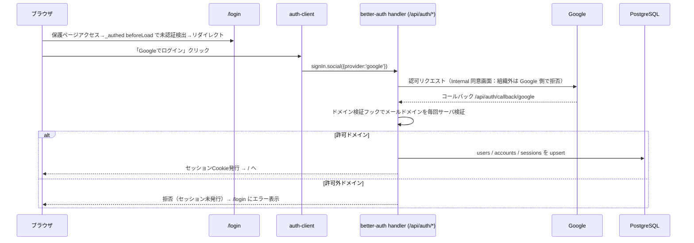

# ログイン機能 設計書（better-auth + Google OAuth）

| 項目 | 内容 |
|------|------|
| 作成日 | 2026-05-30 |
| 最終更新 | 2026-05-30（実装前レビューを反映） |
| 対象 | work-hub（apps/web） |
| ステータス | レビュー反映済み（実装着手可） |

---

## 0. 決定ログ（レビューでの合意事項）

実装前レビューで、設計のツリーを根から辿り依存関係順に以下を確定した。詳細は各節に反映済み。

| # | 論点 | 決定 |
|---|------|------|
| 1 | 保護の境界 | **Server Function 保護を必須化**しスコープに含める。route guard は UX 用途、Server Function 保護がセキュリティの実体 |
| 2 | 強制の仕組み | `createMiddleware` で `authMiddleware` を定義し、保護対象 Server Function に付与。session/user を context 注入（クライアントから userId を送らせない） |
| 3 | ルートガード | `routes/_authed/` パスレスレイアウト新設＋`beforeLoad` サーバ側ガード。既存3ルートを配下へ移動、ナビも集約 |
| 4 | 許可粒度 | **ドメイン全体許可**。`email.endsWith('@arumako.co.jp')` を毎認証時にサーバ検証。Google `hd` は UX ヒント |
| 5 | テナンシー | **最小限のユーザー別スコープを今回含める**。`user_id` 追加・`unique(user_id,date)`・全 Server Function に userId フィルタ |
| 6 | 既存データ | 破棄可。`daily_reports` を truncate し `user_id`(uuid,NOT NULL,FK)＋`unique(user_id,date)` で再作成 |
| 7 | セッション期間 | 30日・`updateAge` 1日（ローリング更新） |
| 8 | 失効時挙動 | `authMiddleware` が `throw redirect({to:'/login'})`。route guard と挙動統一 |
| 9 | 検証スコープ | シードセッションで自動 E2E、Google 認可往復＋ドメイン受理/拒否は手動 |
| 10 | 認証基盤前提 | arumako.co.jp は Google Workspace。OAuth 同意画面は **Internal** |

---

## 1. 背景・目的

work-hub（日報・工数管理システム / TanStack Start + Drizzle ORM + PostgreSQL）には現在**認証機構が存在しない**。すべての Server Function（`apps/web/src/server/functions/reports.ts` ほか）が無保護で、URL／RPC エンドポイントを知っていれば誰でも全データを閲覧・編集できる状態にある。

社内の複数メンバーが安全に利用できるよう、**Google OAuth によるログイン**を導入し、**特定ドメインのメールアドレスを持つユーザーのみ**アクセスを許可する。認証は自前実装せず、TanStack Start に公式対応し将来のプロバイダ拡張も容易な **better-auth** を採用する。

`createServerFn` が生成する RPC エンドポイントは画面ガードを迂回して直接呼べるため、**Server Function 自体の保護を必須**とし、画面ガードは UX（未認証者を `/login` へ誘導）の役割に限定する。また「複数メンバーが安全に利用」を成立させるため、**ログイン後のデータをユーザー単位に分離する最小限のテナンシー**も本スコープに含める（共有単一データセットのままでは、同日付の日報が相互に上書きされるため）。

---

## 2. 要件

### 2.1 機能要件
- [F-1] 未認証ユーザーが保護ページにアクセスした場合、`/login` にリダイレクトする。
- [F-2] `/login` で「Googleでログイン」からGoogle OAuth認証を開始できる。
- [F-3] 認証成功かつメールが許可ドメインの場合、ユーザーを永続化しセッションを発行、トップ（`/`）へ遷移する。
- [F-4] メールが許可ドメイン**外**の場合、ログインを拒否しエラーを表示する。
- [F-5] ログイン中ユーザーはナビゲーションでユーザー名を確認し、ログアウトできる。
- [F-6] ログアウト後は保護ページへアクセスできず `/login` に戻る。
- [F-7] すべての Server Function は有効なセッションを要求し、未認証なら `/login` へリダイレクトする。
- [F-8] 日報データは**認証ユーザー単位にスコープ**され、他ユーザーのデータは閲覧・更新できない。同一日付でもユーザーが異なれば別レコードとして共存する。

### 2.2 非機能要件・制約
- パスワードは扱わない（OAuthのみ）。サインアップ画面は作らない。
- セッションはCookieベース（better-auth標準）。有効期限30日・ローリング更新。
- 既存のDB接続・スキーマ規約・UIコンポーネントを再利用する。
- ユーザー識別子（`user_id`）はクライアントから受け取らず、必ずサーバ側のセッションから取得する（なりすまし防止）。

### 2.3 ヒアリング決定事項
| 項目 | 決定 |
|------|------|
| 利用者 | 社内の複数メンバー（複数人が日報を入力する） |
| 認証方式 | better-auth（ライブラリ導入） |
| ログイン手段 | Google OAuth のみ（arumako.co.jp は Google Workspace） |
| サインアップ画面 | 不要 |
| アクセス制限 | 特定ドメイン（`@arumako.co.jp`）全体を許可 |
| データ分離 | ユーザー単位（最小テナンシーを今回スコープに含む） |

---

## 3. アーキテクチャ

### 3.1 認証フロー



### 3.2 コンポーネント構成

```
apps/web/src/
├── server/
│   ├── auth.ts                ★新規  betterAuth() サーバ設定（drizzleAdapter / google / ドメイン制限 / session 30d）
│   ├── auth-middleware.ts     ★新規  createMiddleware による authMiddleware（session/user を context 注入、未認証は redirect）
│   ├── db.ts                  既存    Proxy + プール（drizzleAdapter に再利用）
│   └── schema/
│       ├── auth.ts            ★新規  users / sessions / accounts / verifications（uuid 主キー）
│       ├── reports.ts         改修    daily_reports に user_id 追加・unique(user_id, date) 化
│       └── index.ts           改修    export * from './auth'
├── lib/
│   └── auth-client.ts         ★新規  createAuthClient（signIn/signOut/useSession）
└── routes/
    ├── api/auth/$.ts          ★新規  better-auth ハンドラのマウント
    ├── login.tsx              ★新規  ログイン画面（認証済みなら / へ redirect）
    ├── __root.tsx             改修    fetchSession を beforeLoad で取得しルート context へ
    └── _authed/               ★新規  パスレスレイアウト（beforeLoad ガード＋ナビ）
        ├── route.tsx          ★新規  beforeLoad：未認証なら /login へ redirect。ユーザー名＋ログアウトのナビ
        ├── index.tsx          移動    （旧 routes/index.tsx）
        ├── timesheet.tsx      移動    （旧 routes/timesheet.tsx）
        └── attendance.tsx     移動    （旧 routes/attendance.tsx）
```

`server/functions/reports.ts` は全関数に `authMiddleware` を付与し、`context.user.id` で userId スコープを適用する。

---

## 4. 詳細設計

### 4.1 DBスキーマ

#### 4.1.1 認証4テーブル（`server/schema/auth.ts`）★新規

better-auth が要求する4テーブルを Drizzle で定義する。命名は既存規約（**uuid主キー**、snake_caseカラム、`created_at`/`updated_at` を timestamptz）に合わせる。スキーマ雛形は better-auth CLI（`npx @better-auth/cli generate`）で生成し、id を uuid に揃える調整を行う。

| テーブル | 主な用途 | 主なカラム |
|----------|----------|-----------|
| `users` | ユーザー本体 | id(uuid), name, email(unique), email_verified, image, created_at, updated_at |
| `accounts` | OAuthアカウント連携 | id, user_id, provider_id, account_id, access_token, ... |
| `sessions` | セッション | id, user_id, token, expires_at, ip_address, user_agent |
| `verifications` | 検証トークン | id, identifier, value, expires_at |

> `verifications`/`accounts` は OAuth のみでも better-auth が要求するため保持する（Google APIトークンは本アプリでは利用しないが adapter が管理）。
> better-auth 既定の id は文字列のため、uuid 主キーに揃えるには id 生成設定（adapter の `generateId` 等）を実装時に確認する。

#### 4.1.2 `daily_reports` のユーザースコープ化（`server/schema/reports.ts`）★改修

ログイン後の複数人利用に備え、ユーザー単位でデータを分離する。

- `user_id`（uuid, NOT NULL）を追加し、`users.id` への FK とする。
- 一意制約を `date` 単独から **`unique(user_id, date)`** へ変更（ユーザーが異なれば同日付を共存可）。

```ts
export const dailyReports = pgTable('daily_reports', {
  id: uuid('id').defaultRandom().primaryKey(),
  userId: uuid('user_id').notNull().references(() => users.id),
  date: date('date').notNull(),
  // ... 既存カラム ...
}, (t) => ({
  userDateUnique: unique().on(t.userId, t.date),
}))
```

> **マイグレーション方針**：既存 `daily_reports` データは破棄可。`daily_reports` を truncate のうえ、`user_id NOT NULL` ＋ `unique(user_id, date)` で再作成する。段階移行（nullable→backfill）は不要。反映は既存ワークフロー `npm run db:generate` → `npm run db:push`。

`server/schema/index.ts` に `export * from './auth'` を追記。

### 4.2 better-auth サーバ設定（`server/auth.ts`）★新規

```ts
import { betterAuth } from 'better-auth'
import { drizzleAdapter } from 'better-auth/adapters/drizzle'
import { db } from './db'
import * as schema from './schema'

const ALLOWED_DOMAIN = process.env.ALLOWED_EMAIL_DOMAIN ?? 'arumako.co.jp'

export const auth = betterAuth({
  baseURL: process.env.BETTER_AUTH_URL,
  secret: process.env.BETTER_AUTH_SECRET,
  database: drizzleAdapter(db, { provider: 'pg', schema }),
  emailAndPassword: { enabled: false },
  session: {
    expiresIn: 60 * 60 * 24 * 30, // 30日
    updateAge: 60 * 60 * 24,      // 1日ごとにローリング更新
  },
  socialProviders: {
    google: {
      clientId: process.env.GOOGLE_CLIENT_ID!,
      clientSecret: process.env.GOOGLE_CLIENT_SECRET!,
    },
  },
  databaseHooks: {
    user: {
      create: {
        before: async (user) => {
          if (!user.email.endsWith(`@${ALLOWED_DOMAIN}`)) {
            throw new Error('このドメインのアカウントは利用できません')
          }
          return { data: user }
        },
      },
    },
  },
})
```

> **ドメイン制限の方針**：粒度はドメイン全体許可。判定は**毎回の認証時にサーバ側のメール検証**で行い、Google `hd` パラメータはアカウント選択 UX のヒントに留める（セキュリティ判定には用いない）。同意画面を Internal にすることで Google 側でも組織外を遮断し、二重化する。
> ドメイン制限の正確なフックポイント（`databaseHooks.user.create.before` か `signIn` 系コールバックか）は実装時に better-auth の当該バージョンの仕様で最終確認する。許可外ドメイン時はセッションを発行しないこと（拒否後に残留 Cookie が無いこと）を確認する。
> 将来「ドメイン全体」から「個人単位の許可リスト」へ変更する場合も、この検証ロジックの局所変更で済むよう実装する。

### 4.3 API ルート（`routes/api/auth/$.ts`）★新規

better-auth ハンドラを catch-all ルートにマウントする。

```ts
import { auth } from '~/server/auth'
import { createFileRoute } from '@tanstack/react-router'

export const Route = createFileRoute('/api/auth/$')({
  server: {
    handlers: {
      GET:  async ({ request }) => auth.handler(request),
      POST: async ({ request }) => auth.handler(request),
    },
  },
})
```

> 注: TanStack Start 1.166 系のサーバルート記法（`server.handlers` / `ServerRoute` 等）は実装時に再確認する。

### 4.4 クライアント（`lib/auth-client.ts`）★新規

```ts
import { createAuthClient } from 'better-auth/react'

export const authClient = createAuthClient()
export const { signIn, signOut, useSession } = authClient
```

### 4.5 ログイン画面（`routes/login.tsx`）★新規

- 「Googleでログイン」ボタン1つのシンプルなセンタリングレイアウト。
- クリックで `signIn.social({ provider: 'google', callbackURL: '/' })`。
- 既存 `~/components/ui/Button` と Tailwind デザイントークン（`bg-accent` 等）を流用。
- クエリ/状態でドメイン拒否エラーを受け取り表示。
- `beforeLoad` でセッションを確認し、**認証済みなら `/` へ redirect**（ログイン済みユーザーに `/login` を見せない）。

### 4.6 ルートガード（`_authed` レイアウト）★新規

画面ガードは `routes/_authed/` パスレスレイアウトに集約する（`__root.tsx` への条件分岐の詰め込みはしない）。

- 既存の `index.tsx` / `timesheet.tsx` / `attendance.tsx` を `routes/_authed/` 配下へ移動する。
- `routes/_authed/route.tsx` の `beforeLoad` で**サーバ側**セッションを検証し、未認証なら `/login` へ redirect。これにより未認証時は保護ページが一切描画されない（チラ見え無し）。
- セッション取得は、クライアント遷移時にも Cookie を読めるよう **`createServerFn`（例 `fetchSession`）経由**とする。`__root.tsx` の `beforeLoad` で `fetchSession` を呼び結果をルート context へ載せ、`_authed` と各子ルートはそれを参照（再フェッチ不要）。
- `_authed` のレイアウトにナビゲーションバーを置き、**ユーザー名**と「ログアウト」ボタン（`signOut()` → `/login`）を表示する。`/login`・`/api/auth/*` は `_authed` の外にあるためナビ非表示の分岐は不要。

### 4.7 Server Function 保護（`server/auth-middleware.ts`）★新規・**必須**

`createServerFn` の RPC エンドポイントは画面ガードを迂回できるため、**Server Function 保護をセキュリティの実体**と位置づける（任意ではない）。手動ヘルパー呼び出しではなく、付け忘れを防げる**ミドルウェア**で強制する。

```ts
import { createMiddleware } from '@tanstack/react-start'
import { redirect } from '@tanstack/react-router'
import { auth } from './auth'

export const authMiddleware = createMiddleware().server(async ({ next }) => {
  const request = getWebRequest() // import パスは実装時に確認
  const session = await auth.api.getSession({ headers: request.headers })
  if (!session) {
    throw redirect({ to: '/login' })
  }
  return next({ context: { user: session.user, session: session.session } })
})
```

- 保護対象の Server Function は `createServerFn(...).middleware([authMiddleware])` で定義し、ハンドラ内では `context.user.id` を用いる。
- 未認証時は `throw redirect({ to: '/login' })`。ブラウザ経由は `/login` へシームレス遷移し、直接 RPC を叩く未認証アクセスはデータを返さず拒否される（route guard と挙動統一）。
- セッションが利用中に失効した場合も同様に `/login` へ遷移。日報入力は sessionStorage 自動保存（`index.tsx:95-100`）があるため復帰後に復元される。

`server/functions/reports.ts` の全関数（`getAllReportsFn` / `getReportsByMonthFn` / `saveReportFn` / `deleteReportFn`）に `authMiddleware` を付与し、`db` クエリへ `eq(dailyReports.userId, context.user.id)` のフィルタ／`values({ userId: context.user.id, ... })` を加える。`saveReportFn` の upsert ターゲットは `(userId, date)` 複合キー。

### 4.8 環境変数（モノレポ root `.env` / `.env.example`）

既存 `db.ts` がモノレポ root の `../../.env` を読む方式に合わせ、better-auth 関連変数も root `.env` に置く。`process.env` 経由で `auth.ts` から参照できるよう、ロード手当て（root `.env` の読み込み）を実装時に確認する。

```
BETTER_AUTH_SECRET=<ランダム32文字以上>
BETTER_AUTH_URL=http://localhost:3000
GOOGLE_CLIENT_ID=
GOOGLE_CLIENT_SECRET=
ALLOWED_EMAIL_DOMAIN=arumako.co.jp
```

Google Cloud Console で OAuth クライアントを作成（**ユーザー作業**）：
- 同意画面は **Internal（内部）** を選択（Workspace 組織内限定。Google 審査不要・組織外アカウントを Google 側でブロック）。
- リダイレクトURIに以下を登録：
  - `http://localhost:3000/api/auth/callback/google`（開発）
  - `https://<本番ドメイン>/api/auth/callback/google`（本番）

---

## 5. 既存資産の再利用

| 再利用対象 | 場所 | 用途 |
|-----------|------|------|
| DB接続 `db` | `server/db.ts` | drizzleAdapter にそのまま渡す |
| root `.env` ロード | `server/db.ts` | better-auth 環境変数の読み込み方式を踏襲 |
| スキーマ規約 | `schema/master.ts`, `schema/reports.ts` | uuid/timestamptz/snake_case を踏襲 |
| Server Fn 記法 | `functions/reports.ts` | `authMiddleware` 付与＋userId スコープの実装パターン |
| 自動保存 | `routes/index.tsx:95-100` | セッション失効リダイレクト時の入力保全 |
| UI部品/トークン | `components/ui/Button`, `styles/app.css` | ログイン画面・ナビ |

---

## 6. リスク・確認事項

1. **TanStack Start サーバルート/ミドルウェアAPI**: 1.166系での `/api/auth/$` の記法、`createMiddleware` / `getWebRequest()` の import パスを実装時に確認。
2. **本番デプロイ（VPS）**: `BETTER_AUTH_URL` と Google リダイレクトURIを本番ドメインで設定（VPSデプロイ手順書へ追記）。
3. **ドメイン制限のフックポイント**: better-auth当該バージョンでの最適なフックと、拒否時にセッションが残らないことを確認。
4. **uuid id 生成**: better-auth 既定の文字列 id を uuid 主キー規約に揃える設定を確認。`daily_reports.user_id` の型整合（uuid FK）も確認。
5. **既存データ truncate**: `daily_reports` の再作成に伴い既存行は破棄される（合意済み）。本番反映時に消去対象を再確認。
6. **テナンシーの範囲**: 今回はユーザー単位の最小スコープのみ。チーム共有・権限ロールは引き続きスコープ外。

---

## 7. 検証計画

自動 E2E は Google を介さない範囲を対象とし、**セッション行/Cookie を DB に直接シード**して検証する。Google 認可往復とドメイン受理/拒否は手動で確認する。

**自動（Playwright）**
1. `npm run db:setup` → auth テーブル4つ＋`daily_reports`（user_id 付き）が作成される。
2. 未ログインで `/`・`/timesheet`・`/attendance` アクセス → `/login` にリダイレクト。
3. シードセッションでログイン状態を作り、保護ルートが描画され、ナビにユーザー名が出る。
4. Server Function（保存・取得）が動作し、**別ユーザーのデータが見えない**（user_id スコープ）。同一日付が別ユーザーで共存できる。
5. ログアウト → `/login` に戻り、保護ルート再アクセス不可。

**手動**
6. 許可ドメインの実 Google アカウントでログイン → `/` 遷移、ユーザー名表示。
7. 許可外ドメイン → 拒否されエラー表示、セッション未発行。

---

## 8. スコープ外

- メール/パスワード認証、サインアップ画面
- **チーム共有**（teams / team_members によるメンバー間の日報共有・閲覧）
- 権限ロール（管理者/一般）の区別
- 個人単位の許可リスト（現状はドメイン全体許可。将来拡張）

> 注: 「ユーザー単位のデータ分離（最小テナンシー）」は当初スコープ外だったが、複数人入力時の上書き事故を防ぐため**本スコープに移動**した（§4.1.2 / §4.7）。チーム共有・ロール管理は引き続きスコープ外。
