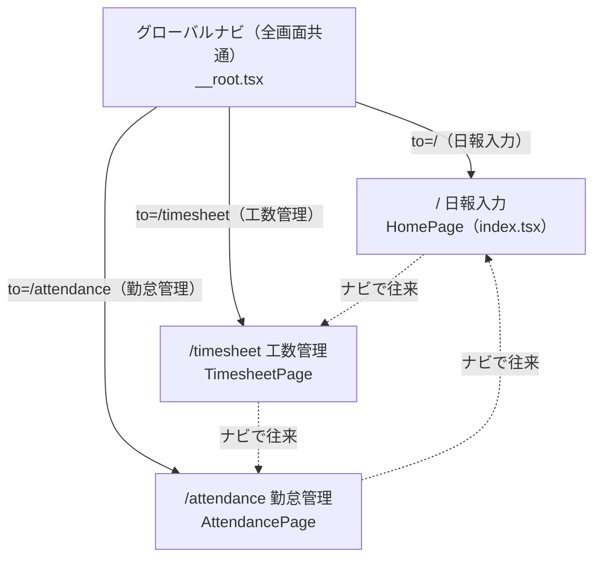
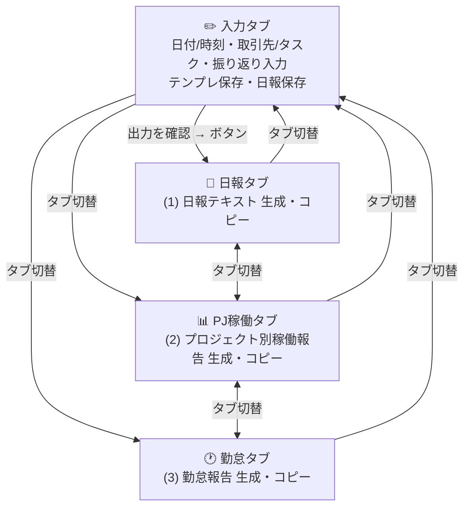
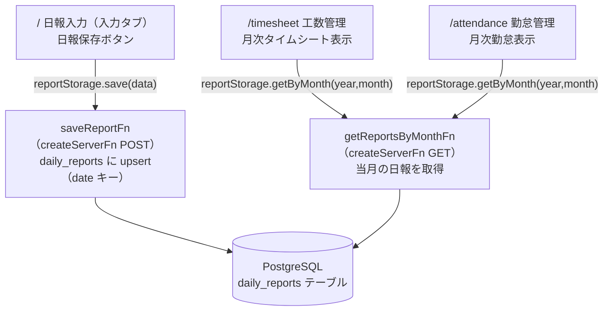
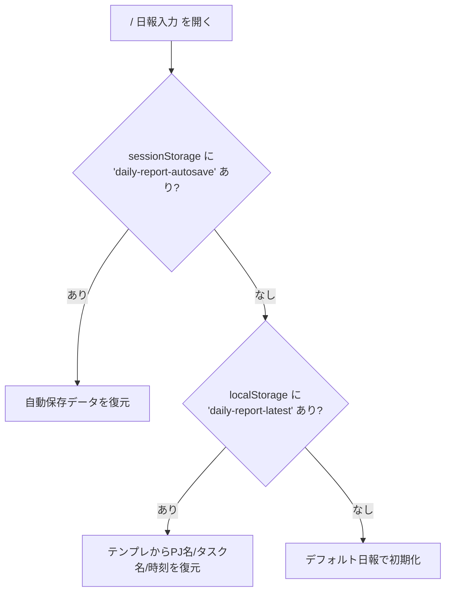

# 06. 画面遷移図

`work-hub` の画面遷移を主要フロー別に示す。画面は 3 つ（`/`, `/timesheet`, `/attendance`）で、いずれもグローバルナビ（`apps/web/src/routes/__root.tsx:45-50`）から相互に行き来できる。日報入力画面（`/`）は単一ルート内で 4 タブを切り替える構造。

## 1. グローバルナビによる画面間遷移

全画面共通のグローバルナビ（`NavLink to="/"` / `to="/timesheet"` / `to="/attendance"`）で 3 画面を相互遷移できる。

- 根拠: `apps/web/src/routes/__root.tsx:47-49`（`<NavLink to="/">日報入力</NavLink>` 他）。`Outlet` 配下に各画面が描画される（`:51`）。

## 2. 日報入力画面（`/`）内のタブ遷移（主要フロー: 入力 → 各フォーマット生成）

`HomePage` は `activeTab`（input/daily/project/attendance）で表示を切り替える（`apps/web/src/routes/index.tsx:22,47`）。タブボタンで任意に遷移でき、入力タブの「📝 出力を確認 →」ボタンは daily タブへ遷移する（`:248-253`）。

- 根拠: タブボタン `TabButton`（`apps/web/src/routes/index.tsx:195-208`）、各タブの描画（`:212-337`）、「出力を確認 →」→ `setActiveTab('daily')`（`:248-253`）。

## 3. 日報保存とデータの流れ（保存 → 月次画面で閲覧）

日報入力画面で保存した日報（DB）が、工数管理・勤怠管理画面の閲覧元になる。

- 根拠: 保存（`apps/web/src/routes/index.tsx:108-121` → `apps/web/src/lib/storage.ts:57-65` → `apps/web/src/server/functions/reports.ts:59-96`）。月次取得（`apps/web/src/routes/timesheet.tsx:25`、`apps/web/src/routes/attendance.tsx:24` → `apps/web/src/lib/storage.ts:76-82` → `apps/web/src/server/functions/reports.ts:41-57`）。

## 4. 起動時の入力データ復元フロー（参考）

日報入力画面の初期化時、sessionStorage（自動保存）→ localStorage（テンプレート）の優先順でデータを復元する。

- 根拠: `apps/web/src/routes/index.tsx:53-92`（sessionStorage 優先、無ければ localStorage テンプレート、それも無ければ `defaultDailyReport()`）。

## 補足

- 画面遷移はすべて認証チェックなしで行える（`_authed` 等のガードは存在しない。`docs/02_users.md:8`）。
- 工数管理・勤怠管理画面は閲覧専用で、ここから入力画面へ戻る導線はグローバルナビのみ（各画面内に「編集」リンクは無し。`apps/web/src/routes/timesheet.tsx` / `attendance.tsx` に編集系の遷移は確認できず）。

## 未確認事項

- 日報削除（`deleteReportFn`）に至る画面遷移・操作は確認できない（UI 結線が未確認。`docs/00_user_features.md:64`）。
- 月次画面の「データがありません」時の案内文以外に、入力画面へ誘導するリンク的遷移があるかは未確認（文言のみで `Link` は確認できず。`apps/web/src/routes/timesheet.tsx:92-95`）。
