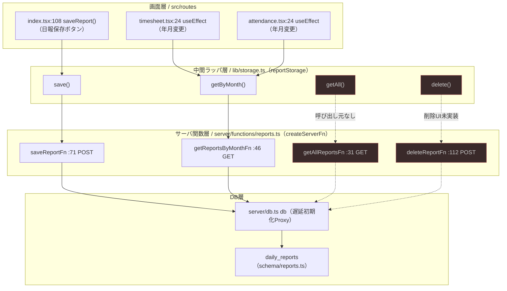
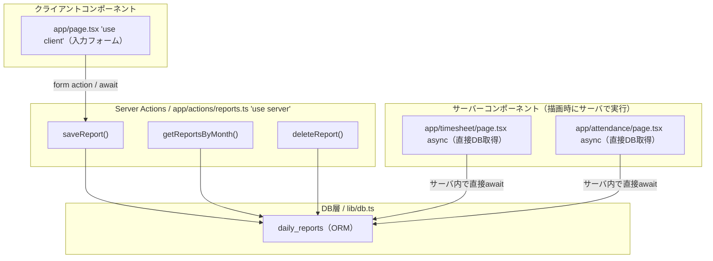
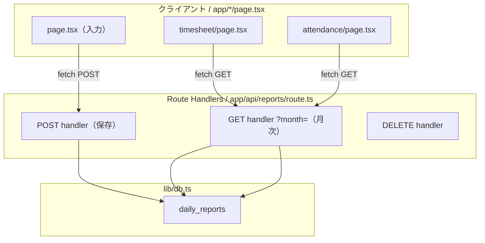

# 10. フレームワーク比較（素のReact / Next.js / Nest.js との違い）

本プロジェクト `work-hub` は **TanStack Start**（+ TanStack Router）+ Vite + Drizzle ORM + PostgreSQL で構築されている。本ドキュメントは、よく比較される「素の React（Vite SPA）」「Next.js」「Nest.js」との違いを、実際のファイルに即して整理する。

- 入力画面の例: `apps/web/src/routes/index.tsx`
- サーバ処理の例: `apps/web/src/server/functions/reports.ts`、`apps/web/src/server/db.ts`

---

## 1. 3者の立ち位置（フロント観点：素のReact / Next.js / TanStack Start）

| | 素のReact (Vite SPA) | Next.js | TanStack Start（本プロジェクト） |
|---|---|---|---|
| 正体 | UIライブラリのみ | Reactフルスタックフレームワーク | Reactフルスタックフレームワーク |
| ルーティング | 自前（React Router等を手動構成） | ファイルベース（`app/`/`pages/`） | ファイルベース + 型安全 |
| サーバ実行 | なし（基本クライアントのみ） | Server Components / Route Handlers / Server Actions | `createServerFn` |
| SSR | デフォルトなし | デフォルトあり | あり（本プロジェクトは有効） |
| ビルド基盤 | Vite | 独自（Turbopack/webpack） | Vite |

### 1-1. ルーティング — `createFileRoute`

`apps/web/src/routes/index.tsx:18`
```ts
export const Route = createFileRoute('/')({ component: HomePage })
```

- 素のReact: `<BrowserRouter>` と `<Route path="/">` を自分で配線する必要がある。
- Next.js: ファイルを置くだけ（`app/page.tsx`）。`createFileRoute(...)` のような明示登録コードは書かない。
- TanStack Start: ファイル配置に加えて `createFileRoute('/')` を書く。その代わり `apps/web/src/routeTree.gen.ts` が自動生成され、`<Link to="/timesheet">` のパスやパラメータが TypeScript で型チェックされる。Next.js の `<Link href>` は文字列ベースで型保証が弱い。

### 1-2. サーバ関数 — `createServerFn`

入力画面の保存処理は次の経路をたどる。
`index.tsx:108`（`saveReport`）→ `apps/web/src/lib/storage.ts`（`reportStorage.save`）→ `apps/web/src/server/functions/reports.ts`（`createServerFn`）

- 素のReact: サーバ処理は別途 Express 等の API を立て、`fetch('/api/...')` を自分で書く。
- Next.js: 近い概念は Server Actions（`'use server'`）や Route Handler（`app/api/route.ts`）。
- TanStack Start: `createServerFn` で定義した関数を、クライアントから通常の関数呼び出しのように `await saveReportFn({ data })` で呼べる（裏でHTTPに変換）。思想は Next.js の Server Action に近いが、Vite ベースで提供される。

### 1-3. コンポーネント内部は「ほぼ素のReact」

`HomePage` の中身（`index.tsx:45-341` の `useState`/`useEffect`/`map` 描画、`sessionStorage`/`localStorage` 直叩き）は素の React そのもの。違いが出るのは「外枠」（ルート登録・サーバ通信・SSR・`<head>`制御）だけで、コンポーネント内部の React の書き方は3者で共通。

### 1-4. Next.js との思想的な差

- Next.js は Server Components が主役で「サーバで描画、クライアントは `'use client'` で限定」という分け方。
- TanStack Start はクライアントコンポーネント中心で、サーバ処理は `createServerFn` で部分的に呼ぶ。そのため `index.tsx` も `'use client'` のような宣言なしに、最初から通常のクライアント React として書ける。

---

## 2. Nest.js との違い（サーバ処理観点）

### 2-1. 前提：レイヤーが違う

- Nest.js = バックエンド専用フレームワーク（サーバプロセスを独立して立てる）。
- TanStack Start = フロント＋サーバ一体型。`reports.ts` の関数はフロント（`index.tsx`）からそのまま呼ばれる。「API を別に立てて fetch する」発想がない。

### 2-2. `reports.ts` で見る違い

`apps/web/src/server/functions/reports.ts`
```ts
export const saveReportFn = createServerFn({ method: 'POST' })
  .inputValidator((data: DailyReportData) => data)
  .handler(async ({ data }) => {
    await db.insert(dailyReports).values({ /* ... */ }).onConflictDoUpdate({ /* ... */ })
    return { success: true }
  })
```

Nest.js で書くと、同じ概念が複数のクラス／デコレータに分解される。

| 観点 | Nest.js | TanStack Start（本ファイル） |
|---|---|---|
| エンドポイント定義 | `@Controller('reports')` + `@Post()` メソッド | `createServerFn({ method: 'POST' })`（関数1つ） |
| ルーティング | デコレータ + パス文字列で明示 | パスを書かない（自動配線、フロントは関数を直接 import） |
| 入力検証(DTO) | `class-validator` の DTO クラス + `ValidationPipe` | `.inputValidator(...)`（現状は素通し＝検証ロジックなし） |
| ビジネスロジック | `@Injectable()` の Service クラスに分離が定石 | `.handler()` に直書き（Controller/Service の分離なし） |
| 呼び出し方 | クライアントが `fetch('/reports')` | フロントが `await saveReportFn({ data })` で関数呼び出し |

Nest.js は Controller / Service / DTO / Module に役割分割するのが定石。TanStack Start は1関数に凝縮する。`reports.ts` の4関数（`getAllReportsFn` / `getReportsByMonthFn` / `saveReportFn` / `deleteReportFn`）は、Nest.js なら `ReportsController` + `ReportsService` + 複数 DTO に展開される規模。

> 補足: `.inputValidator((data: DailyReportData) => data)` は受け取った値をそのまま返すだけで、実際のバリデーション（型・必須チェック等）は行っていない。Nest.js の DTO + `class-validator` に相当する検証は現状未実装。

### 2-3. `db.ts` で見る違い（依存性注入 DI の有無）

`apps/web/src/server/db.ts:14-34`
```ts
let dbInstance: PostgresJsDatabase<typeof schema> | null = null
function getDb() {
  if (!dbInstance) {
    const client = postgres(loadDatabaseUrl(), { connect_timeout: 10, idle_timeout: 20, max: 10 })
    dbInstance = drizzle(client, { schema })
  }
  return dbInstance
}
export const db = new Proxy({} as PostgresJsDatabase<typeof schema>, { /* 遅延初期化 */ })
```

- Nest.js: DB接続は `@Module` の provider として登録し、`constructor(private db: ...)` で注入(DI)してもらう。生成タイミングは DI コンテナが管理。
- TanStack Start（本ファイル）: DI コンテナが無いため、シングルトンを自前で実装（`dbInstance` のキャッシュ + Proxy による遅延接続）。`reports.ts` は `import { db }` でグローバルに直接掴む。

Nest.js の「`@Injectable` / `@Module` / コンストラクタ注入」という仕組みは本プロジェクトに存在せず、素のモジュール import + 自前シングルトンで代替している。

### 2-4. まとめ（Nest.js 比較）

| | Nest.js | 本プロジェクト |
|---|---|---|
| 構造 | 規約ベース（Controller/Service/Module/DTO に強制分割） | 関数ベース（1ファイル・1関数に凝縮） |
| デコレータ | 多用（`@Controller` `@Injectable` `@Get` 等） | 不使用（メソッドチェーンで表現） |
| DI | フレームワーク中核機能 | なし（手動シングルトン） |
| フロントとの関係 | 完全分離（別プロセス・HTTP） | 一体（フロントが関数を直接呼ぶ） |

一言でいうと、Nest.js は「大規模・チーム向けに役割を強制分割するフレームワーク」、本プロジェクトの `reports.ts` は「個人開発向けに最小の関数へ凝縮した対極のスタイル」。

---

## 3. 総括

| 比較軸 | 素のReact | Next.js | Nest.js | TanStack Start（本プロジェクト） |
|---|---|---|---|---|
| 主担当レイヤー | フロント | フルスタック（フロント主導） | バックエンド | フルスタック（フロント主導） |
| ルーティング | 手動 | ファイルベース | デコレータ（URL明示） | ファイルベース + 型安全 |
| サーバ処理 | なし | Server Components / Actions | Controller/Service | `createServerFn`（関数RPC） |
| DI | なし | なし | あり（中核機能） | なし（手動シングルトン） |
| ビルド基盤 | Vite | 独自 | （Node/独自） | Vite |

TanStack Start の個性は「Vite ベース・型安全ルーティング・RPC 的サーバ関数」。素の React に「ルーティング/SSR/サーバ通信」を型安全に足したものであり、Next.js とは「Server Components 中心か、クライアント中心 + サーバ関数か」で思想が分かれ、Nest.js とは「役割を強制分割するか、関数に凝縮するか」で対極に位置する。

---

## 4. `reports.ts` の呼び出しフロー（Mermaid）と Next.js 実装比較

サーバ処理の中心 `apps/web/src/server/functions/reports.ts` の4関数が、どの画面からどう呼ばれるかを図示し、同じ機能を Next.js（App Router）で実装した場合の階層と比較する。

### 4-1. 現状（TanStack Start）の呼び出しフロー

画面は `reports.ts` を直接呼ばず、必ず `lib/storage.ts` の `reportStorage`（try/catch でエラー吸収・戻り値正規化）を経由する。



点線（赤）の `getAllReportsFn` / `deleteReportFn` は定義・ラッパはあるが画面からの呼び出しがない。

呼び出し元の対応表:

| `reports.ts` の関数 | 経由（storage.ts） | 呼び出し元の画面 | トリガー |
|---|---|---|---|
| `saveReportFn`（:71） | `reportStorage.save` | `index.tsx:114` | 「日報保存」ボタン |
| `getReportsByMonthFn`（:46） | `reportStorage.getByMonth` | `timesheet.tsx:24` / `attendance.tsx:24` | 年月変更時の `useEffect` |
| `getAllReportsFn`（:31） | `reportStorage.getAll` | なし | 未使用 |
| `deleteReportFn`（:112） | `reportStorage.delete` | なし | 削除UI未実装 |

### 4-2. Next.js（App Router）で実装した場合

#### パターンA：Server Actions ＋ Server Components（Next.js 推奨）



月次取得は Server Component が描画時に DB を直接 await するため、TanStack Start 版にあった「`useEffect` で取りに行く中間ラッパ」が不要になる。保存・削除のような変更操作だけ Server Action にする。

#### パターンB：Route Handlers（REST API）＋ fetch（明示的なAPI境界）



TanStack Start 版の構造に最も近く、`createServerFn` が `app/api/.../route.ts` に置き換わり、`fetch` を自分で書く分だけ手数が増える。

### 4-3. 階層構造の対応表

| レイヤー | TanStack Start（現状） | Next.js パターンA（Server Actions） | Next.js パターンB（Route Handler） |
|---|---|---|---|
| 画面（入力） | `routes/index.tsx` | `app/page.tsx`（`'use client'`） | `app/page.tsx`（`'use client'`） |
| 画面（閲覧） | `routes/timesheet.tsx` 等が `useEffect` で取得 | `app/timesheet/page.tsx`（サーバで直接取得） | `app/timesheet/page.tsx`（`fetch`） |
| 中間ラッパ | `lib/storage.ts`（`reportStorage`） | 基本不要（Action を直接 import） | `fetch` 呼び出しを各画面/共通関数に |
| サーバ処理 | `createServerFn`（`reports.ts`） | `'use server'` Server Actions | `route.ts` の HTTP ハンドラ |
| サーバ↔クライアント結合 | 関数を直接 import（RPC的） | 関数を直接 import（RPC的） | URL + `fetch`（疎結合） |
| DBアクセス | `server/db.ts`（手動シングルトン） | `lib/db.ts` | `lib/db.ts` |

### 4-4. 構造上の主な違い

1. データ取得の位置が変わる
   - 現状: 閲覧画面がクライアントで `useEffect` → ラッパ → サーバ関数、と往復（クライアント起点）。
   - Next.js パターンA: 閲覧画面がサーバで描画時に直接 DB 取得。`useEffect` もローディング状態も不要になり、階層が1段浅くなる。
2. 中間ラッパ（`lib/storage.ts`）の必要性
   - 現状: サーバ関数の呼び出し規約（`fn({ data })`）とエラー処理を `reportStorage` に集約。
   - Next.js パターンA: Server Action を画面から直接 import して `await` できるため、専用ラッパは原則不要。
3. クライアントとサーバの結合度
   - 現状 / パターンA: 関数を import する型安全な RPC 的結合（URL を意識しない）。
   - パターンB: `fetch('/api/reports')` の URL ベースの疎結合（Nest.js に近い明示的な API 境界）。

---

## 未確認事項

- TanStack Start / `createServerFn` の最新仕様（API 変更の有無）は公式ドキュメント未照合。本ドキュメントはコード実体（`reports.ts` / `db.ts` / `index.tsx`）からの記述を主とする。
- Next.js / Nest.js の記述は一般的なフレームワーク仕様に基づく比較であり、本リポジトリ内に両者の実装は存在しない。
