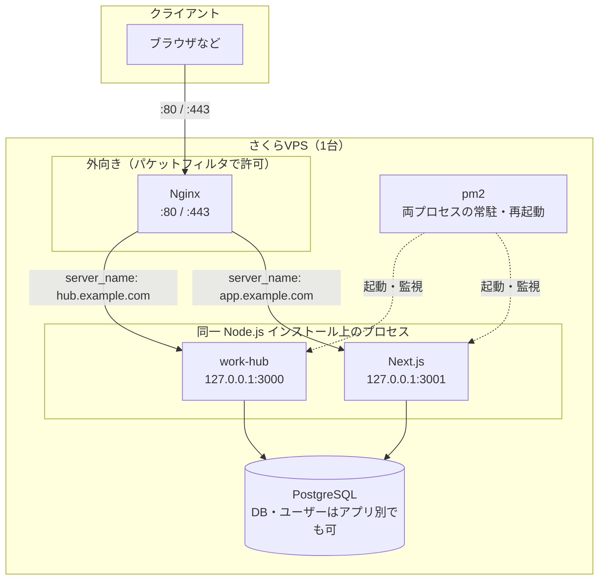

# 同一VPSへの Next.js アプリ追加デプロイ手順（サブドメイン方式）

このドキュメントは、**既に [vps-deploy-commands.md](./vps-deploy-commands.md) に沿って work-hub が稼働しているさくらVPS** に、別リポジトリの **Next.js** アプリを追加するときの手順をまとめたものです。Node.js・PostgreSQL・Nginx・pm2 は既に入っている前提です。

**ルーティング方式はサブドメイン**とします（例: `hub.example.com` → work-hub、`app.example.com` → Next）。ホスト名でアプリを分け、Cookie や CORS、将来の HTTPS 証明書も取り扱いやすくします。

---

## 追加後の構成イメージ

Next.js を追加すると、**1 台の VPS 上で Nginx が入口となり、背後で pm2 が管理する Node プロセスが 2 系統**（work-hub と Next）に分かれて動きます。どちらも **同じ OS にインストールされた 1 つの Node.js** を実行ファイルとして使いますが、**プロセスと listen ポートは別**です。PostgreSQL はインスタンスは 1 つでも、**データベース／ユーザーはアプリごとに分ける**のが一般的です。




**読み取りポイント**

- **:3000 / :3001** は **ループバックのみ**想定。外部から直叩きしない（パケットフィルタで閉じてよい）。
- **Nginx** が `**server_name`（サブドメイン）** で **どちらの Node にプロキシするか**を決める。
- **pm2** は両方のプロセスを一覧管理する（`pm2 status` で 2 エントリ）。

---

## 前提：ホスト名の決定

次のように **用途ごとのサブドメイン**を決めておく（例。実際の名前はドメインに合わせる）。


| 用途          | 例（サブドメイン）         | プロキシ先            |
| ----------- | ----------------- | ---------------- |
| 既存 work-hub | `hub.example.com` | `127.0.0.1:3000` |
| 新規 Next.js  | `app.example.com` | `127.0.0.1:3001` |


これまで **IP のみ**（`http://49.xxx...`）で work-hub にアクセスしている場合は、work-hub 用の `**server` ブロックにも `server_name` を付ける**か、リダイレクト用の設定を足すと、サブドメイン運用と揃えやすいです。

---

## 1. DNS（ドメイン側）の設定

ドメインの DNS 管理画面で、**両方のサブドメイン**を VPS のグローバル IP に向ける。

- **タイプ**: A レコード（IPv6 のみなら AAAA）
- **ホスト名**: `hub` / `app` など（プロバイダによっては `hub.example.com` と書く形式）
- **値**: さくらVPS の IP（[vps-deploy-commands.md](./vps-deploy-commands.md) の前提と同じ）

反映まで数分〜最大48時間程度かかることがある。作業前に `ping hub.example.com` などで解決先が VPS になっているか確認すると安全です。

---

## 2. VPS 上の配置とクローン

```bash
cd /opt
sudo mkdir sme-talent-acquisition-poc
sudo chown ubuntu:ubuntu sme-talent-acquisition-poc
cd sme-talent-acquisition-poc
git clone git@github.com:<org>/<repo>.git .
```

（既存と同様、VPS の SSH 鍵が GitHub に登録済みであること。手順は [vps-deploy-commands.md](./vps-deploy-commands.md) の「8. GitHubからコードを取得」を参照。）

---

## 3. 環境変数

Next.js は通常プロジェクト直下の `.env` / `.env.production` を参照します。

```bash
cd /opt/sme-talent-acquisition-poc
nano .env.production
```

- `NODE_ENV=production`
- 本番の公開 URL を参照する設定がある場合（例: `NEXTAUTH_URL`、`NEXT_PUBLIC_*`）、`**https://app.example.com` のようにサブドメイン URL**に合わせる。
- 外部APIキー、DB URL など（**本番用の値のみ**。パスワードはリポジトリにコミットしない）

別アプリ用に PostgreSQL のユーザー・DB を新規作成する場合は、既存ドキュメントの「6. データベースのセットアップ」と同様に `CREATE USER` / `CREATE DATABASE` で分離すると安全です。

---

## 4. ビルドと本番起動コマンドの確認

モノレポでない通常の Next プロジェクトなら、プロジェクト直下で:

```bash
npm install
npm run build
```

本番起動は `**next start` が listen するポートを固定** します（既存の 3000 と被らないようにする）。

**package.json の `scripts` に例:**

```json
"start": "next start -p 3001"
```

または環境変数 `PORT=3001` で起動する運用でも可。

---

## 5. pm2 で常駐化（既存の work-hub と併存）

```bash
cd /opt/sme-talent-acquisition-poc
pm2 start npm --name "sme-talent-acquisition-poc" -- start
```

`package.json` で `-p 3001` を付けている、または `PORT` を設定していることを確認する。

```bash
pm2 status
pm2 save
```

`pm2 startup` は **初回のみ** 実行済みなら再実行は不要（新しいプロセスは `pm2 save` で保存リストに含まれる）。

---

## 6. Nginx（サブドメインごとに `server` ブロック）

### Next.js 用（新規ファイル）

例: `/etc/nginx/sites-available/my-next-app`

```nginx
server {
    listen 80;
    server_name app.example.com;

    location / {
        proxy_pass http://127.0.0.1:3001;
        proxy_http_version 1.1;
        proxy_set_header Host $host;
        proxy_set_header X-Real-IP $remote_addr;
        proxy_set_header X-Forwarded-For $proxy_add_x_forwarded_for;
        proxy_set_header X-Forwarded-Proto $scheme;
        proxy_set_header Upgrade $http_upgrade;
        proxy_set_header Connection 'upgrade';
    }
}
```

### work-hub 側（既存設定の見直し）

既存の `work-hub` 用設定（例: `/etc/nginx/sites-available/work-hub`）で、`server_name _` のみになっている場合は、**work-hub 用サブドメイン**を指定する。

```nginx
server {
    listen 80;
    server_name hub.example.com;

    # 既存の auth_basic 等があればそのまま

    location / {
        proxy_pass http://127.0.0.1:3000;
        proxy_http_version 1.1;
        proxy_set_header Host $host;
        proxy_set_header X-Real-IP $remote_addr;
        proxy_set_header X-Forwarded-For $proxy_add_x_forwarded_for;
        proxy_set_header X-Forwarded-Proto $scheme;
        proxy_set_header Upgrade $http_upgrade;
        proxy_set_header Connection 'upgrade';
    }
}
```

### 有効化とリロード

```bash
sudo ln -sf /etc/nginx/sites-available/my-next-app /etc/nginx/sites-enabled/my-next-app
sudo nginx -t
sudo systemctl reload nginx
```

`work-hub` の設定ファイルを編集した場合も、同様に `nginx -t` のあと `reload` する。

---

## 7. ファイアウォール

- 新しい Node ポート（3001 など）を **外向きに開ける必要はない**（Nginx 経由のみでよい）。
- [vps-deploy-commands.md](./vps-deploy-commands.md) と同様、**80（と HTTPS 利用時は 443）** が許可されていれば足りることが多い。

---

## 8. HTTPS（Let's Encrypt）を使う場合

サブドメインごとに証明書を取るのが一般的です（certbot の `--nginx` や、DNS-01 でワイルドカードなど）。手順の骨子は [vps-deploy-commands.md](./vps-deploy-commands.md) の「TODO: SSL化」を参照。取得後、**各 `server` で `listen 443 ssl` と証明書パス**を揃え、`X-Forwarded-Proto` は既に例に含めている。

---

## 9. 再デプロイ（コード更新時）

```bash
cd /opt/my-next-app
git pull
npm install
npm run build
pm2 restart my-next-app
```

---

## 10. work-hub 側との注意点

- **ポートの重複**: work-hub が 3000、Next が別ポート（例: 3001）に固定する。
- **メモリ**: 1GB VPS では Next と既存アプリを同時に動かすとメモリが厳しい場合がある。`pm2 monit` や `free -h` で様子を見る。足りなければビルドの最適化・スワップ・プランアップを検討。

---

## 参考：パスで振り分ける方式

同一ドメインのパスだけで分けたい場合（例: `/next/`）は、Nginx の `location` と Next の `basePath` の整合が必要で設定ミスが出やすい。**サブドメインで問題ない場合は本ドキュメントの方式を推奨**する。

---

## 参照

- 初回の VPS セットアップ・SSH・Node・PostgreSQL・Nginx・pm2 の詳細: [vps-deploy-commands.md](./vps-deploy-commands.md)

