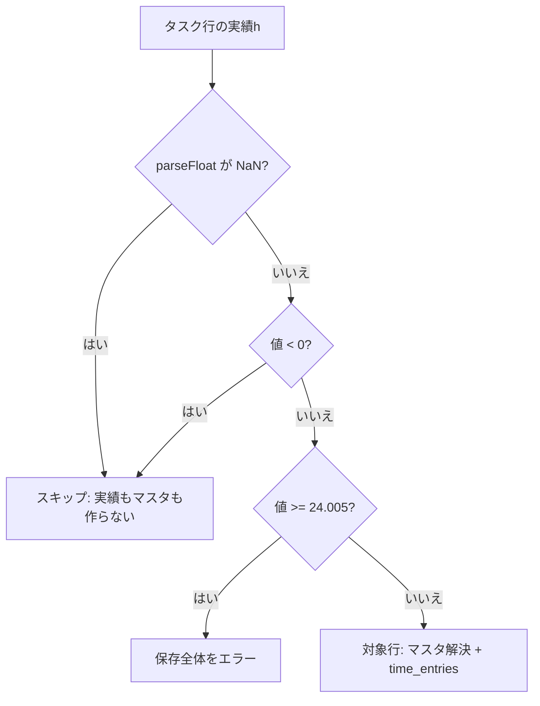

# 実績0hの保存 設計書

# 基本情報【必須】

- 対象機能：実績0hの保存（日報保存時、実績h が 0 以上の行も `time_entries` に記録する）
- ステータス：**合意済**（Phase 3 の人間承認ゲートを通過。2026-08-16）
- 作成日：2026-08-16
- 最終更新：2026-08-16（Phase 3 承認）
- 承認範囲：本設計書の全内容。親設計の上書き箇所（R-2 下限・CHECK・AC-03 / AC-30 / AC-46 の読み替え）を含む。未決事項 No.1〜3 は本文「本書の位置づけ」および未決事項表のとおり決定済み
- **本設計書は承認済み成果物である。**以後のフェーズで本書の規定を変更する必要が生じた場合は、`flow-review-policy` 4.3 に従い人間へエスカレーションすること（AI の判断で書き換えない）
- 関連ドキュメント：
  - `docs/要件/実績0hの保存_要件メモ.md`（要件の根拠）
  - `docs/設計/実績0hの保存/_flow-config.md`（フロー設定：テスト承認=実施／実装承認=スキップ／lean）
  - `docs/設計/工数実績の正規化保存/工数実績の正規化保存_設計書.md`（親設計。承認済み。2026-08-15）

## 本書の位置づけ（差分設計）

本書は親設計の**差分**である。親設計は承認済み成果物のまま残し、本文書が上書きすると書いた箇所だけを本機能の正とする。

- **継承**：本書が触れない規定（R-1 / R-4 / R-5 / R-6 / R-7、T-1 / T-2、エラーメッセージテンプレート、並行・ロック、UI エラー表示、認証）は親設計どおり
- **上書き**：下表の箇所は親設計より本書を優先する。Phase 3 で本書が承認された時点で、親設計の当該規定は本機能の範囲では失効する（親設計ファイル自体は書き換えない）

| 親設計の箇所 | 本書での扱い |
|---|---|
| 「実績h が有効な行」の定義（`0.005` 以上 `24.005` 未満） | **上書き**。`0` 以上 `24.005` 未満 |
| R-2 判定 2・判定 4、分類表 | **上書き** |
| R-3 の「判定 4 通過値は `0.005` 以上なので `String()` が指数表記にならない」 | **上書き**（下限が `0` になるため） |
| `chk_hours_positive`（`hours > 0`）および「0.00 は DB に届かない」旨の記述 | **上書き** |
| AC-03 / AC-30 / AC-46 | **上書き**（後述「親 AC の読み替え」） |
| 例外系の「`chk_hours_positive` に違反する経路は存在しない」 | **上書き** |
| ER 図の `hours "> 0"` | **上書き**（`>= 0`） |
| 上記以外 | **継承** |

要件メモの未決事項 3 件は本設計で次のとおり決定する。

| 要件メモ未決 | 決定 |
|---|---|
| 成果物の置き方 | 親設計は改訂しない。差分設計書を `docs/設計/実績0hの保存/` に置く |
| R-2 の書き換え方 | 判定 2 の閾値を `0.005` から `0` にずらす。AC は本機能用 ID（AC-Z）を新設し、矛盾する親 AC は読み替え表で失効させる |
| `chk_hours_positive` の条件 | `hours >= 0` に変更し、制約名を `chk_hours_non_negative` に改名する |

---

# 要件【必須】

日報保存時の対象行判定を変え、実績h が **0h（丸め後 `0.00` になる値を含む）** の行も `time_entries` に残す。空欄（未入力）と「実績ゼロとして記録した」行を区別する。

## 背景【必須】

親機能は `parseFloat` 結果が `0.005` 未満の行をスキップする。`"0"` も `"0.004"` も負数も同じ「記録しない」になる。DB の `chk_hours_positive`（`hours > 0`）も `0.00` を拒否する。

「予定していたができなかった」タスクを集計の記録として残すには、利用者が実績h に `0` を入れた行を `time_entries` に残す必要がある。空欄のまま保存する現行運用（予定だけ書いて実績は空）は維持する。

## 目的（ゴール）【必須】

**実績h が 0 以上 `24.005` 未満の行は、`time_entries.hours` に丸め後の値（`0.00` を含む）が残る。** 空欄・非数値・負数は今までどおり残さない。画面・帳票は変えない。

到達したい状態：

- `"0"` / `"0.0"` / `"0h"` を保存すると `hours = 0.00` の `time_entries` が 1 件ある
- `"0.004"` や `"0.0000001"` も `0.00` として残る（丸め後ゼロ）
- 空欄・負数・予定h のみは `time_entries` もマスタも作らない
- 再保存で `7.5` → `0` にすると `time_entries.hours` は `0.00` になり、`0` → 空にすると**その行の `time_entries` は残らない**（マスタは親 AC-22 どおり消さない）

## 受け入れ条件【必須】

テストで機械的に判定できる粒度で定義する。実装承認ゲートはスキップ設定のため、Phase 5 のテスト観点は本書の AC を根拠にする。

**全 AC 共通の前提（上書き）：** 「実績h が有効な行」（対象行）とは、改訂後 R-2 で「対象行」と分類された行を指す（`parseFloat` の結果が **`0` 以上 `24.005` 未満**）。親設計の「`0.005` 以上」は使わない。

親設計の AC のうち、対象行の定義だけに依存し期待値が変わらないもの（AC-01・AC-06・AC-09・AC-27・AC-29・AC-38・AC-48 など）は、この新しい定義のまま継承する。矛盾する親 AC は「親 AC の読み替え」を正とする。

### 0h の記録

| ID | 受け入れ条件 |
|---|---|
| AC-Z01 | 次の 3 入力を**それぞれ**、対象行 1 件だけの日報（当該日付に他の `time_entries` が無い状態）として保存する。いずれも当該日付の `time_entries` は 1 件、DB から読んだ `hours` は文字列 `"0.00"` である。(a) `"0"` (b) `"0.0"` (c) `"0h"` |
| AC-Z02 | 実績h が `"0.004"` の対象行 1 件を保存すると、`hours` は `"0.00"` である |
| AC-Z03 | 実績h が `"0.0000001"` の対象行 1 件を保存すると、`hours` は `"0.00"` である（AC-46 の上書き） |
| AC-Z04 | 実績h が `"0x10"` の対象行 1 件を保存すると、`hours` は `"0.00"` である（`parseFloat("0x10") === 0`。親の分類ではスキップだった） |
| AC-Z05 | 実績h が `"-0"` の対象行 1 件を保存すると、`hours` は `"0.00"` である（JS の `-0 < 0` は false のため対象行。`String(-0)` は `"0"`） |
| AC-Z06 | 実績h が数値型 `0` で送られても `hours` は `"0.00"` である（R-7 の文字列化を経る。親 AC-53 の 0h 版） |
| AC-Z09b | **対象行 1 件だけの日報**で、`Task.plannedHours` が `"8"` かつ `Task.actualHours` が `"0"`（「予定していたができなかった」）のとき、当該日付の `time_entries` は 1 件・`hours` は `"0.00"` である |

### 記録しない行（現行維持）

| ID | 受け入れ条件 |
|---|---|
| AC-Z07 | 実績h が空文字・空白のみ・`"abc"` の行は、`time_entries` が作成されず、その行の取引先名・プロジェクト名・タスク名でも `clients` / `projects` / `tasks` は作成されない（親 AC-29・AC-27 の再確認） |
| AC-Z08 | 実績h が `"-3"` / `"-0.004"` / `"-Infinity"` の行は、`time_entries` もマスタも作られない |
| AC-Z09 | `Task.plannedHours` が `"8"` で `Task.actualHours` が空の行は、`time_entries` もマスタも作られない（`Project.plannedHours` ではない） |

### マスタ・再保存・検証

| ID | 受け入れ条件 |
|---|---|
| AC-Z10 | 一意な取引先名・プロジェクト名・タスク名と実績h `"0"` の行 1 件を保存すると、`clients.name` / `projects.name` / `tasks.title` がそれぞれの名前に一致し、`tasks.type` は `'project'`、`tasks.project_id` は解決した `projects.id`、`time_entries.task_id` はその `tasks.id` と一致する（親 AC-26 の 0h 版）。adhoc 3 分岐は親 AC-23〜25 を新しい「有効な行」定義で継承する（本機能で再掲しない） |
| AC-Z10b | **取引先名・プロジェクト名・タスク名がすべて空**（正規化後も空。空白のみのタスク名を含む）で実績h が `"0"` の対象行 1 件を保存すると、`tasks.title` は `(名称未設定)`、当該日付の `time_entries` は 1 件・`hours` は `"0.00"` である。取引先名が空・プロジェクト名があり・タスク名が空の行は本 AC の対象外とし、親 AC-28（`title` は `<プロジェクト名> / (名称未設定)`）を新しい「有効な行」定義で継承する |
| AC-Z11 | **対象行 1 件だけの日報**を実績h `"7.5"` で保存したあと、同じ行を `"0"` にして再保存すると、当該日付の `time_entries` は 1 件のまま `hours` が `"0.00"` である（旧値 `"7.50"` の行は残らない）。同じ手順を `"0.004"` でも行い、再保存後の `hours` は `"0.00"` である |
| AC-Z12 | **対象行 1 件だけの日報**を実績h `"0"` で保存したあと、同じ行の実績h を空にして再保存すると、当該日付の `time_entries` は 0 件である。同じ手順を初回 `"0.004"` → 再保存で空、でも 0 件である |
| AC-Z13 | 実績h が対象行になる値（`"0"` または `"0.004"`）の行で、DB へ書き込む最終的なタスク名が 256 文字の場合、保存全体が失敗し、`daily_reports` も `time_entries` も更新されない。`Error.message` は親設計「エラー処理」の長さ超過テンプレートに完全一致する |
| AC-Z14 | 実績h が空でタスク名が 300 文字の行は、保存に成功する（親 AC-48。0h を対象行にしたことで空欄行まで長さ検証しないこと） |
| AC-Z15 | 実績h `"24.005"` は今までどおり保存全体が失敗する（親 AC-34・AC-36。下限変更で上限を緩めていないこと） |
| AC-Z16 | 実績h に `"7.5"` / `"2.675"` / `"0.004"` / `""` を持つ 4 行を含む日報を保存すると、当該日付の `time_entries` は **3 件**、`hours` の合計は `10.18`（`7.50 + 2.68 + 0.00`）である（親 AC-03 の上書き。`"0.004"` が件数に入る） |

### スキーマ

| ID | 受け入れ条件 |
|---|---|
| AC-Z17 | `time_entries` に `hours` として数値 `0` を直接 INSERT できる。DB から読んだ `hours` は文字列 `"0.00"` である |
| AC-Z18 | `time_entries` に `hours = -0.01` の行を直接 INSERT しようとすると、DB のチェック制約違反になる |
| AC-Z18b | `time_entries` に `hours = -0.004` を直接 INSERT すると成功し、DB から読んだ `hours` は `"0.00"` である（`numeric(4,2)` が先に half-up し、格納値 `0.00` は `>= 0` を満たす）。**アプリ経路**の実績h `"-0.004"` は AC-Z08 どおりスキップし、この直 INSERT の成功と混同しない |
| AC-Z19 | 情報スキーマ上、`time_entries` に `chk_hours_positive` は存在せず、`chk_hours_non_negative` が存在する |
| AC-Z20 | 情報スキーマ上、`schedule_entries` の `chk_planned_hours_positive`（`planned_hours > 0`）は残っている |

### 親 AC の読み替え

| 親 AC | 本機能での扱い |
|---|---|
| AC-03 | **失効**。AC-Z16 を使う |
| AC-30 | **失効**。`"0"` / `"0.004"` / `"0x10"` は記録する（AC-Z01・AC-Z02・AC-Z04）。負数（`"-3"` / `"-0.004"` / `"-Infinity"`）は AC-Z08 でスキップが残る |
| AC-46 | **失効**。AC-Z03 を使う |
| AC-02 | **継承（読み替え）**。`hours` の具体値集合に AC-Z01〜Z06・AC-Z16 の `0.00` を含める。親が列挙した AC-31〜35・AC-68 に加え、丸め後ゼロも「設計書が定めた期待値」とする |
| AC-01・AC-06・AC-09・AC-27・AC-29・AC-38・AC-48・AC-68 | **継承**。ただし「有効な行」は新しい定義。AC-68（`"0.005"` → `0.01`）は「0.01 になる最小入力」として残る |
| その他の親 AC | **継承**（対象行に 0h が含まれること以外、期待値は変わらない） |

AC-Z09（予定h のみ）と AC-Z07（空欄）は、親 AC-06・AC-27・AC-29 と重複するが、本機能の中心（空欄と 0 の区別）なので本設計でも明示する。

## 対象外の機能・要件（非ゴール）【必須】

- **画面・テキスト・月次表の変更** — `generateDailyReport` / `getProjectSummary` / `MonthlyTimesheetTable` / 日報入力欄は触らない。現行の表示差は維持する：`generateDailyReport` は名前がある 0h 行を**既に出す**。`getProjectSummary` は `parseFloat(actualHours) > 0` で 0h 行を**落とす**。どちらも本機能では変えない
- **表示側不変の AC 化はしない** — 要件メモ AC種9 は非ゴールとして扱う。Phase 5 は表示モジュール（`report-generator.ts` / `MonthlyTimesheetTable.tsx`）のテストを新設・改変しない。画面での確認は候補カタログ C-Z3 に置く
- **既存日報の一括バックフィル** — `raw_data` に 0 がある過去日報を自動では取り込まない。再保存した日報だけ新しい判定が適用される
- **予定h のみの行を 0h として記録すること**
- **負数の実績h を記録すること**（アプリ経路。直 INSERT で丸め後 `0.00` になる値は AC-Z18b）
- **予定工数（`schedule_entries`）への書き込み** — `chk_planned_hours_positive` は変更しない（AC-Z20）
- **集計画面・帳票の新規追加**
- **親設計が非ゴールとした項目はすべて引き続き非ゴール** — `tasks.actual_hours` の更新、マルチユーザー、マスタ管理画面、進捗率の記録、孤立マスタのクリーンアップ、予算対比、その他マスタ紐づけ、1 日合計の上限チェック

## 未決事項【必須】

| No | 内容 | 決定期限 | ステータス |
|---|---|---|---|
| 1 | 成果物の置き方（親改訂 vs 差分新設） | Phase 1 | **決定済み**（差分設計書を `docs/設計/実績0hの保存/` に置く） |
| 2 | R-2 判定表の書き換え方 | Phase 1 | **決定済み**（判定 2 の閾値を `0` にずらす。AC-Z 新設） |
| 3 | `chk_hours_positive` の新しい条件 | Phase 1 | **決定済み**（`hours >= 0`、制約名 `chk_hours_non_negative`。意味はキャスト後の格納値） |

## 業務フロー【必須】

親設計の正常系（日報保存 → T-1）と同じ。変わるのは対象行の分類だけである。

### 正常系（本機能で増える経路）

1. 利用者がタスク行に名前を入れ、実績h に `0` を入れて「日報保存」を押す
2. R-2 が対象行と判定する
3. 親 T-1 どおりマスタを解決し、`time_entries.hours = 0.00` を挿入する
4. 画面は親どおり「保存しました ✓」（表示ロジックは変更しない）

### 例外系

親の E-1〜E-8 を継承する。追加の例外種別は無い。次だけ読み替える。

| # | 発生条件 | 挙動 |
|---|---|---|
| E-3 | 実績h が `24.005` 以上（親と同じ） | 親どおり保存全体エラー |
| E-4 | 対象行の名前が 255 文字超 | 親どおり。**新規に対象行になる値（`"0"` / `"0.004"` 等）も E-4 の対象**（AC-Z13） |
| （旧注記） | `chk_hours_positive` に 0.00 は届かない | **廃止**。0.00 は正常に届く。アプリ経路の負数は R-2 判定 2 で除外する。CHECK は**キャスト後の格納値が非負**であることだけを見る（後述 S-Z1） |

## 影響を受ける実装済み機能【必須】

| 対象 | 影響 |
|---|---|
| `apps/web/src/server/report-normalize.ts` の `classifyActualHours` | 判定 2 の閾値を `0.005` から `0` に変更する |
| `apps/web/src/server/schema/tasks.ts` の `time_entries` | check 制約を差し替える |
| `saveReportFn`（`functions/reports.ts`） | 呼び出し側の分岐は増やさない。`classifyActualHours` の結果を使う現行のまま、対象行が増える |
| `deleteReportFn` | **変更しない**（親 T-2 を継承。0h 行も日付単位 DELETE の対象） |
| `apps/web/src/lib/report-generator.ts`（`generateDailyReport` / `getProjectSummary`） | **変更しない** |
| 親機能の単体・結合テスト | AC-30・AC-03・AC-46 等、旧期待値を持つテストは Phase 5 で本設計の期待値に書き換える（後述「Phase 5 への申し送り」） |
| 日報入力 UI / 日報テキスト / 月次表 | **変更しない** |

## 非機能要件

親設計の性能・セキュリティを継承する。本機能で接続数・ロック・認証の変更はしない。

---

# 設計

## データモデル設計

### スキーマ変更

テーブル・カラムの追加はしない。`time_entries.hours` の check 制約だけを差し替える。

| # | 対象 | 変更 | 目的 |
|---|---|---|---|
| S-Z1 | `time_entries` | `chk_hours_positive`（`hours > 0`）を **DROP** し、`chk_hours_non_negative`（`hours >= 0`）を **ADD** する | **キャスト後の格納値**が非負であること。`0.00` を許可する |

制約名を変える理由：条件が「正」ではなく「非負」になるため、旧名のまま残すと後から読んだ人が `hours > 0` だと誤読する。

**CHECK が見るのは格納後の値である。**PostgreSQL は CHECK の前に `numeric(4,2)` へ half-up する。したがって：

- 直 INSERT の `-0.01`（丸め後 `-0.01`）は拒否される（AC-Z18）
- 直 INSERT の `-0.004`（丸め後 `0.00`）は**許可される**（AC-Z18b）
- アプリ経路の `"-0.004"` は R-2 判定 2（`value < 0`）でスキップし、CHECK に到達しない（AC-Z08）

「負数は DB でもすべて拒否する」とは書かない。CHECK をアプリ判定 2 の代わりにしてはならない。

`schedule_entries.chk_planned_hours_positive` は変更しない（予定工数は非ゴール。AC-Z20）。

### 既存 check 制約との整合（上書き行のみ）

| 制約 | 本設計との整合 |
|---|---|
| `chk_hours_non_negative`（`hours >= 0`） | 見るのはキャスト後の格納値。R-2 判定 4 の格納値は `0.00`〜`24.00`。アプリ経路の負数は判定 2 で除外。NaN は親設計と同じく PostgreSQL では `NaN >= 0` が真になりうるため、**防波堤にしない**。R-2 判定 1 で NaN を落とす |

### ER（変更点）

`time_entries.hours` の意味を `>= 0` と読む。それ以外の関係は親設計の ER 図どおり。

## 変換ルール仕様

### R-2（上書き）：対象行の抽出とスキップ条件

日報の全プロジェクトブロックの全タスク行を順に走査し、**以下の順序で**判定する。順序は仕様の一部であり、入れ替えてはならない。`parseFloat` の引数は親どおり `toInputString(Task.actualHours)`（R-7）である。

| 順 | 判定 | 該当時の扱い |
|---|---|---|
| 1 | `parseFloat(...)` の結果が `NaN` | **スキップ**（`time_entries` を作らない。マスタも作らない） |
| 2 | 結果が **`0` 未満**（負数・`-Infinity` を含む） | **スキップ** |
| 3 | 結果が **`24.005` 以上**（`Infinity` を含む） | **保存全体をエラー**（親 AC-36） |
| 4 | 結果が **`0` 以上かつ `24.005` 未満** | **対象行**として処理する |

判定 4 は能動条件のまま残す（親と同じ理由。`NaN` が判定 2・3 をすり抜けて対象行に落ちるのを防ぐ）。

**判定 2 を `value < 0` とする理由：** 丸め後 `0.00` になる非負の値（`0` ちょうどと `0.005` 未満の正の微小値）を対象行にするため。負数は「できなかった」ではなく入力誤りなので、今までどおりスキップする。

**`-0` の扱い：** JavaScript では `-0 < 0` が false である。したがって `parseFloat("-0")` は判定 2 に該当せず、判定 4 の対象行になる。`String(-0)` は `"0"` なので、DB には `0.00` が格納される（AC-Z05）。`Object.is(value, -0)` で除外してはならない。

**スキップした行はマスタも作らない**（親 AC-27・AC-Z07〜AC-Z09）。予定h だけ入力して実績が空の行で、マスタが先行作成されるのを避ける。

**`parseFloat` を用いる理由**は親設計と同じ（画面集計と揃える）。変更しない。

具体的な分類。**本表は親 R-2 分類表の完全置換**である。本表に無い入力（例: `"12345678901234567890"`）は判定規則（1〜4）を適用する。Phase 5 のテストは本表と判定規則の両方を根拠にしてよい。

| 入力 | `parseFloat` | 判定 | 結果 |
|---|---|---|---|
| `""` / `"   "` / `"abc"` / `"時間"` / `"１.５"`（全角数字） | `NaN` | 1 | スキップ |
| `"-3"` / `"-0.004"` / `"-Infinity"` | `-3` / `-0.004` / `-Infinity` | 2 | スキップ |
| `"-0"` | `-0` | 4 | `0.00` として記録 |
| `"0"` / `"0.0"` / `"0h"` / `"0x10"` / `" 0"` / `"0.00"` | `0` | 4 | `0.00` として記録 |
| `"0,5"` | `0` | 4 | `0.00` として記録（カンマ以降は `parseFloat` が読まない） |
| `"0.004"` / `"0.0000001"` / `"0.000001"` | `0.004` / `1e-7` / `1e-6` | 4 | `0.00` として記録 |
| `"0.005"` | `0.005` | 4 | `0.01` として記録（親 AC-68） |
| `"7.5h"` / `"7.5 時間"` | `7.5` | 4 | `7.50` として記録 |
| `"1,5"` | `1` | 4 | `1.00` として記録（親表から継承） |
| `"24"` / `"24.004"` | `24` / `24.004` | 4 | `24.00` として記録 |
| `"24.005"` / `"25"` / `"1e2"` / `"Infinity"` | `24.005` / `25` / `100` / `Infinity` | 3 | 保存全体エラー |

### R-3（追記）：指数表記が対象行に入りうる

親の「アプリケーション側で丸めない」「`parseFloat` の結果を `String()` して `numeric(4,2)` に渡す」は**維持**する。

親は「判定 4 の値は `0.005` 以上なので `String()` が指数表記にならない」と書いていた。下限が `0` になるため、この文は成り立たない。

- `|n| < 1e-6` のとき `String(n)` は指数表記になる（例: `String(1e-7) === "1e-7"`）
- `|n| === 1e-6`（入力 `"0.000001"`）のとき `String(n)` は `"0.000001"`（指数表記にならない境界）
- PostgreSQL の `numeric` は `'1e-7'` も `'0.000001'` も受理し、`numeric(4,2)` へ half-up すると `0.00` になる
- **指数表記のまま渡してよい。**アプリ側で通常の 10 進表記へ変換したり、`1e-6` 未満をスキップしたりしてはならない（AC-Z03 が `|n| < 1e-6` 側を検出する。境界 `"0.000001"` は分類表の対象行として残す）

`0` ちょうどは `String(0) === "0"` であり、指数表記にはならない。

上限側（`24.005` 未満）は親どおり `String()` が指数表記にならない範囲に収まる。

## 項目定義

親のマッピング表を継承する。変わるのは次の 1 行の備考だけである。

| No | 項目 | 格納先 | 備考（本機能） |
|---|---|---|---|
| 4 | `Task.actualHours` | `time_entries.hours` | R-2 判定 4 の下限が `0`。丸め後 `0.00` を許可する |

## トランザクション・エラー処理・UI

親の T-1 / T-2 / エラー処理テンプレート / UI エラー表示を**変更しない**。対象行が増えるだけで、DELETE → マスタ解決 → 複数行 INSERT の手順は同じである。

0h だけの日報（対象行は 1 件以上、合計時間は 0）では、親どおり INSERT を発行する（対象行 0 件のときだけ INSERT しない、という親の規定は「件数」で判定する。hours の合計ではない）。

## マイグレーション手順

**適用順（必須）：** `chk_hours_non_negative` が対象 DB で有効になってから、`classifyActualHours` の判定 2 を `0` 未満スキップに切り替える。逆順（判定だけ先）だと、`"0"` / `"0.004"` が対象行になり旧 `hours > 0` が `0.00` を拒否し、**保存全体が失敗する**（親設計 Phase 2 の F-001 と同型。以前は 0 行をスキップしていたため同じ日報は保存できていた）。

1. `apps/web/src/server/schema/tasks.ts` の `timeEntries` から `chk_hours_positive` を外し、`chk_hours_non_negative`（`hours >= 0`）を追加する
2. `npm run db:push` で制約を反映する。**この時点ではまだ判定下限を変えない**
3. 制約が情報スキーマ上 `chk_hours_non_negative` であることを確認してから、`classifyActualHours` の判定 2 を変更する
4. 既存の `time_entries` はすべて `hours > 0` である（親機能が 0.00 を書いていない）ため、制約差し替えで既存行が違反することはない

同一 PR にスキーマと判定変更を載せてよい。ただし開発・CI・本番のいずれでも、**アプリが 0.00 を INSERT するコードが動く環境では、その前に `db:push` が終わっていること**。

**`db:push` の既知の挙動（親機能で文書化済み）とは別件である。**今回は check 制約の条件と名前が実際に変わるため、drizzle-kit が変更を検出する。`tasks_pj_cl_title_unique` の DROP/ADD 再発行は従来どおり付随しうる。S-Z1 の DROP と ADD の間も、ユニーク制約と同様に**一瞬 CHECK が無い窓**がある。その間に負数が入る経路は本機能のアプリからは無い。

ロールバックする場合：

1. `hours = 0` の行が残っていれば先に削除する（旧制約 `hours > 0` を戻すと 0.00 行で ADD が失敗する）
2. `chk_hours_non_negative` を DROP し、`chk_hours_positive`（`hours > 0`）を戻す
3. **ADD が失敗したまま放置すると CHECK が無い状態で残る。**失敗したら負数の混入有無を確認し、制約が付くまでアプリの 0.00 INSERT を出さない

---

# テストレベル判定

`docs/開発プロセス/テストレベル選定トリガー表.md` との突き合わせ。Phase 7 は「実施」のため、影響度トリガー該当の結合(DB込み)は**人間本記載**である。

## 影響度トリガー（Impact）

| トリガー | 該当 | 理由 |
|---|---|---|
| 認可境界 | **非該当** | 親と同じ。データモデルに `user_id` / `company_id` の分離が無い |
| PII 取扱い | **非該当** | 扱うのは名前と工数のみ |
| 認証・セッション | **非該当** | `requireSession` を変更しない |
| **不可逆操作** | **該当** | 親と同じ保存経路で当該日付の `time_entries` を DELETE する。0h 行の追加・削除もこの DELETE + 再 INSERT に乗る → **結合(DB込み)必須・人間本記載** |
| クリティカルパス業務 | **該当** | 日報保存は親でクリティカルパス判定済み。本変更は新しい画面導線を足さない。`time_entries` の 0.00 は画面から観測できない（親 E2E の「画面で観測できる事実に限定」を継承）。**E2E 必須分は親 E2E-1〜7 の維持**で満たす。本差分の新規シナリオ起案・凍結はしない（`_flow-config.md` の「AI起案→人間承認」は親機能で完了済みの E2E-1〜7 に対して適用済みであり、本差分では再実行しない）。0h 入力の画面確認は候補カタログに置く |
| 金銭・契約 | **非該当** | 親と同じ |

## 発生可能性トリガー（Likelihood）

| トリガー | 該当 | 理由 |
|---|---|---|
| **DB 制約依存** | **該当** | `chk_hours_non_negative` の許可（格納後 `0.00`。AC-Z17・AC-Z18b）と拒否（格納後も負。AC-Z18）を実 DB で検証する → **結合(DB込み)必須** |
| 実 JOIN クエリ | **非該当（本変更単体）** | 新しい JOIN は増えない。0h のマスタ解決は親の結合テストがカバーする経路と同じ（AC-Z10 は既存ヘルパーで検証可能） |
| **トランザクション** | **該当** | 再保存で 7.5→0、0→空が同一トランザクションの DELETE + INSERT に乗る（AC-Z11・AC-Z12）。親の原子性規定を継承 → **結合(DB込み)必須** |
| 複雑な状態遷移 | **非該当** | ステータス遷移は無い |

## 判定結果

| レベル | 要否 | テスト仕様の確定方式 |
|---|---|---|
| 単体 | 必須 | AI（`classifyActualHours` の新閾値・分類表） |
| 結合（内部・モック） | 必須 | AI（検証エラーが 0h 行の長さ超過でも親テンプレートになること。AC-Z13） |
| 結合（DB込み） | **必須** | **人間本記載**（Phase 7 = 実施。AI は各観点 1〜2 件の記入例のみ） |
| E2E | **必須** | 親の E2E-1〜7 を Phase 10 の実行検証で退行確認する（省略不可）。本差分の新規シナリオは起案しない |

## E2E シナリオの洗い出し

### 自動化対象（クリティカルパス）

親設計の E2E-1〜7。本差分で新規コード化はしない。Phase 10 で既存 7 本を実行して退行が無いことを確認する。

### E2E 候補カタログ（コード化しない）

Phase 5 で `docs/開発プロセス/E2E候補カタログ.md` に追記する。

| # | シナリオ | 期待結果（画面） | 備考 |
|---|---|---|---|
| C-Z1 | センチネル日付を入れ、実績h に `0` を入力して保存する | 「保存しました ✓」が表示される | `time_entries` の `0.00` は結合(DB込み) AC-Z01 が担保する |
| C-Z2 | 予定h だけ入れて実績h を空のまま保存する | 「保存しました ✓」が表示される | 親 C-1 / E2E-3 と同型。空と 0 の区別は結合 AC-Z09 |
| C-Z3 | 実績h `0` で保存したあと、日報テキスト生成と月次表を目視する | 日報テキストは名前付き 0h 行を出す（現行）。月次のプロジェクト別 content（`getProjectSummary`）には 0h 行が出ない（現行） | 表示側は AC 化しない。実装がここを変えた場合の自動検知は無い |

---

# Phase 5 への申し送り

1. **既存テストの期待値を本設計に合わせて書き換えること。**親機能の `classifyActualHours` 単体テスト（`report-normalize.test.ts` の「判定 2（0.005 未満）」）と結合(DB込み)（`reports-constraints.integration.test.ts` の `"0.004"` / `"0.0000001"` が空配列、など）は旧 AC-30・AC-46 を固定している。Phase 5 で本設計の期待値に直す。実装後に直すのではない（Phase 8 はテスト変更禁止）
2. 書き換えた既存テストと新規 AC-Z テストは、スタブ／現行実装に対して **Red** であること（0 をまだスキップする実装で FAIL する）
3. 矛盾しない親テスト（上限 24.005、空欄スキップ、名前 255、認証）は期待値を変えない
4. 結合(DB込み)は `report-db-helpers.ts` を経由する（ガード A）。センチネル日付・接頭辞分離は親と同じ
5. AC-Z19（制約名）と AC-Z20（予定側制約の残存）は情報スキーマ（`pg_constraint`）で検証する。アプリの INSERT 成否だけでは旧名のまま条件だけ変えた実装を落とせない
6. 表示モジュール（`report-generator.ts` / `MonthlyTimesheetTable.tsx`）のテストを新設・改変しない（非ゴール。要件メモ AC種9 は AC 化しない）
7. AC-Z01 の 3 表記は別ケースとして書く（1 本に畳まない）

## テスト観点の確定方式（再掲）

Phase 7 は「実施」。結合(DB込み)の観点表は人間本記載（AI は記入例 1〜2 件のみ）。上表は記載を助ける事実であり、観点の取捨を代替しない。

---

# 自己レビューチェック

- [x] 実装者は R-2 の新表・S-Z1・AC-Z01〜AC-Z20 だけで下限変更を実装できる
- [x] 共通機能設計書はリポジトリに存在しない
- [x] 空欄と 0、負数、微小値、再保存、名前長さ、上限、制約名を拾っている
- [x] 親設計の長文を複製せず、上書き箇所だけを書いた
- [x] ステータスは「レビュー中」
- [x] テストレベル判定を記載した
