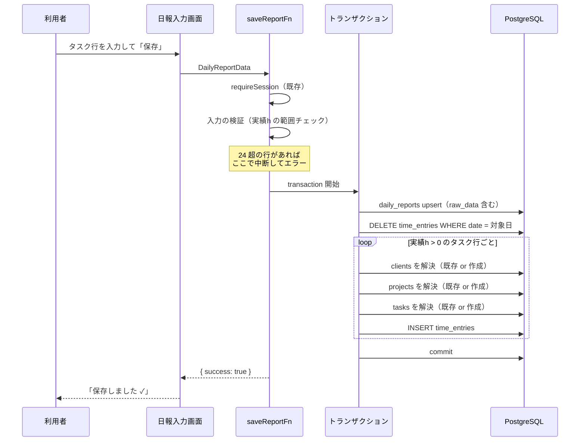
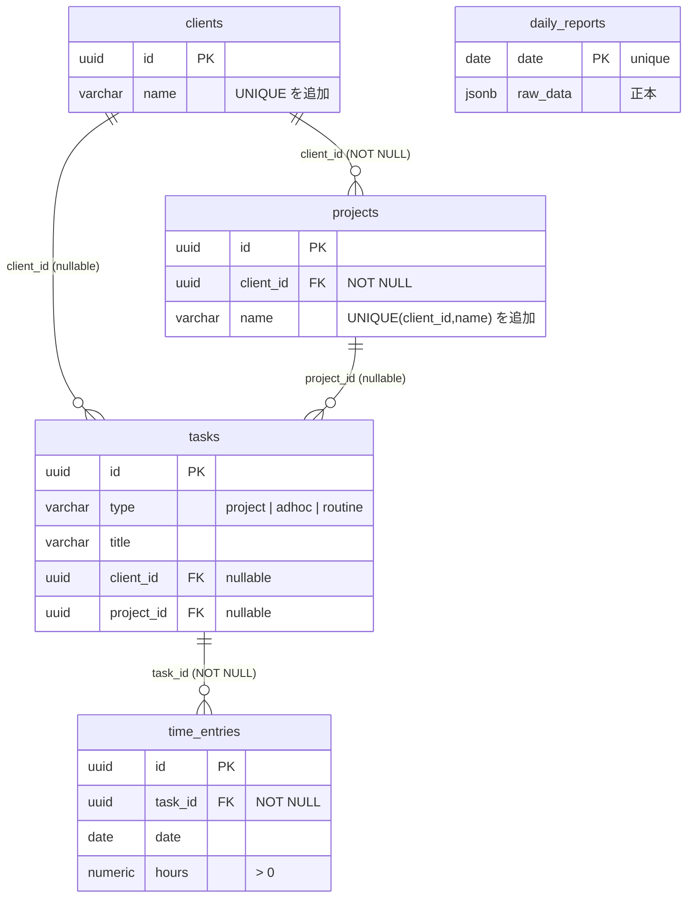

# 工数実績の正規化保存 設計書

# 基本情報【必須】

- 対象機能：工数実績の正規化保存（日報保存時のマスタ解決 + `time_entries` への実績記録）
- ステータス：レビュー中
- 作成日：2026-08-13
- 関連ドキュメント：
  - `docs/要件/工数実績の正規化保存_要件メモ.md`（要件の根拠）
  - `docs/設計/工数実績の正規化保存/_flow-config.md`（フロー設定：テスト承認=実施／実装承認=スキップ／lean）

---

# 要件【必須】

日報を保存したときに、`daily_reports.raw_data`（JSONB）への書き込みと同一トランザクションで、取引先・プロジェクト・タスクのマスタを解決（既存があれば再利用・無ければ作成）し、実績工数を `time_entries` に記録する。これにより、取引先別・プロジェクト別・タスク別の工数を SQL で集計できる状態にする。

## 背景【必須】

現在、日報の保存先は `daily_reports` テーブル 1 本のみで、書き込み経路は `saveReportFn`（`apps/web/src/server/functions/reports.ts:78`）だけである。正規化されているのは日単位の情報（`date` / `start_time` / `end_time` / `break_time` / `total_work_hours`）に限られ、**工数の内訳（取引先・プロジェクト・タスク・実績h）はすべて `raw_data` JSONB の中にある**。

一方、スキーマには正規化された受け皿がすでに定義されているが、アプリケーションコードからは一切参照されていない（`apps/web/src` を対象に検索して、`schema/` 配下の定義以外の参照は 0 件）：

- `clients`（取引先マスタ）／`projects`（プロジェクトマスタ）— `apps/web/src/server/schema/master.ts`
- `tasks`／`time_entries`（コメントに「工数記録（実績の唯一のマスター）」と明記）— `apps/web/src/server/schema/tasks.ts`

この結果、以下ができない状態にある：

- 取引先・プロジェクトをまたいだ工数の横断集計（SQL で内訳に到達できない）
- `effort_budgets` / `weekly_effort_budgets` に定義済みの工数予算との実績対比
- タスク単位の累計実績（`tasks.actual_hours` は空のまま）

現在の月次工数管理表は、JSON を全件展開したうえで**プロジェクト名の文字列完全一致**で突き合わせている（`apps/web/src/components/report/MonthlyTimesheetTable.tsx:42` の `report.projects.find((p) => p.name === projectName)`）。表記ゆれが 1 文字でもあれば別物として扱われる、脆い実装になっている。

## 目的（ゴール）【必須】

**日報を保存すると `time_entries` に ID 紐づきの実績が正しく積み上がる状態**を作る。集計の見せ方（画面・帳票）は本開発のゴールに含めない。

到達したい状態：

- 取引先・プロジェクト・タスクが ID で紐づいた実績レコードが `time_entries` に存在する
- 同じ日報を何度保存しても実績が二重計上されない
- `time_entries` の合計が、日報に入力された実績工数の合計と一致する

## 受け入れ条件【必須】

テストで検証可能な粒度で定義する（実装承認ゲートをスキップする設定のため、Phase 5 のテスト観点はこの条件を唯一の根拠として起案される）。

### 書き込みの基本

| ID | 受け入れ条件 |
|---|---|
| AC-01 | 日報を保存すると、実績h が数値として解釈でき 0 より大きいタスク行 1 件につき、`time_entries` が 1 件作成される |
| AC-02 | 作成された `time_entries` の `date` は日報の日付と一致し、`hours` は入力された実績h を小数第 2 位に丸めた値と一致する |
| AC-03 | 保存後、当該日付の `time_entries.hours` の合計が、日報の実績h（丸め後）の合計と一致する |
| AC-04 | `raw_data` の内容は本変更の前後で同一であり、`getAllReportsFn` / `getReportsByMonthFn` の戻り値も変わらない |
| AC-05 | `daily_reports` の既存カラム（`start_time` / `end_time` / `break_time` / `total_work_hours` / `note` / `good_points` / `bad_points` / `next_plan`）の保存内容は本変更の前後で変わらない |

### 冪等性・同期

| ID | 受け入れ条件 |
|---|---|
| AC-06 | 同じ日報を 2 回連続で保存しても、当該日付の `time_entries` の件数・合計が 1 回目と変わらない |
| AC-07 | タスク行を削除して再保存すると、削除した行に対応する `time_entries` も消える |
| AC-08 | 実績h を変更して再保存すると、対応する `time_entries.hours` が新しい値に更新されている（旧値のレコードは残らない） |
| AC-09 | `deleteReportFn` で日報を削除すると、当該日付の `time_entries` も削除される |

### マスタ解決

| ID | 受け入れ条件 |
|---|---|
| AC-10 | 同じ取引先名を含む日報を 2 日分保存しても、`clients` は 1 件のままである |
| AC-11 | 同じ取引先・同じプロジェクト名を含む日報を 2 日分保存しても、`projects` は 1 件のままである |
| AC-12 | 同一プロジェクト内の同名タスクを 2 日分保存すると、`tasks` は 1 件・`time_entries` は 2 件になる |
| AC-13 | 前後の空白または連続空白のみが異なる取引先名（例：`" A社 "` と `"A社"`、`"A  社"` と `"A 社"`）は、同一の `clients` レコードに解決される |
| AC-14 | 大文字小文字のみが異なる取引先名（例：`"api改修"` と `"API改修"`）は、別の `clients` レコードとして扱われる |
| AC-15 | 異なる取引先に属する同名プロジェクトは、別の `projects` レコードとして作成される |

### 欠損行・型の扱い

| ID | 受け入れ条件 |
|---|---|
| AC-16 | 取引先名とプロジェクト名がともに空のタスク行は、`type='adhoc'`・`client_id` が NULL・`project_id` が NULL のタスクとして記録され、`time_entries` も作成される |
| AC-17 | 取引先名はあるがプロジェクト名が空のタスク行は、`type='adhoc'`・`client_id` に解決済み ID・`project_id` が NULL のタスクとして記録される |
| AC-18 | 取引先名とプロジェクト名がともに入力された行は、`type='project'`・`project_id` に解決済み ID を持つタスクとして記録される |
| AC-19 | 実績h が空文字・空白のみ・数値に変換できない文字列・0・負数のいずれかである行は、`time_entries` が作成されない |
| AC-20 | 実績h が有効な行でタスク名が空の場合も `time_entries` は作成される（タスク名は後述の既定値で補う） |

### 検証エラーとトランザクション

| ID | 受け入れ条件 |
|---|---|
| AC-21 | 実績h が 24 を超える行が 1 件でもある場合、保存全体が失敗し、`daily_reports` も `time_entries` も更新されない |
| AC-22 | AC-21 の失敗時、原因が分かるエラーメッセージ（対象のタスク名と入力値を含む）が呼び出し元に返る |
| AC-23 | マスタ解決または `time_entries` の書き込みが失敗した場合、`daily_reports` の更新もロールバックされる（保存前の状態が保たれる） |
| AC-24 | 未ログイン状態では保存できない（既存の `requireSession` による保護が維持される） |

### DB 制約

| ID | 受け入れ条件 |
|---|---|
| AC-25 | `clients.name` に重複する行を直接 INSERT しようとすると、DB のユニーク制約違反になる |
| AC-26 | 同一 `client_id` 内で `projects.name` が重複する行を直接 INSERT しようとすると、DB のユニーク制約違反になる |
| AC-27 | `tasks` に `(project_id, client_id, title)` が重複する行を直接 INSERT しようとすると、DB のユニーク制約違反になる（いずれかが NULL の場合も重複と判定される） |

## 対象外の機能・要件（非ゴール）【必須】

- **既存データのバックフィル** — 既存 `daily_reports.raw_data` から `time_entries` への一括移行は行わない。本機能の適用後に保存された日報のみが対象
- **予定工数の記録** — `Task.plannedHours` から `schedule_entries` への書き込み、および `tasks.estimated_hours` の設定は行わない
- **`tasks.actual_hours` の更新** — `time_entries` を実績の唯一のマスターとし、`tasks.actual_hours` には書き込まない（二重管理を避けるため。集計は `time_entries` の SUM で行う）
- **マルチユーザー対応** — `user_id` は追加しない。現行の単一ユーザー前提（`daily_reports.date` が unique）を維持する
- **読み取り側の差し替え** — `MonthlyTimesheetTable.tsx` / 勤怠表の名前一致による集計はそのまま残す。`time_entries` を読む集計画面は本スコープに含めない
- **マスタ管理画面** — 取引先・プロジェクト・タスクの一覧／編集／統合（名寄せの手動修正）UI は作らない
- **予算対比** — `effort_budgets` / `weekly_effort_budgets` との突き合わせは行わない
- **その他のマスタ紐づけ** — `task_categories`（カテゴリ）・`technology_tags`（技術タグ）・`goals`（目標）との紐づけは行わない
- **UI の変更** — 日報入力画面の入力欄・レイアウトは変更しない（保存失敗時のメッセージ表示は既存機構をそのまま使う）

## 未決事項【必須】

| No | 内容 | 決定期限 | ステータス |
|---|---|---|---|
| 1 | `clients` / `projects` / `tasks` に本番 DB で手動投入されたデータが存在しないか（存在する場合、ユニーク制約追加時に重複で失敗する可能性がある） | Phase 3（人間承認）| 未決 — 人間の確認が必要 |
| 2 | `time_entries` への書き込み経路が将来複数になった場合、「日付単位で全削除して入れ直す」方式は日報以外の由来のレコードも消す。本設計はこのリスクを受け入れる前提でよいか | Phase 3（人間承認）| 未決 — 人間の判断が必要 |
| 3 | 実績h の上限を 24 とする妥当性（複数人分をまとめて入力する運用が将来生じないか） | Phase 3（人間承認）| 未決 — 人間の判断が必要 |

要件メモに挙げていた未決事項のうち、以下は本設計書で決定した（詳細は「変換ルール仕様」参照）：

| 要件メモの未決事項 | 本設計での決定 |
|---|---|
| 取引先はあるがプロジェクトが空の中間ケース | `type='adhoc'` + `client_id` のみ紐づけ（AC-17） |
| 同一日・同一タスクに複数行 | 合算せず行ごとに `time_entries` を作成する |
| 名寄せ先タスクの `status` が `completed` / `archived` の場合 | `status` を問わず再利用し、`status` は変更しない |
| `tasks.type` の判定ルール | `project_id` が解決できたら `project`、できなければ `adhoc`。`routine` は本機能では使わない |
| 日報削除時の `time_entries` | 同一トランザクションで削除する（AC-09） |

---

# 業務フロー【必須】

## 正常系



## 例外系

| # | 発生条件 | 挙動 |
|---|---|---|
| E-1 | 未ログイン | 既存の `requireSession` が中断する。`time_entries` にも `daily_reports` にも書き込まれない |
| E-2 | 実績h が 24 を超える行がある | トランザクション開始前に検証で中断。`Error` を投げ、画面に `保存エラー: <メッセージ>` が表示される（既存の `saveReport` 実装が `err.message` を表示する） |
| E-3 | マスタ解決中の DB エラー（一意制約の競合・接続断等） | トランザクション全体がロールバック。日報も更新されない。`Error` が呼び出し元へ伝播する |
| E-4 | `time_entries` の INSERT が check 制約（`hours > 0`）に違反 | 本設計では 0 以下の行を事前にスキップするため到達しない想定。到達した場合は E-3 と同じくロールバック |
| E-5 | 日報削除中のエラー | `deleteReportFn` のトランザクション全体がロールバックし、日報も `time_entries` も残る |

---

# 設計

## データモデル設計

### 変更方針

**テーブルの新規追加は行わない。**既存の `clients` / `projects` / `tasks` / `time_entries` をそのまま使う。名寄せを DB レベルで担保するため、**ユニーク制約を 3 本追加する**のが唯一のスキーマ変更である。

### スキーマ変更一覧

| # | 対象 | 追加する制約 | 目的 |
|---|---|---|---|
| S-1 | `clients` | `UNIQUE (name)` | 取引先名の重複作成を防ぐ。現状は nullable な `code` にのみ unique index があり（`master.ts:26`）、`name` の一意性は担保されていない |
| S-2 | `projects` | `UNIQUE (client_id, name)` | 同一取引先内でのプロジェクト名の重複作成を防ぐ。取引先が違えば同名プロジェクトを許す（AC-15） |
| S-3 | `tasks` | `UNIQUE NULLS NOT DISTINCT (project_id, client_id, title)` | タスクの名寄せキーの重複作成を防ぐ |

**S-3 で `NULLS NOT DISTINCT` を使う理由：** PostgreSQL は既定でユニーク制約中の NULL を互いに異なる値として扱うため、`project_id` / `client_id` が NULL になる adhoc タスク（AC-16・AC-17）では重複が防げない。PostgreSQL 15 以降で使える `NULLS NOT DISTINCT` を指定して NULL 同士も重複と判定させる。本リポジトリの PostgreSQL は 16（`docker-compose.yml` の `postgres:16-alpine`、CI も `postgres:16`）、Drizzle ORM は 0.45.2 で `unique().nullsNotDistinct()` に対応済みであることを確認済み。

**S-3 の副作用（明示）：** この制約は本機能以外の経路で作られるタスクにも適用され、「同一プロジェクト内に同名のタスクを 2 件作る」ことが DB レベルで不可能になる。本機能では「同名なら同一タスク」という名寄せ方針を採るため整合するが、将来タスク管理 UI を作る際は制約の見直しが必要になりうる。

### ER 図（本機能が触る範囲）



`daily_reports` と `time_entries` の間に外部キーはない。両者は「同じ `date` を持つ」ことだけで対応づく（後述のトランザクション設計で整合を保つ）。

### 既存 check 制約との整合

`tasks` には `chk_task_type_project`（`type != 'project' OR project_id IS NOT NULL`）がある（`tasks.ts:80`）。本設計の type 判定ルール（`project_id` が解決できたときのみ `project`）はこの制約を常に満たす。

`time_entries` には `chk_hours_positive`（`hours > 0`）がある（`tasks.ts:130`）。本設計は 0 以下の行を事前にスキップするため、この制約に到達しない。

## データ項目マッピング表

日報の入力欄（`apps/web/src/lib/types.ts` の型）と DB カラムの対応。

| No | 日報の項目 | UI 上の意味 | 型 | 格納先テーブル | カラム | 変換・備考 |
|---|---|---|---|---|---|---|
| 1 | `Project.name` | 取引先（placeholder「取引先」・`ProjectBlock.tsx:41`） | string | `clients` | `name` | 空白正規化後の文字列。空なら解決しない |
| 2 | `Task.label` | プロジェクト（placeholder「プロジェクト」・`TaskRow.tsx:22`） | string | `projects` | `name` | 空白正規化後の文字列。空、または取引先が空なら解決しない |
| 3 | `Task.name` | タスク名 | string | `tasks` | `title` | 空白正規化後の文字列。空なら既定値 `(名称未設定)` |
| 4 | `Task.actualHours` | 実績工数 | string | `time_entries` | `hours` | `Number()` で変換し小数第 2 位に丸める。0 以下・変換不可はスキップ、24 超はエラー |
| 5 | `Task.plannedHours` | 予定工数 | string | — | — | **本機能では書き込まない**（非ゴール） |
| 6 | `Task.progressBefore` / `progressExpected` / `progressActual` | 進捗率 | string | — | — | 対応する正規化カラムがないため書き込まない（`raw_data` にのみ残る） |
| 7 | `DailyReportData.date` | 日付 | string | `time_entries` | `date` | そのまま |
| 8 | （なし） | — | — | `time_entries` | `note` | 常に NULL。タスク行に対応するメモ欄が UI に存在しないため |
| 9 | （なし） | — | — | `tasks` | `status` / `priority` | 新規作成時は DB 既定値（`active` / `medium`）に任せる。既存再利用時は更新しない |

## 変換ルール仕様

### R-1: 名前の正規化（`normalizeName`）

すべての名前（取引先名・プロジェクト名・タスク名）に共通で適用する。

1. 空白文字（半角スペース・全角スペース・タブ・改行）を対象に、**前後の空白を除去**する
2. **連続する空白を半角スペース 1 つに圧縮**する
3. それ以外の変換は行わない（小文字化・全角半角変換・記号の正規化はしない）

補足：全角スペースも「空白」として扱い半角スペース 1 つに畳む。これは「全角半角を同一視しない」方針の例外ではなく、空白の打ち間違いを吸収する処理の一部として扱う。全角スペースを保持したい業務要件は存在しない。

### R-2: 対象行の抽出とスキップ条件

日報の全プロジェクトブロックの全タスク行を順に走査し、以下の順で判定する。

| 順 | 判定 | 該当時の扱い |
|---|---|---|
| 1 | `Task.actualHours` を `Number()` で変換できない（空文字・空白のみ・数値以外の文字列を含む） | **スキップ**（`time_entries` を作らない。マスタも作らない） |
| 2 | 変換結果が `0` 以下、または `NaN` | **スキップ** |
| 3 | 変換結果が `24` を超える | **保存全体をエラー**（AC-21） |
| 4 | 上記以外 | 対象行として処理する |

`Number('')` は `0` を返すため、空文字は判定 2 でスキップされる。判定 1 と 2 は実装上まとめてよいが、仕様としては「数値でない」と「0 以下」を区別して扱う。

**スキップした行はマスタも作らない。**予定h だけ入力して実績が未入力の行で、取引先やタスクが先行して作成されるのを避けるため。

### R-3: 実績h の丸め

小数第 3 位以下を四捨五入して小数第 2 位までにする（`time_entries.hours` が `numeric(4, 2)` のため）。丸めた値を `time_entries.hours` に格納する。AC-03 の「合計一致」は**丸め後の値の合計**で判定する。

### R-4: `tasks.type` の判定

| 条件 | `type` | `client_id` | `project_id` |
|---|---|---|---|
| 取引先名・プロジェクト名がともに非空 | `project` | 解決した取引先 ID | 解決したプロジェクト ID |
| 取引先名が非空・プロジェクト名が空 | `adhoc` | 解決した取引先 ID | NULL |
| 取引先名が空 | `adhoc` | NULL | NULL |

**取引先名が空の場合、プロジェクト名が入力されていてもプロジェクトマスタは作成しない。**`projects.client_id` が NOT NULL であり、所属先のない プロジェクトを作れないため。この場合プロジェクト名は正規化テーブルに残らない（`raw_data` には残る）。

`routine` は本機能では使用しない。

### R-5: タスク名の既定値

正規化後のタスク名が空文字の場合、`tasks.title` は `(名称未設定)` とする。`tasks.title` が NOT NULL であり、かつ実績h が入っている行は工数として記録する方針（AC-20）のため、既定値で補う。

## マスタ解決ロジック仕様

### 解決の共通方針

各マスタについて「正規化キーで検索 → 見つかればその ID を使う → 見つからなければ作成」を行う。作成時の競合（同一キーの同時挿入）は S-1〜S-3 のユニーク制約が防ぐ。競合が発生した場合は挿入を無視して再検索し、既存行の ID を採用する（`ON CONFLICT DO NOTHING` → 再 SELECT）。

### M-1: 取引先（`clients`）

- 検索キー：`name = normalizeName(Project.name)`
- 未存在時の作成値：`name` のみ指定。`code` は NULL、`sort_order` / `is_archived` は DB 既定値
- `Project.name` が正規化後に空文字の場合は解決しない（NULL を返す）

### M-2: プロジェクト（`projects`）

- 前提：取引先が解決済みであること（`client_id` が確定していること）
- 検索キー：`client_id = <解決済み取引先ID> AND name = normalizeName(Task.label)`
- 未存在時の作成値：`client_id` / `name` を指定。`code` は NULL
- `Task.label` が正規化後に空文字、または取引先が未解決の場合は解決しない（NULL を返す）

### M-3: タスク（`tasks`）

- 検索キー：`project_id`・`client_id`・`title` の 3 つ組（NULL も値として一致判定する）
- 未存在時の作成値：`type`（R-4）／`title`（R-5）／`client_id`／`project_id`。`status` / `priority` は DB 既定値、`estimated_hours` / `actual_hours` / `due_date` / `goal_id` / `category_id` は NULL
- **既存タスクが見つかった場合、そのタスクは一切更新しない。**`status` が `completed` / `archived` であっても再利用し、`status` を `active` に戻すこともしない（工数の記録はタスクの進行状態と独立であるため）

### M-4: 同一保存内のキャッシュ

1 回の保存で同じ取引先・プロジェクト・タスクが複数行に現れることは通常起きる（例：同じ取引先ブロック内に 5 タスク）。同一トランザクション内で解決済みのキーはメモリ上のマップに保持し、重複したクエリを発行しない。キャッシュのキーは正規化後の名前（および親 ID）とし、トランザクション終了時に破棄する。

## トランザクション設計

### T-1: 保存（`saveReportFn`）

トランザクション**外**で行うこと：

1. `requireSession`（既存ミドルウェア）
2. 実績h の検証（R-2 の判定 3）— DB に触れる前に落とす

トランザクション**内**で行うこと（この順序で実行する）：

1. `daily_reports` の upsert（現行と同一。`raw_data` を含む）
2. `DELETE FROM time_entries WHERE date = <対象日>`
3. 対象行ごとに M-1 → M-2 → M-3 を解決し、`time_entries` を INSERT

**削除を先に行い、その後に挿入する**（差分更新はしない）。日報が「その日の実績の完全なスナップショット」として丸ごと上書きされる以上、派生である `time_entries` も毎回作り直すのが最も整合するため。これにより AC-06・AC-07・AC-08 が同時に満たされる。

**削除範囲は「日付」のみで絞る。**`time_entries` に日報由来かどうかを示す列はなく、現状 `time_entries` への書き込み経路は本機能だけであるため、日付での特定で足りる。この前提が崩れる（別経路が追加される）場合は再設計が必要（未決事項 No.2）。

### T-2: 削除（`deleteReportFn`）

トランザクション内で以下を実行する：

1. `DELETE FROM time_entries WHERE date = <対象日>`
2. `DELETE FROM daily_reports WHERE date = <対象日>`

マスタ（`clients` / `projects` / `tasks`）は削除しない。他の日付の実績から参照されている可能性があり、参照されていない場合も「一度使った取引先」の履歴として残す方が自然なため。

### T-3: 原子性の担保

`db.transaction()`（Drizzle + postgres-js）を使う。トランザクション内のすべての DB 操作はトランザクションハンドル経由で行い、`db` を直接使わない（同一接続で実行されないと原子性が保証されないため）。

## エラー処理

本リポジトリには共通機能設計書が存在しないため、本機能のエラー処理を以下に定義する。

| 種別 | 発生条件 | サーバー側の挙動 | 画面表示 |
|---|---|---|---|
| 検証エラー | 実績h が 24 超（R-2 判定 3） | `Error` を throw（メッセージにタスク名と入力値を含む） | 既存の `saveReport` が `保存エラー: <メッセージ>` を 2 秒表示（`routes/index.tsx:114-121`） |
| DB エラー | 制約違反・接続断等 | トランザクションがロールバックし、例外が伝播する | 同上（`保存エラー: <DB のメッセージ>`） |
| 認証エラー | 未ログイン | `requireSession` が中断（既存挙動） | 既存挙動を変更しない |

エラーメッセージは日本語とし、利用者が入力を修正できる情報（どのタスクのどの値が問題か）を含める。例：`実績工数が上限（24時間）を超えています: 「ログイン改修」= 25`

**既存のクライアント実装との整合：**`reportStorage.save` は例外を捕捉して `{ ok: false, error: err.message }` を返す（`lib/storage.ts:53-60`）。画面はこの `error` をそのまま表示するため、サーバー側で throw したメッセージが利用者に届く。この経路は変更しない。

## 影響を受ける実装済み機能【必須】

| 機能 | 影響 | 対応 |
|---|---|---|
| 日報保存（`saveReportFn`） | **変更あり**。トランザクション化とマスタ解決・`time_entries` 書き込みを追加 | 本機能の中心。`raw_data` と既存カラムの保存内容は不変（AC-04・AC-05） |
| 日報削除（`deleteReportFn`） | **変更あり**。`time_entries` の削除を追加しトランザクション化 | AC-09 |
| 日報取得（`getAllReportsFn` / `getReportsByMonthFn`） | 変更なし | `raw_data` を読む経路は不変（AC-04） |
| 月次工数管理表（`MonthlyTimesheetTable`） | 変更なし | 名前一致による集計のまま。差し替えは別機能（非ゴール） |
| 勤怠管理表（`AttendanceTable`） | 変更なし | `daily_reports` の日単位カラムのみ参照しているため |
| 日報入力画面（`routes/index.tsx`） | 変更なし | 保存失敗時のメッセージ表示は既存機構をそのまま使う |
| better-auth の認証テーブル | 変更なし | — |
| DB スキーマ | **変更あり**。ユニーク制約 3 本を追加（S-1〜S-3） | `npm run db:push` で反映 |

## 非機能要件【任意】

### 性能

1 回の保存で発行されるクエリ数は、タスク行数を N、ユニークな取引先数を C、プロジェクト数を P、タスク数を T として概ね次のとおり：

```
1（日報 upsert）+ 1（time_entries 削除）+ (C + P + T) × 最大2（検索 + 作成）+ N（time_entries 挿入）
```

同一保存内のキャッシュ（M-4）により、同じマスタへの重複クエリは発生しない。日報 1 件のタスク行数は実運用で 10〜30 行程度を想定しており、この規模では逐次実行で問題ない。**`time_entries` の INSERT は 1 回の複数行 INSERT にまとめる。**

### セキュリティ

- 既存の `requireSession` ミドルウェアを維持する（AC-24）。本機能で新たな認証・認可の判断は追加しない
- 単一ユーザー前提のため、`user_id` によるデータ分離は行わない（非ゴール）
- SQL は Drizzle のクエリビルダ経由で構築し、名前などの利用者入力を文字列連結で SQL に埋め込まない

## マイグレーション手順

1. `apps/web/src/server/schema/master.ts` / `tasks.ts` にユニーク制約（S-1〜S-3）を追加する
2. `npm run db:push` でスキーマを反映する
3. 既存データに重複がある場合、`db:push` はユニーク制約の作成に失敗する。その場合は重複行を確認し、統合または削除してから再実行する

**現状の想定：**`clients` / `projects` / `tasks` はアプリケーションから一度も書き込まれていないため空である。手動投入されたデータがある場合は上記 3 の対応が必要（未決事項 No.1）。

ロールバックが必要な場合は、追加したユニーク制約を DROP すれば本機能の適用前の状態に戻る（テーブル・カラムの追加削除は行わないため）。

---

# テストレベル判定

`docs/開発プロセス/テストレベル選定トリガー表.md` との突き合わせ結果。

## 影響度トリガー（Impact）

| トリガー | 該当 | 理由 |
|---|---|---|
| 認可境界 | **非該当** | `user_id` / `company_id` によるデータ分離を行わない単一ユーザー前提の設計であり、フィルタリングの正しさが問われる箇所がない。マルチユーザー化する際は再判定が必要 |
| PII 取扱い | **非該当** | 扱うのは取引先名・プロジェクト名・タスク名・工数のみ。個人の連絡先情報や要配慮個人情報を含まない |
| 認証・セッション | **非該当** | 既存の `requireSession` を通すだけで、認証・セッションのロジック自体は追加・変更しない |
| **不可逆操作** | **該当** | 保存のたびに当該日付の `time_entries` を DELETE する。削除範囲の指定を誤ると他日付の実績を消す。日報削除時の連鎖削除も同様 → **結合(DB込み)必須・人間本記載** |
| **クリティカルパス業務** | **該当** | 日報保存は本アプリの主要導線であり、これが失敗すると利用者は日報を記録できない → **E2E 必須（AI起案→人間承認）** |
| 金銭・契約に関わる処理 | **非該当** | 現時点では請求・契約処理に接続していない。将来、工数を請求根拠に用いる場合は再判定が必要 |

## 発生可能性トリガー（Likelihood）

| トリガー | 該当 | 理由 |
|---|---|---|
| **DB 制約依存** | **該当** | 名寄せの正しさをユニーク制約（S-1〜S-3、特に `NULLS NOT DISTINCT`）に依存する。既存の check 制約（`chk_task_type_project` / `chk_hours_positive`）との整合もモックでは検証できない → **結合(DB込み)必須** |
| **実 JOIN クエリ** | **該当（限定的）** | 集計クエリ自体は非ゴールだが、マスタ解決で `clients` → `projects` → `tasks` を親子関係に沿って引く。NULL を含む複合キーでの検索はモックでは再現できない → **結合(DB込み)必須** |
| **トランザクション** | **該当** | `daily_reports` / `clients` / `projects` / `tasks` / `time_entries` の 5 テーブルにまたがる更新の原子性が要件（AC-23）→ **結合(DB込み)必須** |
| 複雑な状態遷移 | **非該当** | `tasks.status` を本機能では変更しない。3 状態以上の遷移ロジックを持たない |

## 判定結果

| レベル | 要否 | テスト仕様の確定方式 |
|---|---|---|
| 単体 | 必須 | AI（`normalizeName`・実績h の解釈と丸め・type 判定といった純粋関数） |
| 結合（内部・モック） | 必須 | AI（`saveReportFn` / `deleteReportFn` の呼び出し順序・検証エラー） |
| 結合（DB込み） | **必須** | **人間本記載**（フロー設定で Phase 7 = 実施のため。AI は各観点 1〜2 件の記入例のみ作成） |
| E2E | **必須** | AI 起案 → Adversary レビュー → 人間が修正・承認して凍結 |

## E2E シナリオの洗い出し

画面操作を伴うシナリオを、クリティカルパス該当有無を問わず列挙する。

### 自動化対象（クリティカルパス該当）

| # | シナリオ | 期待結果 |
|---|---|---|
| E2E-1 | ログイン済みで日報入力画面を開き、取引先・プロジェクト・タスク名・実績h を入力して保存する | 「保存しました ✓」が表示され、DB に日報と `time_entries` が作成されている |
| E2E-2 | 同じ日付の日報を修正して再度保存する | 保存が成功し、`time_entries` が二重に増えていない |

既存の `apps/web/e2e/daily-report.test.ts` に日報保存の E2E がすでに存在するため、Phase 10 ではその拡張として実装する（新規ファイルを作らない）。

### E2E 候補カタログ（クリティカルパス外・コード化しない）

Phase 5 で `docs/開発プロセス/E2E候補カタログ.md` に追記する候補。

| # | シナリオ | 期待結果 |
|---|---|---|
| C-1 | 実績h に `25` を入力して保存する | 「保存エラー: 実績工数が上限（24時間）を超えています…」が表示され、保存されない |
| C-2 | 実績h を空欄のままタスク行を残して保存する | エラーにならず保存され、その行は工数として記録されない |
| C-3 | 取引先欄を空にしたまま実績h を入力して保存する | エラーにならず保存される |
| C-4 | 保存済みの日報からタスク行を 1 つ削除して再保存する | 保存が成功し、削除した行の工数が消える |
| C-5 | 保存済みの日報を削除する | 日報が消え、その日の工数も残らない |

---

# 自己レビューチェック

- [x] 実装者がこの設計書だけを見て実装できるか — 正規化ルール（R-1）・スキップ条件（R-2）・丸め（R-3）・type 判定（R-4）・既定値（R-5）・解決手順（M-1〜M-4）・トランザクション順序（T-1〜T-3）を具体値レベルで定義した
- [x] 共通機能設計書との矛盾 — 本リポジトリに共通機能設計書が存在しないため、エラー処理を本設計書内で定義した
- [x] 機能特有の論点 — 欠損行・NULL を含む一意性・丸め・冪等性・削除経路・並行保存を扱った
- [x] ベースフォーマットにない項目の追記 — データモデル設計／変換ルール仕様／マスタ解決ロジック仕様／トランザクション設計／マイグレーション手順を追加。UI を持たない機能のため「デザイン」「画面構成」は省略し、「項目定義」は「データ項目マッピング表」に置き換えた
- [x] ステータスが「レビュー中」になっているか
- [x] テストレベル判定が記載されているか
