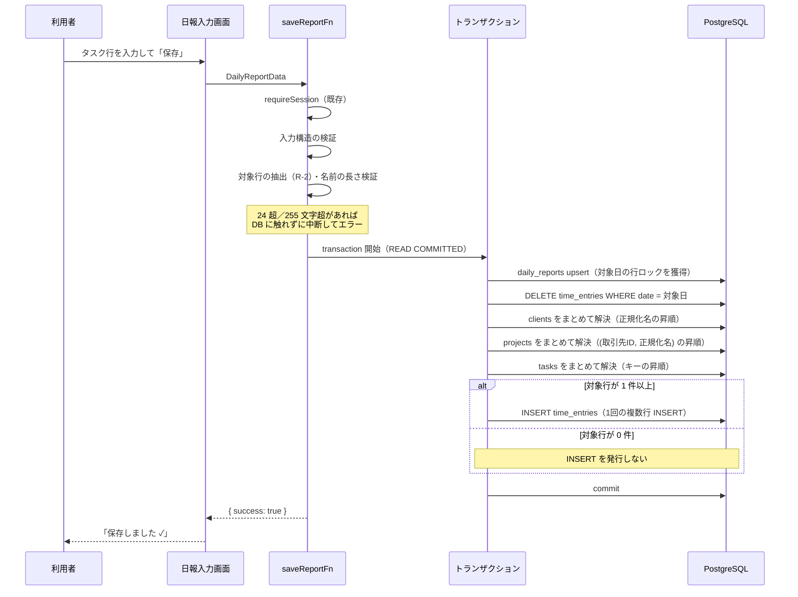
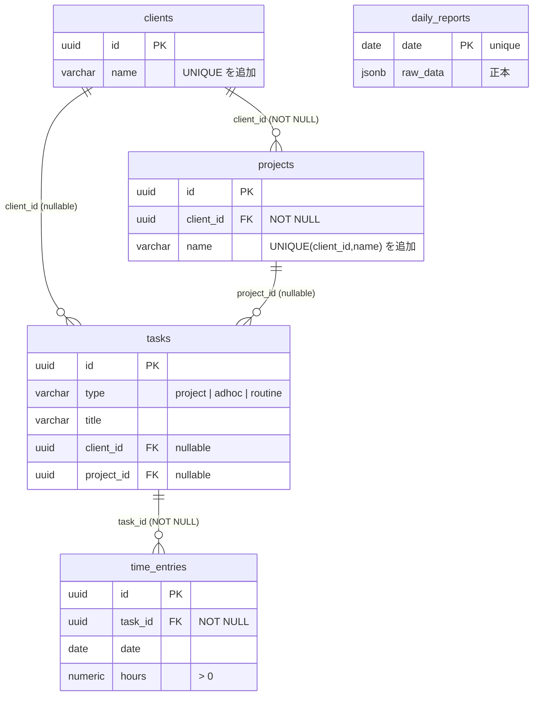

# 工数実績の正規化保存 設計書

# 基本情報【必須】

- 対象機能：工数実績の正規化保存（日報保存時のマスタ解決 + `time_entries` への実績記録）
- ステータス：レビュー中
- 作成日：2026-08-13
- 最終更新：2026-08-13（Phase 2 Round 1 findings を反映）
- 関連ドキュメント：
  - `docs/要件/工数実績の正規化保存_要件メモ.md`（要件の根拠）
  - `docs/設計/工数実績の正規化保存/_flow-config.md`（フロー設定：テスト承認=実施／実装承認=スキップ／lean）
  - `docs/設計/工数実績の正規化保存/_review/spec/findings.md`（Phase 2 の findings）

---

# 要件【必須】

日報を保存したときに、`daily_reports.raw_data`（JSONB）への書き込みと同一トランザクションで、取引先・プロジェクト・タスクのマスタを解決（既存があれば再利用・無ければ作成）し、実績工数を `time_entries` に記録する。これにより、取引先別・プロジェクト別・タスク別の工数を SQL で集計できる状態にする。

## 背景【必須】

現在、日報の保存先は `daily_reports` テーブル 1 本のみで、書き込み経路は `saveReportFn`（`apps/web/src/server/functions/reports.ts:63`）だけである。正規化されているのは日単位の情報（`date` / `start_time` / `end_time` / `break_time` / `total_work_hours`）に限られ、**工数の内訳（取引先・プロジェクト・タスク・実績h）はすべて `raw_data` JSONB の中にある**。

一方、スキーマには正規化された受け皿がすでに定義されているが、アプリケーションコードからは一切参照されていない（`apps/web/src` を対象に検索して、`schema/` 配下の定義以外の参照は 0 件）：

- `clients`（取引先マスタ）／`projects`（プロジェクトマスタ）— `apps/web/src/server/schema/master.ts`
- `tasks`／`time_entries`（コメントに「工数記録（実績の唯一のマスター）」と明記）— `apps/web/src/server/schema/tasks.ts`

この結果、以下ができない状態にある：

- 取引先・プロジェクトをまたいだ工数の横断集計（SQL で内訳に到達できない）
- `effort_budgets` / `weekly_effort_budgets` に定義済みの工数予算との実績対比
- タスク単位の累計実績（`tasks.actual_hours` は空のまま）

現在の月次工数管理表は、JSON を全件展開したうえで**プロジェクト名の文字列完全一致**で突き合わせている（`apps/web/src/components/report/MonthlyTimesheetTable.tsx:38` の `report.projects.find((p) => p.name === projectName)`）。表記ゆれが 1 文字でもあれば別物として扱われる、脆い実装になっている。

## 目的（ゴール）【必須】

**日報を保存すると `time_entries` に ID 紐づきの実績が正しく積み上がる状態**を作る。集計の見せ方（画面・帳票）は本開発のゴールに含めない。

到達したい状態：

- 取引先・プロジェクト・タスクが ID で紐づいた実績レコードが `time_entries` に存在する
- 同じ日報を何度保存しても実績が二重計上されない
- `time_entries` の合計が、日報に入力された実績工数の合計と一致する
- **本変更によって、これまで保存できていた日報が保存できなくなることがない**（保存を失敗させるのは、本設計で明示的に検証エラーと定めた場合に限る）

## 受け入れ条件【必須】

テストで機械的に判定できる粒度で定義する（実装承認ゲートをスキップする設定のため、Phase 5 のテスト観点はこの条件を唯一の根拠として起案される）。

**全 AC 共通の前提**：「実績h が有効な行」とは、R-2 の判定手順で「対象行」と分類された行を指す（parseFloat で有限の数値として解釈でき、丸め後の値が 0 より大きく 24 以下）。

### 書き込みの基本

| ID | 受け入れ条件 |
|---|---|
| AC-01 | 実績h が有効なタスク行 1 件につき、`time_entries` が 1 件作成される |
| AC-02 | 作成された `time_entries` の `date` は日報の日付と一致し、`hours` は R-3 で丸めた値と一致する |
| AC-03 | 保存後、当該日付の `time_entries.hours` の合計が、実績h が有効な行の丸め後の値の合計と一致する |
| AC-04 | `raw_data` の内容は本変更の前後で同一であり、`getAllReportsFn` / `getReportsByMonthFn` の戻り値も変わらない |
| AC-05 | `daily_reports` の既存カラム（`start_time` / `end_time` / `break_time` / `total_work_hours` / `note` / `good_points` / `bad_points` / `next_plan`）の保存内容は本変更の前後で変わらない |
| AC-06 | 実績h が有効な行が 1 件も無い日報（タスク行が 0 件の場合を含む）を保存しても成功し、当該日付の `time_entries` は 0 件になる |

### 冪等性・同期

| ID | 受け入れ条件 |
|---|---|
| AC-07 | 同じ日報を 2 回連続で保存しても、当該日付の `time_entries` の件数・合計が 1 回目と変わらない |
| AC-08 | タスク行を削除して再保存すると、削除した行に対応する `time_entries` も消える |
| AC-09 | 実績h を変更して再保存すると、対応する `time_entries.hours` が新しい値に更新されている（旧値のレコードは残らない） |
| AC-10 | `deleteReportFn` で日報を削除すると、当該日付の `time_entries` も削除される |
| AC-11 | **別日付の `time_entries` が存在する状態で対象日の日報を保存しても、別日付の `time_entries` の件数・合計は変化しない** |
| AC-12 | **別日付の `time_entries` が存在する状態で `deleteReportFn` を実行しても、別日付の `time_entries` および `daily_reports` は残る** |

### マスタ解決

| ID | 受け入れ条件 |
|---|---|
| AC-13 | 同じ取引先名を含む日報を 2 日分保存しても、`clients` は 1 件のままである |
| AC-14 | 同じ取引先・同じプロジェクト名を含む日報を 2 日分保存しても、`projects` は 1 件のままである |
| AC-15 | 同一プロジェクト内の同名タスクを 2 日分保存すると、`tasks` は 1 件・`time_entries` は 2 件になる |
| AC-16 | 空白のみが異なる取引先名は同一の `clients` レコードに解決される。検証対象：`" A社 "` と `"A社"`／`"A  社"` と `"A 社"`／`"A　社"`（全角スペース1つ）と `"A 社"`／`"A\t社"` と `"A 社"` |
| AC-17 | 大文字小文字のみが異なる取引先名（`"abc商事"` と `"ABC商事"`）は、別の `clients` レコードとして扱われる |
| AC-18 | 全角・半角のみが異なる取引先名（`"ＡＢＣ商事"` と `"ABC商事"`）は、別の `clients` レコードとして扱われる |
| AC-19 | 異なる取引先に属する同名プロジェクトは、別の `projects` レコードとして作成される |
| AC-20 | 取引先が異なる同名の adhoc タスク（例：取引先A の「定例会議」と取引先B の「定例会議」）は、別の `tasks` レコードとして作成される |
| AC-21 | 既存タスクの `status` が `completed` または `archived` であっても再利用され、`status` は変更されない |
| AC-22 | `deleteReportFn` で日報を削除しても、`clients` / `projects` / `tasks` のレコードは削除されない |

### 欠損行と type 判定

| ID | 受け入れ条件 |
|---|---|
| AC-23 | 取引先名・プロジェクト名がともに空で実績h が有効な行は、`type='adhoc'`・`client_id` NULL・`project_id` NULL・`title` がタスク名のタスクとして記録される |
| AC-24 | 取引先名があり・プロジェクト名が空で実績h が有効な行は、`type='adhoc'`・`client_id` に解決済み ID・`project_id` NULL のタスクとして記録される |
| AC-25 | 取引先名が空・プロジェクト名があり実績h が有効な行は、`projects` にレコードが作成されず、`type='adhoc'`・`client_id` NULL・`project_id` NULL で `title` が `<プロジェクト名> / <タスク名>` のタスクとして記録される |
| AC-26 | 取引先名・プロジェクト名がともにある行は、`type='project'`・`project_id` に解決済み ID を持つタスクとして記録される |
| AC-27 | 実績h が有効でない行に取引先名・プロジェクト名・タスク名が入力されていても、`clients` / `projects` / `tasks` のいずれにもレコードは作成されない |
| AC-28 | タスク名が空の行は `title` が `(名称未設定)` になる。AC-25 の連結が同時に該当する場合は `<プロジェクト名> / (名称未設定)` になる |

### 実績h の解釈・丸め

| ID | 受け入れ条件 |
|---|---|
| AC-29 | 実績h が空文字・空白のみ・`"abc"`・`"時間"` のように `parseFloat` で有限の数値にならない行は、`time_entries` が作成されない |
| AC-30 | 実績h の丸め後の値が 0 以下になる行（`"0"` / `"-3"` / `"0.004"`）は、`time_entries` が作成されない |
| AC-31 | 実績h `"2.675"` は `2.68` として格納される（10進 half-up。`Math.round(2.675*100)/100` の結果 `2.67` ではない） |
| AC-32 | 実績h `"24"` は保存に成功し、`24.00` として格納される |
| AC-33 | 実績h `"24.004"` は保存に成功し、`24.00` として格納される（24 判定は丸め後に行うため） |
| AC-34 | 実績h `"24.005"` は丸めると `24.01` となり上限を超えるため、保存全体が失敗する |
| AC-35 | 実績h `"7.5h"` は `7.5` として格納される（既存 UI の集計と同じく `parseFloat` を正とするため） |

### 検証エラーとトランザクション

| ID | 受け入れ条件 |
|---|---|
| AC-36 | 丸め後の実績h が 24 を超える行が 1 件でもある場合、保存全体が失敗し、`daily_reports` も `time_entries` も更新されない |
| AC-37 | AC-36 の失敗時、`saveReportFn` が投げる `Error.message` が「エラー処理」節のテンプレートに一致し、該当行が複数ある場合は全件が列挙される |
| AC-38 | 取引先名・プロジェクト名・タスク名（AC-25 の連結後を含む）が正規化後 255 文字を超える行が 1 件でもある場合、保存全体が失敗し、`Error.message` が「エラー処理」節のテンプレートに一致する。255 文字ちょうどは成功する |
| AC-39 | マスタ解決または `time_entries` の書き込みが失敗した場合、`daily_reports` の更新もロールバックされる（保存前の状態が保たれる） |
| AC-40 | 未ログイン状態では保存できない（既存の `requireSession` による保護が維持される） |
| AC-41 | `projects` が配列でない、`projects[].tasks` が配列でないなど入力の構造が不正な場合、DB に触れる前に検証エラーとなり、`daily_reports` も `time_entries` も更新されない |

### DB 制約

| ID | 受け入れ条件 |
|---|---|
| AC-42 | `clients.name` に重複する行を直接 INSERT しようとすると、DB のユニーク制約違反になる |
| AC-43 | 同一 `client_id` 内で `projects.name` が重複する行を直接 INSERT しようとすると、DB のユニーク制約違反になる |
| AC-44 | `tasks` に `(project_id, client_id, title)` が重複する行を直接 INSERT しようとすると、DB のユニーク制約違反になる（`project_id` / `client_id` がともに NULL の 2 行も重複と判定される） |

### 並行

| ID | 受け入れ条件 |
|---|---|
| AC-45 | 同一日付の日報保存を 2 つ同時に実行しても、当該日付の `time_entries` は後にコミットされた側の内容のみになり、両者の合算にならない |

## 対象外の機能・要件（非ゴール）【必須】

- **既存データのバックフィル** — 既存 `daily_reports.raw_data` から `time_entries` への一括移行は行わない。本機能の適用後に保存された日報のみが対象
- **予定工数の記録** — `Task.plannedHours` および `Project.plannedHours` から `schedule_entries` への書き込み、`tasks.estimated_hours` の設定は行わない
- **進捗率の記録** — `Task.progressBefore` / `progressExpected` / `progressActual` に対応する正規化カラムは存在せず、書き込まない（`raw_data` にのみ残る）
- **`tasks.actual_hours` の更新** — `time_entries` を実績の唯一のマスターとし、`tasks.actual_hours` には書き込まない（二重管理を避けるため。集計は `time_entries` の SUM で行う）
- **マルチユーザー対応** — `user_id` は追加しない。現行の単一利用前提（`daily_reports.date` が unique）を維持する
- **読み取り側の差し替え** — `MonthlyTimesheetTable.tsx` / 勤怠表の名前一致による集計はそのまま残す。`time_entries` を読む集計画面は本スコープに含めない
- **マスタ管理画面** — 取引先・プロジェクト・タスクの一覧／編集／統合（名寄せの手動修正）UI は作らない
- **孤立マスタのクリーンアップ** — 参照されなくなった `clients` / `projects` / `tasks` を削除する仕組みは作らない
- **予算対比** — `effort_budgets` / `weekly_effort_budgets` との突き合わせは行わない
- **その他のマスタ紐づけ** — `task_categories`（カテゴリ）・`technology_tags`（技術タグ）・`goals`（目標）との紐づけは行わない
- **1 日の合計工数の上限チェック** — 上限は行単位（24 時間）でのみ設ける。1 日の合計が実働時間を超えていても検証しない
- **UI の変更** — 日報入力画面の入力欄・レイアウトは変更しない（保存失敗時のメッセージ表示は既存機構をそのまま使う）

## 未決事項【必須】

| No | 内容 | 決定期限 | ステータス |
|---|---|---|---|
| 1 | `clients` / `projects` / `tasks` に本番 DB で手動投入されたデータが存在しないか。存在する場合、(a) ユニーク制約追加が重複で失敗する、(b) 前後に空白を含む等の非正規化な名前は `normalizeName` 済みの検索キーと一致せず別レコードが作られる、の 2 つの問題が起きる | Phase 3（人間承認）| 未決 — 人間の確認が必要 |
| 2 | `time_entries` への書き込み経路が将来複数になった場合、「日付単位で全削除して入れ直す」方式は日報以外の由来のレコードも消す。本設計はこのリスクを受け入れる前提でよいか（代替案は下記）| Phase 3（人間承認）| 未決 — 人間の判断が必要 |
| 3 | 実績h の上限を 24 とする妥当性（複数人分をまとめて入力する運用が将来生じないか）。なお `time_entries.hours` は `numeric(4,2)` であり、100 以上は上限を撤廃しても数値オーバーフロー（22003）になるため、実質的な上限は 99.99 である | Phase 3（人間承認）| 未決 — 人間の判断が必要 |

**未決 No.2 が否決された場合の代替案**（判断材料）：

| 案 | 内容 | 切替コスト |
|---|---|---|
| 案1 | `time_entries` に由来を示す列（例：`source varchar(20) default 'daily_report'`）を追加し、削除条件を `date = ? AND source = 'daily_report'` に絞る | スキーマ 1 列追加＋ T-1 / T-2 の DELETE 条件 1 箇所の変更 |
| 案2 | `daily_reports.date`（unique）を参照する外部キーを `time_entries` に張り、`ON DELETE CASCADE` にする | スキーマ変更（列追加＋FK）＋ T-2 の DELETE を 1 文削減。ただし日報のない日付に工数を記録できなくなる |

いずれも本設計の他の規定（マスタ解決・冪等性・トランザクション順序）は変更不要であり、Phase 3 で否決されても設計書の全面再作成にはならない。

### 要件メモからの変更点

要件メモ（`docs/要件/工数実績の正規化保存_要件メモ.md`）に対する本設計の位置づけ。

**要件メモの未決事項6件のうち5件を本設計で決定した：**

| 要件メモの未決事項 | 本設計での決定 |
|---|---|
| 取引先はあるがプロジェクトが空の中間ケース | `type='adhoc'` + `client_id` のみ紐づけ（R-4・AC-24） |
| 同一日・同一タスクに複数行 | 合算せず行ごとに `time_entries` を作成する（R-2） |
| 名寄せ先タスクの `status` が `completed` / `archived` の場合 | `status` を問わず再利用し、`status` は変更しない（M-3・AC-21） |
| `tasks.type` の判定ルール | `project_id` が解決できたら `project`、できなければ `adhoc`。`routine` は使わない（R-4） |
| 日報削除時の `time_entries` | 同一トランザクションで削除する（T-2・AC-10） |

残る1件（既存データとの衝突）は本設計書の未決事項 No.1 に引き継いだ。

**要件メモの決定事項からの変更点（Phase 3 で明示的な承認が必要）：**

| 要件メモの決定事項 | 本設計での扱い | 変更理由 |
|---|---|---|
| #9「PJ が無い場合は `title` と `type` をキーにする」 | キーを `(project_id, client_id, title)` に変更。`type` はキーに含めず、`client_id` を含める | `type` は `project_id` の有無から一意に決まるため、キーに含めても情報が増えない。一方 `client_id` を含めないと、取引先A の「定例会議」と取引先B の「定例会議」が同一タスクに融合し、取引先別の集計ができなくなる（AC-20） |
| #5「取引先・PJ が空なら adhoc でマスタ紐づけなし」 | 取引先が空で**プロジェクト名がある**行に限り、`title` を `<プロジェクト名> / <タスク名>` に連結する | 連結しない場合、`(NULL, NULL, title)` がキーになるため、プロジェクトの異なる「調査」「実装」等の汎用タスク名がすべて 1 件のタスクに融合し、タスク単位の集計が無意味になる（AC-25） |

---

# 業務フロー【必須】

## 正常系



## 例外系

| # | 発生条件 | 挙動 |
|---|---|---|
| E-1 | 未ログイン | 既存の `requireSession` が中断する。`time_entries` にも `daily_reports` にも書き込まれない |
| E-2 | 入力構造が不正（`projects` が配列でない等） | トランザクション開始前に検証で中断。`Error` を投げる |
| E-3 | 丸め後の実績h が 24 を超える行がある | トランザクション開始前に検証で中断。該当行を全件列挙した `Error` を投げ、画面に `保存エラー: <メッセージ>` が表示される（既存の `saveReport` 実装が `err.message` を表示する） |
| E-4 | 名前が正規化後 255 文字を超える | トランザクション開始前に検証で中断。E-3 と同じ形式で該当箇所を全件列挙する |
| E-5 | マスタ解決中の DB エラー（一意制約の競合・接続断・デッドロック等） | トランザクション全体がロールバック。日報も更新されない。`Error` が呼び出し元へ伝播する |
| E-6 | 日報削除中のエラー | `deleteReportFn` のトランザクション全体がロールバックし、日報も `time_entries` も残る |

`time_entries` の `chk_hours_positive`（`hours > 0`）に違反する経路は存在しない。R-2 の判定順序により、丸め後 0 以下の行は対象行から除外されるためである（丸め前の値でなく丸め後の値で判定することが要件）。

---

# 設計

## データモデル設計

### 変更方針

**テーブルの新規追加は行わない。**既存の `clients` / `projects` / `tasks` / `time_entries` をそのまま使う。名寄せを DB レベルで担保するため、**ユニーク制約を 3 本追加する**のが唯一のスキーマ変更である。

### スキーマ変更一覧

| # | 対象 | 追加する制約 | 目的 |
|---|---|---|---|
| S-1 | `clients` | `UNIQUE (name)` | 取引先名の重複作成を防ぐ。現状は nullable な `code` にのみ unique index があり（`master.ts:27`）、`name` の一意性は担保されていない |
| S-2 | `projects` | `UNIQUE (client_id, name)` | 同一取引先内でのプロジェクト名の重複作成を防ぐ。取引先が違えば同名プロジェクトを許す（AC-19） |
| S-3 | `tasks` | `UNIQUE NULLS NOT DISTINCT (project_id, client_id, title)` | タスクの名寄せキーの重複作成を防ぐ |

**S-3 で `NULLS NOT DISTINCT` を使う理由：** PostgreSQL は既定でユニーク制約中の NULL を互いに異なる値として扱うため、`project_id` / `client_id` が NULL になる adhoc タスク（AC-23・AC-25）では重複が防げない。PostgreSQL 15 以降で使える `NULLS NOT DISTINCT` を指定して NULL 同士も重複と判定させる。本リポジトリの PostgreSQL は 16（`docker-compose.yml` の `postgres:16-alpine`、CI も `postgres:16`）、Drizzle ORM は 0.45.2 で `unique().nullsNotDistinct()` に対応済みであることを確認済み。

**S-3 の副作用（明示）：**

1. この制約は本機能以外の経路で作られるタスクにも適用され、「同一プロジェクト内に同名のタスクを 2 件作る」ことが DB レベルで不可能になる。本機能では「同名なら同一タスク」という名寄せ方針を採るため整合するが、将来タスク管理 UI を作る際は制約の見直しが必要になりうる。
2. `parent_task_id` はキーに含まれないため、**親の異なるサブタスクであっても、同一プロジェクト内で同名のものは作れない**。本機能はサブタスクを作らないため影響はないが、階層タスクを導入する際は制約の見直しが必要になる。

### ER 図（本機能が触る範囲）



`daily_reports` と `time_entries` の間に外部キーはない。両者は「同じ `date` を持つ」ことだけで対応づく（トランザクション設計で整合を保つ）。

### 既存 check 制約との整合

| 制約 | 定義箇所 | 本設計との整合 |
|---|---|---|
| `chk_task_type_project`（`type != 'project' OR project_id IS NOT NULL`）| `tasks.ts:67` | R-4 の type 判定は `project_id` が解決できたときのみ `project` とするため常に満たす |
| `chk_task_type`（`type IN ('project','adhoc','routine')`）| `tasks.ts:59` | 本設計が書き込むのは `project` / `adhoc` のみ |
| `chk_task_status` / `chk_task_priority` | `tasks.ts:63,71` | 新規作成時は DB 既定値（`active` / `medium`）に任せる。既存再利用時は更新しない |
| `chk_hours_positive`（`hours > 0`）| `tasks.ts:109` | R-2 が丸め後 0 以下の行を除外するため到達しない |
| `chk_task_complexity` | `tasks.ts:75` | `complexity` は書き込まない（NULL 許容） |

## データ項目マッピング表

日報の入力欄（`apps/web/src/lib/types.ts` の型）と DB カラムの対応。

| No | 日報の項目 | UI 上の意味 | 桁数制限 | 格納先テーブル | カラム | 変換・備考 |
|---|---|---|---|---|---|---|
| 1 | `Project.name` | 取引先（placeholder「取引先」・`ProjectBlock.tsx:37`） | 255（正規化後） | `clients` | `name` | `normalizeName` 適用後の文字列。空なら解決しない |
| 2 | `Task.label` | プロジェクト（placeholder「プロジェクト」・`TaskRow.tsx:18`） | 255（正規化後） | `projects` | `name` | `normalizeName` 適用後の文字列。空、または取引先が空なら解決しない |
| 3 | `Task.name` | タスク名 | 255（連結後） | `tasks` | `title` | `normalizeName` 適用後。空なら `(名称未設定)`。取引先が空でプロジェクト名がある場合は `<プロジェクト名> / <タスク名>` に連結（R-4） |
| 4 | `Task.actualHours` | 実績工数 | — | `time_entries` | `hours` | `parseFloat` で変換し R-3 で丸める。有限数でない・丸め後 0 以下はスキップ、24 超はエラー |
| 5 | `Task.plannedHours` | 予定工数 | — | — | — | **本機能では書き込まない**（非ゴール） |
| 6 | `Project.plannedHours` | プロジェクト単位の予定工数 | — | — | — | **本機能では書き込まない**（非ゴール）。現状 UI にも入力欄がなく、型にのみ存在する |
| 7 | `Task.progressBefore` / `progressExpected` / `progressActual` | 進捗率 | — | — | — | 対応する正規化カラムがないため書き込まない（非ゴール） |
| 8 | `DailyReportData.date` | 日付 | — | `time_entries` | `date` | そのまま |
| 9 | （なし） | — | — | `time_entries` | `note` | 常に NULL。タスク行に対応するメモ欄が UI に存在しないため |
| 10 | （なし） | — | — | `tasks` | `status` / `priority` | 新規作成時は DB 既定値（`active` / `medium`）。既存再利用時は更新しない |

## 変換ルール仕様

### R-1: 名前の正規化（`normalizeName`）

すべての名前（取引先名・プロジェクト名・タスク名）に共通で適用する。

**規定（実装はこの式と等価であること）：**

```ts
function normalizeName(s: string): string {
  return s.replace(/\s+/gu, ' ').trim()
}
```

- 対象とする空白文字は **JavaScript の `\s` が空白とみなす集合**とする。これには半角スペース・タブ・改行（LF / CR）・垂直タブ・フォームフィード・**全角スペース（U+3000）**・NBSP（U+00A0）・`U+2000`〜`U+200A`・`U+FEFF` が含まれる。列挙ではなく `\s` を基準とすることで、実装ごとの解釈差をなくす
- **1 文字以上**の連続する空白列を半角スペース 1 つに置換する（単独の全角スペース・タブも半角スペース 1 つになる）。その後、前後の空白を除去する
- 上記以外の変換は行わない。**小文字化・全角半角変換・Unicode 正規化（NFC / NFD）・記号の正規化は行わない**（全角と半角、大文字と小文字は別の名前として扱う。AC-17・AC-18）

補足：全角スペースも「空白」として扱い半角スペース 1 つに畳む。これは「全角半角を同一視しない」方針の例外ではなく、空白の打ち間違いを吸収する処理の一部として扱う。全角スペースを名前の一部として保持したい業務要件は存在しない。

### R-2: 対象行の抽出とスキップ条件

日報の全プロジェクトブロックの全タスク行を順に走査し、**以下の順序で**判定する。順序は仕様の一部であり、入れ替えてはならない。

| 順 | 判定 | 該当時の扱い |
|---|---|---|
| 1 | `parseFloat(Task.actualHours)` の結果が有限の数値でない（`NaN` / `Infinity` / `-Infinity`） | **スキップ**（`time_entries` を作らない。マスタも作らない） |
| 2 | R-3 の丸めを適用した結果が **0 以下** | **スキップ** |
| 3 | R-3 の丸めを適用した結果が **24 を超える** | **保存全体をエラー**（AC-36） |
| 4 | 上記以外 | **対象行**として処理する |

**`parseFloat` を用いる理由（`Number` ではない）：** 既存 UI の実績h 集計はすべて `parseFloat` である（`ProjectBlock.tsx:30`、`routes/index.tsx:142`、`lib/report-generator.ts:11-12,38,40`）。`Number` を使うと、画面のヘッダに「合計 7.5h」と表示され日報テキストにも出力されている値が `time_entries` には 1 件も記録されない、という無警告の欠落が起きる（`Number('7.5h')` は `NaN`、`parseFloat('7.5h')` は `7.5`）。画面表示と `time_entries` の合計が常に一致することを優先し、`parseFloat` を正とする（AC-35）。

具体的な分類（Phase 5 のテストはこの表を根拠にしてよい）：

| 入力 | `parseFloat` | 判定 | 結果 |
|---|---|---|---|
| `""` / `"   "` | `NaN` | 1 | スキップ |
| `"abc"` / `"時間"` / `"１.５"`（全角数字） | `NaN` | 1 | スキップ |
| `"0x10"` | `0` | 2 | スキップ |
| `"0"` / `"-3"` / `"0.004"` | `0` / `-3` / `0.004` | 2 | スキップ |
| `"7.5h"` / `"7.5 時間"` | `7.5` | 4 | 7.50 として記録 |
| `"1,5"` | `1` | 4 | 1.00 として記録 |
| `"2.675"` | `2.675` | 4 | 2.68 として記録 |
| `"24"` / `"24.004"` | `24` / `24.004` | 4 | 24.00 として記録 |
| `"24.005"` / `"25"` / `"1e2"` | `24.005` / `25` / `100` | 3 | 保存全体エラー |

**スキップした行はマスタも作らない**（AC-27）。予定h だけ入力して実績が未入力の行で、取引先やタスクが先行して作成されるのを避けるため。

### R-3: 実績h の丸め

小数第 3 位を **10進の half-up（四捨五入）** で丸め、小数第 2 位までにする（`time_entries.hours` が `numeric(4, 2)` のため）。

**規定（実装はこの式と等価であること）：**

```ts
function round2(n: number): number {
  return Number(`${Math.round(Number(`${n}e+2`))}e-2`)
}
```

**`Math.round(n * 100) / 100` を使ってはならない。**2 進浮動小数の誤差により `2.675 * 100` が `267.49999999999994` となり、結果が `2.67` になる（期待値は `2.68`）。上記の指数表記を経由する式は、`String(n)` が最短往復表現を返す性質を利用して 10 進のまま桁をずらすため、この誤差を回避する。`toFixed(2)` も同じ理由で使用しない（`(2.675).toFixed(2) === '1.00'` 相当の誤差が出る）。

丸めた値を `time_entries.hours` に格納する。R-2 の判定 2・判定 3 は**いずれも丸め後の値**に対して行う。AC-03 の「合計一致」は丸め後の値の合計で判定する。

### R-4: `tasks` の識別情報の決定

| 条件 | `type` | `client_id` | `project_id` | `title` |
|---|---|---|---|---|
| 取引先名・プロジェクト名がともに非空 | `project` | 解決した取引先 ID | 解決したプロジェクト ID | タスク名 |
| 取引先名が非空・プロジェクト名が空 | `adhoc` | 解決した取引先 ID | NULL | タスク名 |
| 取引先名が空・プロジェクト名が非空 | `adhoc` | NULL | NULL | **`<プロジェクト名> / <タスク名>`** |
| 取引先名・プロジェクト名がともに空 | `adhoc` | NULL | NULL | タスク名 |

いずれも名前は `normalizeName` 適用後の値を用いる。

**取引先名が空の場合、プロジェクト名が入力されていてもプロジェクトマスタは作成しない。**`projects.client_id` が NOT NULL であり、所属先のないプロジェクトを作れないためである。

**この場合にプロジェクト名をタスク名へ連結する理由：** 連結しないと名寄せキーが `(NULL, NULL, タスク名)` となり、S-3 の `NULLS NOT DISTINCT` により、**プロジェクトが異なっても同名のタスクがすべて 1 件のタスクに融合する**。「調査」「実装」「MTG」のような汎用的なタスク名は複数プロジェクトで重複するのが常態であり、融合するとタスク単位の集計が無意味な混合値になる。しかも `time_entries` の総計は正しいまま内訳だけが誤るため、後続の集計機能を作るまで誤りに気づけない。連結によりキーが `(NULL, NULL, "PJ名 / タスク名")` となり、プロジェクト単位で分離できる。

連結の書式は **`<プロジェクト名>` + 半角スペース + `/` + 半角スペース + `<タスク名>`** とする。連結後の文字列に対して 255 文字の検証（R-6）を行う。

`routine` は本機能では使用しない。

### R-5: タスク名の既定値

正規化後のタスク名が空文字の場合、タスク名を `(名称未設定)` として扱う。`tasks.title` が NOT NULL であり、かつ実績h が有効な行は工数として記録する方針（AC-28）のため、既定値で補う。R-4 の連結が該当する場合は `<プロジェクト名> / (名称未設定)` になる。

**既知の帰結：** 利用者が実際に `(名称未設定)` という文字列をタスク名に入力した場合、タスク名未入力の行と同一タスクに名寄せされる。実害が小さいため対処しない。

### R-6: 名前の長さ検証

`normalizeName` 適用後（R-4 の連結が該当する場合は連結後）の取引先名・プロジェクト名・タスク名が **255 文字を超える場合、保存全体をエラーにする**。`clients.name` / `projects.name`（`master.ts:16,38`）と `tasks.title`（`tasks.ts:23`）がいずれも `varchar(255)` であるため、超過すると DB エラー（22001）でトランザクション全体がロールバックし、原因の分からない英語メッセージだけが表示される。

**切り詰めではなくエラーとする理由：** 255 文字で切り詰めると、先頭 255 文字が同じ別の名前どうしが同一マスタに統合され、誤った名寄せが静かに起きる。エラーであれば利用者が入力を修正できる。

検証はトランザクション開始前に行い、該当箇所を全件列挙してエラーメッセージに含める（R-2 判定 3 の検証と同じタイミング）。

### R-7: 入力構造の検証

`saveReportFn` の `inputValidator` は現状素通しであり（`reports.ts:66`）、`DailyReportData` の構造は保証されていない。本機能はタスク行を走査するため、以下をトランザクション開始前に検証し、満たさない場合はエラーにする（AC-41）。

- `data.projects` が配列であること
- `data.projects[].tasks` が配列であること

各フィールドが文字列でない場合は空文字として扱う（既存の `raw_data` 保存が任意の JSON を受け付けてきた挙動を壊さないため、型の緩さは許容し、走査で例外を出さないことのみを保証する）。

## マスタ解決ロジック仕様

### 解決の共通方針

各マスタについて「正規化キーで検索 → 見つかればその ID を使う → 見つからなければ作成」を行う。作成時の競合（同一キーの同時挿入）は S-1〜S-3 のユニーク制約が防ぐ。競合が発生した場合は挿入を無視して再検索し、既存行の ID を採用する（`ON CONFLICT DO NOTHING` → 再 SELECT）。

**再 SELECT が 0 件だった場合の終端条件：** 挿入と再検索を **1 回だけ**やり直す。それでも解決できない場合はエラーを投げてトランザクションを中断する（ID が NULL のまま先へ進むと `projects.client_id` や `time_entries.task_id` の NOT NULL 違反になり、原因の分かりにくい失敗になるため）。

**分離レベル：** PostgreSQL の既定である **READ COMMITTED** を用いる。「挿入を無視して再検索し既存行を採る」方式は、文ごとに新しいスナップショットを取る READ COMMITTED でのみ成立する（REPEATABLE READ 以上では再 SELECT が競合相手のコミット行を見られず 0 件を返し続ける）。トランザクションの分離レベルを変更してはならない。

### 解決の順序（デッドロック回避のため固定する）

対象行を走査して必要なマスタを収集したあと、**次の順序でまとめて解決する**。行ごとに逐次解決してはならない。

1. 取引先：正規化後の名前の**昇順**（コードポイント順）に解決する
2. プロジェクト：`(取引先ID, 正規化後の名前)` の**昇順**に解決する
3. タスク：`(project_id, client_id, title)` の**昇順**（NULL は最小として扱う）に解決する

**理由：** 順序を固定しないと、異なる日付の保存が同時に走ったときに、双方が同じ新規マスタ群を異なる順序で作ろうとして未コミットタプル同士で相互待機し、デッドロック（40P01）になる。名前順に固定すればロック取得順序が全トランザクションで一致し、デッドロックが構造的に発生しない。

### M-1: 取引先（`clients`）

- 検索キー：`name = normalizeName(Project.name)`
- 未存在時の作成値：`name` のみ指定。`code` は NULL、`sort_order` / `is_archived` は DB 既定値
- `Project.name` が正規化後に空文字の場合は解決しない（NULL を返す）
- `is_archived` が true のレコードも名前一致で再利用する（アーカイブ済みの取引先に過去日付の工数を追加する運用がありうるため。アーカイブ状態は変更しない）

### M-2: プロジェクト（`projects`）

- 前提：取引先が解決済みであること（`client_id` が確定していること）
- 検索キー：`client_id = <解決済み取引先ID> AND name = normalizeName(Task.label)`
- 未存在時の作成値：`client_id` / `name` を指定。`code` は NULL
- `Task.label` が正規化後に空文字、または取引先が未解決の場合は解決しない（NULL を返す）
- `is_archived` が true のレコードも M-1 と同じ理由で再利用する

### M-3: タスク（`tasks`）

- 検索キー：`project_id`・`client_id`・`title`（R-4 で決定した値）の 3 つ組
- **NULL を含む比較には `IS NOT DISTINCT FROM` を用いる。**Drizzle の `eq()` は `= NULL` を生成し SQL の三値論理により常に UNKNOWN となるため、`project_id` / `client_id` が NULL の adhoc タスクは決してヒットしない。ヒットしないまま `ON CONFLICT DO NOTHING` は S-3 に弾かれて 0 行、再 SELECT も 0 行となり、`task_id` が確定しないまま `time_entries` の INSERT に到達して NOT NULL 違反になる。実装では `sql` テンプレートで `IS NOT DISTINCT FROM` を明示する
- `ON CONFLICT` のアービタは S-3 のユニーク制約（`project_id, client_id, title`）に一致させる
- 未存在時の作成値：`type`（R-4）／`title`（R-4・R-5）／`client_id`／`project_id`。`status` / `priority` は DB 既定値、`estimated_hours` / `actual_hours` / `due_date` / `goal_id` / `category_id` / `parent_task_id` は NULL
- **既存タスクが見つかった場合、そのタスクは一切更新しない。**`status` が `completed` / `archived` であっても再利用し、`status` を `active` に戻すこともしない（工数の記録はタスクの進行状態と独立であるため。AC-21）

### M-4: 同一保存内のキャッシュ

1 回の保存で同じ取引先・プロジェクト・タスクが複数行に現れることは通常起きる（例：同じ取引先ブロック内に 5 タスク）。同一トランザクション内で解決済みのキーはメモリ上のマップに保持し、重複したクエリを発行しない。

キャッシュキーは**衝突しない形式**で構成する。名前をそのまま連結すると区切り文字が名前中に現れた場合に別のキーと衝突するため、`JSON.stringify([projectId, clientId, title])` のように配列をシリアライズした文字列を用いる（NULL は `null` として区別される）。キャッシュはトランザクション終了時に破棄する。

## トランザクション設計

### T-1: 保存（`saveReportFn`）

トランザクション**外**で行うこと（この順序で実行する）：

1. `requireSession`（既存ミドルウェア）
2. 入力構造の検証（R-7）
3. 全タスク行の走査と対象行の抽出（R-2）、および名前の長さ検証（R-6）— 24 超・255 文字超があればここでエラーを投げ、DB に一切触れない

トランザクション**内**で行うこと（この順序で実行する）：

1. **`daily_reports` の upsert**（現行と同一。`raw_data` を含む）
2. `DELETE FROM time_entries WHERE date = <対象日>`
3. マスタの解決（「解決の順序」に従って取引先 → プロジェクト → タスクの順にまとめて解決）
4. 対象行が 1 件以上ある場合、`time_entries` を **1 回の複数行 INSERT** で挿入する。**対象行が 0 件の場合は INSERT を発行しない**

**手順 1 を最初に置くことは整合性の要件であり、性能上の都合ではない。**`daily_reports.date` は unique であるため、`INSERT ... ON CONFLICT DO UPDATE` は対象日の行ロック（行が無い場合はユニークインデックスへの挿入）を獲得する。これにより**同一日付に対する 2 つの保存が直列化され**、後続のトランザクションは先行がコミットするまで待たされる。この順序を崩すと、両者が互いの未コミット行を DELETE 対象として認識できず、当該日付の `time_entries` が二重に残る（AC-45 が破れる）。

**対象行が 0 件の場合に INSERT を発行しない理由：** Drizzle の `insert().values([])` は例外を投げる（`node_modules/drizzle-orm/pg-core/query-builders/insert.js` の `values() must be called with at least one value`）。対象行 0 件は例外的な入力ではなく、`defaultDailyReport()` の初期状態（タスク行 1 件・実績h 空）や「予定だけ入れて保存する」運用で日常的に発生する。INSERT を発行してしまうと日報の初回保存が壊れる（AC-06）。

**削除を先に行い、その後に挿入する**（差分更新はしない）。日報が「その日の実績の完全なスナップショット」として丸ごと上書きされる以上、派生である `time_entries` も毎回作り直すのが最も整合するため。これにより AC-07・AC-08・AC-09 が同時に満たされる。

**削除範囲は「日付」のみで絞る。**`time_entries` に日報由来かどうかを示す列はなく、現状 `time_entries` への書き込み経路は本機能だけであるため、日付での特定で足りる（**未決事項 No.2。Phase 3 の判断により変更されうる**。代替案は未決事項節を参照）。削除条件から日付を落とすと全期間の実績が消えるため、AC-11 でこれを検証する。

### T-2: 削除（`deleteReportFn`）

トランザクション内で以下を実行する：

1. `DELETE FROM time_entries WHERE date = <対象日>`
2. `DELETE FROM daily_reports WHERE date = <対象日>`

マスタ（`clients` / `projects` / `tasks`）は削除しない（AC-22）。他の日付の実績から参照されている可能性があり、参照されていない場合も「一度使った取引先」の履歴として残す方が自然なため。孤立マスタのクリーンアップは非ゴール。

削除範囲が当該日付に限られることは AC-12 で検証する。

### T-3: 原子性の担保

`db.transaction()`（Drizzle + postgres-js）を使う。トランザクション内のすべての DB 操作はトランザクションハンドル経由で行い、`db` を直接使わない（同一接続で実行されないと原子性が保証されないため）。分離レベルは READ COMMITTED（既定）から変更しない（理由は「解決の共通方針」を参照）。

## エラー処理

本リポジトリには共通機能設計書が存在しないため、本機能のエラー処理を以下に定義する。

| 種別 | 発生条件 | サーバー側の挙動 | 画面表示 |
|---|---|---|---|
| 検証エラー（構造） | 入力構造が不正（R-7） | `Error` を throw | `保存エラー: <メッセージ>` を 2 秒表示（`routes/index.tsx:114-121`） |
| 検証エラー（上限） | 丸め後の実績h が 24 超（R-2 判定 3） | `Error` を throw（該当行を全件列挙） | 同上 |
| 検証エラー（長さ） | 名前が正規化後 255 文字超（R-6） | `Error` を throw（該当箇所を全件列挙） | 同上 |
| DB エラー | 制約違反・接続断・デッドロック等 | トランザクションがロールバックし、例外が伝播する | 同上（PostgreSQL のメッセージがそのまま表示される） |
| 認証エラー | 未ログイン | `requireSession` が中断（既存挙動） | 既存挙動を変更しない |

### エラーメッセージの規範

以下のテンプレートを**規範**とする（例示ではない）。複数件該当する場合は、該当行を改行（`\n`）区切りで**全件列挙**する。

**実績h の上限超過：**

```
実績工数が上限（24時間）を超えています。
「<タスク名>」= <入力された文字列そのまま>
```

**名前の長さ超過：**

```
名前が長すぎます（255文字以内にしてください）。
<項目名>: 「<正規化後の先頭30文字>…」（<正規化後の文字数>文字）
```

`<項目名>` は `取引先名` / `プロジェクト名` / `タスク名` のいずれか。

**入力構造の不正：**

```
日報のデータ形式が不正です。
```

`<タスク名>` は正規化後の値を用い、空文字の場合は `(名称未設定)`（R-5 と同じ既定値）を用いる。

### 検証の範囲（AC-37・AC-38 が対象とするもの）

AC-37・AC-38 が検証するのは、**`saveReportFn` が投げる `Error` の `message`** であり、結合テスト（内部）で判定する。

ブラウザ上の表示文言は AC の対象に含めない。サーバー関数で `throw` した `Error.message` が TanStack Start の RPC 境界を越えてクライアントの `err.message` に到達するかは未検証であり（本リポジトリに利用者向けメッセージを throw するサーバー関数の前例がなく、`apps/web/src/server` 配下の `throw new Error` は `env.ts` と `auth/config.ts` の起動時設定エラー 2 件のみ）、E2E ではメッセージ本文の一致を期待値にしない。E2E の期待値は「`保存エラー` を含む文言が表示され、保存が行われていないこと」までとする。

`reportStorage.save` は例外を捕捉して `{ ok: false, error: err.message }` を返す（`lib/storage.ts:57-65`）。この経路自体は変更しない。

## 影響を受ける実装済み機能【必須】

| 機能 | 影響 | 対応 |
|---|---|---|
| 日報保存（`saveReportFn`） | **変更あり**。トランザクション化、入力検証、マスタ解決・`time_entries` 書き込みを追加 | 本機能の中心。`raw_data` と既存カラムの保存内容は不変（AC-04・AC-05） |
| 日報削除（`deleteReportFn`） | **変更あり**。`time_entries` の削除を追加しトランザクション化 | AC-10・AC-12。なお**この関数を呼び出す UI は現状存在しない**（`routes/` からの呼び出しは 0 件で、画面に削除ボタンがない）。`createServerFn` で公開されたエンドポイントを直接叩く経路でのみ到達する |
| 日報取得（`getAllReportsFn` / `getReportsByMonthFn`） | 変更なし | `raw_data` を読む経路は不変（AC-04） |
| 月次工数管理表（`MonthlyTimesheetTable`） | 変更なし | 名前一致による集計のまま。差し替えは別機能（非ゴール） |
| 勤怠管理表（`AttendanceTable`） | 変更なし | `daily_reports` の日単位カラムのみ参照しているため |
| 日報入力画面（`routes/index.tsx`） | 変更なし | 保存失敗時のメッセージ表示は既存機構をそのまま使う |
| better-auth の認証テーブル | 変更なし | — |
| DB スキーマ | **変更あり**。ユニーク制約 3 本を追加（S-1〜S-3） | `npm run db:push` で反映 |

## 非機能要件【任意】

### 性能

1 回の保存で発行されるクエリ数は、ユニークな取引先数を C、プロジェクト数を P、タスク数を T、対象行数を N として概ね次のとおり：

```
1（日報 upsert）+ 1（time_entries 削除）+ (C + P + T) × 最大2（検索 + 作成）+ 1（time_entries の複数行 INSERT。N=0 のときは 0）
```

同一保存内のキャッシュ（M-4）により、同じマスタへの重複クエリは発生しない。日報 1 件のタスク行数は実運用で 10〜30 行程度を想定しており、この規模では逐次実行で問題ない。

タスク行数の上限は設けない。行数が極端に多い場合（数百行）はトランザクションの保持時間が延びるが、単一利用者・同一日付の保存が直列化される設計であるため、他の利用者を待たせる問題は生じない。

### セキュリティ

- 既存の `requireSession` ミドルウェアを維持する（AC-40）。本機能で新たな認証・認可の判断は追加しない
- データ分離（`user_id` によるフィルタリング）は行わない。これは本アプリのデータモデルが単一利用を前提としており（`daily_reports.date` が unique で `user_id` を持たない）、分離すべき境界が存在しないためである。**ログイン自体は `AUTH_ALLOWED_EMAILS` により複数人・ドメイン単位で許可されうる**ため、「利用者は必ず 1 人」という前提には立たない。複数人が使う場合、全員が同一のデータを共有する（これは本機能が持ち込む変更ではなく、既存の `daily_reports` の設計に由来する）
- SQL は Drizzle のクエリビルダおよびパラメータ化された `sql` テンプレート経由で構築し、名前などの利用者入力を文字列連結で SQL に埋め込まない

## マイグレーション手順

1. `apps/web/src/server/schema/master.ts` / `tasks.ts` にユニーク制約（S-1〜S-3）を追加する
2. `npm run db:push` でスキーマを反映する
3. 既存データに重複がある場合、`db:push` はユニーク制約の作成に失敗する。その場合は重複行を確認し、統合または削除してから再実行する

**現状の想定：**`clients` / `projects` / `tasks` はアプリケーションから一度も書き込まれていないため空である。手動投入されたデータがある場合は上記 3 の対応に加え、前後に空白を含む等の非正規化な名前が `normalizeName` 済みの検索キーと一致せず別レコードが作られる点にも注意が必要（未決事項 No.1）。

ロールバックが必要な場合は、追加したユニーク制約を DROP すれば本機能の適用前の状態に戻る（テーブル・カラムの追加削除は行わないため）。

---

# テストレベル判定

`docs/開発プロセス/テストレベル選定トリガー表.md` との突き合わせ結果。

## 影響度トリガー（Impact）

| トリガー | 該当 | 理由 |
|---|---|---|
| 認可境界 | **非該当** | 本アプリのデータモデルに `user_id` / `company_id` による分離が存在せず、フィルタリングの正しさが問われる箇所がない（`daily_reports` は日付が unique で、全ログインユーザーが同一データを共有する）。「利用者が 1 人だから」ではなく「分離すべき境界がデータモデル上存在しないから」非該当である。マルチユーザー化する際は再判定が必要 |
| PII 取扱い | **非該当** | 扱うのは取引先名・プロジェクト名・タスク名・工数のみ。個人の連絡先情報や要配慮個人情報を含まない |
| 認証・セッション | **非該当** | 既存の `requireSession` を通すだけで、認証・セッションのロジック自体は追加・変更しない |
| **不可逆操作** | **該当** | 保存のたびに当該日付の `time_entries` を DELETE する。削除範囲の指定を誤ると他日付の実績を消す（AC-11・AC-12 で検証）。日報削除時の連鎖削除も同様 → **結合(DB込み)必須・人間本記載** |
| **クリティカルパス業務** | **該当** | 日報保存は本アプリの主要導線であり、これが失敗すると利用者は日報を記録できない → **E2E 必須（AI起案→人間承認）** |
| 金銭・契約に関わる処理 | **非該当** | 現時点では請求・契約処理に接続していない。将来、工数を請求根拠に用いる場合は再判定が必要 |

## 発生可能性トリガー（Likelihood）

| トリガー | 該当 | 理由 |
|---|---|---|
| **DB 制約依存** | **該当** | 名寄せの正しさをユニーク制約（S-1〜S-3、特に `NULLS NOT DISTINCT`）に依存する。既存の check 制約（`chk_task_type_project` / `chk_hours_positive`）や `varchar(255)` との整合もモックでは検証できない → **結合(DB込み)必須** |
| **実 JOIN クエリ** | **該当（限定的）** | 集計クエリ自体は非ゴールだが、マスタ解決で `clients` → `projects` → `tasks` を親子関係に沿って引く。`IS NOT DISTINCT FROM` による NULL を含む複合キー検索はモックでは再現できない → **結合(DB込み)必須** |
| **トランザクション** | **該当** | `daily_reports` / `clients` / `projects` / `tasks` / `time_entries` の 5 テーブルにまたがる更新の原子性が要件（AC-39）。同一日付の直列化（AC-45）も実 DB でのみ検証できる → **結合(DB込み)必須** |
| 複雑な状態遷移 | **非該当** | `tasks.status` を本機能では変更しない。3 状態以上の遷移ロジックを持たない |

## 判定結果

| レベル | 要否 | テスト仕様の確定方式 |
|---|---|---|
| 単体 | 必須 | AI（`normalizeName`・R-2 の判定・R-3 の丸め・R-4 の type と title 決定といった純粋関数） |
| 結合（内部・モック） | 必須 | AI（`saveReportFn` / `deleteReportFn` の検証エラー・エラーメッセージ文言・呼び出し順序） |
| 結合（DB込み） | **必須** | **人間本記載**（フロー設定で Phase 7 = 実施のため。AI は各観点 1〜2 件の記入例のみ作成） |
| E2E | **必須** | AI 起案 → Adversary レビュー → 人間が修正・承認して凍結（Phase 5 で仕様凍結、Phase 10 でコード化・実行） |

## E2E シナリオの洗い出し

画面操作を伴うシナリオを、クリティカルパス該当有無を問わず列挙する。

### 自動化対象（クリティカルパス該当）

**前提の訂正：** 既存の `apps/web/e2e/daily-report.test.ts`（全 29 行）に含まれるのは「日報入力画面が表示され、フォーム要素が存在する」「工数管理ページが読み込める」「勤怠管理ページが読み込める」の 3 件のみで、**保存ボタンを押すテストは存在しない**。本機能の E2E は既存テストの拡張ではなく**新規に書き起こす**必要がある。

**検証手段の規定：** `time_entries` を表示する画面は存在しない（読み取り側の差し替えは非ゴール）。したがって E2E の期待結果は**画面上で観測できる事実に限定**し、`time_entries` の内容そのものの検証は結合(DB込み)テストに委ねる。

| # | シナリオ | 期待結果（画面で観測できる範囲） |
|---|---|---|
| E2E-1 | ログイン済みで日報入力画面を開き、取引先・プロジェクト・タスク名・実績h を入力して保存する | 「保存しました ✓」を含むメッセージが表示される |
| E2E-2 | E2E-1 の直後にページを再読み込みし、同じ日付の日報を開いて再度保存する | 2 回目も「保存しました ✓」が表示され、エラーにならない（冪等性の破綻がエラーとして表面化しないことの確認） |
| E2E-3 | 実績h を入力せずに（初期状態のまま）保存する | 「保存しました ✓」が表示され、保存エラーにならない（対象行 0 件で保存が壊れないことの確認・AC-06 の画面側での担保） |

`time_entries` の件数・合計・二重計上の不在は AC-01〜AC-12 として結合(DB込み)テストで検証する。

### E2E 候補カタログ（クリティカルパス外・コード化しない）

Phase 5 で `docs/開発プロセス/E2E候補カタログ.md` に追記する候補。

| # | シナリオ | 期待結果 |
|---|---|---|
| C-1 | 実績h に `25` を入力して保存する | 「保存エラー」を含む文言が表示され、保存されない（メッセージ本文の一致は求めない） |
| C-2 | 実績h を空欄のままタスク行を残して保存する | エラーにならず保存され、その行は工数として記録されない |
| C-3 | 取引先欄を空にしたまま実績h を入力して保存する | エラーにならず保存される |
| C-4 | 保存済みの日報からタスク行を 1 つ削除して再保存する | 保存が成功する |
| C-5 | 保存済みの日報を削除する | **現状 UI に削除導線がないため手動実施は不可**。削除導線を追加した時点で有効化する。それまで AC-10・AC-12 は結合(DB込み)テストで担保する |

---

# 自己レビューチェック

- [x] 実装者がこの設計書だけを見て実装できるか — 正規化（R-1）・判定順序（R-2）・丸め（R-3）・title 決定（R-4）・既定値（R-5）・長さ検証（R-6）・入力検証（R-7）・解決手順と順序（M-1〜M-4）・トランザクション順序（T-1〜T-3）・エラーメッセージ書式を、実装が一意に定まる粒度で規定した
- [x] 共通機能設計書との矛盾 — 本リポジトリに共通機能設計書が存在しないため、エラー処理を本設計書内で定義した
- [x] 機能特有の論点 — 欠損行・NULL を含む一意性・丸め・冪等性・削除範囲・文字列長・入力構造を扱った。**並行性については、同一日付の直列化（T-1 の順序規定・AC-45）とデッドロック回避（解決の順序固定）を規定した**
- [x] ベースフォーマットにない項目の追記 — データモデル設計／変換ルール仕様／マスタ解決ロジック仕様／トランザクション設計／マイグレーション手順を追加。UI を持たない機能のため「デザイン」「画面構成」は省略し、「項目定義」は「データ項目マッピング表」に置き換えた
- [x] ステータスが「レビュー中」になっているか
- [x] テストレベル判定が記載されているか
