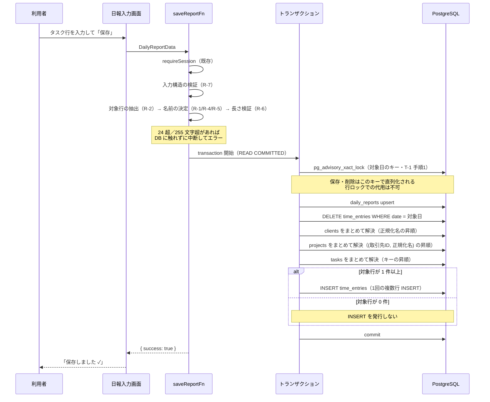
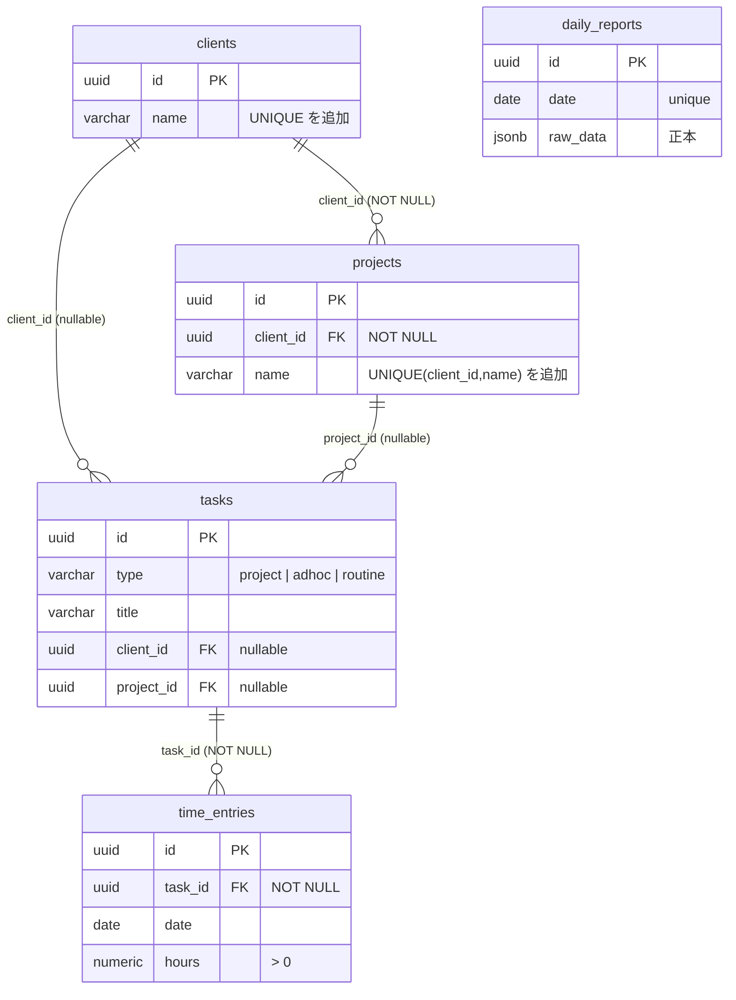

# 工数実績の正規化保存 設計書

# 基本情報【必須】

- 対象機能：工数実績の正規化保存（日報保存時のマスタ解決 + `time_entries` への実績記録）
- ステータス：**承認済み**（Phase 3 の人間承認ゲートを通過。2026-08-15）
- 作成日：2026-08-13
- 最終更新：2026-08-15（Phase 2 Round 7 findings を反映 → Phase 3 承認）
- 承認範囲：本設計書の全内容。「要件メモからの変更点」節に列挙した 5 件の変更（要件メモの決定事項 #1・#4・#5×2・#9 からの逸脱）を含む。**未決事項 No.2（日付単位の全削除方式のリスク受容）は、本設計書を記述どおり承認したことをもって「受容」で決定**した
- **本設計書は承認済み成果物である。**以後のフェーズで本書の規定を変更する必要が生じた場合は、`flow-review-policy` 4.3 に従い人間へエスカレーションすること（AI の判断で書き換えない）
- 関連ドキュメント：
  - `docs/要件/工数実績の正規化保存_要件メモ.md`（要件の根拠）
  - `docs/設計/工数実績の正規化保存/_flow-config.md`（フロー設定：テスト承認=実施／実装承認=スキップ／lean）
  - `docs/設計/工数実績の正規化保存/_review/spec/findings.md`（Phase 2 の findings）

---

# 要件【必須】

日報を保存したときに、`daily_reports.raw_data`（JSONB）への書き込みと同一トランザクションで、取引先・プロジェクト・タスクのマスタを解決（既存があれば再利用・無ければ作成）し、実績工数を `time_entries` に記録する。これにより、取引先別・プロジェクト別・タスク別の工数を SQL で集計できる状態にする。

## 背景【必須】

現在、日報の保存先は `daily_reports` テーブル 1 本のみで、書き込み経路は `saveReportFn`（`apps/web/src/server/functions/reports.ts:63`）だけである。正規化されているのは日単位の情報（`date` / `start_time` / `end_time` / `break_time` / `total_work_hours`）に限られ、**工数の内訳（取引先・プロジェクト・タスク・実績h）はすべて `raw_data` JSONB の中にある**。

一方、スキーマには正規化された受け皿がすでに定義されているが、アプリケーションコードからは一切参照されていない（`apps/web/src` を対象に検索して、`schema/` 配下の定義以外の参照は 0 件）：

- `clients`（取引先マスタ）／`projects`（プロジェクトマスタ）— `apps/web/src/server/schema/master.ts`
- `tasks`／`time_entries`（コメントに「工数記録（実績の唯一のマスター）」と明記）— `apps/web/src/server/schema/tasks.ts`

この結果、以下ができない状態にある：

- 取引先・プロジェクトをまたいだ工数の横断集計（SQL で内訳に到達できない）
- `effort_budgets` / `weekly_effort_budgets` に定義済みの工数予算との実績対比
- タスク単位の累計実績（`tasks.actual_hours` は空のまま）

現在の月次工数管理表は、JSON を全件展開したうえで**プロジェクト名の文字列完全一致**で突き合わせている（`apps/web/src/components/report/MonthlyTimesheetTable.tsx:38` の `report.projects.find((p) => p.name === projectName)`）。表記ゆれが 1 文字でもあれば別物として扱われる、脆い実装になっている。

## 目的（ゴール）【必須】

**日報を保存すると `time_entries` に ID 紐づきの実績が正しく積み上がる状態**を作る。集計の見せ方（画面・帳票）は本開発のゴールに含めない。

到達したい状態：

- 取引先・プロジェクト・タスクが ID で紐づいた実績レコードが `time_entries` に存在する
- 同じ日報を何度保存しても実績が二重計上されない
- `time_entries` の合計が、日報に入力された実績工数の合計と一致する
- **本変更によって新たに保存できなくなる入力は、次の 3 つに限る**（それ以外の入力は、同じ入力を単独で保存した場合の成否が本変更の前後で変わらない）
  1. `parseFloat` の結果が `24.005` 以上になる実績h を持つ行があるもの（R-2 判定 3）
  2. 実績h が有効な行（R-2 判定 4）のうち、DB へ書き込む名前が 255 文字を超えるものがあるもの（R-6）
  3. 日報データの構造が不正なもの（R-7）

  なお上記以外の入力でも、同一日付への同時保存による直列化待ちや DB 側の障害（接続断・デッドロック等。E-5）で保存が失敗することはある。ここでいう「成否が変わらない」は単独実行時の成否を指す。また対象行が約 21,845 行を超える日報は、複数行 INSERT のバインドパラメータ上限により単独実行でも失敗する（非機能要件 > 性能を参照。実運用でこの規模になることは想定しない）。

## 受け入れ条件【必須】

テストで機械的に判定できる粒度で定義する（実装承認ゲートをスキップする設定のため、Phase 5 のテスト観点はこの条件を唯一の根拠として起案される）。

**全 AC 共通の前提**：「実績h が有効な行」とは、R-2 の判定手順で「対象行」と分類された行を指す（`parseFloat` の結果が `0.005` 以上 `24.005` 未満）。

### 書き込みの基本

| ID | 受け入れ条件 |
|---|---|
| AC-01 | 実績h が有効なタスク行 1 件につき、`time_entries` が 1 件作成される |
| AC-02 | 作成された `time_entries` の `date` は日報の日付と一致し、`hours` は AC-31〜AC-35・AC-68 が定める具体値と一致する（DB から読んだ値を DB から読んだ値と比較するのではなく、設計書が定めた期待値と比較すること） |
| AC-03 | 実績h に `"7.5"` / `"2.675"` / `"0.004"` / `""` を持つ 4 行を含む日報を保存すると、当該日付の `time_entries.hours` の合計は `10.18`（`7.50 + 2.68`）になる |
| AC-04 | 日報を保存したのち `daily_reports.raw_data` を読むと、保存に渡した `DailyReportData` と等価な内容（全フィールドが一致）が格納されている（取得系サーバー関数の戻り値そのものを検証手段にしない理由は「検証の範囲」節を参照。`rowToReport()` はモジュールプライベートであり本機能では変更しないため、検証対象に含めない） |
| AC-05 | 保存後の `daily_reports` 行は、`date` / `start_time` / `end_time` / `break_time` / `note` / `good_points` / `bad_points` / `next_plan` が入力値と一致し、`total_work_hours` が「終業 − 始業 − 休憩」を 0 で下限クランプした値と一致する（現行実装 `String(Math.max(0, workHours))`（`functions/reports.ts:77,90`）の挙動を維持する。終業 < 始業 の入力では `0` になる） |
| AC-06 | 実績h が有効な行が 1 件も無い日報（タスク行が 0 件の場合を含む）を保存しても成功し、当該日付の `time_entries` は 0 件になる |

### 冪等性・同期

| ID | 受け入れ条件 |
|---|---|
| AC-07 | `type='project'` の行と adhoc 行（取引先が空の行・プロジェクトが空の行の両方）を含む日報を 2 回連続で保存しても、当該日付の `time_entries` の件数・合計が 1 回目と変わらない |
| AC-08 | タスク行を削除して再保存すると、削除した行に対応する `time_entries` も消える |
| AC-09 | 実績h を変更して再保存すると、対応する `time_entries.hours` が新しい値に更新されている（旧値のレコードは残らない） |
| AC-10 | `deleteReportFn` で日報を削除すると、当該日付の `time_entries` も削除される |
| AC-11 | 別日付の `time_entries` が存在する状態で対象日の日報を保存しても、別日付の `time_entries` の件数・合計は変化しない |
| AC-12 | 別日付の `time_entries` が存在する状態で `deleteReportFn` を実行しても、別日付の `time_entries` および `daily_reports` は残る |

### マスタ解決

以下は特記のない限り、実績h が有効な行を用いて検証する（実績h が無効な行ではマスタが作成されないため。AC-27）。

| ID | 受け入れ条件 |
|---|---|
| AC-13 | 同じ取引先名を含む日報を 2 日分保存しても、`clients` は 1 件のままである |
| AC-14 | 同じ取引先・同じプロジェクト名を含む日報を 2 日分保存しても、`projects` は 1 件のままである |
| AC-15 | 同一プロジェクト内の同名タスクを 2 日分保存すると、`tasks` は 1 件・`time_entries` は 2 件になる |
| AC-16 | 空白のみが異なる取引先名は同一の `clients` レコードに解決される。検証対象：`" A社 "` と `"A社"`／`"A  社"` と `"A 社"`／`"A　社"`（全角スペース1つ）と `"A 社"`／`"A\t社"` と `"A 社"` |
| AC-17 | 大文字小文字のみが異なる取引先名（`"abc商事"` と `"ABC商事"`）は、別の `clients` レコードとして扱われる |
| AC-18 | 全角・半角のみが異なる取引先名（`"ＡＢＣ商事"` と `"ABC商事"`）は、別の `clients` レコードとして扱われる |
| AC-19 | 異なる取引先に属する同名プロジェクトは、別の `projects` レコードとして作成される |
| AC-20 | 取引先が異なる同名の adhoc タスク（例：取引先A の「定例会議」と取引先B の「定例会議」）は、別の `tasks` レコードとして作成される |
| AC-21 | 既存タスクの `status` が `completed` または `archived` であっても再利用され、`status` は変更されない |
| AC-22 | `deleteReportFn` で日報を削除しても、`clients` / `projects` / `tasks` のレコードは削除されない |
| AC-49 | 取引先名・プロジェクト名がともに空で同名のタスク行を含む日報を 2 日分保存すると、`tasks` は 1 件・`time_entries` は 2 件になり、**2 回目の保存も成功する** |
| AC-50 | 取引先名のみあり・プロジェクト名が空で同名のタスク行を含む日報を 2 日分保存すると、`tasks` は 1 件・`time_entries` は 2 件になり、**2 回目の保存も成功する** |
| AC-51 | **同一の取引先の下で**、空白のみが異なるプロジェクト名（`" 基幹刷新 "` と `"基幹刷新"`）は、同一の `projects` レコードに解決される |
| AC-52 | **同一のプロジェクトの下で**、空白のみが異なるタスク名（`"調査 "` と `"調査"`）は、同一の `tasks` レコードに解決される |
| AC-57 | `is_archived` が true の `clients` / `projects` も名前一致で再利用され、`is_archived` は変更されない |
| AC-58 | 新規作成された `tasks` の `status` は `active`、`priority` は `medium` になる |

### 欠損行と type 判定

| ID | 受け入れ条件 |
|---|---|
| AC-23 | 取引先名・プロジェクト名がともに空で実績h が有効な行は、`type='adhoc'`・`client_id` NULL・`project_id` NULL・`title` がタスク名のタスクとして記録される |
| AC-24 | 取引先名があり・プロジェクト名が空で実績h が有効な行は、`type='adhoc'`・`client_id` に解決済み ID・`project_id` NULL のタスクとして記録される |
| AC-25 | 取引先名が空・プロジェクト名があり実績h が有効な行は、`projects` にレコードが作成されず、`type='adhoc'`・`client_id` NULL・`project_id` NULL で `title` が `<プロジェクト名> / <タスク名>` のタスクとして記録される |
| AC-26 | 取引先名・プロジェクト名がともにある行は、`type='project'`・`project_id` に解決済み ID を持つタスクとして記録される |
| AC-27 | 実績h が有効でない行に取引先名・プロジェクト名・タスク名が入力されていても、`clients` / `projects` / `tasks` のいずれにもレコードは作成されない |
| AC-28 | タスク名が空の行は `title` が `(名称未設定)` になる。AC-25 の連結が同時に該当する場合は `<プロジェクト名> / (名称未設定)` になる |

### 実績h の解釈・丸め

| ID | 受け入れ条件 |
|---|---|
| AC-29 | 実績h が空文字・空白のみ・`"abc"`・`"時間"` のように `parseFloat` で数値にならない行は、`time_entries` が作成されない |
| AC-30 | 実績h が `0.005` 未満になる行（`"0"` / `"-3"` / `"0.004"` / `"0x10"`）は、`time_entries` が作成されない |
| AC-31 | 実績h `"2.675"` は `2.68` として格納される（PostgreSQL の `numeric` による 10 進の half-up） |
| AC-32 | 実績h `"24"` は保存に成功し、`24.00` として格納される |
| AC-33 | 実績h `"24.004"` は保存に成功し、`24.00` として格納される |
| AC-34 | 実績h `"24.005"` は保存全体が失敗する（丸めると `24.01` となり上限を超えるため） |
| AC-35 | 実績h `"7.5h"` は `7.5` として格納される（既存 UI の集計と同じく `parseFloat` を正とするため） |
| AC-46 | 実績h `"0.0000001"` は `time_entries` が作成されない（`0.005` 未満のため） |
| AC-47 | 実績h `"12345678901234567890"`（20 桁）は保存全体が失敗する（`24.005` 以上のため） |
| AC-53 | `Task.actualHours` が数値型 `7.5` で送られても `7.5` として格納される（R-7 の文字列化を経て `parseFloat` される） |
| AC-68 | 実績h `"0.005"` は保存に成功し、`0.01` として格納される（下限の境界） |
| AC-70 | 実績h `"1.005"` は `1.01` として格納される（アプリ側で `Math.round(n*100)/100` や `toFixed(2)` を用いると `1.00` になるため、R-3 の「アプリ側で丸めない」規定に違反する実装を検出する） |
| AC-71 | 実績h `"8.575"` は `8.58` として格納される（同上。JS の丸めでは `8.57` になる） |
| AC-69 | `Project.name` / `Task.label` / `Task.name` が文字列でない値（数値・`null` 等）で送られても保存は成功し、数値は `String()` 化された文字列が、`null` / `undefined` は空文字が名前として扱われる |

### 検証エラーとトランザクション

| ID | 受け入れ条件 |
|---|---|
| AC-36 | 実績h が `24.005` 以上の行が 1 件でもある場合、保存全体が失敗し、`daily_reports` も `time_entries` も更新されない |
| AC-37 | AC-36 の失敗時、`saveReportFn` が投げる `Error.message` が「エラー処理」節のテンプレートに完全一致し、該当行が複数ある場合は見出し 1 行に続けて該当行が全件列挙される |
| AC-38 | 実績h が有効な行のうち、DB へ書き込む最終的な名前（R-1 正規化・R-5 既定値・R-4 連結をすべて適用した後の値）が 255 文字を超える行が 1 件でもある場合、保存全体が失敗し、`Error.message` が「エラー処理」節のテンプレートに完全一致する。255 文字ちょうどは成功する |
| AC-39 | マスタ解決または `time_entries` の書き込みが失敗した場合、`daily_reports` の更新もロールバックされる（保存前の状態が保たれる） |
| AC-40 | 未ログイン状態では**保存も削除も**できない（`saveReportFn` / `deleteReportFn` の双方で既存の `requireSession` による保護が維持される）。**検証は E2E で行う**（Vitest からサーバー関数を直接呼ぶ経路では `.server()` ミドルウェアが実行されないため検証できない。「検証の範囲」節を参照） |
| AC-41 | `projects` が配列でない、`projects[].tasks` が配列でない、`date` が文字列でない場合、DB に触れる前に検証エラーとなり、`Error.message` が「エラー処理」節の入力構造テンプレートに完全一致する |
| AC-48 | 実績h が有効でない行に 300 文字の名前が入力されていても、保存は成功する |
| AC-56 | 取引先名が空・プロジェクト名 250 文字・タスク名未入力・実績h 有効の行は、連結後 260 文字となり保存全体が失敗する |
| AC-59 | 実績h の上限超過と名前の長さ超過が同一の日報で同時に該当する場合、`Error.message` が「上限超過ブロック → 改行 → 長さ超過ブロック」の順で連結された文字列に完全一致する |
| AC-60 | `projects: [null]` または `tasks: [null]` を含む入力は AC-41 と同じ検証エラーになり、TypeError にならない |
| AC-66 | 取引先名が空・プロジェクト名 300 文字・タスク名あり・実績h 有効の行では、`Error.message` に `プロジェクト名:` の行が現れず、連結後の `タスク名:` の行のみが現れる（`projects` レコードが作られないため） |
| AC-67 | 同一プロジェクトブロックに対象行が 3 行あり、その取引先名が 300 文字の場合、`Error.message` の `取引先名:` の行は 1 回だけ現れる |

### DB 制約

| ID | 受け入れ条件 |
|---|---|
| AC-42 | `clients.name` に重複する行を直接 INSERT しようとすると、DB のユニーク制約違反になる |
| AC-43 | 同一 `client_id` 内で `projects.name` が重複する行を直接 INSERT しようとすると、DB のユニーク制約違反になる |
| AC-44 | `tasks` に `(project_id, client_id, title)` が重複する行を直接 INSERT しようとすると、DB のユニーク制約違反になる（`project_id` / `client_id` がともに NULL の 2 行も重複と判定される） |

### 並行

並行・順序に関する受け入れ条件は、**「守るべき性質」として記述する。検証手段（どの接続でどうロックを取るか、何を観測するか）は Phase 5 のテスト設計で確定する。**設計書側で検証手段まで規定しようとすると本リポジトリのテスト基盤で実行不能な条件を書き込むことになり（Phase 2 Round 3〜4 で実際に発生した）、かえって守られなくなるためである。Phase 5 が踏むべき制約は「Phase 5 への申し送り」節に列挙する。

| ID | 受け入れ条件（守るべき性質） |
|---|---|
| AC-45 | 同一日付に対する保存が 2 つ重なった場合、後発は先発のコミットまで進行せず、当該日付の `time_entries` は後にコミットされた側の内容のみになる（両者の合算にならない） |
| AC-54 | 同一日付に対する削除は、保存と同じ排他制御の対象になる（`deleteReportFn` も T-2 手順 1 のロックを取得する） |
| AC-55 | 対象日に `daily_reports` 行が**存在しない状態から**保存と削除が重なっても、`daily_reports` が存在しない日付に `time_entries` だけが残ることはない |
| AC-62 | マスタの解決は対象行の走査順ではなく、**取引先は正規化後の名前の昇順、プロジェクトは `(取引先ID, 正規化後の名前)` の昇順、タスクは `(project_id, client_id, title)` の昇順（NULL は最小）**で行われる（「解決の順序」と同一のキー）。守るべき性質は**全トランザクションが同一の全順序を用いること**であり、順序規則そのものの言語的な正しさは問わない |
| AC-63 | `saveReportFn` / `deleteReportFn` のトランザクションは分離レベルの指定を行わず、PostgreSQL の既定（READ COMMITTED）で実行される |
| AC-64 | マスタの再 SELECT が 0 件だった場合、挿入と再検索を**ちょうど 1 回**やり直し、それでも解決できない場合はエラーでトランザクションを中断する（無限リトライにも再試行ゼロにもならない） |
| AC-72 | アドバイザリロックはトランザクション内で取得され、コミットまで保持される（トランザクション外で取得して即解放される実装、およびセッションレベルの `pg_advisory_lock` を用いてコミット後も保持し続ける実装は、この条件を満たさない） |
| AC-73 | `deleteReportFn` に `'2000-1-1'`（書式違反）・`'2026-02-30'`（存在しない日）・`'0000-01-01'`（年 0）・`data` 自体が `null` の 4 入力を渡した場合、いずれも `Error.message` が「エラー処理」節の入力構造テンプレート（`日報のデータ形式が不正です。`）に**完全一致**し、DB に触れない。PostgreSQL 由来のエラー（22008 等）が返る実装はこの条件を満たさない |
| AC-74 | `saveReportFn` に `'2000-1-1'`・`'2026-02-30'`・`'0000-01-01'` を渡した場合、いずれも `Error.message` が AC-73 と同一のテンプレートに**完全一致**する。とくに `'2026-02-30'` が `'2026-03-02'` として処理され、3/2 の `time_entries` が削除されることはない |
| AC-75 | 未ログイン状態では削除もできない（`deleteReportFn` も `requireSession` を通る） |
| AC-89 | 対象日の `daily_reports` 行が存在しない日付に `deleteReportFn` を実行すると、`Error.message` が `指定された日付の日報が存在しません。` に完全一致し、DB は一切変化しない。判定は `time_entries` の件数ではなく `daily_reports` 行の有無で行い、アドバイザリロックの取得後に行う（T-2 手順 2） |
| AC-76 | `saveReportFn` に `data` として `null` を渡した場合、`Error.message` が AC-73 と同一のテンプレートに完全一致する（TypeError にならない。保存と削除で同一入力に同一の挙動となる） |
| AC-77 | 条件 2（実在日）の判定はプロセスの `TZ` 環境変数に依存しない。`TZ=UTC` / `TZ=Asia/Tokyo` / `TZ=America/New_York` のいずれで実行しても、`'2026-12-31'` は受理され `'2026-02-30'` は拒否される |
| AC-78 | 年 `0001`〜`0099` の日付（例 `'0050-03-01'`）は条件 2・3 を通過する（年 0 のみを拒否するという条件 3 の規定どおりに動く） |
| AC-83 | 判定手順 2（月の範囲）を落とす実装が識別できる。`'2026-13-01'`・`'2026-00-10'`・`'2026-01-00'` はいずれも入力構造テンプレートに完全一致するメッセージで拒否され、PostgreSQL 由来のエラーにならない |
| AC-84 | 判定手順 4（閏年規則）の 4 分岐すべてが識別できる。`'2028-02-29'`（4 の倍数）と `'2000-02-29'`（400 の倍数）は**検証を通過**し、`'2026-02-29'`（4 の倍数でない）と `'1900-02-29'`（100 の倍数かつ 400 の倍数でない）は**入力構造テンプレートに完全一致するメッセージで拒否される**。2 月を常に 28 日とする実装・常に 29 日とする実装・`y % 4 === 0` のみの実装は、いずれもこの条件を満たさない |
| AC-85 | 年 `0001`〜`0099` でも閏年規則が適用される。`'0004-02-29'` は検証を通過し、`'0050-02-29'` は拒否される（2 桁年を 1900 年代へ丸め込む実装はこの条件を満たさない） |

### UI（エラー表示）

| ID | 受け入れ条件 |
|---|---|
| AC-61 | 検証エラーで保存が失敗したとき、メッセージを表示する要素が `text-danger` クラス（`--color-danger`）を持ち、`whitespace-pre-line` により改行が保持され、**保存操作から 3 秒後も表示が残っている**（自動消去されない） |
| AC-65 | **`savedMsg` を更新するいずれの経路（日報保存の成功・テンプレート保存・日付未入力）の直後（2 秒以内）**に日報保存が検証エラーで失敗した場合も、エラー表示は自動的に消えない（先行する自動消去タイマーが取り消されていることの検証） |
| AC-79 | 副作用実行関数に偽のタイマー API を注入して呼ぶと、`setTimeout` を含む副作用配列では**注入した `setTimeout` が返した ID がそのまま戻り値になり**、含まない配列では `null` が返る。また `clearTimeout` 副作用は、副作用が指定した ID を引数として注入した `clearTimeout` に渡す |
| AC-80 | 日報保存の成功・テンプレ保存の成功・テンプレ保存の失敗・日付未入力の 4 イベントは、いずれも `setTimeout`（2000ms）を副作用として**出力する**（reducer の出力を対象とする条件である。自動消去が実際に起きることは AC-87・AC-88 が担保する） |
| AC-81 | テンプレ保存の失敗イベントに対する reducer の出力は「エラー扱いにしない」である（エラー扱いになるのは日報保存の失敗イベントのみ）。したがって画面上も `text-danger` / `whitespace-pre-line` は付かない |
| AC-82 | 「自動消去の発火」イベントは、メッセージを空にし、**副作用を 1 つも出力しない**（`setTimeout` を出力して 2 秒周期で自己再スケジュールする実装はこの条件を満たさない） |
| AC-86 | reducer が出力する `clearTimeout` 副作用の `id` は、**入力状態の「予約中タイマー ID」と同一の値**である（識別可能な値、例 `12345` を入力に与えて等値比較する）。予約中タイマー ID が `null` の状態では `clearTimeout` を出力しない。固定値・別変数の値・`null` を詰める実装はこの条件を満たさない |
| AC-87 | 副作用実行関数に偽のタイマー API と偽の `dispatch` を注入して `setTimeout` 副作用を実行すると、注入した `setTimeout` は `(callback, ms)` を受け取り、**`ms` が副作用の値（2000）と一致**し、**`callback` を呼ぶと注入した `dispatch` に「自動消去の発火」イベントが 1 回送られる**。コールバックが no-op の実装・`ms` を無視する実装はこの条件を満たさない |
| AC-88 | 日報保存の成功メッセージは 2 秒後に自動的に消える（現行挙動の維持。自動消去の機構が失われた実装はこの条件を満たさない）。**検証は E2E で行う**（E2E-7） |

## 対象外の機能・要件（非ゴール）【必須】

- **既存データのバックフィル** — 既存 `daily_reports.raw_data` から `time_entries` への一括移行は行わない。本機能の適用後に保存された日報のみが対象
- **予定工数の記録** — `Task.plannedHours` および `Project.plannedHours` から `schedule_entries` への書き込み、`tasks.estimated_hours` の設定は行わない
- **進捗率の記録** — `Task.progressBefore` / `progressExpected` / `progressActual` に対応する正規化カラムは存在せず、書き込まない（`raw_data` にのみ残る）
- **`tasks.actual_hours` の更新** — `time_entries` を実績の唯一のマスターとし、`tasks.actual_hours` には書き込まない（集計は `time_entries` の SUM で行う）
- **マルチユーザー対応** — `user_id` は追加しない。現行のデータモデル（`daily_reports.date` が unique）を維持する
- **読み取り側の差し替え** — `MonthlyTimesheetTable.tsx` / 勤怠表の名前一致による集計はそのまま残す。`time_entries` を読む集計画面は本スコープに含めない
- **マスタ管理画面** — 取引先・プロジェクト・タスクの一覧／編集／統合（名寄せの手動修正）UI は作らない
- **孤立マスタのクリーンアップ** — 参照されなくなった `clients` / `projects` / `tasks` を削除する仕組みは作らない
- **予算対比** — `effort_budgets` / `weekly_effort_budgets` との突き合わせは行わない
- **その他のマスタ紐づけ** — `task_categories`・`technology_tags`・`goals` との紐づけは行わない
- **1 日の合計工数の上限チェック** — 上限は行単位でのみ設ける。1 日の合計が実働時間を超えていても検証しない
- **UI の変更（エラー表示を除く）** — 日報入力画面の入力欄・レイアウト・保存導線は変更しない。**保存失敗時のメッセージ表示のみ、後述「UI の変更（エラー表示）」の範囲で変更する**

## 未決事項【必須】

| No | 内容 | 決定期限 | ステータス |
|---|---|---|---|
| 1 | `clients` / `projects` / `tasks` に本番 DB で手動投入されたデータが存在しないか。存在する場合、(a) ユニーク制約追加が重複で失敗する、(b) 前後に空白を含む等の非正規化な名前は `normalizeName` 済みの検索キーと一致せず別レコードが作られる、の 2 つの問題が起きる | **Phase 8 のスキーマ反映（`npm run db:push`）の前**まで | **持ち越し** — 設計判断ではなく実 DB の確認事項であるため、Phase 3 の承認とは独立に残る。**確認は人間が実施する**（下記「確認手順」）|
| 2 | `time_entries` への書き込み経路が将来複数になった場合、「日付単位で全削除して入れ直す」方式は日報以外の由来のレコードも消す。本設計はこのリスクを受け入れる前提でよいか（代替案は下記）| Phase 3（人間承認）| **決定：受容**（2026-08-15）。本設計書を記述どおり承認したことをもって、日付単位の全削除方式のリスクを受け入れる。現状 `time_entries` への書き込み経路は本機能のみである |

**未決 No.1 の確認手順（人間が実施。`npm run db:push` の前まで）：**

```sql
-- (a) ユニーク制約が張れるか（3 クエリとも 0 行なら S-1〜S-3 は成功する）
SELECT name, count(*) FROM clients GROUP BY name HAVING count(*) > 1;
SELECT client_id, name, count(*) FROM projects GROUP BY client_id, name HAVING count(*) > 1;
SELECT project_id, client_id, title, count(*) FROM tasks
  GROUP BY project_id, client_id, title HAVING count(*) > 1;

-- (b) 非正規化な名前が残っていないか（0 行なら R-1 の検索キーと一致する）
SELECT id, name FROM clients  WHERE name <> regexp_replace(btrim(name), '\s+', ' ', 'g');
SELECT id, name FROM projects WHERE name <> regexp_replace(btrim(name), '\s+', ' ', 'g');
SELECT id, title FROM tasks   WHERE title <> regexp_replace(btrim(title), '\s+', ' ', 'g');
```

(a) が 1 行でも返る場合は重複を手で統合してから `db:push` する（制約追加が失敗するため）。(b) が返る場合、そのレコードは本機能から再利用されず新しいレコードが並んで作られる。実害が無ければ放置してよいが、統合したい場合は名前を正規化済みの値に UPDATE してから `db:push` する。**いずれも本設計書の規定は変更しない。**

**未決 No.2 を将来見直す場合の代替案**（今回は「受容」で決定済み。参考として残す）：

| 案 | 内容 | 切替コスト |
|---|---|---|
| 案1 | `time_entries` に由来を示す列（例：`source varchar(20) default 'daily_report'`）を追加し、削除条件を `date = ? AND source = 'daily_report'` に絞る | スキーマ 1 列追加＋ T-1 / T-2 の DELETE 条件 1 箇所の変更 |
| 案2 | `daily_reports.date`（unique）を参照する外部キーを `time_entries` に張り、`ON DELETE CASCADE` にする | スキーマ変更（列追加＋FK）＋ T-2 の DELETE を 1 文削減。ただし日報のない日付に工数を記録できなくなる |

いずれも本設計の他の規定（マスタ解決・冪等性・トランザクション順序）は変更不要であり、将来この方式を見直すことになっても設計書の全面再作成にはならない。

### 要件メモからの変更点

要件メモ（`docs/要件/工数実績の正規化保存_要件メモ.md`）に対する本設計の位置づけ。**Phase 3 の承認者は、この節を承認範囲の目次として使うこと。**

**要件メモの未決事項6件のうち5件を本設計で決定した：**

| 要件メモの未決事項 | 本設計での決定 |
|---|---|
| 取引先はあるがプロジェクトが空の中間ケース | `type='adhoc'` + `client_id` のみ紐づけ（R-4・AC-24） |
| 同一日・同一タスクに複数行 | 合算せず行ごとに `time_entries` を作成する（R-2） |
| 名寄せ先タスクの `status` が `completed` / `archived` の場合 | `status` を問わず再利用し、`status` は変更しない（M-3・AC-21） |
| `tasks.type` の判定ルール | `project_id` が解決できたら `project`、できなければ `adhoc`。`routine` は使わない（R-4） |
| 日報削除時の `time_entries` | 同一トランザクションで削除する（T-2・AC-10） |

残る1件（既存データとの衝突）は本設計書の未決事項 No.1 に引き継いだ。

**要件メモの決定事項からの変更点（Phase 3 で明示的な承認が必要）：**

決定事項 9 件を 1 件ずつ照合した結果、**4 件の決定事項（#1・#4・#5・#9）に対して 5 つの変更**がある（#5 のみ 2 つ）。引用は要件メモの当該箇所から必要部分を抜き出したもので、変更点に関わる語句は落としていない。

| # | 要件メモの決定事項（該当部分を原文で引用） | 本設計での扱い | 変更理由 |
|---|---|---|---|
| #4 | 「`trim` ＋ **連続空白の圧縮のみ**を行い、残った文字列の完全一致で既存マスタを再利用する。**大文字小文字・全角半角は別物として扱う**」 | R-1 で「**1 文字以上**の連続する空白列を半角スペース 1 つに置換する」と規定。結果として**単独の全角スペース（U+3000）も半角スペースに変換される**（＝全角半角を別物として扱う原則の例外） | 全角スペース単独を残すと、IME で全角を打った日と半角を打った日で取引先マスタが二重化する。空白は名前の意味を持たない打ち間違いであり、畳んでも情報が失われない。Round 1 で人間が承認した AC-16 の内容そのもの |
| #5 | 「実績h が 0・空・不正な値の行はスキップ。**`h > 0` の行は必ず記録し**、取引先・PJ が空なら `type='adhoc'` のタスクとしてマスタ紐づけなしで記録する」 | `h > 0` であっても次の行は記録せず、**日報全体の保存を失敗させる**：(a) 丸めると 24 時間を超える行（R-2 判定 3）、(b) DB へ書き込む名前が 255 文字を超える行（R-6）。**従来 `raw_data` に保存できていた入力が保存不能になるデグレードである** | (a) 1 日 1 行あたり 24 時間超は入力誤りであり、黙って記録すると集計基盤の信頼性が損なわれる。(b) `varchar(255)` を超えると DB エラー（22001）で原因不明の失敗になるため、事前に日本語で原因を返す。切り詰めは先頭 255 文字が同じ別の名前を誤って統合するため採らない |
| #5 | 同上（取引先・PJ が空の場合の扱い） | 取引先が空で**プロジェクト名がある**行に限り、`title` を `<プロジェクト名> / <タスク名>` に連結する（R-4・AC-25） | 連結しないとキーが `(NULL, NULL, title)` になり、プロジェクトの異なる「調査」「実装」等の汎用タスク名がすべて 1 件のタスクに融合し、タスク単位の集計が無意味になる |
| #9 | 「同一プロジェクト内で同名なら同一タスクとして再利用する（**PJ が無い場合は `title` と `type` をキーにする**）」 | キーを `(project_id, client_id, title)` に変更。`type` はキーに含めず、`client_id` を含める | `type` は `project_id` の有無から一意に決まるため、キーに含めても情報が増えない。一方 `client_id` を含めないと、取引先A の「定例会議」と取引先B の「定例会議」が同一タスクに融合し、取引先別の集計ができなくなる（AC-20） |
| #1 | 「集計の見せ方（画面・帳票）は本開発のゴールに含めない」 | **保存失敗時のエラー表示のみ UI を変更する**（エラー色・改行保持・自動消去なし。「UI の変更（エラー表示）」節） | 本設計は 24 時間超・255 文字超・入力構造不正の 3 つで日報全体の保存を失敗させる。その代償として「利用者が原因を認識して入力を修正できる」ことを前提に置いているが、現行の表示は成功色・極小・改行が潰れる・2 秒で消えるため前提が成立しない。集計の見せ方には手を付けない |

**Phase 2 のレビュー中に人間が決定した事項：**

| 決定事項 | 該当節 |
|---|---|
| 実績h の解釈は `parseFloat` を正とする（既存 UI の集計と揃える） | R-2 |
| 空白の正規化で単独の全角スペースも半角スペースに畳む（Round 1 で AC-16 の検証対象として承認） | R-1 |
| 取引先が空でプロジェクト名がある行は `title` を連結する | R-4 |
| 名前が 255 文字を超えたら保存全体を検証エラーにする（切り詰めない） | R-6 |
| 同一日付の同時保存は直列化して対処する | T-1 |
| 実績h が 24 時間を超える行は保存全体を検証エラーにする | R-2 判定 3 |
| 検証エラーの表示のみ UI を変更する（エラー色・複数行・自動消去なし） | UI の変更（エラー表示） |
| 実績h が文字列でない値で届いた場合は文字列化して解釈する | R-7 |
| **設計書は「何を守るか」を規定し、「どう検証するか」の手段規定は Phase 5 のテスト設計に委ねる**（Round 4 の収束評価を受けた方針転換） | 受け入れ条件「並行」節冒頭／「Phase 5 への申し送り」 |
| エラー表示の状態管理ロジックを `src/lib/` の純粋関数として切り出し、単体テストで検証する（テスト基盤の追加は行わない） | UI の変更（エラー表示）> 実装構造の規定 |

---

# 業務フロー【必須】

## 正常系



## 例外系

| # | 発生条件 | 挙動 |
|---|---|---|
| E-1 | 未ログイン | 既存の `requireSession` が中断する。`time_entries` にも `daily_reports` にも書き込まれない |
| E-2 | 入力構造が不正（R-7） | トランザクション開始前に検証で中断。`Error` を投げる |
| E-3 | 実績h が `24.005` 以上の行がある | トランザクション開始前に検証で中断。該当行を全件列挙した `Error` を投げる |
| E-4 | 名前が 255 文字を超える（R-6） | トランザクション開始前に検証で中断。E-3 と同じ形式で該当箇所を全件列挙する。E-3 と同時に該当する場合は両方を結合する |
| E-5 | マスタ解決中の DB エラー（一意制約の競合・接続断・デッドロック等） | トランザクション全体がロールバック。日報も更新されない。`Error` が呼び出し元へ伝播する |
| E-6 | 日報削除中のエラー | `deleteReportFn` のトランザクション全体がロールバックし、日報も `time_entries` も残る |
| E-7 | 削除の入力が不正（T-2 トランザクション外手順 2） | トランザクション開始前に検証で中断。E-2 と同一の `Error` を投げる（DB に触れない）。`deleteReportFn` を呼ぶ UI は無いため画面表示は伴わない |
| E-8 | 削除対象の日報が存在しない（T-2 トランザクション内手順 2） | アドバイザリロック取得後に検出し、トランザクションをロールバックして `指定された日付の日報が存在しません。` を投げる（AC-89）。DB は変化しない |

E-2〜E-5 で `saveReportFn` が投げた `Error` は `reportStorage.save` が捕捉して `{ ok: false, error: err.message }` を返し、画面に表示される。**メッセージ本文は改行を含めてクライアントまで到達する**（根拠は「検証の範囲」節）。ただし E2E では文言の完全一致を期待値にせず、表示のされ方（エラー色・改行の保持・自動消去されないこと）までを担保する。

`time_entries` の `chk_hours_positive`（`hours > 0`）に違反する経路は存在しない。R-2 の判定 2 が `parseFloat` の結果が `0.005` 未満の行を除外するため、DB へ渡る値は必ず `0.01` 以上に丸められるためである。

---

# 設計

## データモデル設計

### 変更方針

**テーブルの新規追加は行わない。**既存の `clients` / `projects` / `tasks` / `time_entries` をそのまま使う。名寄せを DB レベルで担保するため、**ユニーク制約を 3 本追加する**のが唯一のスキーマ変更である。

### スキーマ変更一覧

| # | 対象 | 追加する制約 | 目的 |
|---|---|---|---|
| S-1 | `clients` | `UNIQUE (name)` | 取引先名の重複作成を防ぐ。現状は nullable な `code` にのみ unique index があり（`master.ts:27`）、`name` の一意性は担保されていない |
| S-2 | `projects` | `UNIQUE (client_id, name)` | 同一取引先内でのプロジェクト名の重複作成を防ぐ。取引先が違えば同名プロジェクトを許す（AC-19） |
| S-3 | `tasks` | `UNIQUE NULLS NOT DISTINCT (project_id, client_id, title)` | タスクの名寄せキーの重複作成を防ぐ |

**S-3 で `NULLS NOT DISTINCT` を使う理由：** PostgreSQL は既定でユニーク制約中の NULL を互いに異なる値として扱うため、`project_id` / `client_id` が NULL になる adhoc タスク（AC-23・AC-25）では重複が防げない。PostgreSQL 15 以降で使える `NULLS NOT DISTINCT` を指定して NULL 同士も重複と判定させる。本リポジトリの PostgreSQL は 16（`docker-compose.yml` の `postgres:16-alpine`、CI も `postgres:16`）、Drizzle ORM は 0.45.2 で `unique().nullsNotDistinct()` に対応済みであることを確認済み。

**S-3 の副作用（明示）：**

1. この制約は本機能以外の経路で作られるタスクにも適用され、「同一プロジェクト内に同名のタスクを 2 件作る」ことが DB レベルで不可能になる。将来タスク管理 UI を作る際は制約の見直しが必要になりうる。
2. `parent_task_id` はキーに含まれないため、**親の異なるサブタスクであっても、同一プロジェクト内で同名のものは作れない**。本機能はサブタスクを作らないため影響はないが、階層タスクを導入する際は見直しが必要になる。

### ER 図（本機能が触る範囲）



`daily_reports` と `time_entries` の間に外部キーはない。両者は「同じ `date` を持つ」ことだけで対応づく（トランザクション設計で整合を保つ）。

### 既存 check 制約との整合

| 制約 | 定義箇所 | 本設計との整合 |
|---|---|---|
| `chk_task_type`（`type IN ('project','adhoc','routine')`）| `tasks.ts:50` | 本設計が書き込むのは `project` / `adhoc` のみ |
| `chk_task_status` | `tasks.ts:54` | 新規作成時は DB 既定値 `active`。既存再利用時は更新しない |
| `chk_task_priority` | `tasks.ts:58` | 新規作成時は DB 既定値 `medium` |
| `chk_task_complexity` | `tasks.ts:62` | `complexity` は書き込まない（NULL 許容） |
| `chk_task_type_project`（`type != 'project' OR project_id IS NOT NULL`）| `tasks.ts:67` | R-4 の type 判定は `project_id` が解決できたときのみ `project` とするため常に満たす |
| `chk_hours_positive`（`hours > 0`）| `tasks.ts:109` | R-2 判定 2 が `0.005` 未満を除外するため、格納値は必ず `0.01` 以上 |

**注意：`chk_hours_positive` は防波堤にならない場合がある。**PostgreSQL の `numeric` は特殊値 `NaN` を受理し、比較において NaN を全ての非 NaN 値より大きいとみなすため、`NaN > 0` は真となり CHECK を通過する。したがって「DB 制約があるから不正値は入らない」という前提を置いてはならない。本設計は R-2 の判定で非数値・非有限値をアプリケーション側で確実に除外することにより、DB へ NaN が渡る経路を作らない（R-2・R-3 を参照）。

## データ項目マッピング表

日報の入力欄（`apps/web/src/lib/types.ts` の型）と DB カラムの対応。

| No | 日報の項目 | UI 上の意味 | 桁数制限 | 格納先テーブル | カラム | 変換・備考 |
|---|---|---|---|---|---|---|
| 1 | `Project.name` | 取引先（placeholder「取引先」・`ProjectBlock.tsx:37`） | 255（正規化後） | `clients` | `name` | `normalizeName` 適用後の文字列。空なら解決しない |
| 2 | `Task.label` | プロジェクト（placeholder「プロジェクト」・`TaskRow.tsx:18`） | 255（正規化後） | `projects` | `name` | `normalizeName` 適用後の文字列。空、または取引先が空なら解決しない |
| 3 | `Task.name` | タスク名 | 255（最終値） | `tasks` | `title` | `normalizeName` → R-5 既定値 → R-4 連結の順に適用した最終値 |
| 4 | `Task.actualHours` | 実績工数 | — | `time_entries` | `hours` | R-7 で文字列化 → `parseFloat` → R-2 で判定 → R-3 に従い PostgreSQL が丸めて格納 |
| 5 | `Task.plannedHours` | 予定工数 | — | — | — | **本機能では書き込まない**（非ゴール） |
| 6 | `Project.plannedHours` | プロジェクト単位の予定工数 | — | — | — | **本機能では書き込まない**（非ゴール）。現状 UI にも入力欄がなく、型にのみ存在する |
| 7 | `Task.progressBefore` / `progressExpected` / `progressActual` | 進捗率 | — | — | — | 対応する正規化カラムがないため書き込まない（非ゴール） |
| 8 | `DailyReportData.date` | 日付 | — | `time_entries` | `date` | そのまま（R-7 で文字列であることを検証） |
| 9 | （なし） | — | — | `time_entries` | `note` | 常に NULL。タスク行に対応するメモ欄が UI に存在しないため |
| 10 | （なし） | — | — | `tasks` | `status` / `priority` | 新規作成時は DB 既定値（`active` / `medium`。AC-58）。既存再利用時は更新しない |

## 変換ルール仕様

### R-1: 名前の正規化（`normalizeName`）

**すべての名前（取引先名・プロジェクト名・タスク名）に共通で適用する**（AC-16・AC-51・AC-52）。

**規定（実装はこの式と等価であること）：**

```ts
function normalizeName(s: string): string {
  return s.replace(/\s+/gu, ' ').trim()
}
```

- 対象とする空白文字は **JavaScript の `\s` が空白とみなす集合**とする。これには半角スペース・タブ・改行（LF / CR）・垂直タブ・フォームフィード・**全角スペース（U+3000）**・NBSP（U+00A0）・`U+2000`〜`U+200A`・`U+FEFF` が含まれる。列挙ではなく `\s` を基準とすることで実装ごとの解釈差をなくす
- **1 文字以上**の連続する空白列を半角スペース 1 つに置換する（単独の全角スペース・タブも半角スペース 1 つになる）。その後、前後の空白を除去する
- 上記以外の変換は行わない。**小文字化・全角半角変換・Unicode 正規化（NFC / NFD）・記号の正規化は行わない**（AC-17・AC-18）

**既知の帰結：**`\s` に含まれない不可視文字（ZWSP `U+200B`・異体字セレクタ等）は正規化されないため、見た目が同一の名前で別マスタが作られうる。実務での発生頻度が低いため対処しない。

### R-2: 対象行の抽出とスキップ条件

日報の全プロジェクトブロックの全タスク行を順に走査し、**以下の順序で**判定する。順序は仕様の一部であり、入れ替えてはならない。

| 順 | 判定 | 該当時の扱い |
|---|---|---|
| 1 | `parseFloat(String(Task.actualHours))` の結果が `NaN` | **スキップ**（`time_entries` を作らない。マスタも作らない） |
| 2 | 結果が **`0.005` 未満**（0・負数・微小値を含む） | **スキップ** |
| 3 | 結果が **`24.005` 以上**（`Infinity` を含む） | **保存全体をエラー**（AC-36） |
| 4 | 結果が **`0.005` 以上かつ `24.005` 未満** | **対象行**として処理する |

判定 4 は「上記以外」ではなく上記の**能動条件**で定義する。受動的に定義すると、判定 1 を省いた実装で `NaN` が判定 2（`NaN < 0.005` は false）と判定 3（`NaN >= 24.005` も false）を素通りして対象行に落ちるためである。

**閾値を `0.005` / `24.005` とする理由：** 格納値は R-3 に従い PostgreSQL が小数第 2 位へ half-up で丸める。丸め後に `0.00` になるのは元の値が `0.005` 未満のときであり、丸め後に `24.00` を超えるのは `24.005` 以上のときである。**丸め前の値に対する閾値比較で判定することにより、アプリケーション側で丸め演算を行う必要がなくなり、浮動小数点の丸め実装に起因する不定性を排除する。**

**同一日・同一タスクに複数の行がある場合、合算せず行ごとに `time_entries` を作成する**（AC-01）。

**スキップした行はマスタも作らない**（AC-27）。予定h だけ入力して実績が未入力の行で、取引先やタスクが先行して作成されるのを避けるため。

**`parseFloat` を用いる理由（`Number` ではない）：** 既存 UI の実績h 集計はすべて `parseFloat` である（`ProjectBlock.tsx:30`、`routes/index.tsx:142`、`lib/report-generator.ts:11-12,38,40`）。`Number` を使うと、画面のヘッダに「合計 7.5h」と表示され日報テキストにも出力されている値が `time_entries` には 1 件も記録されない、という無警告の欠落が起きる（`Number('7.5h')` は `NaN`、`parseFloat('7.5h')` は `7.5`）。画面表示と `time_entries` の合計が常に一致することを優先する（AC-35）。

具体的な分類（Phase 5 のテストはこの表を根拠にしてよい）：

| 入力 | `parseFloat` | 判定 | 結果 |
|---|---|---|---|
| `""` / `"   "` / `"abc"` / `"時間"` / `"１.５"`（全角数字） | `NaN` | 1 | スキップ |
| `"0x10"` | `0` | 2 | スキップ |
| `"0"` / `"-3"` / `"0.004"` / `"0.0000001"` | `0` / `-3` / `0.004` / `1e-7` | 2 | スキップ |
| `"7.5h"` / `"7.5 時間"` | `7.5` | 4 | `7.50` として記録 |
| `"1,5"` | `1` | 4 | `1.00` として記録 |
| `"2.675"` | `2.675` | 4 | `2.68` として記録 |
| `"24"` / `"24.004"` | `24` / `24.004` | 4 | `24.00` として記録 |
| `"24.005"` / `"25"` / `"1e2"` / `"12345678901234567890"` / `"Infinity"` | `24.005` / `25` / `100` / `1.2345678901234567e19` / `Infinity` | 3 | 保存全体エラー |

### R-3: 実績h の格納と丸め

**アプリケーション側で丸め演算を行わない。**`parseFloat` の結果を `String()` で文字列化して `numeric(4,2)` 列へ渡し、**PostgreSQL の `numeric` による 10 進の half-up（away from zero）を丸めの正とする**（AC-31）。

この方式を採る理由：

- JavaScript の浮動小数点演算で丸めると、**入力値によって PostgreSQL と結果が食い違う**。実測値：

  | 入力 | `Math.round(n*100)/100` | `(n).toFixed(2)` | PostgreSQL の `numeric(4,2)` |
  |---|---|---|---|
  | `1.005` | **`1`** | **`'1.00'`** | `1.01` |
  | `8.575` | **`8.57`** | **`'8.57'`** | `8.58` |
  | `2.675` | `2.68` | **`'2.67'`** | `2.68` |

  `1.005 * 100` は `100.49999999999999`、`8.575 * 100` は `857.4999999999999` になるため切り下がる（`2.675 * 100` は誤差なく `267.5` になるので `Math.round` では偶然一致するが、`toFixed` は乗算を経ず double の厳密値 `2.67499999999999982…` を丸めるため `'2.67'` になる）。手段ごとに結果が割れ、いずれも人間が「四捨五入」と聞いて期待する値と一致しない。PostgreSQL の `numeric` は 10 進で正確に丸めるため常に期待どおりになる。**AC-70・AC-71 がこの差を検出する**
- 指数表記を経由する丸め実装（`` Number(`${Math.round(Number(`${n}e+2`))}e-2`) `` 等）は、`String(n)` が指数表記を返す領域（`|n| < 1e-6` または `|n| >= 1e21`）で `NaN` を返す。`NaN` は R-2 の判定 2・判定 3 を両方すり抜けたうえ、PostgreSQL の `numeric` が受理し `NaN > 0` も真になるため、`chk_hours_positive` も通過して永続化されてしまう。**アプリ側で丸めないことでこの経路を構造的に排除する**

R-2 の判定 4 を通過した値は `0.005` 以上 `24.005` 未満に限られるため、`String()` が指数表記を返すことはなく、DB には必ず通常の 10 進表記が渡る。`numeric(4,2)` の精度上限（99.99）への到達も、判定 3 が `24.005` 以上を弾くため起こりえない。

### R-4: `tasks` の識別情報の決定

| 条件 | `type` | `client_id` | `project_id` | `title` |
|---|---|---|---|---|
| 取引先名・プロジェクト名がともに非空 | `project` | 解決した取引先 ID | 解決したプロジェクト ID | タスク名 |
| 取引先名が非空・プロジェクト名が空 | `adhoc` | 解決した取引先 ID | NULL | タスク名 |
| 取引先名が空・プロジェクト名が非空 | `adhoc` | NULL | NULL | **`<プロジェクト名> / <タスク名>`** |
| 取引先名・プロジェクト名がともに空 | `adhoc` | NULL | NULL | タスク名 |

いずれも名前は `normalizeName` 適用後、タスク名は R-5 の既定値適用後の値を用いる。

**取引先名が空の場合、プロジェクト名が入力されていてもプロジェクトマスタは作成しない。**`projects.client_id` が NOT NULL であり、所属先のないプロジェクトを作れないためである。

**この場合にプロジェクト名をタスク名へ連結する理由：** 連結しないと名寄せキーが `(NULL, NULL, タスク名)` となり、S-3 の `NULLS NOT DISTINCT` により、プロジェクトが異なっても同名のタスクがすべて 1 件のタスクに融合する。「調査」「実装」「MTG」のような汎用的なタスク名は複数プロジェクトで重複するのが常態であり、融合するとタスク単位の集計が無意味な混合値になる。しかも `time_entries` の総計は正しいまま内訳だけが誤るため、後続の集計機能を作るまで誤りに気づけない。

連結の書式は **`<プロジェクト名>` + 半角スペース + `/` + 半角スペース + `<タスク名>`** とする。

**既知の帰結（R-5 と同じ扱い）：** 区切り文字列 `" / "` がプロジェクト名やタスク名の中に現れる場合、異なる入力が同一の `title` になり融合する（プロジェクト名 `"設計 / 実装"` × タスク名 `"調査"` と、プロジェクト名 `"設計"` × タスク名 `"実装 / 調査"` は、いずれも `"設計 / 実装 / 調査"` になる。取引先・プロジェクトともに空でタスク名自体が `"設計 / 実装 / 調査"` の行とも融合する）。エスケープは行わない。この帰結は仕様として許容し、Phase 5 のテストは融合を「正しい挙動」として固定してよい。

`routine` は本機能では使用しない。

### R-5: タスク名の既定値

正規化後のタスク名が空文字の場合、タスク名を `(名称未設定)` として扱う。`tasks.title` が NOT NULL であり、かつ実績h が有効な行は工数として記録する方針（AC-28）のため、既定値で補う。R-4 の連結が該当する場合は `<プロジェクト名> / (名称未設定)` になる。

**既知の帰結：** 利用者が実際に `(名称未設定)` という文字列をタスク名に入力した場合、タスク名未入力の行と同一タスクに名寄せされる。実害が小さいため対処しない。

### R-6: 名前の長さ検証

**検証対象は、R-2 で「対象行」と判定された行に限る**（AC-48）。スキップされた行の名前は DB へ一度も送られないため、検証する必要がない。実績h を入力していない行の名前を理由に日報全体が保存できなくなることを避ける。

**検証する値は、各列へ実際に書き込む最終的な文字列とする**（AC-56）。**DB へ書き込まれない値は検証しない。**すなわち：

| 列 | 検証対象の値 | 検証する条件 |
|---|---|---|
| `clients.name` | `normalizeName(Project.name)` | 正規化後が非空（＝M-1 が解決を行う）とき |
| `projects.name` | `normalizeName(Task.label)` | 正規化後が非空**かつ取引先が解決される**（＝M-2 が解決を行う）とき。取引先名が空の行では `projects` レコードが作られないため検証しない。この場合プロジェクト名は `tasks.title` の一部として連結され（R-4）、`tasks.title` 側で検証される |
| `tasks.title` | `normalizeName(Task.name)` に R-5 の既定値適用と R-4 の連結を**すべて適用した後**の値 | 常に（対象行なら必ず `tasks` を作る） |

いずれかが **255 文字を超える場合、保存全体をエラーにする**。`clients.name` / `projects.name`（`master.ts:16,38`）と `tasks.title`（`tasks.ts:23`）がいずれも `varchar(255)` であるため、超過すると DB エラー（22001）でトランザクション全体がロールバックし、原因の分からない英語メッセージだけが表示される。

文字数は **JavaScript の `String.prototype.length`（UTF-16 コード単位）**で数える。PostgreSQL の `varchar(255)` はコードポイント単位で数えるため、サロゲートペア（絵文字・一部の漢字）を含む名前では本検証のほうが厳しくなる。安全側であり、実務での発生頻度も低いため許容する。

**切り詰めではなくエラーとする理由：** 255 文字で切り詰めると、先頭 255 文字が同じ別の名前どうしが同一マスタに統合され、誤った名寄せが静かに起きる。エラーであれば利用者が入力を修正できる（そのために「UI の変更（エラー表示）」を行う）。

検証はトランザクション開始前に行い、該当箇所を全件列挙してエラーメッセージに含める（R-2 判定 3 の検証と同じタイミング）。

### R-7: 入力構造の検証と正規化

`saveReportFn` の `inputValidator` は現状素通しであり（`functions/reports.ts:65`）、`DailyReportData` の構造は保証されていない。`createServerFn` で公開されたエンドポイントには任意の JSON が到達しうるため、トランザクション開始前に以下を行う。

**検証（満たさない場合はエラー。AC-41・AC-60）：**

- `data` が **`null` / `undefined` でなく、`typeof data === 'object'` かつ配列でない**こと（`data` が `null` / `undefined` の場合、以降の `data.date` の参照が TypeError になり規範メッセージが返らない。文字列・数値・配列の場合は `data.date` が `undefined` になるだけで TypeError にはならないが、後続の `date` 検証で同じメッセージに収束するため、判定はここで行い扱いを一意にする）。T-2 手順 2 と同一の検証であり、保存と削除で扱いを揃える
- `data.date` が文字列であり、かつ以下の 3 条件をすべて満たすこと
  1. `^\d{4}-\d{2}-\d{2}$` に一致する
  2. **月・日が暦として実在すること。**判定手順は下記に規定した**日数表による方式に固定する**
  3. 年が `0001` 以上である（PostgreSQL の `date` は年 0 を持たず、`'0000-01-01'::date` はエラーになる。一方 `'0000-01-01'` は 1・2 の条件を通過してしまう）

  **条件 2 の判定手順（規範。この手順以外で実装してはならない）：**

  1. 条件 1 の正規表現を**キャプチャ群つき**（`^(\d{4})-(\d{2})-(\d{2})$`）で書き、その 3 群から年 `y` ・月 `mo` ・日 `d` を `Number()` で整数化する。`\d` は ASCII の `0`〜`9` のみに一致し（全角数字は不一致）、`$` は末尾改行を許さず、`Number('08')` は 8 進数解釈されないため、**`y` は 0〜9999、`mo` と `d` は 0〜99 の有限な非負整数が必ず得られる**
  2. `1 <= mo && mo <= 12` を満たすこと
  3. `1 <= d && d <= daysInMonth(y, mo)` を満たすこと。`daysInMonth` は月ごとの日数表 `[31, <2月>, 31, 30, 31, 30, 31, 31, 30, 31, 30, 31]` を引き、2 月は `isLeap(y) ? 29 : 28` とする
  4. `isLeap(y)` は `(y % 4 === 0 && y % 100 !== 0) || y % 400 === 0`（先発グレゴリオ暦。PostgreSQL の `date` 型と同じ暦である）

  **`Date` を使ってはならない。**`new Date(s)` ＋ローカル getter で往復比較する実装は、UTC からのオフセットが負のタイムゾーン（例 `TZ=America/New_York`）では `'YYYY-MM-DD'` が UTC 深夜として解釈されてローカルでは前日になるため、**すべての正当な日付を拒否する**。`Date.UTC(y, mo - 1, d)` の成分往復は逆に、年 0〜99 が 1900 年代へマップされるため条件 3 が明示的に許容する `0001`〜`0099` を拒否する。いずれも CI（UTC）や国内開発機（JST）では顕在化せず、目的節の「新たに保存できなくなる入力は次の 3 つに限る」に違反する。R-1（`\s` を基準に固定）・R-3（丸めを PostgreSQL に委ねる）と同じく、**実装差が出る余地を規定側で潰す**

  **この検証は「検証」であり「正規化」ではない。**通過した入力文字列を**そのまま**以後の処理に用いる（`toISOString()` 等で書き換えてはならない）。書き換えると、`2026-02-30` のような入力が別の日付として扱われ、T-1 手順 3 の `DELETE FROM time_entries WHERE date = <対象日>` が**利用者が実際に記録した別日の実績を消す**。名前系フィールドの `String()` 化（後述）は正規化だが、日付は検証のみである点に注意すること

  検証する理由は 2 つある。(a) `pg_advisory_xact_lock` は STRICT 関数であり、引数が NULL だとロックを取らずに成功してしまう。(b) `<対象日>::date` のキャストが失敗するとトランザクション内で 22008 が発生し、R-6 が事前検証を置いた目的（原因の分かるメッセージを返す）が日付についてだけ達成されなくなる。**なおロックキーは書式に依存しないため（T-1「ロックキーを日付文字列のハッシュにしない理由」を参照）、書式の統一は直列化のためではない**
- `data.projects` が配列であること
- `data.projects` の各要素が **null でないオブジェクト**であること
- 各要素の `tasks` が配列であること
- `tasks` の各要素が **null でないオブジェクト**であること

要素の型を検証するのは、`null` の要素に対する `.tasks` / `.actualHours` の参照が TypeError（`Cannot read properties of null`）になり、規範メッセージではなく V8 の英語メッセージが返ってしまうためである。

**正規化（エラーにしない）：**

- 名前系フィールド（`Project.name` / `Task.label` / `Task.name`）と `Task.actualHours` が文字列でない場合、**`String()` で文字列化してから扱う**（AC-53・AC-69）。`actualHours: 7.5`（数値型）で送られた行を無言でスキップすると、`parseFloat` を採用した理由（画面表示と `time_entries` を一致させる）と矛盾するため。`null` / `undefined` は空文字として扱う

**既知の帰結：** 名前系フィールドにオブジェクトや配列が届いた場合、`String({})` は `"[object Object]"` となり、その文字列がマスタ名として作成されうる。マスタ管理画面は非ゴールのため手動削除もできない。ただしこれは正規の UI からは発生せず、エンドポイントを直接叩いた場合にのみ起こる。エラーにして保存を止めるより、保存を通して `raw_data` に記録を残すほうが既存挙動に近いため、この帰結を許容する

## マスタ解決ロジック仕様

### 解決の共通方針

各マスタについて「正規化キーで検索 → 見つかればその ID を使う → 見つからなければ作成」を行う。作成時の競合（同一キーの同時挿入）は S-1〜S-3 のユニーク制約が防ぐ。競合が発生した場合は挿入を無視して再検索し、既存行の ID を採用する（`ON CONFLICT DO NOTHING` → 再 SELECT）。

**再 SELECT が 0 件だった場合の終端条件：** 挿入と再検索を **1 回だけ**やり直す。それでも解決できない場合はエラーを投げてトランザクションを中断する（ID が NULL のまま先へ進むと `projects.client_id` や `time_entries.task_id` の NOT NULL 違反になり、原因の分かりにくい失敗になるため）。

**分離レベル：** PostgreSQL の既定である **READ COMMITTED** を用いる。「挿入を無視して再検索し既存行を採る」方式は、文ごとに新しいスナップショットを取る READ COMMITTED でのみ成立する（REPEATABLE READ 以上では再 SELECT が競合相手のコミット行を見られず 0 件を返し続ける）。トランザクションの分離レベルを変更してはならない。なお Drizzle の `db.transaction()` は設定を指定しない限り素の `BEGIN` を発行するため、実効的な分離レベルはサーバー／ロールの `default_transaction_isolation` に従う。この設定を既定（`read committed`）から変更しないこと。

### 解決の順序（デッドロック回避のため固定する）

**T-1（保存）と T-2（削除）は、いずれも最初に対象日のアドバイザリロックを取る**（キーの定義は T-1 手順 1 を参照）。同一日付を対象とする操作はこの時点で直列化されるため、以降のテーブルアクセス順序が日付内で競合することはない。

そのうえで、**異なる日付のトランザクション同士**が競合しうるマスタテーブルについて、解決順序を固定する。対象行を走査して必要なマスタを収集したあと、次の順序でまとめて解決する（行ごとに逐次解決してはならない）。

1. 取引先：正規化後の名前の**昇順**に解決する
2. プロジェクト：`(取引先ID, 正規化後の名前)` の**昇順**に解決する
3. タスク：`(project_id, client_id, title)` の**昇順**（NULL は最小として扱う）に解決する

昇順の比較は **JavaScript の既定の文字列比較（`<` 演算子および `Array.prototype.sort()` の既定＝UTF-16 コード単位順）**とする。全トランザクションが同一の比較規則を用いれば相対順序が一致し、デッドロックは構造的に発生しない（規則が「言語的に正しい順序」であるかは問題ではない）。

`daily_reports` と `time_entries` については、同一日付での競合をアドバイザリロックが排除し、異なる日付では対象行が重ならないため、テーブル間の取得順序を追加で規定する必要はない。T-1 が `time_entries` を 2 回（手順 3 の DELETE と手順 5 の INSERT）触るのもこのためである。

タスクの解決キーは取引先・プロジェクトの解決後にしか確定しないため、収集は段階的に行う（取引先を解決してからプロジェクトのキー集合を確定させ、プロジェクトを解決してからタスクのキー集合を確定させる）。

**理由：** 順序を固定しないと、異なる日付の保存が同時に走ったときに、双方が同じ新規マスタ群を異なる順序で作ろうとして未コミットタプル同士で相互待機し、デッドロック（40P01）になる（AC-54）。名前順に固定すればロック取得順序が全トランザクションで一致し、デッドロックが構造的に発生しない。テーブル間の順序を T-1・T-2 で揃えるのは、保存と削除が同一日付に対して同時に走ったときの ABBA デッドロックと、`daily_reports` のない日付に `time_entries` だけが残る孤児化を防ぐためである（AC-55）。

### M-1: 取引先（`clients`）

- 検索キー：`name = normalizeName(Project.name)`
- 未存在時の作成値：`name` のみ指定。`code` は NULL、`sort_order` / `is_archived` は DB 既定値
- `Project.name` が正規化後に空文字の場合は解決しない（NULL を返す）
- `is_archived` が true のレコードも名前一致で再利用する（アーカイブ済みの取引先に過去日付の工数を追加する運用がありうるため。アーカイブ状態は変更しない。AC-57）

### M-2: プロジェクト（`projects`）

- 前提：取引先が解決済みであること（`client_id` が確定していること）
- 検索キー：`client_id = <解決済み取引先ID> AND name = normalizeName(Task.label)`
- 未存在時の作成値：`client_id` / `name` を指定。`code` は NULL
- `Task.label` が正規化後に空文字、または取引先が未解決の場合は解決しない（NULL を返す）
- `is_archived` が true のレコードも M-1 と同じ理由で再利用する（AC-57）

### M-3: タスク（`tasks`）

- 検索キー：`project_id`・`client_id`・`title`（R-4 で決定した値）の 3 つ組
- **NULL を含む比較には `IS NOT DISTINCT FROM` を用いる。**Drizzle の `eq()` は `= NULL` を生成し SQL の三値論理により常に UNKNOWN となるため、`project_id` / `client_id` が NULL の adhoc タスクは決してヒットしない。ヒットしないまま `ON CONFLICT DO NOTHING` は S-3 に弾かれて 0 行、再 SELECT も 0 行となり、`task_id` が確定しないまま `time_entries` の INSERT に到達して NOT NULL 違反になる。実装では `sql` テンプレートで `IS NOT DISTINCT FROM` を明示する（AC-49・AC-50 がこの経路を検証する）
- `ON CONFLICT` のアービタは S-3 のユニーク制約（`project_id, client_id, title`）に一致させる
- 未存在時の作成値：`type`（R-4）／`title`（R-4・R-5）／`client_id`／`project_id`。`status` / `priority` は DB 既定値、`estimated_hours` / `actual_hours` / `due_date` / `goal_id` / `category_id` / `parent_task_id` は NULL
- **既存タスクが見つかった場合、そのタスクは一切更新しない。**`status` が `completed` / `archived` であっても再利用し、`status` を `active` に戻すこともしない（AC-21）

### M-4: 同一保存内のキャッシュ

1 回の保存で同じ取引先・プロジェクト・タスクが複数行に現れることは通常起きる。同一トランザクション内で解決済みのキーはメモリ上のマップに保持し、重複したクエリを発行しない。

キャッシュキーは**衝突しない形式**で構成する。名前をそのまま連結すると区切り文字が名前中に現れた場合に別のキーと衝突するため、`JSON.stringify([projectId, clientId, title])` のように配列をシリアライズした文字列を用いる（NULL は `null` として区別される）。キャッシュはトランザクション終了時に破棄する。

キャッシュは「同一キーへの再問い合わせを抑える」だけであり、「解決の順序」の規定とは独立である（順序は解決すべきキー集合に対する規定であり、キャッシュヒットした分は既に解決済みのためロックの取得順序に影響しない）。

## トランザクション設計

### T-1: 保存（`saveReportFn`）

トランザクション**外**で行うこと（この順序で実行する）：

1. `requireSession`（既存ミドルウェア）
2. 入力構造の検証と正規化（R-7）
3. 全タスク行の走査と対象行の抽出（R-2）
4. 対象行について名前を決定（R-1 → R-5 → R-4）し、長さを検証（R-6）
5. 手順 3・4 で検出した検証エラー（24 超・255 文字超）があれば、すべてを結合したメッセージでエラーを投げる。DB には一切触れない

トランザクション**内**で行うこと（この順序で実行する）：

1. **対象日のアドバイザリロックを獲得する**：`SELECT pg_advisory_xact_lock((<対象日>::date - DATE '2000-01-01')::bigint)`
2. **`daily_reports` の upsert**（現行と同一。`raw_data` を含む）
3. `DELETE FROM time_entries WHERE date = <対象日>`
4. マスタの解決（「解決の順序」に従って取引先 → プロジェクト → タスクの順にまとめて解決）
5. 対象行が 1 件以上ある場合、`time_entries` を **1 回の複数行 INSERT** で挿入する。**対象行が 0 件の場合は INSERT を発行しない**

**手順 1 のアドバイザリロックは整合性の要件であり、省略してはならない。**同一日付を対象とするすべてのトランザクション（T-1 の保存・T-2 の削除）が同じキーで直列化される。`pg_advisory_xact_lock` はトランザクション終了時に自動解放される。

**行ロックではなくアドバイザリロックを使う理由：**`daily_reports` の行ロック（`SELECT ... FOR UPDATE` や `ON CONFLICT DO UPDATE`）は、**対象日の行が存在しない場合にロック対象がない**。初回保存と削除が競合する場合、削除側の `FOR UPDATE` は 0 行を返してロックを取らず、保存側の投機的挿入トークンとも待ち合わせないため直列化が成立しない。その結果、「削除側が `time_entries` を 0 行削除 → 保存側が `time_entries` を INSERT してコミット → 削除側が `daily_reports` だけを削除してコミット」という順序が成立し、**`daily_reports` が存在しない日付に `time_entries` だけが残る**（両者に外部キーがないため検出も修復もできない）。アドバイザリロックは行の存在に依存しないため、この経路を塞ぐ（AC-55）。

**ロックキーを日付文字列のハッシュにしない理由：**`hashtext('daily_report:' || <対象日>)` のように**入力文字列**からキーを作ると、同じ日を指す別書式（`'2000-01-01'` / `'2000-1-1'` / `'01/01/2000'`）が別のキーになる。PostgreSQL の `date` 型はこれらをすべて同一の日付にパースするため**同じ行を読み書きするのに直列化されない**。上記のように `date` へキャストしてから基準日との差（整数）を取れば、書式に依存せず、値が一意なのでハッシュ衝突も起きない。

**キーが NULL になる経路を作らないこと：**`pg_advisory_xact_lock` は STRICT 関数であり、引数が NULL なら**関数は呼ばれず NULL を返す**（エラーにも例外にもならず、ロックを取らないまま次の手順へ進む）。`<対象日>` が NULL や不正な日付文字列にならないことは、R-7 の入力検証で保証する。

手順 2 を手順 3 より前に置くことも維持する。`daily_reports.date` は unique（`schema/reports.ts:15`）であり、upsert が対象日の行ロックを取ることで、アドバイザリロックと二重に直列化が担保される。

**対象行が 0 件の場合に INSERT を発行しない理由：** Drizzle の `insert().values([])` は例外を投げる（`node_modules/drizzle-orm/pg-core/query-builders/insert.js` の `values() must be called with at least one value`）。対象行 0 件は例外的な入力ではなく、`defaultDailyReport()` の初期状態（タスク行 1 件・実績h 空）や「予定だけ入れて保存する」運用で日常的に発生する（AC-06）。

**削除を先に行い、その後に挿入する**（差分更新はしない）。日報が「その日の実績の完全なスナップショット」として丸ごと上書きされる以上、派生である `time_entries` も毎回作り直すのが最も整合するため。これにより AC-07・AC-08・AC-09 が同時に満たされる。

**削除範囲は「日付」のみで絞る。**`time_entries` に日報由来かどうかを示す列はなく、現状 `time_entries` への書き込み経路は本機能だけであるため、日付での特定で足りる（**未決事項 No.2。Phase 3 で「受容」と決定済み**）。削除条件から日付を落とすと全期間の実績が消えるため、AC-11 でこれを検証する。

### T-2: 削除（`deleteReportFn`）

トランザクション**外**で行うこと（この順序で実行する）：

1. **`requireSession`（既存ミドルウェア）**。`deleteReportFn` は現在 `.middleware([requireSession])` を持っており（`functions/reports.ts:104`）、**本機能の書き換えでこれを外してはならない**。この関数は UI から呼ばれずエンドポイント直叩きでのみ到達するため、認証が外れると未認証の POST 1 本で任意の日付の日報と実績が消える（AC-75）
2. **入力検証**：R-7 の `data` 検証（`null` / `undefined` でなく `typeof data === 'object'` かつ配列でない）と、**`data.date` が文字列であること**、および `data.date` が R-7 と同一の 3 条件を満たすことを検証する（`projects` / `tasks` の構造は削除では参照しないため対象外）。**トランザクション内手順 2 の存在確認とは別の検証であり、メッセージも別である**（`deleteReportFn` の `inputValidator` は現状素通しであり（`functions/reports.ts:105`）、書式は呼び出し元任せになっている）。R-7 と同じく**ハンドラ本体の先頭**で行う（`inputValidator` に置くと Vitest からの直接呼び出しで実行されず AC-73 が検証できない）

トランザクション**内**で行うこと（**T-1 と同じ順序**）：
1. **対象日のアドバイザリロックを獲得する**：`SELECT pg_advisory_xact_lock((<対象日>::date - DATE '2000-01-01')::bigint)`（T-1 手順 1 と同一のキー）
2. **対象日の `daily_reports` 行が存在することを確認する。存在しなければトランザクションをロールバックし、`指定された日付の日報が存在しません。` に完全一致するメッセージでエラーを投げる**（AC-89）
3. `DELETE FROM time_entries WHERE date = <対象日>`
4. `DELETE FROM daily_reports WHERE date = <対象日>`

**手順 2 を置く理由（Phase 5 のテスト観点表 1-6 における人間の判断・2026-08-15）：** 存在しない日付への削除を黙って成功させると、呼び出し元（`deleteReportFn` は UI を持たずエンドポイント直叩きでのみ到達する）は「消えた」のか「もともと無かった」のかを区別できない。**判定対象は `daily_reports` の行の有無であり、`time_entries` の件数では判定しない。**また判定は**アドバイザリロックの取得後**に行う（ロック前に確認すると、確認と削除の間に別トランザクションの保存が割り込みうる）。

**この規定の既知の帰結：** `daily_reports` が存在しない日付に `time_entries` だけが残る状態（設計書が AC-55 で防いでいる孤児）が万一発生した場合、`deleteReportFn` ではその孤児を掃除できない。孤児はアドバイザリロックにより発生しない設計であり、削除の UI も存在しないため、この帰結を受け入れる。

**手順 1 を置く理由：** T-1 と同じキーで直列化するため。これがないと T-2 は `time_entries` → `daily_reports` の順にロックを取り、T-1（`daily_reports` → `time_entries`）と逆順になって ABBA デッドロック（40P01）を起こす。またロックを行ロックで代用すると、対象日の `daily_reports` 行が存在しない場合に直列化が成立せず、孤児 `time_entries` が残る（T-1 の「行ロックではなくアドバイザリロックを使う理由」を参照）。AC-55 がこれを検証する。

手順 2 の `DELETE FROM time_entries` も日付のみで絞るため、日報以外の由来のレコードを巻き込む（**未決事項 No.2。Phase 3 で「受容」と決定済み**。T-1 と同じリスク）。

マスタ（`clients` / `projects` / `tasks`）は削除しない（AC-22）。他の日付の実績から参照されている可能性があり、参照されていない場合も「一度使った取引先」の履歴として残す方が自然なため。孤立マスタのクリーンアップは非ゴール。

削除範囲が当該日付に限られることは AC-12 で検証する。

### T-3: 原子性の担保

`db.transaction()`（Drizzle + postgres-js）を使う。**アドバイザリロックの取得を含め、T-1・T-2 のすべての文をトランザクションハンドル経由で発行する**。`db` を直接使ってはならない。

**この規定が重要な理由：**`pg_advisory_xact_lock` を `db.transaction()` の**外**で 1 文だけ実行すると、その文は暗黙トランザクションで走るため**文の完了と同時にロックが解放される**。外形上は「呼び出しがロック解放まで待つ」ように見えるため、テストからは正しい実装と区別が付きにくいが、実際には以降の手順が無防備になり、アドバイザリロックを置いた意味が失われる。同様に、セッションレベルの `pg_advisory_lock`（`_xact_` なし）を使うとコミット後もロックが残り、接続プール（`db.ts:10-14` の `max: 10`）で当該接続が再利用されるまでその日付の保存・削除が永久にブロックする。

分離レベルは READ COMMITTED（既定）から変更しない。`db.transaction()` に分離レベルの指定を渡さないこと。

## UI の変更（エラー表示）

保存失敗時のメッセージ表示のみ、以下を変更する。**それ以外の UI（入力欄・レイアウト・保存導線・成功時の表示）は変更しない。**

現状の表示（`apps/web/src/routes/index.tsx:217`）は `<span className="text-xs text-success">{savedMsg}</span>` であり、成功・失敗の区別なく成功色で表示され、`setTimeout(…, 2000)`（`:114-121`）で 2 秒後に消え、`white-space` 指定がないため改行が潰れる。この機構では、本機能が新たに導入する 3 つの保存失敗パス（24 超・255 文字超・入力構造不正）について「利用者が原因を認識して入力を修正する」という前提が成立しない。

変更内容（AC-61）：

| 項目 | 変更後 |
|---|---|
| 表示色 | 成功時は現行どおり `text-success`（`--color-success`）。**失敗時は `text-danger`（`--color-danger`）**で表示する。既存の Tailwind テーマトークン（`app.css` の `@theme`）に定義済みのものを使い、新しいトークンは追加しない |
| 改行 | 失敗時は `whitespace-pre-line` を付与し、**改行を保持**する（既存の `CellRow.tsx` が `whitespace-pre-wrap` を使う前例に倣う） |
| 自動消去 | 失敗時は自動消去しない（次の保存操作まで残す）。成功時は現行どおり 2 秒で消す |
| タイマーの取り消し | **新しいメッセージを表示するたび、先行して予約された自動消去を必ず取り消す。**タイマー ID を状態として保持し `clearTimeout` する（後述「実装構造の規定」を参照）。`useEffect` の cleanup による解除は採らない — `[savedMsg]` 依存で書くと同一文字列を連続で set した場合に effect が再実行されず先行タイマーが残るため。**「自動消去の発火」（＝満了したタイマー自身がメッセージを空にする経路）はこの規定の対象外**であり、`clearTimeout` を出力しない（満了済みのタイマーを取り消す意味がないため。実装構造の規定の表 行 6・AC-82） |

成功・失敗の区別は、`reportStorage.save` の戻り値（`{ ok: boolean }`）で判定する。

**タイマーの取り消しが必要な理由：** 現行実装は `setTimeout(() => setSavedMsg(''), 2000)` をタイマー ID を保持せずに発火する（`index.tsx:105`・`:111`・`:120`）。取り消さないと、**成功保存の 2 秒以内に次の保存が失敗した場合、先行タイマーが満了して表示したばかりのエラーメッセージを消す**。「保存に成功した直後、値を直して再保存したら失敗した」というもっとも起こりやすい操作列で発現するため、AC-61 の「自動的に消えない」が成立しなくなる。

### 実装構造の規定（テスト可能性のため）

**メッセージの状態管理ロジックを `apps/web/src/lib/` 配下の純粋関数として実装し、コンポーネントからはそれを呼ぶだけにする。**

本リポジトリのテスト設定は `environment: 'node'` で `jsdom` / `@testing-library/react` を導入しておらず、`AGENTS.md` も「表示系コンポーネントはテストを書かない（ロジックを分離してそちらをテストする）」と定めている。コンポーネント内にタイマー制御を書くと AC-65 を検証する場所がどこにも無くなるため、方針に沿ってロジックを分離する。

**副作用（`clearTimeout` / `setTimeout`）は関数の中で実行せず、「実行すべき副作用の一覧」を戻り値として返す。**こうしないと、AC-65 が捉えようとしている欠陥（先行タイマーの ID を保持し忘れる／`clearTimeout` を呼び忘れる）が切り出した関数の**外側**に残り、分離した意味がなくなる。

切り出す対象（関数名・型の詳細は実装者の裁量。以下を純粋関数として表現できればよい）：

- **入力**：現在の状態（表示中のメッセージ・エラー扱いか否か・予約中の消去タイマー ID）と、発生したイベント。イベントは次の 6 種で、**ペイロードを持つものは明示する**
  1. 日報保存の成功（**ペイロード：対象日付**。現行の成功文言が日付を含むため必要。`index.tsx:117`）
  2. 日報保存の失敗（ペイロード：メッセージ本文）
  3. テンプレ保存の成功（ペイロードなし）
  4. テンプレ保存の失敗（ペイロードなし）
  5. 日付未入力（ペイロードなし）
  6. 自動消去の発火（ペイロードなし）
- **出力**：次の状態と、**実行すべき副作用の配列**（例：`[{ type: 'clearTimeout', id }, { type: 'setTimeout', ms: 2000 }]`）

**規定（入力イベント 6 種を全件・能動的に列挙する。「それ以外」による受動的定義は用いない — R-2 判定 4 と同じ理由）：**

| # | イベント | 次の状態（メッセージ／エラー扱い） | 出力する副作用 |
|---|---|---|---|
**メッセージの文言はすべて現行実装（`index.tsx:102-121`）のままとする。**本機能で変更するのは「エラー扱いか否か」と「`setTimeout` を出すか否か」だけであり、**文言そのものは 1 文字も変えない**（非ゴール・「それ以外の UI（…成功時の表示）は変更しない」）。下表の文言欄は現行実装の逐語コピーである。

| # | イベント | 次の状態：メッセージ（現行のまま） | 次の状態：エラー扱い | 出力する副作用 |
|---|---|---|---|---|
| 1 | 日報保存の成功 | `` `${対象日付} の日報を保存しました ✓` ``（`index.tsx:117`） | しない | 予約中タイマーがあれば `clearTimeout`、続けて `setTimeout`（2000ms） |
| 2 | 日報保存の失敗 | `` `保存エラー${メッセージ本文 ? `: ${メッセージ本文}` : ''}` ``（`index.tsx:118`。本文が空なら `保存エラー` のみ） | **する**（`text-danger` + `whitespace-pre-line`） | 予約中タイマーがあれば `clearTimeout`。**`setTimeout` は出力しない** |
| 3 | テンプレ保存の成功 | `テンプレート保存済 ✓`（`index.tsx:104`） | しない | 予約中タイマーがあれば `clearTimeout`、続けて `setTimeout`（2000ms） |
| 4 | テンプレ保存の失敗 | `保存エラー`（`index.tsx:104`） | **しない**（非ゴール：本機能で表示色・消去挙動を変えるのは日報保存経路のみ） | 予約中タイマーがあれば `clearTimeout`、続けて `setTimeout`（2000ms） |
| 5 | 日付未入力 | `日付を入力してください`（`index.tsx:110`） | しない | 予約中タイマーがあれば `clearTimeout`、続けて `setTimeout`（2000ms） |
| 6 | **自動消去の発火** | 空文字 | しない | **何も出力しない**（`clearTimeout` も `setTimeout` も出力しない。発火済みタイマーの取り消しは無意味であり、ここで `setTimeout` を出力すると画面を開いている間 2 秒周期で自己再スケジュールが続く） |

**`clearTimeout` 副作用の `id` は、必ず入力状態の「予約中タイマー ID」と同一の値**とする（別変数の値・固定値・`null` を詰めてはならない。AC-86 で固定する）。予約中タイマー ID が `null` の場合は `clearTimeout` を出力しない。

いずれのイベントでも、次の状態の「予約中タイマー ID」は **`setTimeout` を出力した場合のみ「未確定」**とし、それ以外は `null` とする（`clearTimeout` を出力した時点で予約は消えるため）。「未確定」の実際の値は、副作用の実行後に後述の書き戻しで確定する。

**副作用の実行と ID の書き戻しも `lib/` 配下の関数として切り出す。**純粋関数は `setTimeout` が返す ID を知りえず、ID を次回の入力へ供給するには実行側の書き戻しが要る。この書き戻しをコンポーネントに置くと、AC-65 が捉えようとしている欠陥（ID の保持忘れ）が再びテストの外へ出る（テストは第 2 呼び出しの入力に ID を手で詰めるため、書き戻しを忘れた実装でも純粋関数の単体テストは必ず PASS する）。したがって次を規定する。

| # | 規定 |
|---|---|
| A | 副作用配列を実行する関数を `lib/` に置く。**タイマー API（`setTimeout` / `clearTimeout`）と、reducer へイベントを送る `dispatch` の 3 つを引数で注入できるようにする**（既定は同名のグローバルと実際の dispatch。単体テストは偽のタイマー・偽の dispatch を渡す） |
| B | **`setTimeout` 副作用を実行するときに渡すコールバックは、注入された `dispatch` に「自動消去の発火」イベントを送るだけの関数**とする。第 2 引数には副作用の `ms` をそのまま渡す。`setSavedMsg('')` 等をコールバック内で直接呼んではならない（表 行 6 と AC-82 が一度も実行されないデッドコードになり、reducer の保持する状態と画面表示が乖離するため） |
| C | この関数は、実行した `setTimeout` が返した ID を**戻り値として返す**。`setTimeout` を実行しなかった場合は `null` を返す |
| D | コンポーネント側は、返された次の状態を `savedMsg`（とエラー扱いフラグ）に反映し、**この関数の戻り値をそのまま「予約中タイマー ID」の状態へ書き戻す**だけの薄い層にする。**イベントの生成（`reportStorage.save` の戻り値の `ok` を見てイベント 1 と 2 のどちらを送るかを決める分岐は含む）以外の条件分岐をコンポーネントに置かない** |

規定 A〜C により、ID の授受・コールバックの内容・`ms` の忠実性がすべて単体テストで判定できる（AC-79・AC-87）。コンポーネントに残る未検証部分は規定 D の代入と、イベント生成の `ok` 分岐のみで、これは E2E-1〜E2E-5 が担保する。

**この形にすることで AC-65 が単体テストで判定できる**：「日報保存の成功（→ `setTimeout` が出力され ID が状態に入る）→ 日報保存の失敗」と関数を 2 回続けて適用し、2 回目の出力に `clearTimeout` が含まれ `setTimeout` が含まれないことを確認すればよい。テンプレ保存・日付未入力から失敗へ遷移する経路も同じ方法で確認できる。見た目（エラー色・改行の保持）は E2E-4 で、画面上での実挙動は E2E-5 で担保する。

**`savedMsg` を共有する他の経路の扱い：** `savedMsg` は日報保存のほか、テンプレート保存（`index.tsx:104` — 失敗時に `保存エラー` を表示）と日付未入力チェック（`:110` — `日付を入力してください`）でも使われる。本機能の変更範囲は**日報保存（`reportStorage.save` の戻り値で判定できる経路）に限る**。他の 2 経路は現行どおり成功色・2 秒消去のままとし、表示色や消去挙動を変更しない。ただしタイマーの取り消し（上表 4 行目）は **`savedMsg` に新しいメッセージを表示するすべての経路**（日報保存の成功・日報保存の失敗・テンプレ保存の成功・テンプレ保存の失敗・日付未入力）に適用する（そうしないと他経路のタイマーが日報保存のエラー表示を消すため）。**「自動消去の発火」だけは対象外**である（表 行 6・AC-82）。

なお、テンプレート保存の失敗文言 `保存エラー` は日報保存のエラー文言の接頭辞と同一である。E2E がこの文字列だけで判定すると取り違えうるため、E2E-4 は**日報保存ボタンを押した直後の表示**を対象とする（テンプレ保存ボタンは押さない）。

## エラー処理

本リポジトリには共通機能設計書が存在しないため、本機能のエラー処理を以下に定義する。

| 種別 | 発生条件 | サーバー側の挙動 | 画面表示 |
|---|---|---|---|
| 検証エラー（構造） | 入力構造が不正（R-7 / T-2 手順 2） | `Error` を throw | `saveReportFn` 経由の場合は `保存エラー: <メッセージ>` をエラー色・改行保持・自動消去なしで表示。`deleteReportFn` は UI から呼ばれないため画面表示は伴わない |
| 検証エラー（上限） | 実績h が `24.005` 以上（R-2 判定 3） | `Error` を throw（該当行を全件列挙） | 同上 |
| 検証エラー（長さ） | 名前が 255 文字超（R-6） | `Error` を throw（該当箇所を全件列挙） | 同上 |
| DB エラー | 制約違反・接続断・デッドロック等 | トランザクションがロールバックし、例外が伝播する | 同上（PostgreSQL のメッセージがそのまま表示される） |
| 検証エラー（対象なし） | 削除対象の日報が存在しない（T-2 トランザクション内手順 2） | ロールバックのうえ `Error` を throw（AC-89） | `deleteReportFn` は UI から呼ばれないため画面表示は伴わない |
| 認証エラー | 未ログイン | `requireSession` が中断（既存挙動） | 既存挙動を変更しない |

### エラーメッセージの規範

以下を**規範**とする（例示ではない）。実装はこの構成に完全一致させること。

**構成規則：**

- 各エラー種別について、**見出し行を 1 回だけ出力し**、その直後に該当行を改行（`\n`）区切りで**全件列挙する**（**入力構造の不正は例外**で、見出し行 1 行のみとし該当箇所を列挙しない。理由は後述）
- 実績h の上限超過と名前の長さ超過が同時に該当する場合、**上限超過のブロックを先に、名前超過のブロックを後に置き、両ブロックを空行なしの改行 1 つで連結する**（AC-59）
- **上限超過ブロックの列挙単位は「該当したタスク行」**とする。順序は日報のプロジェクトブロック順・その中のタスク行順。同じタスク名が複数行にあっても行ごとに 1 行ずつ出力する（行ごとに入力値が異なりうるため）
- **長さ超過ブロックの列挙単位は「（項目名, 最終値）の一意な組」**とする。同一の組が複数の対象行から検出されても **1 回だけ**出力する（取引先名はプロジェクトブロック単位の値であり、同一ブロック内の対象行数だけ繰り返すのは冗長なため）。順序は、初めて検出された対象行の位置（プロジェクトブロック順・タスク行順）を基準とし、同一行内では `取引先名` → `プロジェクト名` → `タスク名` の順とする

**実績h の上限超過（該当 2 件の場合の完全な例）：**

```
実績工数が上限（24時間）を超えています。
「ログイン改修」= 25
「バッチ調査」= 30.5
```

該当行の書式は `「<タスク名>」= <入力値>`。

- `<タスク名>` は R-1 正規化・R-5 既定値・**R-4 連結をすべて適用した最終値**を用いる（`tasks.title` に書かれる値と同一）
- `<入力値>` は **R-7 の文字列化を適用した後の文字列**を用いる（`actualHours` が数値型 `7.5` で届いた場合は `7.5`）。長さが 30 文字（`String.prototype.length`）を超える場合は**先頭 30 文字に切って出力する**（長さ超過ブロックと基準を揃え、巨大な貼り付け文字列がそのままメッセージに埋め込まれるのを防ぐ）

**名前の長さ超過（該当 1 件の場合の完全な例）：**

```
名前が長すぎます（255文字以内にしてください）。
タスク名: 「あいうえおかきくけこさしすせそたちつてとなにぬねのはひふへほ」（312文字）
```

上の例で `「」` の中身は最終値の**先頭 30 文字をそのまま並べたもの**であり、**省略記号（`…`）は出力しない**。

該当行の書式は `<項目名>: 「<最終値の先頭30文字>」（<最終値の文字数>文字）`。

- `<項目名>` は検証対象の列に対応して `取引先名` / `プロジェクト名` / `タスク名` のいずれか。R-4 の連結が該当する場合、連結後の値は `tasks.title` に書かれるため `タスク名` とする
- 「先頭 30 文字」「文字数」はいずれも **`String.prototype.length`（UTF-16 コード単位）**で数える（R-6 の 255 文字と同じ基準）。先頭 30 コード単位がサロゲートペアの途中で切れる場合もそのまま出力する（表示が崩れうるが、期待値を一意にすることを優先する）

**削除対象が存在しない（`deleteReportFn` のみ・AC-89）：**

```
指定された日付の日報が存在しません。
```

見出し行 1 行のみとし、該当箇所を列挙しない。**入力構造の不正とは別のメッセージ**であり、両者を取り違える実装は AC-73 または AC-89 のいずれかで落ちる。

**入力構造の不正：**

```
日報のデータ形式が不正です。
```

R-7 の検証（`data` の非 null・`date` の 3 条件・`projects` / `tasks` の構造）に 1 つでも違反した場合、**どの条件に違反したかによらずこの 1 行に完全一致する**メッセージを投げる。違反箇所を特定する情報は含めない（このエラーは正規の UI からは発生せず、エンドポイント直叩き時にのみ起こるため、利用者向けの修正情報として意味を持たない）。

**`deleteReportFn` も同一のメッセージを用いる**（T-2 の入力検証）。保存と削除で同じ入力クラスに同じ文言を返すことで、片方だけが検証を実装していない状態を AC で識別できるようにする。

**このメッセージと PostgreSQL 由来のエラーは明確に別物である。**日付検証を条件 1（正規表現）だけしか実装しなかった場合、`'2026-02-30'` / `'0000-01-01'` はトランザクション内の `<対象日>::date` キャストで PostgreSQL の 22008（`date/time field value out of range` 等の英語メッセージ）となる。外形上はどちらも「例外が投げられ DB は変わらない」だが、**AC-73・AC-74 はこの 1 行への完全一致を要求するため、条件 2・3 を実装しない限り PASS しない**。

### 検証の範囲（AC-37・AC-38・AC-41・AC-59 が対象とするもの）

これらの AC が検証するのは、**`saveReportFn` が投げる `Error` の `message`** であり、結合テスト（内部）で判定する。

### Vitest からサーバー関数を直接呼んだ場合の実挙動（重要）

`vitest.config.ts` / `vitest.integration.config.ts` のプラグインは `tsconfigPaths()` のみで、`vite.config.ts` にある `tanstackStart()` を**含まない**。そのため `.handler(fn)` の `fn` は `extractedFn` の位置に入り、テストからの直接呼び出しは **client 経路**で実行される。実際の挙動は次のとおり（実装を読んで確認済み）：

| 項目 | 直接呼び出し時の挙動 |
|---|---|
| `.server()` のみを持つミドルウェア（＝ `requireSession`） | **実行されない** |
| `inputValidator` | **実行されない** |
| ハンドラ本体 | 実行され、DB への読み書きも行われる |
| ハンドラの戻り値 | **`undefined` になる**（`ctx.result` に載らないため） |
| ハンドラが `throw` した `Error` | 改行を含めてそのまま伝播する |

この制約から、次のように検証手段を割り当てる。

- **エラーメッセージ（AC-37・AC-38・AC-41・AC-59）**：直接呼び出しで検証できる（`throw` は伝播するため）
- **戻り値に依存する検証（AC-04）**：戻り値ではなく `daily_reports.raw_data` を直接読んで検証する
- **`requireSession` による保護（AC-40）**：直接呼び出しでは検証できないため E2E へ割り当てる
- **`inputValidator` の検証**：本設計の入力検証（R-7）は `inputValidator` ではなく**ハンドラ本体の先頭**で行う。`inputValidator` に置くと直接呼び出しで実行されず、AC-41・AC-60 が検証できなくなるため

**RPC 境界でのメッセージ保持は検証済みである。**サーバー関数で `throw` した `Error.message` は、改行を含めてそのままクライアントに到達する。根拠：

1. サーバー側（`node_modules/@tanstack/start-server-core/dist/esm/server-functions-handler.js` の catch 節）は、投げられたエラーを `toCrossJSONAsync(error, { plugins: serovalPlugins })` で seroval シリアライズし、`x-tss-serialized` ヘッダ付きの JSON レスポンスとして返す
2. クライアント側（`node_modules/@tanstack/start-client-core/dist/esm/client-rpc/serverFnFetcher.js` の `getResponse`）は `x-tss-serialized` を検出すると `fromCrossJSON` で復元し、`if (result instanceof Error) throw result` で再び throw する
3. seroval の実挙動を確認したところ、改行と日本語を含む `Error.message` が完全一致で復元される（`fromCrossJSON(toCrossJSON(err)).message === err.message` が真）

したがって `reportStorage.save` が返す `{ ok: false, error: err.message }`（`lib/storage.ts:57-65`）には規範どおりのメッセージ（改行を含む）が入り、画面に渡る。この経路自体は変更しない。

ただし **E2E の期待値にはメッセージ本文の完全一致を用いない**。E2E が担保するのは表示のされ方（エラー色・改行が保持されて複数行に見えること・自動消去されないこと）までとし、文言そのものの検証は結合テスト（内部）に委ねる（同じ文字列を 2 か所で二重に固定すると、文言変更時の修正箇所が増えるだけで検出力が上がらないため）。

`reportStorage.save` は例外を捕捉して `{ ok: false, error: err.message }` を返す（`lib/storage.ts:57-65`）。この経路自体は変更しない。

## 影響を受ける実装済み機能【必須】

| 機能 | 影響 | 対応 |
|---|---|---|
| 日報保存（`saveReportFn`） | **変更あり**。トランザクション化、入力検証、マスタ解決・`time_entries` 書き込みを追加 | 本機能の中心。`raw_data` と既存カラムの保存内容は不変（AC-04・AC-05） |
| 日報削除（`deleteReportFn`） | **変更あり**。入力検証（T-2 トランザクション外手順 2。`data` の非 null・`date` が文字列・R-7 と同一の 3 条件）・**削除対象の存在確認（T-2 トランザクション内手順 2・AC-89）**・対象日のアドバイザリロック取得（T-2 手順 1。**行ロックでの代用は禁止**）・`time_entries` の削除を追加しトランザクション化 | AC-10・AC-12・AC-55・AC-73・AC-75。なお**この関数を呼び出す UI は現状存在しない**（`routes/` からの呼び出しは 0 件で、画面に削除ボタンがない）。`createServerFn` で公開されたエンドポイントを直接叩く経路でのみ到達する |
| 日報取得（`getAllReportsFn` / `getReportsByMonthFn`） | 変更なし | `raw_data` を読む経路は不変（AC-04） |
| 日報入力画面（`routes/index.tsx`） | **変更あり（エラー表示のみ）** | 「UI の変更（エラー表示）」節を参照。入力欄・レイアウト・保存導線は変更しない |
| 月次工数管理表（`MonthlyTimesheetTable`） | 変更なし | 名前一致による集計のまま。差し替えは別機能（非ゴール） |
| 勤怠管理表（`AttendanceTable`） | 変更なし | `daily_reports` の日単位カラムのみ参照しているため |
| better-auth の認証テーブル | 変更なし | — |
| DB スキーマ | **変更あり**。ユニーク制約 3 本を追加（S-1〜S-3） | `npm run db:push` で反映 |

## 非機能要件【任意】

### 性能

1 回の保存で発行されるクエリ数は、ユニークな取引先数を C、プロジェクト数を P、タスク数を T、対象行数を N として概ね次のとおり：

```
1（日報 upsert）+ 1（time_entries 削除）+ (C + P + T) × 最大2（検索 + 作成）+ 1（time_entries の複数行 INSERT。N=0 のときは 0）
```

同一保存内のキャッシュ（M-4）により、同じマスタへの重複クエリは発生しない。日報 1 件のタスク行数は実運用で 10〜30 行程度を想定しており、この規模では逐次実行で問題ない。

タスク行数の上限は設けない。行数が極端に多い場合（数百行）はトランザクションの保持時間が延び、同一日付の保存待ちが接続プール（`db.ts:10-14` の `max: 10`）を占有しうる。ステートメントタイムアウトの設定は本スコープに含めない（実運用で問題が出た時点で検討する）。

なお `time_entries` の複数行 INSERT は、PostgreSQL のバインドパラメータ上限（65535）に対して 1 行あたり 3 パラメータ（`task_id` / `date` / `hours`）を消費するため、約 21,845 行で失敗する。日報 1 件のタスク行数がこの規模になることは想定しないが、上限に達した場合は保存全体がエラーになる（黙って切り捨てられることはない）。

### セキュリティ

- 既存の `requireSession` ミドルウェアを維持する（AC-40）。本機能で新たな認証・認可の判断は追加しない
- データ分離（`user_id` によるフィルタリング）は行わない。これは本アプリのデータモデルが `daily_reports.date` を unique とし `user_id` を持たない構造であり、**分離すべき境界がデータモデル上存在しない**ためである。ログイン自体は `AUTH_ALLOWED_EMAILS` により複数人・ドメイン単位で許可されうるため、「利用者は必ず 1 人」という前提には立たない。複数人が使う場合、全員が同一のデータを共有する（これは本機能が持ち込む変更ではなく、既存の `daily_reports` の設計に由来する）
- SQL は Drizzle のクエリビルダおよびパラメータ化された `sql` テンプレート経由で構築し、名前などの利用者入力を文字列連結で SQL に埋め込まない

## マイグレーション手順

1. `apps/web/src/server/schema/master.ts` / `tasks.ts` にユニーク制約（S-1〜S-3）を追加する
2. `npm run db:push` でスキーマを反映する
3. 既存データに重複がある場合、`db:push` はユニーク制約の作成に失敗する。その場合は重複行を確認し、統合または削除してから再実行する

**現状の想定：**`clients` / `projects` / `tasks` はアプリケーションから一度も書き込まれていないため空である。手動投入されたデータがある場合は上記 3 の対応に加え、前後に空白を含む等の非正規化な名前が `normalizeName` 済みの検索キーと一致せず別レコードが作られる点にも注意が必要（未決事項 No.1）。

ロールバックが必要な場合は、追加したユニーク制約を DROP すれば本機能の適用前の状態に戻る（テーブル・カラムの追加削除は行わないため）。

---

# テストレベル判定

`docs/開発プロセス/テストレベル選定トリガー表.md` との突き合わせ結果。

## 影響度トリガー（Impact）

| トリガー | 該当 | 理由 |
|---|---|---|
| 認可境界 | **非該当** | 本アプリのデータモデルに `user_id` / `company_id` による分離が存在せず、フィルタリングの正しさが問われる箇所がない。「利用者が 1 人だから」ではなく「分離すべき境界がデータモデル上存在しないから」非該当である。マルチユーザー化する際は再判定が必要 |
| PII 取扱い | **非該当** | 扱うのは取引先名・プロジェクト名・タスク名・工数のみ。個人の連絡先情報や要配慮個人情報を含まない |
| 認証・セッション | **非該当** | 既存の `requireSession` を通すだけで、認証・セッションのロジック自体は追加・変更しない |
| **不可逆操作** | **該当** | 保存のたびに当該日付の `time_entries` を DELETE する。削除範囲の指定を誤ると他日付の実績を消す（AC-11・AC-12 で検証）。日報削除時の連鎖削除・並行時の孤児化（AC-55）も同様 → **結合(DB込み)必須・人間本記載** |
| **クリティカルパス業務** | **該当** | 日報保存は本アプリの主要導線であり、これが失敗すると利用者は日報を記録できない → **E2E 必須（AI起案→人間承認）** |
| 金銭・契約に関わる処理 | **非該当** | 現時点では請求・契約処理に接続していない。将来、工数を請求根拠に用いる場合は再判定が必要 |

## 発生可能性トリガー（Likelihood）

| トリガー | 該当 | 理由 |
|---|---|---|
| **DB 制約依存** | **該当** | 名寄せの正しさをユニーク制約（S-1〜S-3、特に `NULLS NOT DISTINCT`）に依存する。既存の check 制約や `varchar(255)` との整合、`numeric(4,2)` の丸め挙動もモックでは検証できない → **結合(DB込み)必須** |
| **実 JOIN クエリ** | **該当（限定的）** | 集計クエリ自体は非ゴールだが、マスタ解決で `clients` → `projects` → `tasks` を親子関係に沿って引く。`IS NOT DISTINCT FROM` による NULL を含む複合キー検索はモックでは再現できない → **結合(DB込み)必須** |
| **トランザクション** | **該当** | `daily_reports` / `clients` / `projects` / `tasks` / `time_entries` の 5 テーブルにまたがる更新の原子性が要件（AC-39）。同一日付の直列化（AC-45）・デッドロック回避（AC-54）・save↔delete の整合（AC-55）も実 DB でのみ検証できる → **結合(DB込み)必須** |
| 複雑な状態遷移 | **非該当** | `tasks.status` を本機能では変更しない。3 状態以上の遷移ロジックを持たない |

## 判定結果

| レベル | 要否 | テスト仕様の確定方式 |
|---|---|---|
| 単体 | 必須 | AI（`normalizeName`・R-2 の判定・R-4 の識別情報決定・R-6 の長さ検証・R-7 の構造検証といった純粋関数） |
| 結合（内部・モック） | 必須 | AI（`saveReportFn` / `deleteReportFn` の検証エラー・エラーメッセージ文言・呼び出し順序） |
| 結合（DB込み） | **必須** | **人間本記載**（フロー設定で Phase 7 = 実施のため。AI は各観点 1〜2 件の記入例のみ作成） |
| E2E | **必須** | AI 起案 → Adversary レビュー → 人間が修正・承認して凍結（Phase 5 で仕様凍結、Phase 10 でコード化・実行） |

## E2E シナリオの洗い出し

### 自動化対象（クリティカルパス該当）

**前提の訂正：** 既存の `apps/web/e2e/daily-report.test.ts`（全 29 行）に含まれるのは「日報入力画面が表示され、フォーム要素が存在する」「工数管理ページが読み込める」「勤怠管理ページが読み込める」の 3 件のみで、**保存ボタンを押すテストは存在しない**。本機能の E2E は既存テストの拡張ではなく**新規に書き起こす**。

**検証手段の規定：** `time_entries` を表示する画面は存在しない（読み取り側の差し替えは非ゴール）。E2E の期待結果は**画面上で観測できる事実に限定**し、`time_entries` の内容そのものの検証は結合(DB込み)テストに委ねる。

**日報入力画面は DB を読まない（重要）：** 初期化は `sessionStorage`（オートセーブ）→ `localStorage`（テンプレート）の順にしか参照せず、`reportStorage.getAll()` / `getByMonth()` を呼ばない（`routes/index.tsx:54-92`）。さらに入力内容は 500ms デバウンスで `sessionStorage` に書かれ続ける（`:95-100`）。したがって **`page.reload()` は DB の状態を観測する手段にならない**（リロード後に復元されるのは入力内容そのものであり、DB に行が作られたか否かと無関係に同じ画面になる）。DB を読む画面は `/timesheet` のみだが、初期表示は当月であり、センチネル日付（過去日）を見るには月送り操作が要る。E2E の期待結果に「保存されていないこと」を含めない理由はこれである。

**テストデータの分離（必須）：** E2E は開発用 DB に接続する運用である（`AGENTS.md`「DB込み結合テストの注意」）。日報入力画面の日付の初期値は**今日**であり（`lib/defaults.ts:28`）、保存すると T-1 手順 2 により**その日の `time_entries` が全削除される**。何も対策しないと、開発者が当日入力した日報と実績が E2E の実行で消える。したがって以下を規定する。

1. 各シナリオは、保存前に**日付欄へ専用のセンチネル日付を明示的に入力する**。日付は実運用と衝突しない固定の過去日とし、**シナリオごとに別の日を割り当てる**（`fullyParallel: true`（`playwright.config.ts:14`）で並列実行されるため）。割り当ては E2E-1 = `2000-01-01`、E2E-2 = `2000-01-02`、E2E-3 = `2000-01-03`、E2E-4 = `2000-01-04`、E2E-5 = `2000-01-05`、E2E-6 = `2000-01-06`、E2E-7 = `2000-01-07` とする。**画面操作を伴うシナリオは、たとえ保存を成立させない意図であっても（E2E-6 の URL 捕捉のように）必ず日付欄にセンチネル日付を入力してから保存ボタンを押す**
2. **各シナリオは他シナリオの実行結果・画面状態に依存してはならない。**Playwright はテストごとに独立した BrowserContext を与えるため `sessionStorage` は引き継がれず、シナリオの初期状態は必ず `defaultDailyReport()`（今日の日付・空のタスク行 1 件。`lib/defaults.ts:26`）である。前のシナリオが入力した内容が残っている前提で書いてはならない（`AGENTS.md`「テスト間の依存を作らない（実行順序に依存しない設計）」）
3. 後始末は **`test.afterEach` で、テストの成否によらず必ず実行する**。自分が使ったセンチネル日付の `time_entries` → `daily_reports` の順に削除する（マスタは AC-22 の方針どおり残す。`truncateTables()` は使わない）。DB への接続は `apps/web/e2e/auth.setup.ts` と同じく `src/server/db` の `db` を E2E プロセスから直接 import して行う（既存の前例に倣い、新しい接続機構を増やさない）
4. **`DATABASE_URL` の上書きだけでは開発用 DB と分離できない。**DB に接続するのは Playwright のテストプロセスではなく `webServer` が起動するアプリサーバープロセスであり、`reuseExistingServer: !process.env.CI`（`playwright.config.ts:34`）により、開発サーバーが起動済みの場合は既存プロセスがそのまま再利用される（既存プロセスの環境変数は変わらない）。分離したい場合は開発サーバーを停止してから実行するか、テスト用サーバーを別ポートで明示起動すること。**分離しない場合でも、1〜3 の規定（センチネル日付・独立性・確実な後始末）により開発中の日報データは保護される**

| # | シナリオ | 期待結果（画面で観測できる範囲） |
|---|---|---|
| E2E-1 | ログイン済みで日報入力画面を開き、センチネル日付 `2000-01-01`・取引先・プロジェクト・タスク名・実績h を入力して「日報保存」を押す | 「保存しました ✓」を含むメッセージが表示される |
| E2E-2 | センチネル日付 `2000-01-02`・取引先・プロジェクト・タスク名・実績h を入力して「日報保存」を押し、**続けてもう一度「日報保存」を押す**（同一シナリオ内で 2 回保存する） | 2 回目も「保存しました ✓」が表示され、エラーにならない（冪等性が保存エラーとして表面化しないことの確認） |
| E2E-3 | センチネル日付 `2000-01-03` を入力し、実績h を入力せずに（初期状態のまま）「日報保存」を押す | 「保存しました ✓」が表示され、保存エラーにならない（対象行 0 件で保存が壊れないことの確認・AC-06 の画面側での担保） |
| E2E-4 | センチネル日付 `2000-01-04` と実績h `25` を入力して「日報保存」を押す（テンプレ保存ボタンは押さない） | 「保存エラー」を含む文言が**エラー色（`text-danger`）で・改行が保持された状態で**表示され、**保存操作から 3 秒後も表示が残っている**。「保存しました ✓」は一度も表示されない（AC-61） |
| E2E-5 | センチネル日付 `2000-01-05` と有効な実績h を入力して「日報保存」を押し、**「保存しました ✓」が出てから 2 秒以内に**実績h を `25` に書き換えて再度「日報保存」を押す | 2 回目の保存でエラー表示に切り替わり、**保存操作から 3 秒後も表示が残っている**（先行する自動消去タイマーが取り消されていることの画面側での担保・AC-65） |
| E2E-6 | センチネル日付 `2000-01-06` を入力してから「日報保存」を押し、`page.route` で POST を **abort** して `saveReportFn` の URL を捕捉する。捕捉した URL から `deleteReportFn` の URL を導出する（下記「E2E-6 の補足」）。**クッキーを持たないリクエストコンテキスト**（`apiRequest.newContext({ storageState: { cookies: [], origins: [] } })`。`apps/web/e2e/auth.test.ts:68-72` に前例あり）から**両方に** POST する。本文の `date` にはセンチネル日付を入れる | **いずれも 401 が返る**（AC-40・AC-75）。401 以外（とくに 5xx）は FAIL とする — 認証の検証が成立していないことを意味するため |
| E2E-7 | センチネル日付 `2000-01-07` と有効な実績h を入力して「日報保存」を押し、「保存しました ✓」の表示を確認したうえで**そのまま待つ**（追加操作をしない） | 保存操作から 3 秒後にはメッセージが消えている（成功時の自動消去が現行どおり機能していることの担保・AC-88） |

`time_entries` の件数・合計・二重計上の不在は AC-01〜AC-12 として結合(DB込み)テストで検証する。

**E2E-6 の補足（URL の取得手段）：** 既存の `apps/web/e2e/auth.test.ts:54-78` は `page.waitForRequest` で「画面遷移時に自動的に発行される GET のサーバー関数 URL」を捕まえる手法だが、`saveReportFn` / `deleteReportFn` は **POST であり画面遷移では発行されない**ため、この手法をそのまま転用できない。実装を読んで確認した事実は次のとおり。

- `saveReportFn` の URL は取得できる。日報保存ボタンの押下で POST が発行されるため、`page.route` でそのリクエストを **abort** すれば URL だけを捕捉でき、保存は成立しない。**`page.route` の登録は保存ボタンのクリックより前に行い**、対象を「POST かつサーバー関数のベースパス配下」に絞ること（オートセーブ・テンプレ保存由来のリクエストと取り違えないため）。**ログイン済みで一度保存を成立させて URL を得る方法は採らない**
- **`deleteReportFn` の URL は `page.route` では取得できない。**この関数を呼ぶ UI が存在しない（`reportStorage.delete` の呼び出し元 0 件）ため、リクエストが永久に発行されず `page.route` は発火しない
- E2E は `webServer.command: 'npm run dev'`（`playwright.config.ts:31-35`）により **CI を含め常に dev モード**で走る。dev モードのサーバー関数 ID は `base64url(JSON.stringify({ file, export }))` である（`start-plugin-core/dist/esm/start-compiler-plugin/compiler.js` の `generateFunctionId`）。ここで **`export` は変数名そのものではなく `<変数名>_createServerFn_handler`** であり（同 `handleCreateServerFn.js:119`）、`file` は `/@id/<ルート相対パス>?tss-serverfn-split` で**同一ファイル内の全サーバー関数に共通**である（同 `:107-108`）
- したがって、捕捉した `saveReportFn` の ID を base64url デコードして得られる `{ file, export: 'saveReportFn_createServerFn_handler' }` の **`export` を `deleteReportFn_createServerFn_handler` に差し替えて再エンコード**すれば、`deleteReportFn` の URL が得られる（`file` は変更しない）。URL は `TSS_SERVER_FN_BASE + functionId`（`start-client-core/dist/esm/client-rpc/createClientRpc.js:6`）
- これは TanStack Start の内部仕様への依存であり、将来の版で壊れうる。壊れた場合はデコードに失敗するか、サーバーが `Invalid server function ID` として 5xx を返すため、**黙って PASS することはない**（E2E-6 が 401 以外を FAIL と規定しているのはこのためである）

**あわせて、次の静的検証を必ず置く（E2E-6 との二者択一ではなく併置する）。**`server/functions/reports.ts` のソースを読み、`deleteReportFn` の定義に `.middleware([requireSession])` が含まれることを検証する `*.test.ts` を `npm run test`（DB 不要）に載せる。E2E-6 は内部仕様依存で壊れうる一方、この静的検証は F5-003 で実際に起きた「書き換え時にミドルウェアを落とす」退行を追加基盤なしに確実に落とせる。**`deleteReportFn` は UI から到達しないため人手のリグレッションテストが成立せず、`requireSession` の脱落は未認証の POST 1 本で任意の日付の日報と実績が消える結果に直結する。**

**1 と 2 のどちらも置かない選択は認めない。**`deleteReportFn` は UI から到達しないため人手のリグレッションテストも成立せず、`requireSession` の脱落は未認証の POST 1 本で任意の日付の日報と実績が消える結果に直結する。

E2E-6 は URL 捕捉のために画面操作（保存ボタンの押下）を伴うため、**規定 1 の免除対象ではない**。日付欄に `2000-01-06` を入力してから押すこと（`page.route` の abort が何らかの理由で外れた場合に、初期値である**今日**の日報と `time_entries` が消えるのを防ぐため）。加えて、未認証 POST を送る側のリクエスト本文の `date` にも同じセンチネル日付を入れる。期待結果は 401 のみとし、DB の状態は検証しない（「画面上で観測できる事実に限定」の方針に従い、認証境界の DB 側の帰結は AC-39 と同じく結合(DB込み)に委ねる）。

### E2E 候補カタログ（クリティカルパス外・コード化しない）

Phase 5 で `docs/開発プロセス/E2E候補カタログ.md` を**新規作成**して記録する（同ファイルは未作成）。

**トレードオフの明示：** トリガー表 5 章のとおり、候補カタログの項目は自動テストで守られない。リグレッションが再発しても検知されるのは人間が気づいたときのみである。

| # | シナリオ | 期待結果 |
|---|---|---|
| C-1 | 実績h を空欄のままタスク行を残して保存する | エラーにならず保存され、その行は工数として記録されない |
| C-2 | 取引先欄を空にしたまま実績h を入力して保存する | エラーにならず保存される |
| C-3 | 保存済みの日報からタスク行を 1 つ削除して再保存する | 保存が成功する |
| C-4 | 300 文字のタスク名と実績h を入力して保存する | 「保存エラー」を含む文言が表示され、保存されない |
| C-5 | 保存済みの日報を削除する | **現状 UI に削除導線がないため手動実施は不可**。削除導線を追加した時点で有効化する。それまで AC-10・AC-12・AC-55 は結合(DB込み)テストで担保する |

---

---

# Phase 5 への申し送り（検証手段の確定が必要な項目）

本設計書は「何を守るか」（受け入れ条件）を規定し、「どう検証するか」の手段は Phase 5 のテスト設計で確定する。ただし Phase 2 のレビュー（Round 3〜4）で、**本リポジトリのテスト基盤に起因して素直な検証手段が成立しない**ことが判明した項目がある。テスト設計者が同じ落とし穴を踏まないよう、確認済みの事実を残す。

## 確認済みの制約

| # | 制約 | 根拠 | 影響する AC |
|---|---|---|---|
| 1 | **`testDb` は本体と同じ接続プールを共有する。**`apps/web/src/test/db-helpers.ts` は `export const testDb = db` であり、postgres-js は idle 接続を `open.shift()` で再利用する。テストが `testDb` でアドバイザリロックを取っても、続く `db.transaction()` が同じ接続に割り当たると**同一セッション内の再入で即座に成功しブロックしない**。「別接続でロックを保持する」検証を行うには `postgres(resolveDatabaseUrl(), { max: 1 })` で専用クライアントを立て、`try/finally` で必ず `end()` する必要がある（`resolveDatabaseUrl` は `server/env.ts` でエクスポート済み） | Round 4 F4-006 | AC-45・AC-54・AC-72 |
| 2 | **`created_at` は挿入順の観測に使えない。**`defaultNow()` は `DEFAULT now()` を生成し、`now()` は `transaction_timestamp()` の別名であるため、**同一トランザクション内で挿入された全行が同値**になる。`ORDER BY created_at` はタイの順序を保証しないため、正しい実装でも flaky になる。挿入順を観測するなら、発行 SQL の順序を記録する（postgres-js の `debug` オプション／Drizzle の `logger`）か、結合(内部・モック)で文の発行順を検証する | Round 4 F4-003 | AC-62 |
| 3 | **Vitest からサーバー関数を直接呼ぶと `.server()` ミドルウェアと `inputValidator` が実行されず、戻り値も `undefined` になる。**`throw` した `Error` だけは伝播する（詳細は「検証の範囲 > Vitest からサーバー関数を直接呼んだ場合の実挙動」） | Round 4 F4-009 | AC-04・AC-40・AC-41・AC-60 |
| 4 | **「再 SELECT が 0 件」は READ COMMITTED では原理的に発生しない。**`INSERT ... ON CONFLICT DO NOTHING` は競合相手の完了を待ち、相手がコミットすれば再 SELECT は必ずその行を見る。終端条件（AC-64）を検証するには、マスタ解決処理を差し替え可能なモジュールとして切り出し、単体／結合(内部)で障害注入する必要がある | Round 4 F4-004 | AC-64 |
| 5 | **アドバイザリロックがトランザクション内で保持されていることは、外形的な「待たされるか否か」だけでは判定できない。**トランザクション外で 1 文だけ実行する実装も外からは待って見える。`saveReportFn` の完了直後に `pg_locks` の `locktype='advisory'` 行が当該キーに残っていないことを確認すれば、セッションレベルロックを使う実装は確実に落とせる | Round 4 F4-005 | AC-72 |
| 6 | **E2E は開発用 DB に接続する。**`DATABASE_URL` の上書きだけでは分離できない（`reuseExistingServer` により既存の開発サーバーが再利用されるため）。センチネル日付と `afterEach` での確実な後始末で保護する（「テストデータの分離（必須）」を参照） | Round 3 F3-007 | E2E 全般 |
| 7 | **E2E の後始末はマスタを残す。**そのため `clients` / `projects` / `tasks` の**絶対件数**を主張する AC（AC-13・AC-14・AC-15・AC-49・AC-50）は、同一 DB 上の他テストと干渉しうる。テスト間で名前空間を分ける（テストごとに一意な取引先名を使う）等の方針を Phase 5 で決めること | Round 4 F4-024 | AC-13・AC-14・AC-15・AC-49・AC-50 |
| 8 | **AC-55（保存と削除が重なっても孤児が残らない）は、逐次実行のテストでは違反実装でも必ず PASS する。**制約 #1 と同じ「別接続でロックを保持する」技法が必要である。この経路は Round 1 から 3 度（F3-004 → F4-005/F4-007 → F5-001）修正を重ねており、設計上もっとも壊れやすい箇所である | Round 4 F4-026・Round 5 F5-006 | AC-55・AC-72 |
| 9 | **AC-63（分離レベル）は素直な方法では観測できない。**`db` は `get` トラップが常に実体を返す Proxy（`server/db.ts:20-26`）であり `vi.spyOn(db, 'transaction')` が効かない（差し替えるには `vi.mock` によるモジュール置換が要る）。テスト自身の接続で `SHOW transaction_isolation` を実行しても、それはテストのセッションの既定値を見ているだけで、実装が `db.transaction({ isolationLevel: ... })` と書いた場合を落とせない | Round 4 F4-004 | AC-63 |
| 10 | **入力検証は `inputValidator` ではなくハンドラ本体の先頭に置く**（制約 #3 の帰結）。`inputValidator` に置くと Vitest からの直接呼び出しで実行されず、AC-41・AC-60・AC-73・AC-74 が検証できなくなる | Round 4 F4-009・Round 5 F5-007 | AC-41・AC-60・AC-73・AC-74 |
| 11 | **アドバイザリロックの待ちは無期限であり、待機中はプール接続を 1 本占有する**（`lock_timeout` は設定しない方針。非機能要件 > 性能）。AC-45・AC-54・AC-72 のテストは「サーバー関数を await せずに起動して待たせる」構成になるため、ロックの解放漏れがあると後続テストが `testTimeout: 20_000`（`vitest.integration.config.ts`）まで固まる。解放は成否によらず `finally` / `afterEach` で行うこと | Round 4 F4-006 | AC-45・AC-54・AC-72 |
| 12 | **`deleteReportFn` の未認証 POST を E2E で検証するには内部仕様依存の URL 組み立てが要る。**呼び出す UI が無いため `page.route` は発火せず、`saveReportFn` の ID（dev モード = `base64url(JSON.stringify({file, export}))`）の `export` を差し替えるほかない。**`export` の実値は `<変数名>_createServerFn_handler`** であり、変数名そのものではない（`handleCreateServerFn.js:119` で実測）。E2E-6 と静的検証は**併置する**（どちらか一方に絞らない） | Round 6 F6-002・Round 7 F7-008 | AC-75 |
| 13 | **日付の実在判定に `Date` を使うと TZ 依存・年 0〜99 の丸め込みで割れる。**R-7 条件 2 は日数表方式を規範として固定した。テストは (a) `TZ` を 3 通り（`UTC` / `Asia/Tokyo` / `America/New_York`）変えて実行し（AC-77。`process.env.TZ` の実行時変更は Node v22 で有効なため 1 プロセス内で完結する）、(b) **閏年規則の 4 分岐（`2028-02-29` / `2026-02-29` / `1900-02-29` / `2000-02-29`）と 2 桁年（`0004-02-29` / `0050-02-29`）を必ず含める**（AC-84・AC-85）。手順のどれか 1 つを落とした実装が、これらの入力なしでは全 AC を PASS する | Round 6 F6-004・Round 7 F7-004 | AC-73・AC-74・AC-77・AC-78・AC-83〜AC-85 |
| 14 | **タイマー周りは「reducer の出力」「実行関数の忠実性」「書き戻し」の 3 つを別々に固定しないと穴が残る。**(a) reducer が `clearTimeout` に詰める `id` が入力の ID と同一であること（AC-86）、(b) 実行関数が `setTimeout` に渡すコールバックが「自動消去の発火」を dispatch し `ms` を忠実に渡すこと（AC-87）、(c) 戻り値の ID が状態へ書き戻されること（AC-79 ＋ E2E-5）。いずれか 1 つでも欠けると、自動消去が完全に失われた実装・先行タイマーを取り消さない実装が全 AC を PASS する | Round 6 F6-007・Round 7 F7-006・F7-007 | AC-65・AC-79・AC-86・AC-87・AC-88 |

## テスト観点の確定方式（再掲）

フロー設定により Phase 7（テスト承認）は「実施」であるため、結合(DB込み)のテスト観点表は**人間本記載**である（AI は各観点 1〜2 件の記入例のみ作成する）。上表はその記載を助けるための事実であり、観点の取捨選択を代替するものではない。

---

# 自己レビューチェック

- [x] 実装者がこの設計書だけを見て実装できるか — 正規化（R-1）・判定順序と閾値（R-2）・格納と丸めの責務分担（R-3）・識別情報の決定（R-4）・既定値（R-5）・長さ検証の対象と値（R-6）・入力検証と正規化（R-7）・解決手順と順序（M-1〜M-4）・トランザクション順序（T-1〜T-3）・UI 変更範囲・エラーメッセージ書式を、実装が一意に定まる粒度で規定した
- [x] 共通機能設計書との矛盾 — 本リポジトリに共通機能設計書が存在しないため、エラー処理を本設計書内で定義した
- [x] 機能特有の論点 — 欠損行・NULL を含む一意性・丸め・冪等性・削除範囲・文字列長・入力構造・エラーの到達性を扱った。**並行性については、同一日付の直列化（T-1・T-2 の順序規定・AC-45・AC-55）とデッドロック回避（テーブル間およびマスタ内部の順序固定・AC-54）を規定した**
- [x] ベースフォーマットにない項目の追記 — データモデル設計／変換ルール仕様／マスタ解決ロジック仕様／トランザクション設計／UI の変更（エラー表示）／マイグレーション手順／Phase 5 への申し送りを追加。本機能は原則としてサーバー側の処理であり、UI の変更は保存失敗時のメッセージ表示に限られるため、「デザイン」「画面構成」は省略して該当箇所を「UI の変更（エラー表示）」節で規定した。「項目定義」は「データ項目マッピング表」に置き換えた
- [x] 本文の規定に対応する AC があるか — R-1 の適用範囲（AC-51・AC-52）、R-7 の正規化（AC-53）、解決の順序（AC-54）、T-2 の順序（AC-55）、`is_archived` 再利用（AC-57）、既定値（AC-58）、adhoc の再利用（AC-49・AC-50）を追加。Round 6・7 でさらに、R-7 の `data` 非 null（AC-76）、日付条件の TZ 非依存と年 0001〜0099（AC-77・AC-78）、判定手順ごとの分岐（AC-83〜AC-85）、reducer のイベント網羅とエラー扱い（AC-80〜AC-82）、タイマー ID の授受と副作用実行関数の忠実性（AC-79・AC-86・AC-87）、成功時の自動消去（AC-88）を追加した
- [x] ステータスが「レビュー中」になっているか
- [x] テストレベル判定が記載されているか
