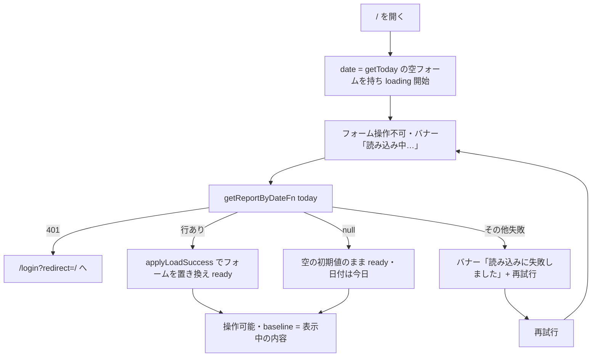
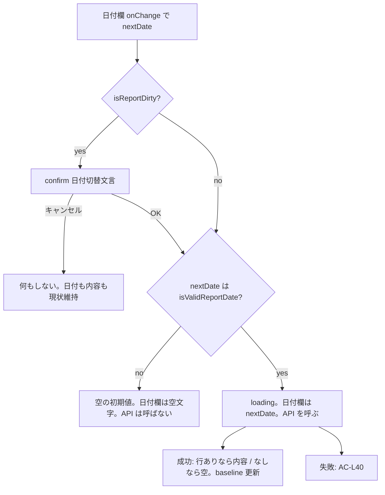

# 日報の自動読み込み 設計書

# 基本情報【必須】

- 対象画面（対象機能）：日報の自動読み込み（日報入力画面 `/`）
- ステータス：**合意済**（Phase 3 の人間承認ゲートを通過。2026-08-16）
- 作成日：2026-08-16
- 最終更新：2026-08-16（Phase 3 承認）
- 関連ドキュメント：
  - `docs/要件/日報の自動読み込み_要件メモ.md`（要件の根拠。grilling 済み）
  - `docs/設計/日報の自動読み込み/_flow-config.md`（Phase 7=スキップ／Phase 10=スキップ／lean。Phase 3 は実施固定）
  - `docs/設計/工数実績の正規化保存/工数実績の正規化保存_設計書.md`（承認済み親設計。本機能が上書きする前提あり）

## 本書の位置づけ

日報入力画面 `/` に、PostgreSQL の保存済み日報を日付単位で読み込む導線を足す。保存（`saveReportFn`）・削除・工数管理・勤怠管理は変えない。

親設計（工数実績の正規化保存）は「日報入力画面は DB を読まない」を E2E の観測前提にしている。**本機能の範囲ではその前提は失効する。** 親設計ファイル自体は承認済み成果物のため書き換えない。親 E2E（`effort-normalize.test.ts`）はセンチネル日付を入力してから保存するため、本機能の「開いた直後に今日を読む」とは観測点がずれる。親 E2E の手順は変更しない（日付入力後に保存する流れは、読み込み完了後に日付を変えれば成立する）。

要件メモの未決事項は本設計で次のとおり決定する。

| 要件メモ未決 | 決定 |
|---|---|
| 日付 1 件取得の API | **`getReportByDateFn` を新設する。** `getAllReportsFn` は使わない（全件取得になる。`reportStorage.getAll` は例外を吞んで `{}` を返すため、失敗を「該当なし」と誤認して空フォームから上書き保存する事故が起きる） |
| 読み込み中・失敗時の UI | ヘッダー直下にバナー。文言と testid は「UI 仕様」節に固定する |
| `window.confirm` の文言 | 「確認ダイアログ」節に固定する |
| 「今日」の実装箇所 | `getToday()` を日本時間（`Asia/Tokyo`）にし、`defaultDailyReport` がそれを使う |
| dirty 比較 | `id` を除くフィールド比較。純粋関数 `isReportDirty` |
| `savedMsg` のテンプレ経路 | reducer と既存テストは残す。日報入力からは呼ばない（ボタン削除） |

Phase 2 Round 1 でユーザーが確定した仕様。

| # | 論点 | 決定 |
|---|---|---|
| Q1 | フォームの「一致」 | `isReportDirty` と同じフィールド集合（id 除外）。E2E は日付・始業・取引先名・実績h・良かった点を画面で見る |
| Q2 | `raw_data.date` と要求日付の不一致 | 成功時は必ず `{ ...report, date: 要求日付 }`。日付欄と保存先は開いた日を正とする |
| Q3 | 親 E2E の待ち | AC-L63。`effort-normalize` と `daily-report` は読み込み**成功**完了を待ってから操作する |
| Q4 | 今日を開いて保存済みが載る E2E | E2E-L7。`Date` を `2000-02-10T00:00:00+09:00` に固定し、その日の行を投入する |
| Q5 | 401 判定 | `status === 401` をネストして辿る。`UNAUTHORIZED` を含む message も true。Phase 5 で実形状を AC-L44 に列挙する |
| Q6 | E2E の JST 今日 | 境界は単体 AC-L01〜L03。E2E-L3 はページ内 `Intl`（`Asia/Tokyo`）で今日を計算して日付欄と比較する |
| Q7 | E2E-L5/L6 の起点 | 実今日は使わない。空のセンチネル `2000-02-11` へ切り替えてから 1 文字入れる |
| Q8 | 壊れた raw_data | 構造不正は読み込み失敗（バナー＋再試行）。空フォームにしない |
| Q9 | 失敗中のタブ閉じ | `error` 中も `beforeunload` を出す |
| Q10 | 読み込み中の出力タブ | `ready` まで「日報 / PJ稼働 / 勤怠」と「出力を確認 →」も disabled |
| Q11 | 不正日付 | `isValidReportDate` を満たさない日付は空と同じ（API なし、空フォーム、日付欄 `''`） |
| Q12 | 失敗中の日付変更 | `error` 中は日付欄と再試行だけ操作可能。日付を変えたらその日を読む |

Phase 2 Round 2 で確定した仕様。

| # | 論点 | 決定 |
|---|---|---|
| Q13 | error 中の SPA 遷移 confirm | `loading` 中だけ `window.confirm` を出さない。`error` かつ dirty なら AC-L51 を適用する（`beforeunload` は従来どおり error 中も出す） |

フロー設定で Phase 7・Phase 10 完了時はスキップのため、受け入れ条件はテストで判定できる粒度まで書く。設計書に根拠がない仮置きは置かない。

---

# 要件【必須】

日報入力画面を開いたとき、および日付を切り替えたときに、その日付の PostgreSQL 保存済み日報をフォームへ載せる。無ければ空の初期値。データ源は DB のみ。未保存のまま画面を離れる・日付を変えるときはブラウザ標準の確認を出す。

## 背景【必須】

日報の永続保存先は PostgreSQL だが、入力画面は `sessionStorage`（オートセーブ）と `localStorage`（テンプレート）だけを読んでいた。日付変更は日付欄だけ更新し、他フィールドは残る。保存した内容を、開き直しや日付切替で入力画面に戻せない。

## 目的（ゴール）【必須】

**日付に対して DB 行があれば、画面の `data` と読み込み結果のあいだで `isReportDirty` が false になる。** 無ければ空の初期値。比較フィールドは `isReportDirty` の定義どおり（id 除外）。オートセーブとテンプレは使わない。未保存の破棄は確認してから行う。日報入力の「今日」は日本時間である。

## 受け入れ条件【必須】

テストで機械的に判定できる粒度。Phase 5 のテスト観点は本書の AC を根拠にする（Phase 7 スキップのため AI が全件起案する）。

共通前提：

- 「空の初期値」とは `defaultDailyReport(date)` の戻り値である。`startTime` は `'9:00'`、`endTime` は `'18:00'`、`breakTime` は `'1:00'`、`note` / `goodPoints` / `badPoints` / `nextPlan` は `''`、`projects` は長さ 1 で `name` が `''`、その `tasks` は長さ 1 で各文字列フィールドが `''`。`date` は引数どおり。
- 「保存済み日報」とは `getReportByDateFn` の戻り値である。行があるときは既存の `rowToReport(row)` と同一。画面・結合の「一致」比較に `raw_data` の直比較は使わない。`rowToReport` は本機能で変更しない。
- センチネル日付は親 E2E（`2000-01-01`〜`2000-01-07`）と衝突しない **`2000-02-01` 以降** を使う。
- 画面上の「一致」の観測点（E2E）は、日付欄・始業・取引先名・実績h・良かった点の 5 つとする。これ以外のフィールドの一致は単体／結合の `isReportDirty` が担う。

### 「今日」の日本時間

| ID | 受け入れ条件 |
|---|---|
| AC-L01 | `getToday(new Date('2026-08-16T15:00:00.000Z'))` は `'2026-08-17'` である（JST 8/17 0:00） |
| AC-L02 | `getToday(new Date('2026-08-16T14:59:59.000Z'))` は `'2026-08-16'` である（JST 8/16 23:59:59） |
| AC-L03 | `getToday(new Date('2026-08-16T00:00:00.000Z'))` は `'2026-08-16'` である（JST 8/16 9:00） |
| AC-L04 | `defaultDailyReport()` の `date` は `getToday()` と同一である。`toISOString().slice(0, 10)` を日付初期値に使わない |
| AC-L05 | `getToday` の実装は `Date#toISOString` も `Date#getDate` / `getFullYear` / `getMonth` も使わない。`Intl.DateTimeFormat` の `timeZone: 'Asia/Tokyo'` と `formatToParts` で `YYYY-MM-DD` を組み立てる |

### 日付 1 件取得

| ID | 受け入れ条件 |
|---|---|
| AC-L10 | `getReportByDateFn({ data: { date: D } })` は、`daily_reports.date = D` の行があるとき `rowToReport` と同じ `DailyReportData` を返す。`raw_data` に保存したフィールド（少なくとも `date` / `startTime` / `endTime` / `breakTime` / `note` / `goodPoints` / `badPoints` / `nextPlan` / `projects`）が一致する |
| AC-L11 | 行が無い日付では戻り値は `null` である。例外を投げない |
| AC-L12 | `date` が `isValidReportDate` を満たさない（`''` / `'2000-1-1'` / `'2026-02-30'` / `'0000-01-01'`）とき、DB に触れず `null` を返す |
| AC-L13 | `getReportByDateFn` の定義スライスに `requireSession` を含む `.middleware` がある（既存 6-2 と同じ静的検証。`it.each` に本関数名を追加する） |
| AC-L14 | `reportStorage.getByDate` は成功時に `DailyReportData \| null` を返す。失敗時は例外を再throw する（空オブジェクトや `null` に吞まない） |
| AC-L15 | `applyLoadSuccess(D, report)` は `report === null` なら `emptyReport(D)`。非 null なら戻り値の `date` は必ず `D` である（`report.date` が他の日でも上書きする） |

### dirty 判定

比較対象から `projects[].id` と `projects[].tasks[].id` を**除外する**。空フォームを作り直すと id が変わるため。

| ID | 受け入れ条件 |
|---|---|
| AC-L20 | 同一内容（id だけ違う場合を含む）なら `isReportDirty(current, baseline)` は `false` |
| AC-L21 | `note` / `startTime` / `endTime` / `breakTime` / `goodPoints` / `badPoints` / `nextPlan` / `date` のいずれかを 1 文字でも変えると `true` |
| AC-L22 | `projects[0].name` または `projects[0].tasks[0].actualHours` を変えると `true` |
| AC-L23 | 開いた直後の空の初期値を baseline にしたとき、何も変えていなければ `false` |
| AC-L24 | 「日報保存」成功後の baseline は、保存に渡したフォーム内容である。成功直後に何も変えていなければ `false`。1 フィールド変えると `true` |

### 画面オープン・日付切替の読み込み

| ID | 受け入れ条件 |
|---|---|
| AC-L30 | `/` を開くと日付欄は `getToday()` の値である。**読み込み中**（`loadStatus === 'loading'`）は日付欄・始業／終業／休憩・プロジェクト入力・所感・「日報保存」・「取引先追加」・入力以外のタブ（日報 / PJ稼働 / 勤怠）・「出力を確認 →」が操作できない（`disabled`） |
| AC-L31 | 今日の DB 行がある状態で `/` を開くと、読み込み完了後に `isReportDirty(画面の data, applyLoadSuccess(getToday(), getReportByDateFn の戻り))` が `false` である |
| AC-L32 | 今日の DB 行が無い状態で `/` を開くと、読み込み完了後に空の初期値（日付は今日）になる |
| AC-L33 | 日付を保存済みの日 `D` に変える（未保存なし）と、完了後に `isReportDirty(画面の data, applyLoadSuccess(D, getReportByDateFn の戻り))` が `false` である。日付欄は `D`（`raw_data.date` が他の日でも `D`） |
| AC-L34 | 日付を保存が無い日 `D` に変える（未保存なし）と、完了後に空の初期値になり、日付欄は `D` |
| AC-L35 | 日付が `''`、または `isValidReportDate` を満たさない（未保存なし）と、`getReportByDateFn` を**呼ばない**。フォームは空の初期値、日付欄は `''`。操作可能。保存すると現行どおり `日付を入力してください`（`savedMsg` の `dateMissing`） |
| AC-L36 | 読み込み中のバナー文言は `読み込み中…` である。`data-testid="report-load-status"` を持つ |
| AC-L37 | 読み込み完了（成功）後、バナーは出ず、AC-L30 の入力は操作可能になる |

### 読み込み失敗

| ID | 受け入れ条件 |
|---|---|
| AC-L40 | 401 以外の失敗（通信失敗、および読み取った値が `isValidReportStructure` を満たさない場合を含む）では、バナーが `読み込みに失敗しました`（`data-testid="report-load-status"`）と「再試行」ボタン（`data-testid="report-load-retry"`）を表示する。フォーム内容は失敗前の内容を維持する（空の初期値で上書きしない）。日付変更後の失敗では、日付欄だけ `startLoad` に渡した日付（変更先）のままである |
| AC-L41 | 「再試行」は表示中の日付（`data.date`）でもう一度 `getReportByDateFn` を呼ぶ。日付変更後の失敗なら変更先の日付である。成功すれば AC-L33 / AC-L34 と同じ結果になる |
| AC-L42 | 失敗中に「日報保存」・プロジェクト入力・所感・タブ切替・「出力を確認 →」は押せない（disabled）。空フォームでの上書き保存が起きない |
| AC-L43 | 取得の失敗が 401（`isUnauthorizedError` が true）なら、`window.location.assign` の引数は `'/login?redirect=/'` である。通常の失敗バナーは出さない |
| AC-L44 | `isUnauthorizedError` は、値およびネストした `cause` / `error` / `response` を辿り、いずれかが (a) `Response` かつ `status === 401` (b) `status === 401` を持つオブジェクト (c) `message` に `'UNAUTHORIZED'` を含む、なら true。それ以外は false（通常失敗として AC-L40）。Phase 5 で未認証呼び出しの実形状を記録し、本 AC の列挙に足りなければ追記する |
| AC-L45 | `getReportByDateFn` が行を返しても `isValidReportStructure` が false なら、クライアントは AC-L40 と同じ失敗として扱う。`null`（該当なし）にも空フォームにもしない |
| AC-L46 | `loadStatus === 'error'` のとき、日付欄と「再試行」は操作可能。日付を変えたら `startLoad(nextDate)` する（dirty 確認は ready のときと同じ規則） |

### 未保存確認

| ID | 受け入れ条件 |
|---|---|
| AC-L50 | dirty かつ日付変更時、`window.confirm` の引数は `入力内容が保存されていません。日付を切り替えますか？`。キャンセル（`false`）なら日付欄もフォーム内容も変わらず、`getReportByDateFn` を呼ばない。E2E-L5 は dialog の `message` がこの文字列と完全一致することを検証する |
| AC-L51 | dirty かつヘッダーの「工数管理」「勤怠管理」への遷移時、`window.confirm` の引数は `入力内容が保存されていません。このページを離れますか？`。キャンセルなら URL は `/` のまま。E2E-L6 は dialog の `message` がこの文字列と完全一致することを検証する |
| AC-L52 | dirty でないとき、日付変更でもヘッダー遷移でも `window.confirm` を呼ばない |
| AC-L53 | 入力画面内のタブ切替（入力 / 日報 / PJ稼働 / 勤怠）では `window.confirm` も `beforeunload` も使わない |
| AC-L54 | `shouldPreventUnload` が true のとき `beforeunload` は `preventDefault` を呼び `returnValue` に空文字を入れる。true になるのは (1) `loadStatus === 'ready'` かつ dirty (2) `loadStatus === 'error'`。`loading` 中、および ready かつ dirty でないときは `preventDefault` しない |
| AC-L55 | 「日報保存」成功後は dirty ではない。成功直後の日付変更・ヘッダー遷移では `window.confirm` を呼ばない |
| AC-L56 | `loadStatus === 'loading'` のとき、ヘッダー遷移で `window.confirm` を呼ばない。`loadStatus === 'error'` かつ dirty のときは AC-L51 を適用する（confirm を出す）。`beforeunload` は AC-L54 どおり error 中は出す |
| AC-L63 | `effort-normalize.test.ts` と `daily-report.test.ts` は `page.goto('/')` のあと、読み込み**成功**完了を待ってから日付入力・ボタン断言を行う。待ち条件は `data-testid="report-load-status"` の要素が無いこと（`loadStatus === 'ready'`）。日付欄が enabled であることだけでは足りない（error 中も日付欄は操作可能なため）。親 E2E の期待結果（保存メッセージ・エラー色）は変えない |

### オートセーブ・テンプレの廃止

| ID | 受け入れ条件 |
|---|---|
| AC-L60 | `apps/web/src/routes/index.tsx` に `sessionStorage` / `localStorage` / `session.get` / `session.set` / `storage.get` / `storage.set` / `daily-report-autosave` / `daily-report-latest` / `saveTemplate` が無い |
| AC-L61 | 日報入力画面に「テンプレ保存」ボタンが無い。既存 E2E `daily-report.test.ts` の「テンプレ保存ボタンが存在する」は削除する |
| AC-L62 | `savedMsgReducer` の `templateSaveSucceeded` / `templateSaveFailed` は残す（既存単体テストを維持する）。日報入力からこれらのイベントを送らない |

## 対象外の機能・要件（非ゴール）【必須】

- 工数管理（`/timesheet`）・勤怠管理（`/attendance`）の画面・API の変更。`getAllReportsFn` / `getReportsByMonthFn` の変更
- 前日コピー、「昨日を複製」
- 複数タブ・複数人の排他ロック（後から保存した方が勝つ。既存どおり）
- オフライン対応、DB と入力の差分マージ
- オートセーブ・テンプレ保存の復活
- 独自モーダル（確認は `beforeunload` と `window.confirm` のみ）
- `savedMsg` のテンプレ経路の削除
- 工数管理・勤怠管理の年月のタイムゾーン変更（もともとローカル時刻）
- `rowToReport` の変更、保存処理（`saveReportFn`）の変更

## 未決事項【必須】

| 内容 | 決定期限 | ステータス |
| ---- | -------- | ---------- |
| 要件メモ未決 6 件 | Phase 1 | 決定済み（本書「本書の位置づけ」） |
| Q2: `raw_data.date` と要求日付の不一致 | Phase 2 | 決定済み（`{ ...report, date: 要求日付 }`） |
| Q7: E2E-L5/L6 の起点 | Phase 2 | 決定済み（空のセンチネル `2000-02-11` へ切替後） |
| Q13: error 中の SPA confirm | Phase 2 Round 2 | 決定済み（error かつ dirty なら AC-L51。loading 中のみ confirm しない） |

## 業務フロー【必須】

### 正常系：画面を開く



### 正常系：日付変更



### 例外系

| 状況 | 挙動 |
|---|---|
| 読み込み 401 | ログインへ。バナーは出さない |
| 読み込み 401 以外 | 操作不可のまま再試行。他フィールドは失敗前を維持。日付変更後の失敗では日付欄は変更先（AC-L40） |
| 日付空・不正 | API なし。空フォーム。日付欄は `''`。操作可能 |
| 構造不正の raw_data | 読み込み失敗（AC-L40）。空にしない |
| dirty で離脱・日付変更をキャンセル | 現状維持 |
| 入力タブ切替 | ready のときだけ可。loading / error 中は disabled |
| 読み込み中のヘッダー遷移 | confirm も beforeunload も出さない |
| 読み込み失敗中のヘッダー遷移 | dirty なら SPA の confirm（AC-L51）。`beforeunload`（リロード・タブ閉じ）は dirty に関わらず出す |
| 読み込み失敗中の日付変更 | 日付欄は操作可能。変えたらその日を読む |

初期表示の loading 中：`data` と `baseline` はどちらも `defaultDailyReport(getToday())`。SPA の `window.confirm` は (`loadStatus === 'ready'` かつ dirty) または (`loadStatus === 'error'` かつ dirty) のときに行う。loading 中は出さない。`beforeunload` は ready かつ dirty、または error のときに出す。

## 影響を受ける実装済み機能【必須】

| 機能 | 影響 | 対応 |
|---|---|---|
| 日報入力画面（`routes/index.tsx`） | **変更あり**。初期化・日付変更・テンプレ／オートセーブ削除・未保存確認・読み込みバナー | 本機能の中心 |
| `getToday` / `defaultDailyReport` | **変更あり**。日本時間 | AC-L01〜L05 |
| 日報取得 | **追加**。`getReportByDateFn` と `reportStorage.getByDate` | 既存の getAll / getByMonth は変更しない |
| `savedMsg` | 日報入力からのテンプレイベントが無くなる。reducer は残す | AC-L62 |
| 既存 E2E `daily-report.test.ts` | テンプレ保存ボタン断言を削除。`goto('/')` 後は読み込み**成功**完了を待つ | AC-L61、「親 E2E への影響」 |
| 親 E2E `effort-normalize.test.ts` | 手順は維持。開いた直後は読み込み**成功**完了を待つ | 「親 E2E への影響」 |
| 日報保存 / 削除 | 変更なし | — |
| 工数管理 / 勤怠管理 | 変更なし | — |
| DB スキーマ | 変更なし | — |

## 非機能要件【任意】

- 性能：日付 1 件の SELECT のみ。全件取得しない
- セキュリティ：`getReportByDateFn` は `requireSession` 必須。`user_id` による行フィルタは既存どおり無い。SQL は Drizzle のパラメータ化のみ。401 リダイレクトの `redirect` は `'/'` 固定（オープンリダイレクトにしない）

---

# 設計

## 「今日」（日本時間）

`apps/web/src/lib/time-utils.ts` の `getToday` を次の契約にする。

```ts
export function getToday(now: Date = new Date()): string
```

- `timeZone: 'Asia/Tokyo'` の `Intl.DateTimeFormat` で `formatToParts(now)` する
- `year` / `month` / `day` からゼロ埋め `YYYY-MM-DD` を返す
- テストは `now` を渡して行い、実行環境の TZ に依存しない
- `defaultDailyReport(date: string = getToday())` の `date` にこれを使う

## 日付 1 件取得

`apps/web/src/server/functions/reports.ts` に追加する。既存の `rowToReport` を使う（変更しない）。

```ts
export const getReportByDateFn = createServerFn({ method: 'GET' })
  .middleware([requireSession])
  .inputValidator((data: { date: string }) => data)
  .handler(async ({ data }) => { /* 下記 */ })
```

ハンドラ：

1. `isValidReportDate(data.date)` が false なら、DB に触れず `null` を返す
2. `daily_reports` を `eq(dailyReports.date, data.date)` で取得する（limit 1）
3. 0 件なら `null`、1 件なら `rowToReport(row)` を返す

`reportStorage.getByDate(date)` は `getReportByDateFn({ data: { date } })` を呼び、成功値をそのまま返す。`try/catch` で吞まない。

`getAllReportsFn` / `getReportsByMonthFn` / `reportStorage.getAll` / `getByMonth` は変更しない。

## `isValidReportStructure` / `isLoadableReport`

既存 `apps/web/src/server/report-normalize.ts` の `isValidReportStructure` を**変更しない**。`isLoadableReport` はそれと同一判定のエイリアスであり、追加のフィールド検証をしない。クライアントは同モジュールから import してよい（サーバ専用依存が無い）。

契約（既存実装どおり）：

- `value` が `null` でないオブジェクトであり、配列でない
- `date` が `isValidReportDate` を満たす（`YYYY-MM-DD` かつ実在日。日数表方式。`Date` は使わない）
- `projects` が配列
- 各 project が `null` でないオブジェクト
- 各 project の `tasks` が配列
- 各 task が `null` でないオブジェクト

`startTime` / `endTime` / 工数文字列などの完全性は見ない。上記を満たせば true。読み込み失敗（AC-L45）は構造不正のみ。

合格例：

- 正常な `DailyReportData`（既存単体の `makeSingleBlockReport` 相当）
- `tasks` が長さ 0 のプロジェクトブロック

不合格例：

- `null` / `undefined` / 文字列 / 数値 / 配列
- `date` が文字列でない
- `date` が実在しない日（例: `'2026-02-30'`）
- `projects` が配列でない
- `projects` の要素が `null`
- `tasks` が配列でない
- `tasks` の要素が `null`

## 純粋関数の配置

画面の分岐は `apps/web/src/lib/report-load.ts` に置き、`index.tsx` は呼び出すだけにする（`saved-msg.ts` と同じ分離）。少なくとも次を export する。

| 関数 | 契約 |
|---|---|
| `isReportDirty(current, baseline)` | id 除外のフィールド比較。`true` なら未保存あり |
| `emptyReport(date)` | `defaultDailyReport(date)` と同じ |
| `DATE_CHANGE_CONFIRM` | `'入力内容が保存されていません。日付を切り替えますか？'` |
| `LEAVE_PAGE_CONFIRM` | `'入力内容が保存されていません。このページを離れますか？'` |
| `LOAD_STATUS_LOADING` | `'読み込み中…'` |
| `LOAD_STATUS_ERROR` | `'読み込みに失敗しました'` |
| `LOGIN_ON_401_HREF` | `'/login?redirect=/'` |
| `isUnauthorizedError(error)` | AC-L44。`status === 401` と `UNAUTHORIZED` をネストして辿る |
| `shouldFetchReport(date)` | `isValidReportDate(date)` と同じ（`report-normalize.ts` から import してよい。サーバ専用依存が無い） |
| `applyLoadSuccess(date, report)` | `report === null` なら `emptyReport(date)`。そうでなければ `{ ...report, date }`（`raw_data.date` が列と食い違っても、日付欄は要求日付） |
| `shouldPreventUnload(dirty, loadStatus)` | `loadStatus === 'error'`、または（`loadStatus === 'ready'` かつ dirty）なら true |
| `isLoadableReport(value)` | `isValidReportStructure(value)` のエイリアス。false なら AC-L45。追加検証はしない |

`isReportDirty` が比較するフィールド（これ以外は見ない）：

- ルート: `date`, `startTime`, `endTime`, `breakTime`, `note`, `goodPoints`, `badPoints`, `nextPlan`
- 各 project（配列長が違えば dirty）: `name`, `plannedHours`
- 各 task（配列長が違えば dirty）: `label`, `name`, `plannedHours`, `actualHours`, `progressBefore`, `progressExpected`, `progressActual`

文字列は正規化しない（空白 1 つの追加も dirty）。

## 画面状態

`HomePage` が持つ状態：

| 名前 | 意味 |
|---|---|
| `data` | 表示中のフォーム |
| `baseline` | 最後に読み込み成功した内容、または最後に保存成功した内容 |
| `loadStatus` | `'loading' \| 'ready' \| 'error'` |
| `loadRequestId` | 読み込み開始のたびに +1。応答の id が現在と違うなら無視する |

マウント時：`data` と `baseline` を `emptyReport(getToday())`、`loadStatus` を `'loading'`、今日の取得を開始する。

`loadStatus === 'loading'` のとき、AC-L30 のコントロール（日付欄を含む）とタブ・「出力を確認 →」を `disabled` にする。ヘッダーナビは disabled にしない。

`loadStatus === 'error'` のとき、「再試行」と日付欄だけ操作可能（AC-L46）。それ以外は disabled。

`loadStatus === 'error'` のときだけ「再試行」を出す。再試行中は `'loading'` に戻す。

### 読み込み開始（`startLoad(date)`）

1. `loadRequestId` を +1 した値をこの要求の id とする
2. `loadStatus = 'loading'`
3. `shouldFetchReport(date)` が false なら、API を呼ばず `data = baseline = emptyReport('')`（日付欄は空。不正日付も空に正規化する）、`loadStatus = 'ready'`
4. true なら、await の**前に** `data = { ...data, date }` する（日付欄だけ要求日付。他フィールドは維持）。そのうえで `reportStorage.getByDate(date)` を await する
5. 応答の id が現在の `loadRequestId` と違うなら、`data` / `baseline` / `loadStatus` を**一切変更しない**（最新の要求だけが状態を確定する。古い成功も古い失敗も無視する）
6. 401 なら `window.location.assign(LOGIN_ON_401_HREF)` して終わる
7. その他例外、または戻りが non-null かつ `isLoadableReport` が false なら `loadStatus = 'error'`。`data` の日付以外は変えない（空で上書きしない）。日付欄は step 4 で入れた要求日付のまま
8. 成功（null または loadable）なら `data = baseline = applyLoadSuccess(date, report)`、`loadStatus = 'ready'`

step 4 の日付先行更新は必須である（「してよい」ではない）。失敗時も日付欄は要求日付のままにする。再試行は `startLoad(data.date)` なので、日付変更後の失敗なら変更先をもう一度読む。内容の他フィールドは AC-L40 どおり維持する。成功時に全体を置き換える。

空日付は step 3 で即 ready になるため混在しない。マウント時は `data.date` がすでに今日なので step 4 の代入は同値になる。

### 日付変更

`onChange` で `nextDate` を受け取る。分岐は業務フロー図と同じである。

1. `nextDate === data.date` なら何もしない（return）
2. `isReportDirty(data, baseline)` が **true** のときだけ `window.confirm(DATE_CHANGE_CONFIRM)` を出す。confirm が **false（キャンセル）** なら return。`data` を更新しない（controlled のため日付欄は元の値のまま）
3. ここに到達するのは (a) dirty が **false**、または (b) dirty が **true** かつ confirm が **true（OK）** のときだけである。dirty=false では confirm を出さない
4. `startLoad(nextDate)`（`startLoad` の step 4 が `data.date` を `nextDate` にする。呼び出し側で先に書き換えない）

（番号 2 のキャンセルと、dirty=false を同じ「return」にしてはならない。confirm OK は step 4 へ進む。）

### 日付変更（error 中）

`loadStatus === 'error'` のとき、日付欄の `onChange` は ready 時と同じ 1〜4 を行う（dirty 確認を含む）。これにより恒常失敗の日付から逃げられる。

### 保存成功

現行どおり `reportStorage.save` が `ok` のとき、`baseline = data` にする（保存した内容が新しい基準）。`loadStatus` は `'ready'` のまま。

### 未保存のページ離脱

- `beforeunload`: `shouldPreventUnload(isReportDirty(data, baseline), loadStatus)` が true のときだけ `preventDefault` + `returnValue = ''`
- SPA 遷移（`/timesheet` / `/attendance`）：TanStack Router の `useBlocker`（または同等）で、dirty かつ `loadStatus` が `'ready'` または `'error'` なら `window.confirm(LEAVE_PAGE_CONFIRM)` を出し、キャンセルなら遷移しない。同一ルート内の state 更新では動かないこと。`loadStatus === 'loading'` の SPA 遷移では confirm しない

ログアウトは現行どおり `window.location.href = '/login'` なので `beforeunload` が担当する。

## UI 仕様

新規の見た目は最小にする（既存レイアウトを大きく変えない）。

- ヘッダー（日付・始業終業休憩がある行）の下、タブの上にバナー領域を置く
- `loadStatus === 'loading'`：`data-testid="report-load-status"` の要素に `読み込み中…`
- `loadStatus === 'error'`：同 testid に `読み込みに失敗しました`。隣に `data-testid="report-load-retry"` のボタン。ラベルは `再試行`
- `loadStatus === 'ready'`：バナー領域は出さない（要素ごと出さない）
- 「テンプレ保存」ボタンを削除する
- 「日報保存」「取引先追加」は残す

## 確認ダイアログ

| 定数 | 値 | 使う操作 |
|---|---|---|
| `DATE_CHANGE_CONFIRM` | `入力内容が保存されていません。日付を切り替えますか？` | 日付変更 |
| `LEAVE_PAGE_CONFIRM` | `入力内容が保存されていません。このページを離れますか？` | 工数管理・勤怠管理への SPA 遷移 |
| `beforeunload` | ブラウザ既定（文言指定不可） | リロード・タブ閉じる・サイトを離れる・`window.location` によるログアウト |

## 親 E2E への影響（実装上の注意）

`effort-normalize.test.ts` と `daily-report.test.ts` はどちらも `page.goto('/')` する。本機能では goto 直後に今日の読み込みが走り、読み込み中は日付欄が disabled になる（AC-L30）。

共通の待ち条件（Phase 8 で両ファイルに入れる。AC-L63）：

- `data-testid="report-load-status"` の要素が無いこと（`loadStatus === 'ready'`。バナー非表示）
- **日付欄が enabled であることだけを待ち条件にしてはならない**（error 中も日付欄は操作可能なため、失敗状態で後続が走りうる）
- この待ちのあとで日付入力・ボタン断言を行う

`effort-normalize.test.ts`：

- 読み込み**成功**完了（AC-L63）を待ってからセンチネル日付を入力する
- 親 E2E の期待結果（保存メッセージ・エラー色）は変えない
- シナリオ仕様（観点表 2 章）は変えない

`daily-report.test.ts`：

- テンプレ保存断言は削除する（AC-L61）
- フォーム要素の存在確認は、上記の待ちのあとに行う

## 項目定義【任意】

| No | カテゴリー | 項目名 | UI | 初期値 | 入力制限 | テーブル | カラム | 備考 |
|----|-----------|--------|----|--------|----------|----------|--------|------|
| 1 | 入力 | 日付 | `input[type=date]` | `getToday()` | loading 中は disabled。error 中は操作可 | daily_reports | date | 空・不正なら API しない。日付欄は `''` |
| 2 | 表示 | 読み込みバナー | `data-testid="report-load-status"` | なし | — | — | — | 文言は定数 |
| 3 | 操作 | 再試行 | `data-testid="report-load-retry"` | — | error のときだけ表示 | — | — | |

## アクション定義【任意】

### No：1 画面オープン時の読み込み

- UI：`/` のマウント
- 動作：業務フロー「画面を開く」どおり `startLoad(getToday())`

### No：2 日付変更

- UI：日付 `onChange`
- 動作：上記「日付変更」1〜4

### No：3 再試行

- UI：再試行ボタン
- 動作：`startLoad(data.date)`（表示中の日付。日付変更後の失敗なら変更先）

### No：4 保存成功で dirty 解除

- UI：日報保存が `ok`
- 動作：`baseline = data`。`savedMsg` の成功イベントは現行どおり

---

# テストレベル判定

`docs/開発プロセス/テストレベル選定トリガー表.md` との突き合わせ。Phase 7 スキップのため、該当分の観点は AI が全件起案し Adversary で凍結する。

## 影響度トリガー（Impact）

| トリガー | 該当 | 理由 |
|---|---|---|
| 認可境界 | **非該当** | `user_id` / `company_id` による分離がデータモデルに無い（親と同じ） |
| PII 取扱い | **非該当** | 日報の既存フィールドのみ。連絡先・要配慮個人情報を新規に扱わない |
| 認証・セッション | **非該当** | ログイン発行そのものは追加しない。401 時は既存の `/login` へ飛ばすだけ（AC-L43）。判定ヘルパーは単体で検証する |
| 不可逆操作 | **非該当** | 本機能は読み取りとクライアント状態の破棄確認のみ。DB の削除・上書きは既存の保存ボタン |
| **クリティカルパス業務** | **該当** | 日報入力を開いて続きを編集する導線。読めないと当日分を空から書く／見えない既存行を保存で潰す → **E2E 必須**（AI起案 → Adversary で凍結。Phase 7 スキップのため人間承認は freeze 後のゲートとしては行わない） |
| 金銭・契約 | **非該当** | — |

## 発生可能性トリガー（Likelihood）

| トリガー | 該当 | 理由 |
|---|---|---|
| DB 制約依存 | **非該当** | 本機能は SELECT 1 件。ユニーク制約の検証や INSERT 失敗の変換はしない |
| 実 JOIN クエリ | **非該当** | JOIN しない。`raw_data` を `rowToReport` するだけ |
| トランザクション | **非該当** | 読み取りのみ |
| **複雑な状態遷移** | **該当** | `loading` / `ready` / `error` と dirty の組み合わせ。不正遷移（失敗中の保存、キャンセルなのに日付が変わる）の防止が仕様の中心 → **結合（内部）必須** |

## 結合(DB込み)について

トリガー表の「DB 制約依存」等には該当しない。ただし AC-L10 / AC-L11 は実行の `raw_data` 復元が正しさの根幹で、モック SELECT はトートロジーになる。**結合(DB込み)を必須とする**（AI起案。`report-db-helpers.ts` 経由。全テーブル TRUNCATE 禁止。センチネルは `2000-02-`）。

## 判定結果

| レベル | 本機能 |
|---|---|
| 単体 | 必須（`getToday` / `isReportDirty` / `isUnauthorizedError` / 読み込み分岐） |
| 結合（内部） | 必須（`getReportByDateFn` の requireSession 静的検証、invalid date で DB 非接触、`index` からテンプレ／オートセーブが消えたこと） |
| 結合（DB込み） | **必須**（AC-L10 / AC-L11。上記理由） |
| E2E（自動化） | **必須**（クリティカルパス。E2E-L1〜L7） |
| E2E 候補カタログ | 下記。Phase 5 で `docs/開発プロセス/E2E候補カタログ.md` に追記する |

## 画面操作シナリオの洗い出し

### クリティカルパス E2E（Phase 5 で仕様化しコード化する）

観測点は画面上の値とダイアログ文言に限る。DB 直読は結合(DB込み)に任せる。

| ID | シナリオ | 対応 AC |
|---|---|---|
| E2E-L1 | センチネル `2000-02-01` に保存済み日報がある状態で `/` を開き、読み込み**成功**完了後（AC-L63 と同じ待ち）に日付を `2000-02-01` へ変える（未保存なし）。日付欄・始業・取引先名・実績h・良かった点が保存した値と一致する | AC-L33 |
| E2E-L2 | 保存が無い `2000-02-02` へ日付を変える。日付欄は `2000-02-02`、取引先名は空、始業は `9:00` | AC-L34 |
| E2E-L3 | `/` を開く。読み込み**成功**完了後（AC-L63 と同じ待ち）、日付欄が `page.evaluate` した `Intl.DateTimeFormat('en-US', { timeZone: 'Asia/Tokyo', year:'numeric', month:'2-digit', day:'2-digit' })` から組み立てた `YYYY-MM-DD` と一致する。JST 0:00〜8:59 の境界は単体 AC-L01〜L03 に任せ、E2E では Date を固定しない | AC-L30・AC-L04 |
| E2E-L4 | 「テンプレ保存」ボタンが無い。「日報保存」はある | AC-L61 |
| E2E-L5 | `/` を開き読み込み**成功**完了後（AC-L63 と同じ待ち）、日付を `2000-02-11` にする（行なし・未保存なしなので confirm は出ない）。空フォームで取引先名を 1 文字入れ、日付を `2000-02-02` に変え、`confirm` をキャンセルする。dialog の `message` は `DATE_CHANGE_CONFIRM` と完全一致。日付は `2000-02-11` のまま、取引先名の 1 文字も残る | AC-L50 |
| E2E-L6 | E2E-L5 と同じ起点（`2000-02-11` の空フォームで取引先名 1 文字）から「工数管理」をクリックし `confirm` をキャンセルする。dialog の `message` は `LEAVE_PAGE_CONFIRM` と完全一致。URL は `/`。日付は `2000-02-11`、取引先名の 1 文字は残る | AC-L51 |
| E2E-L7 | `Date` を `2000-02-10T00:00:00+09:00` に固定し、その日付の保存済み日報を投入したうえで `/` を開く。読み込み**成功**完了後（AC-L63 と同じ待ち）、日付欄・始業・取引先名・実績h・良かった点が保存値と一致する | AC-L31 |

`beforeunload` は Playwright で不安定なため E2E 自動化対象にしない（AC-L54 は単体）。

### E2E 候補カタログ（コード化しない）

Phase 5 で本表を `docs/開発プロセス/E2E候補カタログ.md` に追記する。

| シナリオ | クリティカルパス外とした理由 |
|---|---|
| リロード時の `beforeunload` | ブラウザネイティブ。自動化が不安定。AC-L54 が単体で見る |
| 読み込み失敗バナーと再試行 | 通信失敗の再現が E2E 向きでない。AC-L40・L41 は結合内部（モック拒否）で見る |
| error かつ dirty のヘッダー遷移 confirm | 通信失敗の仕込みが E2E 向きでない。AC-L56 は結合内部（`loadStatus` を error にしてヘッダー遷移）で見る |
| 401 でログイン画面 | セッション切断の仕込みが重い。AC-L43・L44 は単体＋結合内部 |
| 日付を空にして保存 | 現行 `dateMissing` の回帰。本機能の主ゴールではない |
| 入力タブを「日報」に切り替えて戻る | 確認が出ないことの確認。壊れてもデータは残る |

---

# 検証の範囲

| 層 | 見るもの | 見ないもの |
|---|---|---|
| 単体 | `getToday` の固定時刻、`isReportDirty`、`isUnauthorizedError`、`isLoadableReport`、confirm 定数、`shouldFetchReport`、`applyLoadSuccess`、`shouldPreventUnload` | React の描画 |
| 結合（内部） | `getReportByDateFn` の middleware、invalid date で DB モックに触れないこと、`index.tsx` からオートセーブ／テンプレ文字列が消えたこと | 実 PostgreSQL |
| 結合（DB込み） | 実行を `getReportByDateFn` で読んだ値が `raw_data` と一致すること、欠如で `null` | 画面 |
| E2E | E2E-L1〜L7 の画面観測 | DB 直読、`beforeunload` のダイアログ |

Red Phase はスタブ最小実装（`getReportByDateFn` が常に `null`、`getToday` がまだ UTC、など）で期待値不一致にする。スタブ段階で PASS する新規テストは書かない。
