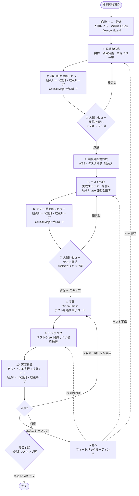

# 設計から実装までのフロー

> **本リポジトリ（work-hub）で読む際の注意**
> 本書は Next.js + Prisma + MySQL を前提に書かれている。本リポジトリは TanStack Start + Drizzle ORM + PostgreSQL のため、スタック・ファイル配置・コマンドは `docs/開発プロセス/本リポジトリでの読み替え.md` の対応表で読み替えること。フロー自体（フェーズ構成・レビュー方針・収束ループ・ゲート）は読み替えなしでそのまま適用する。

## このドキュメントの目的

新規機能開発・機能追加時の **設計 → テスト → 実装 → レビュー** のフローを定義する。AI主導開発における品質ゲートを明示し、「動くように見えるが仕様を満たしていない」コードの混入を防ぐことを目的とする。

本フローは [VCSDD（Verified Coherence Spec-Driven Development）](https://github.com/sc30gsw/vcsdd-claude-code) の方法論をベースに、本プロジェクトの実情（商用Webアプリ・MVP1検証段階）に合わせてカスタマイズしたハイブリッド構成である。

---

## フロー全体図



---

## フロー設定（人間レビューの要否）— 開発開始時に決める

機能ごとに、**どこに人間の承認ゲートを置くかを開発開始時に決めて記録する**（`docs/設計/<機能名>/_flow-config.md`）。フェーズの途中で都度尋ねるのではなく、前段（`flow-kickoff`）で一度決め、以後すべてのフェーズがこの設定を読んで挙動を変える。方針の正本は `flow-review-policy` skill。

| ゲート | 対象 | 設定 |
|---|---|---|
| 設計書承認（Phase 3） | 設計書 + Phase 2 findings | **実施固定（スキップ不可）** |
| テスト承認（Phase 7） | テスト + Phase 6 findings | 実施 / スキップ |
| 実装承認（Phase 10 完了時） | 実行検証証拠 + Phase 10 findings | 実施 / スキップ |

**Phase 3 をスキップ不可とする理由：** 設計書は要件の写像であり、「何を作るか」の判断は人間にしか帰属しない。ここを AI に閉じさせると、以降がどれだけ厳密でも「正しく作られた誤ったもの」に収束する。Phase 7 / 10 は「作られたものが設計書に対して正しいか」の検証であり、判定基準（設計書）が人間承認済みのため AI 検証で代替しうる。

**スキップ時の代償措置（必須）：** スキップは「レビューを省く」ことではなく「人間の判断を AI の検証で置き換える」ことである。

- **Phase 7 スキップ時**：Phase 5 のテスト観点は AI が全件起案し（`flow-review-policy` 1.5 のチェックリストに従う）、Adversary の敵対的レビューで Critical/Major ゼロまで収束させてから凍結する。Phase 6 でも Major の「文書化のみで通過」は使えない
- **実装承認スキップ時**：Phase 10 で Major の「文書化のみで通過」は使えない。実行検証は1項目も省略できない。戻り先が Phase 1 / 5 になる findings が出た場合は設定にかかわらず人間へエスカレーションする

---

## 10フェーズの詳細

### Phase 1. 設計書作成

| 項目 | 内容 |
| ---- | ---- |
| 入力 | 要件メモ・利用フロー・画面モック等 |
| 成果物 | `docs/設計/<画面名>/<画面名>_設計書.md`（「テストレベル判定」節を含む） |
| 実施者 | Builder AI（人間が伴走） |
| ツール | `flow-phase1-design-doc` skill |
| ゲート | なし（次フェーズで敵対的レビュー） |

**テストレベル判定（2026-07-12 追加）：** `docs/開発プロセス/テストレベル選定トリガー表.md` と照合し、影響度トリガー・発生可能性トリガーの該当有無を設計書に記載する。画面操作を伴う機能由来のシナリオも洗い出し、クリティカルパス業務トリガー該当分はE2E自動化対象、非該当分はE2E候補カタログの候補として一覧化する。

### Phase 2. 設計書 敵対的レビュー（収束ループ）

| 項目 | 内容 |
| ---- | ---- |
| 入力 | Phase 1 の設計書 |
| 成果物 | `docs/設計/<画面名>/_review/spec/findings.md`（findings 一覧と severity）+ 同 `review-log.md`（収束ログ） |
| 実施者 | Adversary AI（**fresh context**・司令塔と分離）を**観点レーンごとに並列起動**（既定3レーン） |
| ツール | `adversarial-reviewer` 役割（役割ファイル：`.claude/skills/flow-agent-roles/roles/adversarial-reviewer.md`）／方針：`flow-review-policy` skill |
| ゲート観点 | 仕様の曖昧性／要件の網羅／エッジケースの欠落／受け入れ条件の検証可能性／非ゴールの明確性／フォーマット準拠 |
| 出力形式 | severity（Critical / Major / Minor）と該当箇所を必ず明記。「全体的によい」等の感想は禁止。Minor は1行に圧縮（出力予算） |
| ゲート | **Critical 0 かつ Major 0 になるまで「レビュー → 修正 → 差分再レビュー」を繰り返す**（上限5周）。収束してから Phase 3 へ渡す |

**重要：** Adversary は **必ず新規エージェントとして起動** し、設計書ファイルのみを読む。司令塔と同じ会話履歴を共有してはならない（VCSDD原則7「Entropy Resistance」）。

**較正不変の原則（2026-08-12 追加・全レビューフェーズ共通）：** レビュー時間の短縮は、**「較正（欠陥を能動的に探す姿勢と探索の深さ）」を下げて行ってはならない**。短縮は次の4つで行う：①観点をレーンに分けて複数エージェントを**並列起動**する ②**報告の閾値**（フェーズごとの規定）③**出力の粒度**（Minor は1行・PASS の裏付けは1〜2行）④**再走査の範囲**（2周目以降は差分レビュー）。

この原則は実走の失敗から得られた。所要時間を削るために「批判的」という観点自体を外した通常較正レビューへ置き換えたところ、不具合の見落としが発生した。原因は**「探索の深さ」と「報告の閾値」という別の2軸をまとめて下げた**ことにある。報告を絞ること（ノイズ削減）は正しかったが、探索まで浅くしたため Critical 級の欠陥が発見されなくなった。詳細と must-catch チェックリストは `flow-review-policy` skill を参照。

**findings 書き出しの運用：** Adversary は Read 専用（Read / Glob / Grep のみ）として運用する（Phase 10 の `impl-reviewer` も同様）。findings は Adversary の最終応答テキストとして返却され、司令塔（メイン会話のAI。旧称 Builder）が `_review/<phase>/findings.md` に Write する。これは Claude Code harness レベルで「分析mdファイルの書き出し」が制限されるケースがあるため、Adversary 側で書き出させる運用は採用しない。

### Phase 3. 人間レビュー（設計書承認ゲート）

| 項目 | 内容 |
| ---- | ---- |
| 入力 | 収束済みの設計書 + Phase 2 の findings・収束ログ |
| 成果物 | 承認 or 差戻し判定 |
| 実施者 | **人間**（**このゲートはスキップ不可**） |
| ゲート判断 | findings を材料に、設計書の修正要否を判断。**テスト記述に直接関わる未決事項が残っている場合は差戻し**（下記） |

Phase 2 の収束ループにより、このゲートに届く時点で Critical / Major は解消済みである。人間がここで見るのは「AI が潰しきれない種類の問題」——要件の取り違え・業務上の妥当性・優先度・スコープ——である。

差戻し → Phase 1 に戻る（修正後、再度 Phase 2 で敵対的レビュー）。

**テスト記述に直接関わる未決事項の解消（必須ゲート項目）：** DB カラム名／デフォルト orderBy／enum 未知値のフォールバック挙動／バリデーションエラー時の error code など、**テストの期待値を確定させる事項**が未決のまま Phase 5 に入ると、曖昧さを温存したテストが書かれ Phase 6 で必ず指摘される（実走で確認済み）。Phase 3 の承認時にこれらの解消を必ず確認する。

### Phase 4. 実装計画書作成（任意）

| 項目 | 内容 |
| ---- | ---- |
| 入力 | 承認済み設計書 |
| 成果物 | `docs/設計/<画面名>/<画面名>_実装計画.md`（大規模機能の場合は実装スコープの決定を含む） |
| 実施者 | Builder AI（実装スコープは人間が最終決定） |
| ゲート | なし |
| 任意性 | 簡単な機能ならスキップ可。複雑・依存関係があればWBS化推奨 |

**実装スコープの決定（2026-07-12 追加。`docs/開発プロセス/ブランチ運用方針.md` 参照）：** 対象機能のボリュームが大きい場合、Phase 1-3 は機能全体を対象に一度で行うが、実装（Phase 4以降）は安全にマージできる単位に分割し、複数回に分けてdevelopへ直接マージしてよい。Builder AI が分割案（新規追加のみで完結する部分を優先／既存の挙動を変更する部分は依存が揃うまで後続へ）を提案し、人間が確定する。スコープが機能全体でなくなった場合はブランチ名（`add/<機能名>` 等）をスコープが分かる名前にリネームすることを検討する。

### Phase 5. テスト作成（Red Phase）

| 項目 | 内容 |
| ---- | ---- |
| 入力 | 承認済み設計書（テストレベル判定を含む）+ フロー設定（`_flow-config.md`） |
| 成果物 | テストファイル（Vitest: `*.test.ts` + 必要に応じて `*.integration.test.ts`）+ Red Phase log（テスト実行結果）+（該当時）観点表・E2Eシナリオ仕様の確定・E2E候補カタログへの追記 |
| 実施者 | ワーカーAI（`test-builder` 役割・**fresh context**）。影響度トリガー該当分のテスト仕様は、Phase 7「実施」なら人間本記載方式、「スキップ」なら AI起案＋Adversary 収束方式で確定する（5-b）。起動・ゲート独立検証・証拠記録は司令塔（メイン会話のAI） |
| ゲート | **新規テストが全件失敗** + **既存テスト（リグレッション）は全件成功** であることを実行ログで証明（司令塔が独立に再実行して確認） |

**サブステップ構成（2026-07-12 追加。`docs/開発プロセス/テストレベル選定トリガー表.md`・`テスト観点表テンプレート.md` 参照）：**

```
5-a. 該当トリガー確認（Phase 1「テストレベル判定」節を参照）＋ フロー設定（Phase 7 の実施要否）の確認
5-b. 【影響度トリガー該当分のみ】テスト仕様確定フロー（2026-08-12 改訂）
     ■ Phase 7「実施」の場合
       結合(DB込み)：AI観点表生成（記入例1〜2件のみ）→ 人間本記載 → Adversaryレビュー（収束ループ）→ 人間確定
       E2E（クリティカルパス）：AIが設計書を根拠に全件起案 → Adversaryレビュー（収束ループ）→ 人間が修正・承認して確定
     ■ Phase 7「スキップ」の場合（人間本記載の代替措置）
       結合(DB込み)・E2E とも：AIが全件起案（flow-review-policy 1.5 のチェックリストを足場にする）
       → Adversaryレビュー（網羅性・曖昧な期待値・実現可能性・仮置きの妥当性）
       → Critical/Major ゼロまで収束させて凍結。設計書に根拠のない仮置きだけは人間に確認する
5-c. 【発生可能性トリガーのみ／トリガーなし】現行どおり test-builder が機械的に導出
5-d. test-builder が確定仕様をコード化
     結合(DB込み)：ここでコード化・Red Phase証拠取得
     E2E（クリティカルパス）：ここで仕様凍結のみ完了。コード化・実行は Phase 10 内（後述「E2E：仕様凍結とコード化の分離」参照）
5-e. クリティカルパス外の画面操作シナリオを `docs/開発プロセス/E2E候補カタログ.md` に追記
```

新規フェーズ番号は追加せず、Phase 5 のサブステップとして位置づける（フロー全体の再定義・全skill改訂を避けるため）。

**「テスト先行」の原則：** 実装コードはこの時点ではまだ書かない。テストが失敗することの証拠を残すことで、後の Phase 8 で「テストを実装に合わせて作った」を防ぐ。

**Red Phase 証拠の粒度（スタブ最小実装方式）：** Phase 5 ではテスト対象関数の**スタブ最小実装**（シグネチャと固定ダミー返却のみ。条件分岐・整形・フィルタ等の実ロジックは書かない）を併せて作成し、新規テストは import エラーの一括失敗ではなく**期待値不一致で個別に FAIL** させる。これにより (1) Red Phase log に個々のテストの失敗が enumerate され、(2) スタブ段階で PASS してしまうテストを**トートロジー疑い**として Red Phase の時点で検出できる。import エラー型の Red Phase 証拠は原則不可とし、やむを得ず残る場合は対象と理由を証拠に明記する（2026-07-12 決定）。

Red Phase log のフォーマット（例）：

```
[Red Phase Evidence]
- Date: 2026-05-04 16:30:00
- new-feature-tests: FAIL (15 tests)
- regression-baseline: PASS (243 tests)
```

### Phase 6. テスト 敵対的レビュー（収束ループ・本フロー固有・VCSDD canonical 拡張）

| 項目 | 内容 |
| ---- | ---- |
| 入力 | Phase 5 のテストファイル + 設計書 + Red Phase 証拠 +（該当時）観点表 |
| 成果物 | `docs/設計/<画面名>/_review/test/findings.md` + 同 `review-log.md`（収束ログ） |
| 実施者 | Adversary AI（fresh context）を**観点レーンごとに並列起動**（既定3レーン：A 欺瞞性／B 仕様対応／C セキュリティと証拠） |
| ツール | `adversarial-reviewer` 役割（役割ファイル：`.claude/skills/flow-agent-roles/roles/adversarial-reviewer.md`）／方針：`flow-review-policy` skill |
| ゲート観点 | 設計書の各受け入れ条件にテストが対応しているか／**トートロジーテストの検出（モックが返す値をそのまま assert していないか）**／エッジケース・例外系の網羅／テストが過剰に実装詳細を縛っていないか／Red Phase log の妥当性（スタブ最小実装方式に従い期待値不一致で個別に FAIL しているか）／認可・PII等のセキュリティ観点が拾えているか |
| ゲート | **Critical 0 かつ Major 0 になるまで「レビュー → `test-builder` による修正 → Red Phase 再検証 → 差分再レビュー」を繰り返す**（上限5周） |

**なぜこのフェーズを置くか：** AIは「テスト先に書いて、後で実装をテストに合わせる」が起きやすい。テスト段階で独立レビューすることで、「テストが仕様を正しく表現していない」を実装前に検出する。VCSDD canonical の Phase 3（実装後の敵対的レビュー）でも検出できるが、その時点では実装が無駄になる。

**設計書の不備に起因する findings は、テスト側の小手先修正で潰さない。**承認済み設計書の変更が必要と判明した時点でループを止め、人間へエスカレーションして Phase 1 / 3 へ差し戻す。

### Phase 7. 人間レビュー（テスト承認ゲート）※フロー設定でスキップ可

| 項目 | 内容 |
| ---- | ---- |
| 入力 | 収束済みテスト + Phase 6 findings・収束ログ |
| 成果物 | 承認 or 差戻し判定（スキップ時は「スキップ（フロー設定）／収束をもって承認」の記録） |
| 実施者 | **人間**（`_flow-config.md` で「スキップ」を選んだ機能では実施しない） |
| ゲート判断 | テストが仕様を正しく表現しているかを最終確認。Phase 6 の収束により Critical/Major は解消済みのため、人間が見るのは「テストの意図が業務上の期待と合っているか」 |

差戻し → Phase 5 に戻る。

**スキップ時の扱い：** Phase 6 の収束（Critical 0・Major 0）をもってテスト承認とみなす。代償措置として、Phase 5 のテスト観点は AI が全件起案し Adversary レビューで収束させたものであること、Phase 6 で Major の「文書化のみで通過」を使っていないことが前提になる（Phase 8 の開始時に確認する）。

### Phase 8. 実装（Green Phase）

| 項目 | 内容 |
| ---- | ---- |
| 入力 | 承認済みテスト + 設計書 |
| 成果物 | 実装コード + Green Phase log |
| 実施者 | ワーカーAI（`impl-builder` 役割・**fresh context**）。起動・ゲート独立検証・証拠記録は司令塔（メイン会話のAI） |
| ゲート | **対象機能のテスト全件成功** + **既存テスト（リグレッション）も全件成功**（司令塔が独立に再実行して確認）+ **テストファイル無変更**（git diff で確認） |
| 制約 | テストを通す **最小限のコード** を書く。過剰な抽象化・将来拡張は禁止（リファクタはPhase 9 で別途行う）。**テストファイルの変更・スキップは禁止** |

Green Phase log のフォーマット（例）：

```
[Green Phase Evidence]
- Date: 2026-05-04 18:00:00
- target-feature-tests: PASS (15 tests)
- regression-baseline: PASS (243 tests)
```

### Phase 9. リファクタ

| 項目 | 内容 |
| ---- | ---- |
| 入力 | Phase 8 のコード |
| 成果物 | リファクタ後のコード（テストGreen維持） |
| 実施者 | Builder AI |
| ゲート | リファクタ前後で全テスト成功維持 |
| 観点 | 重複削除（DRY）／命名改善／責務分離／抽象度の調整／可読性向上 |
| ツール | （TS/JS時）静的解析 **fallow**（fallow-rs）で候補を機械抽出（dupes / dead-code / health / 循環依存 → 5観点にマッピング）。**advisory・非ゲート**（採否は人間判断。指摘の有無で FAIL しない） |

**なぜ Phase 8 と分けるか：** 「動くこと」と「良いコード」の責任を分離する。Phase 8 で過剰に綺麗なコードを狙うと「テストを通す責務」と「設計品質の責務」が混ざってAIが迷子になる。リファクタフェーズを独立させることで、テストを安全網として構造変更できる。

簡単な機能ではスキップ可（lean運用）。

### Phase 10. 実装検証（テスト・E2E 実行＋実装レビュー）

| 項目 | 内容 |
| ---- | ---- |
| 入力 | リファクタ後のコード + テスト + 設計書 +（該当時）Phase 5 で凍結した E2E シナリオ仕様 |
| 成果物 | `docs/設計/<画面名>/_review/impl/verification-evidence.md`（実行検証の証拠）+ 同 `findings.md`（レビュー結果）+ 同 `review-log.md`（収束ログ）+（該当時）E2E コード（`tests/*.spec.ts`） |
| 実施者 | 司令塔 AI（E2E コード化・実行検証）+ Reviewer AI（`impl-reviewer` 役割・**fresh context**）を**観点レーンごとに並列起動**（既定3レーン：A 仕様忠実性／B セキュリティ／C テストのすり抜け） |
| ツール | `flow-phase10-impl-review` skill／役割ファイル：`.claude/skills/flow-agent-roles/roles/impl-reviewer.md`／方針：`flow-review-policy` skill |
| ゲート（実行検証・主） | 全テスト（単体・結合・DB込み）PASS + テストファイル無改変 + **E2E PASS（当該機能分＋既存クリティカルパス全件）** + lint / 型 / build PASS。司令塔が自ら実行して確認 |
| ゲート（レビュー・従） | 仕様忠実性・セキュリティ・**テストのすり抜け**の3観点。**探索は敵対的較正・報告は Critical / Major のみ**（Minor・構造・命名・別解提案は報告対象外） |
| ゲート（収束） | **実行検証が全項目 PASS、かつ Critical 0・Major 0 になるまで「検証 → `impl-builder` による修正 → 差分再検証」を繰り返す**（上限5周。実行検証は毎周全件、レビューは差分） |
| 判定 | 収束をもって総合 PASS。以後、実装承認ゲート（人間・設定でスキップ可）へ |

**2026-07-20 改訂とその撤回（2026-08-12）：** 2026-07-20 に「5次元 敵対的レビュー」を「実行検証（主）＋**通常較正**レビュー（従）」へ変更したが、実走で**不具合の見落とし**が発生したため、較正の部分のみ撤回した。

- **維持する**：品質保証の主役を「実行による証明」（全テスト＋E2E）に置くこと／報告を Critical・Major に絞ること（Minor 指摘の量産がフローの回転を遅くしていた問題への対処）／構造品質は Phase 9 の責務とすること
- **撤回する**：レビューの探索較正を下げたこと。**探索は敵対的較正に戻す**
- **追加する**：レーン C「テストのすり抜け」——テスト全件 PASS でもすり抜ける欠陥（未検証の分岐・エラー経路・状態遷移・並行/競合・リソース解放）を専門に探すレーン。所要時間はレーン並列・出力予算・差分レビューで抑える

教訓は「**探索の深さと報告の閾値は別の軸であり、まとめて下げてはならない**」ことである（`flow-review-policy` 2章）。

**E2E コード化のタイミング：** Phase 5 で凍結したシナリオ仕様（操作手順・期待結果）を、本フェーズ内でコード化してから実行する（従来の「Phase 10 完了後」から前倒しし、実行を義務化）。凍結済み仕様の改変は禁止。実装との乖離を発見した場合は中断して人間に報告する。

#### 未収束時：フィードバックルーティング

実行失敗・findings の内容に応じて、修正すべきフェーズを特定する。**Phase 8 に戻るものは収束ループ内で自動的に解消し、それ以外は人間へエスカレーションする**（承認済み成果物の変更は人間の判断事項）：

| 失敗・findings の種類 | 戻り先 | ループ内で解消 |
| ----------------- | ------ | ---- |
| テスト・E2E の実行失敗（実装バグ） | Phase 8（実装） | ✅ |
| 実装の仕様乖離・セキュリティ欠陥 | Phase 8（実装） | ✅ |
| lint / 型 / build の失敗 | Phase 8（実装） | ✅ |
| テストの不備 | Phase 5（テスト作成） | ❌ 人間へ |
| エッジケースの欠落 | Phase 1 + Phase 5 | ❌ 人間へ |
| 仕様の曖昧性・要件不足 | Phase 1（設計書作成） | ❌ 人間へ |
| E2E 凍結仕様と実装挙動の乖離 | 人間判断（仕様か実装かの決定） | ❌ 人間へ |

※テストで再発防止すべきものは、人間の判断のうえ Phase 5 にもテストを追加する。

### 実装承認ゲート（Phase 10 完了時）※フロー設定でスキップ可

| 項目 | 内容 |
| ---- | ---- |
| 入力 | 収束済みの実装 + 実行検証証拠 + findings・収束ログ |
| 実施者 | **人間**（`_flow-config.md` で「スキップ」を選んだ機能では実施しない） |
| ゲート判断 | 実行検証の内容と findings を確認して完了とするか、差し戻すか |

スキップ時は Phase 10 の収束（実行検証すべて PASS ＋ Critical 0・Major 0）をもって完了とし、その旨を findings.md に記録する。

---

## 役割分担

| 役割 | 担当 | 制約 |
| ---- | ---- | ---- |
| 設計書作成・実装計画書作成・リファクタ・E2Eコード化と実行検証（Phase 10）・フェーズ遷移管理 | 司令塔 AI（メイン会話） | 一連の文脈を保持して作業。ワーカー・レビュワーの起動、ゲートの独立検証、証拠・findings の disk 書き出しも担当 |
| テスト作成（Phase 5）・実装（Phase 8） | ワーカーAI（`test-builder` / `impl-builder` 役割） | **必ず新規エージェント起動（fresh context）**。disk 上の承認済み成果物のみを仕様の根拠とする。判断できないことは推測せず質問として返す |
| 敵対的レビュー（設計書／テスト） | Adversary AI（`adversarial-reviewer` 役割） | **必ず新規エージェント起動**。司令塔と会話履歴を共有しない。ファイルのみ読む（Read 専用）。**観点レーンごとに並列起動**し、担当レーンを通常より深く掘る |
| 実装レビュー（Phase 10） | Reviewer AI（`impl-reviewer` 役割） | **必ず新規エージェント起動**。Read 専用。**探索は敵対的較正／報告は Critical/Major のみ**・具体的な失敗シナリオ必須。構造・命名等は報告対象外。観点レーンごとに並列起動 |
| 収束ループの管理（Phase 2/6/10） | 司令塔 AI | 各レーンの findings をマージ（要約・軟化・削除は禁止）し、Critical/Major がゼロになるまで修正と差分再レビューを回す。エスカレーション条件に該当したら人間へ上げる |
| フロー設定の決定（人間レビューの要否） | **人間**（前段で決定） | `_flow-config.md` に記録。Phase 3 はスキップ不可 |
| 設計書承認・テスト承認・実装承認 | **人間** | findings・収束ログを材料に判断（テスト承認・実装承認は設定でスキップ可） |
| フィードバックルーティング判断 | 人間 + 司令塔 AI | findings の severity と原因フェーズを照合。戻り先が Phase 1/5 のものは人間判断 |

**ワーカー分離の理由（Phase 5・8）：** テスト作成者が設計議論の記憶で設計書の曖昧さを補うと、設計書の不備が顕在化しない。実装者がテスト作成の文脈を持つと、テストの意図に合わせ込む余地が残る。fresh context のワーカーは disk 上の承認済み成果物だけを読むため、これらの余地が構造的に消え、同時に「成果物だけで次工程が成立するか」という自己完結性の検証を兼ねる。ワーカーの規律（テスト変更禁止・最小限実装等）は各役割ファイル（`.claude/skills/flow-agent-roles/roles/test-builder.md`・同 `impl-builder.md`）に固定し、ゲート検証は司令塔がワーカーの自己申告に頼らず独立に再実行する。

**役割定義の管理（役割ファイル方式・2026-07-13 変更）：** ワーカー・Adversary の役割定義は、特定ツールのカスタムエージェント形式に依存しないプレーンな Markdown の役割ファイル（`.claude/skills/flow-agent-roles/roles/`）を正本とする。起動時に fresh context のサブエージェントへ役割ファイルを最初に読み込ませることで、Claude Code / Codex / Cursor など汎用サブエージェント機能を持つ任意のツールで同じ役割を再現できる。ツール固有のカスタムエージェント定義（`.claude/agents/` 等）は使用しない。Adversary の読み取り専用（Read / Glob / Grep 相当のみ）の制約は役割ファイル内の指示で担保する。

---

## 既存ドキュメント形式との対応

| 本フローのフェーズ | 本プロジェクトの既存形式 |
| ------------------ | -------------------- |
| 前段 フロー設定 | `docs/設計/<画面名>/_flow-config.md` |
| Phase 1 設計書作成 | `docs/設計/<画面名>/<画面名>_設計書.md`（フォーマットは `docs/設計/設計書フォーマット.md`） |
| Phase 4 実装計画書作成 | `docs/設計/<画面名>/<画面名>_実装計画.md` |
| Phase 5 テスト作成 | Vitest（`__tests__/` 配下、`*.test.ts` + `*.integration.test.ts`） |
| Phase 8 実装 | 通常の実装（コーディング規約は `AGENTS.md` 参照） |
| レビュー findings（Phase 2/6/10） | `docs/設計/<画面名>/_review/<spec|test|impl>/findings.md` |
| レビュー収束ログ（Phase 2/6/10） | `docs/設計/<画面名>/_review/<spec|test|impl>/review-log.md` |
| Phase 10 実行検証証拠 | `docs/設計/<画面名>/_review/impl/verification-evidence.md` |

レビュー成果物の置き場所として、各設計フォルダに `_review/` サブディレクトリを設ける。

---

## ゲート運用ルール

### 厳格運用（safety-critical な機能）

- 全10フェーズを順守
- 各ゲートの差戻しは妥協しない
- Adversary findings の Critical は必ず解消

### lean 運用（プロトタイプ・MVP検証）

- Phase 4（実装計画書）は省略可
- Phase 9（リファクタ）は明らかに不要なら省略可
- レビュー findings の Minor は文書化のみで通過可
- **Major の「対応方針を文書化して通過（deferred）」は、該当する人間ゲートが「実施」の場合に、人間が明示的に判断したときのみ使える**（AI が自分の判断で deferred にすることは禁止。ゲートをスキップした機能では使用不可）

ただし **以下のフェーズは省略不可**：

- Phase 2（設計書 敵対的レビュー）
- Phase 5（テスト作成・Red Phase 証拠）
- Phase 6（テスト 敵対的レビュー）
- Phase 8（実装・Green Phase 証拠）
- Phase 10（実装検証：テスト・E2E 実行＋実装レビュー）

**収束ループも省略不可。**Phase 2 / 6 / 10 はいずれも「1回レビューして findings を出して終わり」ではなく、Critical / Major がゼロになるまで修正と差分再レビューを繰り返す（上限5周・詳細は `flow-review-policy` 4章）。

### Severity 判定基準（レビュー共通・Phase 2/6/10）

**報告閾値の違い：** Phase 2/6 は Critical / Major / Minor を報告する（Minor は1行に圧縮）。Phase 10 は Critical / Major のみ報告する（Minor 相当は報告しない。詳細は `impl-reviewer` 役割ファイル参照）。**報告閾値の違いは探索の深さの違いではない**——どのフェーズでも探索は敵対的較正で行う。

| Severity | 定義 | 収束条件への影響 |
| ---- | ---- | ---- |
| Critical | 仕様違反・セキュリティ欠陥・トートロジーテストなど、放置するとフローの品質保証が成立しないもの | **ゼロになるまで収束ループを回す**（例外なし） |
| Major | 品質・保守性・網羅性に実害があるが、回避策や後続対応が可能なもの | **ゼロになるまで収束ループを回す**（例外：lean 運用かつ該当ゲート「実施」で、人間が明示的に deferred と判断したもののみ） |
| Minor | 改善が望ましいが実害が限定的なもの | 収束条件に含めない（findings に1行で記録して通過） |

人間承認ゲート（Phase 3/7/実装承認）では、収束ログと findings を材料に判定し、判定結果を findings.md に追記する。

---

## このフローを採用する理由

### AI主導開発の構造的問題

- AIは「動くように見えるコード」を生成しやすい（surface plausibility）
- 仕様の曖昧性・テストの抜け穴・構造的負債は表層レビューでは検出されない
- 人間レビューだけでは AI の生成スピードに追いつかない

### 本フローの解決策

| 問題 | 対応 |
| ---- | ---- |
| 仕様の曖昧性 | Phase 2 で Adversary が網羅検出 |
| テストが仕様を正しく表現していない | Phase 6 で独立レビュー |
| 実装がテストに合わせ込まれる | Phase 5 で Red Phase 証拠を必須化 |
| 「動くけど構造が悪い」コード | Phase 9 リファクタを独立フェーズ化 |
| テストが検証していない欠陥（仕様乖離・セキュリティ） | Phase 10 の実行検証（全テスト＋E2E）＋3観点レビュー（レーン C「テストのすり抜け」が専門に担当） |
| Builder と Reviewer の認知バイアス共有 | Adversary を fresh context で起動 |
| 敵対的レビューに時間がかかりすぎる | 観点レーン分割による並列化・出力予算・差分レビュー（**較正は下げない**） |
| 指摘が残ったまま次フェーズへ流れる | Phase 2/6/10 の収束ループ（Critical/Major ゼロまで） |
| 人間レビューが律速になる | フロー設定でテスト承認・実装承認をスキップ可能にし、AI 検証（収束ループ・AI 起案観点表の Adversary レビュー）で代替 |

---

## メタ：本フロー自体の検証

本フローは **完成形ではない**。実際の機能開発で運用しながら、以下の観点で改善する：

- 各フェーズの所要時間・効果
- Adversary findings の質（過剰検出 / 漏れ）
- 人間レビュー負荷
- ゲート差戻しの発生頻度

---

## テスト種別とフロー内での位置づけ

本フローで扱うテスト種別と、それぞれの実施タイミングを定義する。

### Phase 5（テスト作成）の対象

| テスト種別 | 対象 | ファイル命名 | 実行コマンド |
| ---- | ---- | ---- | ---- |
| 単体テスト | 純粋関数、ヘルパー関数 | `*.test.ts` | `npm run test` |
| 結合テスト（内部） | Route Handler（Prisma/auth モック化） | `*.test.ts` | `npm run test` |
| 結合テスト（DB込み） | 影響度トリガー（認可境界・PII等）または発生可能性トリガー（DB制約等）に該当する機能 | `*.integration.test.ts` | `npm run test:integration` |

**結合(DB込み)テストの判断基準（2026-07-12 改訂）**：`docs/開発プロセス/テストレベル選定トリガー表.md` の二軸トリガーで判定する。

- **発生可能性トリガー**（ユニーク制約・FK制約・実JOINクエリ・トランザクションの原子性・モックでは再現困難な状態遷移）：技術的検証のため test-builder が機械的に導出（5-c）
- **影響度トリガー**（認可境界・PII取扱い・認証セッション・不可逆操作・金銭契約）：人間本記載フロー（5-b）を経て test-builder がコード化

テストヘルパーは `src/test/db-helpers.ts` を使用する。

### E2E：仕様凍結とコード化の分離（2026-07-12 改訂）

E2Eは**自動化対象（クリティカルパス）**と**候補カタログ（それ以外の機能由来シナリオ）**の二層構造とする（`docs/開発プロセス/テストレベル選定トリガー表.md` 5章参照）。UIコンポーネント単位の独立レベル（RTL等）は新設せず、画面操作に関わるテストはすべてE2Eの枠内で扱う。

| 区分 | シナリオ仕様の確定 | コード化 | 実行コマンド |
| ---- | ---- | ---- | ---- |
| E2E（自動化・クリティカルパス業務トリガー該当） | Phase 5（AI起案→人間承認、5-b） | Phase 10 内・実行検証の前（`tests/*.spec.ts`） | `npm run test:e2e`（Phase 10 の実行検証ゲートで必須） |
| E2E候補（カタログ） | Phase 5（5-e、`docs/開発プロセス/E2E候補カタログ.md` に記録） | 行わない（人間が手動実施、または将来自動化に昇格） | ─ |

**コード化を実装完了後に分離する理由**：実装前にE2Eコードを書くと画面が存在せず一括失敗となり、Red Phase証拠の粒度（スタブ最小実装方式）で解決した「失敗理由を区別できない」問題が再発する。セレクタも実在DOMに依存するため実装前は書けない。**ただし仕様（操作手順・期待結果）はテスト先行の原則どおりPhase 5で凍結し、実装がテストに合わせ込まれることを防ぐ。**

**実行の義務化（2026-07-20 改訂）**：コード化した当該機能の E2E と既存の自動化済み E2E 全件（クリティカルパス常設スイート）は、Phase 10 の実行検証ゲートとして `npm run test:e2e` で全件 PASS を確認する。「PR 前に実行を推奨」ではなくフローの必須ゲートである。

CI では `playwright.yml` で PR 作成時に自動実行される（対象は自動化区分のみ）。

### Phase 8（実装）のゲート確認

Phase 8 の次フェーズ条件は以下のすべてを満たすこと：

```bash
npm run test              # 単体テスト + 結合テスト（内部）全件 PASS
npm run test:integration  # 結合テスト（DB込み）全件 PASS ※該当テストがある場合
npm run lint              # ESLint PASS
npm run check-types       # TypeScript 型チェック PASS
npm run build             # ビルド成功
```

---

## 本フロー未対応の論点（将来対応）

機能横断で扱うべき論点で、現状の10フェーズフローではカバーしきれていないもの。アジャイル開発の本格導入時等に方針策定する。

- **システム間結合テスト**：user/company/admin を横断するテスト。3リポジトリの同時起動・API仕様書整備・テストデータ整合性管理が前提。基盤未整備
- **非機能テスト**：k6（負荷）・OWASP ZAP（セキュリティ）。性能要件の確定・ベースライン計測が先。基盤未整備
- **テスト方針の蓄積場所**：論点が増えた場合は `docs/開発プロセス/テスト戦略.md` 等の専用ドキュメントへ分離する
- **non-Web プロジェクトへの適用**：本フローは Next.js の Web アプリを前提にしている。バッチ・CLI・モバイル等への適用は別途検討

---

## 参考

- VCSDD 公式: https://github.com/sc30gsw/vcsdd-claude-code
- `flow-review-policy` skill: **レビュー方針の正本**（フロー設定の様式・較正不変の原則・観点レーン分割・must-catch・収束ループ）
- AGENTS.md（本リポジトリ）: テストフレームワーク・コーディング規約
- `docs/設計/設計書フォーマット.md`: 設計書の最低限フォーマット
- `docs/設計/共通機能設計書.md`: システム全体共通仕様
- `docs/開発プロセス/テストレベル選定トリガー表.md`: 結合(DB込み)・E2Eのレベル選定基準（トラックB-2）
- `docs/開発プロセス/テスト観点表テンプレート.md`: テスト仕様確定フロー（結合DB込み：人間本記載／E2E：AI起案→人間承認）の様式・E2E候補カタログの形式（トラックB-1）
- `docs/開発プロセス/ブランチ運用方針.md`: 大規模機能のブランチ分割・実装スコープ決定の基準（Phase 4）
