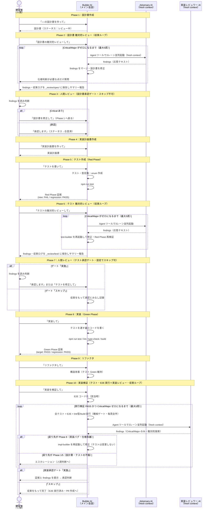

# 開発フロー実践ガイド（社内エンジニア向け）

> **本リポジトリ（work-hub）で読む際の注意**
> 本書のコード例・ファイル配置・コマンドは Next.js + Prisma + MySQL 前提。本リポジトリでの読み替えは `docs/開発プロセス/本リポジトリでの読み替え.md` を参照すること。特に **DB込み結合テストで `truncateAllTables()` による全テーブル削除は使わない**（開発用 DB を共有しているため）。

## 1. このドキュメントの目的

本ドキュメントは、本プロジェクトで採用している **新規機能開発の10フェーズフロー** を、初めて使う開発者が **自分の手で実行できるようになる** ことを目的とする。

### 想定読者

- 本プロジェクトに参加した（する）社内エンジニア
- 機能設計から実装までを Claude Code（AI）と協働で進める前提

### 既存資料との関係

| 資料 | 役割 | 読むタイミング |
|---|---|---|
| **本ドキュメント** | 実践ガイド（手順書）| **最初に読む** |
| `設計から実装までのフロー.md` | フロー定義の正典 | より深く知りたい時 |
| `AGENTS.md` | テスト指針・skill 対応表 | フロー中に都度参照 |

### 完了後にできること

- 自分が担当する機能を Phase 1 から Phase 10 まで運用できる
- どの場面で人間が判断すべきか・AIに任せていいかが分かる
- Adversary レビューを使いこなして AI 主導開発の落とし穴を回避できる

---

## 2. 開発フロー全体図

10フェーズと4つの役割（**人間 / Builder AI / Adversary AI / 実装レビュワー AI**）の関係を示す。



---

## 3. 役割分担の早見表

開発フローには **4つの役割** がある。誰が何をするかを最初に押さえる。

### 3.1 開発者（人間）

主な責務：**判断と承認**。

| やること | 具体例 |
|---|---|
| **開発開始時にフロー設定を決める** | テスト承認（Phase 7）・実装承認（Phase 10 完了時）の人間レビューを実施するかを選ぶ。Phase 3 は必ず実施 |
| 機能の意図を伝える | 「○○画面の設計書を作って」と Builder に依頼 |
| 収束後の findings を読んで判断 | Critical/Major は収束ループで解消済み。人間が見るのは要件の取り違え・業務上の妥当性・優先度 |
| **収束ループ中の仕様判断に答える** | 「設計書に根拠がない」と AI が質問してきた点を決める（AI に推測させない） |
| 仕様の最終承認（Phase 3 / Phase 7 / 実装承認） | ステータス変更を依頼、承認記録を残す |
| ビジネス・業務面の整合性確認 | AI が踏み込めない領域の妥当性判断 |
| つまずいたら止める | 「ここおかしいから戻って」と判断する |

**やらないこと**：

- Builder の代わりにコードを書く（Builder に任せる）
- Adversary の代わりに自分で全網羅レビューする（Adversary に任せて findings を判断する）

### 3.2 Builder AI（メイン会話の Claude）

主な責務：**生成と実行**。

| やること | 具体例 |
|---|---|
| 設計書・実装計画書・テスト・実装コードの生成 | 開発者の指示に応じて成果物を作成 |
| Adversary を Agent ツールで起動 | fresh context として呼び出す |
| Adversary の findings を disk に保存 | `_review/<phase>/findings.md` に Write |
| テスト実行・Lint・型チェック・ビルド | コマンド実行と結果報告 |
| 次フェーズの案内 | 各 Phase 完了時に「次は〇〇です」と提案 |

**やらないこと**：

- Adversary レビューを自分で代行する（fresh context が必須）
- 開発者の承認を自分で代行する（人間の判断ポイントを侵食しない）

### 3.3 Adversary AI（fresh context の Claude）— Phase 2 / 6

主な責務：**設計書・テストの敵対的検証**。

| やること | 具体例 |
|---|---|
| 設計書・テストを批判的にレビュー | 6観点を**3レーンに分けて並列**に評価（1エージェント＝担当2観点を深く） |
| 具体的 findings を返す | severity（Critical / Major / Minor）と該当行を必ず明記 |
| 「全体的によい」を禁止 | 観点ごとに具体評価を出す（甘い PASS は不可）|
| must-catch を毎回確認 | トートロジー・PII 3層・認可2層・Red Phase 証拠など、過去に見落としが起きた項目 |

**重要な制約**：

- **fresh context（新規エージェント）として起動**：Builder の会話履歴・反論を引き継がない
- **Read 専用**：findings の disk 書き出しは Builder が代行する（runtime 制約のため）
- **較正は下げない**：担当が絞られていることも、出力を短くせよという指示も、浅く読んでよい合図ではない
- **収束するまで繰り返し起動される**：Critical/Major がゼロになるまで、修正のたびに差分レビューで再起動される（2周目以降は「前回 findings の解消確認＋修正差分＋must-catch」に限定）

### 3.4 実装レビュワー AI（fresh context の Claude）— Phase 10

主な責務：**実装の最終確認**。Adversary との違いは「**報告の閾値**」だけであり、「**探索の深さ**」ではない。探索は敵対的に行い、報告は実害のある欠陥（Critical / Major）だけに絞る。

| やること | 具体例 |
|---|---|
| 仕様忠実性の確認（レーンA） | 実装と設計書の受け入れ条件を突き合わせ、乖離だけ報告 |
| セキュリティの確認（レーンB） | 認可境界・PII 露出・インジェクション・N+1 |
| **テストのすり抜けの確認（レーンC）** | テストがカバーしている経路を把握 → テストが一度も通っていない分岐・エラー経路・状態遷移・並行/競合を列挙 → そこを重点的に読む |
| Critical / Major のみ報告 | 具体的な失敗シナリオを1文で書けない指摘はしない |

**重要な制約**：

- fresh context・Read 専用は Adversary と同じ
- **命名・構造・スタイル・別解提案は報告しない**（構造品質は Phase 9 の責務）
- **「テストが通っているから大丈夫」を根拠にしない**（最も警戒すべき推論）
- 指摘ゼロは正当な結果（ただし「何を確認したか」＋「列挙した未検証経路」の裏付け必須）

> **なぜレーンCを置くか：** 2026-07-20 の改訂でレビューを「通常較正」に下げたところ、実行検証（全テスト PASS）をすり抜ける不具合の見落としが発生した。報告を絞ること自体は正しかったが、探索まで浅くしたのが誤りだった。現在は探索を敵対的に戻し、「テストが見ていない経路」を専門に探すレーンを追加している。

---

## 4. 各フェーズの実践手順

各フェーズは以下の統一フォーマットで記述する：

- **開発者の役割**：観察 / 操作 / 判断 / 承認 のいずれか
- **入力**：前フェーズから受け取るもの
- **開発者のアクション**：実際に何をすればよいか（発話例つき）
- **出力**：このフェーズの成果物
- **次フェーズへ進む条件**：ゲート判定

---

### 前段：開発開始の受付とフロー設定

| 項目 | 内容 |
|---|---|
| **開発者の役割** | **判断**（人間レビューをどこに置くかを決める） |
| **入力** | 機能の要件・アイデア |
| **開発者のアクション** | 「**○○機能の開発を始めたいです**」と依頼。Builder から次の2点を聞かれるので選ぶ：<br/>1. **テスト承認ゲート（Phase 7）**：実施 / スキップ<br/>2. **実装承認ゲート（Phase 10 完了時）**：実施 / スキップ<br/>あわせて運用モード（厳格 / lean）と、grilling による要件深掘りの要否を選ぶ |
| **出力** | `docs/設計/<機能名>/_flow-config.md`（フロー設定）+ `docs/要件/<機能名>_要件メモ.md` |
| **次フェーズ条件** | フロー設定と要件メモが生成されている |

**選び方の目安**：

| 状況 | おすすめ設定 |
|---|---|
| 認可・PII・金銭など影響度トリガーに該当する機能 | 両方「実施」（人間がテスト内容を確認する価値が最も高い） |
| 既存パターンの踏襲・影響範囲が小さい機能 | 両方「スキップ」でもよい（AI の収束ループが代替する） |
| 手離れを良くしたいが品質は落としたくない | テスト承認「実施」＋実装承認「スキップ」（テストさえ正しければ実装は機械検証で担保できる） |

**スキップは「省略」ではない**：スキップした場合、テスト観点は AI がチェックリストに沿って全件起案し、Adversary レビューで Critical/Major ゼロまで収束させてから凍結する。また Major を「文書化のみで通過」させることができなくなる（完全ゼロ化が必須）。**設計書承認（Phase 3）はスキップできない**——「何を作るか」は人間にしか決められないため。

---

### Phase 1：設計書作成

| 項目 | 内容 |
|---|---|
| **開発者の役割** | 操作（指示出し）+ 観察 |
| **入力** | 機能要件・利用フロー・画面モック等 |
| **開発者のアクション** | Builder に「**○○の設計書を作って**」と依頼。Builder から「単発利用 or フロー利用？」と聞かれたら「**フロー利用**」と答える。提示された構成案を確認し、機能特性に合わせて項目の追加・削減を依頼してもよい |
| **出力** | `docs/設計/<画面名>/<画面名>_設計書.md`（ステータス：レビュー中） |
| **次フェーズ条件** | 設計書ファイルが生成されている |

**コツ**：要件・画面モック等の参考資料があれば、Builder に最初に渡す。後から見つかると修正コストが上がる。

---

### Phase 2：設計書 敵対的レビュー（収束ループ）

| 項目 | 内容 |
|---|---|
| **開発者の役割** | 操作（指示出し）+ 観察 + **仕様判断への回答** |
| **入力** | Phase 1 の設計書 |
| **開発者のアクション** | Builder に「**設計書の敵対的レビューして**」と依頼。Builder が Adversary を**3レーン並列**で fresh context 起動し、findings をマージして修正 → 差分再レビュー、を **Critical/Major がゼロになるまで**繰り返す。**自分でAdversaryと会話しない**。ループ中、Builder が「設計書に根拠がなく決めが必要」と質問してきたら回答する（推奨案が添えられている） |
| **出力** | `_review/spec/findings.md` + `_review/spec/review-log.md`（各周の件数と解消状況） |
| **次フェーズ条件** | 収束（Critical 0・Major 0）またはエスカレーション報告が届いている |

**注意**：収束ループは最大5周。上限到達・振動・要件の見直しが必要な場合は、Builder がループを止めて状況を報告してくる。その場合は方針を判断する。

---

### Phase 3：人間レビュー（設計書承認ゲート）※スキップ不可

| 項目 | 内容 |
|---|---|
| **開発者の役割** | **判断 + 承認**（このフェーズは人間が主役） |
| **入力** | 収束済みの設計書 + Phase 2 の findings・収束ログ |
| **開発者のアクション** | findings と設計書を **自分の目で読む**。Critical/Major は収束ループで解消済みなので、ここで見るのは **AI には判定できない種類のこと**——要件の取り違え・業務上の妥当性・優先度・スコープ。以下のいずれかを選択：<br/>1. 「**設計書を修正して。○○が業務実態と違う**」 → Phase 1 に戻る<br/>2. 「**承認します**」 → Builder が設計書ステータスを「合意済」に更新<br/>3. 「**この未決事項は次回 MTG で決める**」 → 未決事項テーブルに追記して通過 |
| **出力** | 設計書ステータス「合意済」+ findings.md に Phase 3 判定セクションが追記される |
| **次フェーズ条件** | 開発者の承認 |

**コツ**：このゲートは唯一スキップできない。以降のフェーズはすべて「設計書に対して正しいか」を検証するだけなので、**設計書が間違っていれば全部が無駄になる**。テストの期待値を確定させる未決事項（カラム名・orderBy・enum のフォールバック等）はここで必ず潰す。

---

### Phase 4：実装計画書作成

| 項目 | 内容 |
|---|---|
| **開発者の役割** | 操作（指示出し）+ 観察 |
| **入力** | 合意済み設計書 |
| **開発者のアクション** | 「**実装計画書を作って**」と依頼。Builder から「フル10フェーズ運用 or lean 運用？」を確認される。lean は Phase 4・Phase 9 を省略可。プロトタイプや MVP 検証なら lean を選ぶ |
| **出力** | `docs/設計/<画面名>/<画面名>_実装計画.md` |
| **次フェーズ条件** | 実装計画書が生成され、Phase 0（前提タスク）のブロック状況が分かっている |

**注意**：実装計画書には **Phase 0（前提タスク・他PR/他機能依存）** が含まれる。ブロックされている項目があると Phase 8 が完全実施できないため、ここでブロック状況を把握しておく。

---

### Phase 5：テスト作成（Red Phase）

| 項目 | 内容 |
|---|---|
| **開発者の役割** | 操作（指示出し）+ 観察 |
| **入力** | 合意済み設計書 + 実装計画書 |
| **開発者のアクション** | 「**テストを書いて**」と依頼。Builder が以下を実施：<br/>- 必要な enum 定数・型定義（実装ロジック以外）の追加<br/>- Vitest テストファイル作成（種別ごとに分離。下記「テスト種別の分け方」参照）<br/>- `npm run test` 実行<br/>- Red Phase 証拠の記録 |
| **出力** | テストファイル一式 + `_review/test/red-phase-evidence.md` |
| **次フェーズ条件** | **新規テスト全件 FAIL + 既存テスト全件 PASS** |

**テスト種別の分け方（policy doc / AGENTS.md 準拠）**

policy doc 「テスト自動化の方針」の分類に従い、**種別ごとに別ファイル** で書く：

| 対象コード | テスト種別 | ファイル配置例 | 実行コマンド |
|---|---|---|---|
| API Route Handler（`route.ts`）| **結合テスト（内部）** | `src/app/api/<endpoint>/__tests__/route.test.ts` | `npm run test` |
| ヘルパー関数（`buildXxxWhere`, `buildCsvRow` 等） | **単体テスト** | `src/app/api/<endpoint>/_lib/__tests__/<関数名>.test.ts` | `npm run test` |
| ユーティリティ関数（`_utils/` 配下）| **単体テスト** | `src/app/_utils/__tests__/<関数名>.test.ts` | `npm run test` |
| サービス層のビジネスロジック | **単体テスト** | サービス近傍の `__tests__/` | `npm run test` |
| DB制約・実JOIN・トランザクション検証 | **結合テスト（DB込み）** | `src/app/api/<endpoint>/__tests__/<対象>.integration.test.ts` | `npm run test:integration` |

**DB込み結合テストの判断基準**：以下のいずれかに該当する場合、`*.integration.test.ts` を追加する。

- ユニーク制約や外部キー制約の正しさを検証する必要がある
- 実DBに対するJOINクエリ（`is_deleted` フィルタ等のリレーション条件）の動作を確認する必要がある
- トランザクション（`prisma.$transaction`）の原子性を検証する必要がある
- モックでは再現が困難な状態遷移（ログインロック等）を検証する必要がある

DB込みテストのヘルパーは `src/test/db-helpers.ts` を参照（`truncateAllTables`, `createTestCompany`, `createTestCompanyLogin` 等）。サンプル実装は `src/app/api/_services/__tests__/auth.integration.test.ts` を参照。

**重要原則**：

- **テストが PASS してしまったらおかしい**。実装が無いのに通るテストはトートロジー。Builder に書き直しを依頼する
- 既存テストが FAIL したら **本機能と無関係な flaky test** か確認。本機能由来なら必ず原因を潰す
- このフェーズで実装コードは書かない（Phase 8 の責務）
- **設計書に登場するヘルパー関数ごとに独立した単体テストファイルを必ず作る**。Route Handler のテストだけだと条件分岐の網羅が不十分になりやすい

---

### Phase 6：テスト 敵対的レビュー（収束ループ）

| 項目 | 内容 |
|---|---|
| **開発者の役割** | 操作（指示出し）+ 観察 |
| **入力** | Phase 5 のテストファイル + 設計書 + Red Phase 証拠 +（該当時）観点表 |
| **開発者のアクション** | 「**テストの敵対的レビューして**」と依頼。Adversary が **3レーン並列**で批判する：<br/>**レーンA（欺瞞性）**：トートロジーになっていないか（モックが返さないだけで「除外できている」と誤認していないか）／実装詳細を縛りすぎていないか<br/>**レーンB（仕様対応）**：受け入れ条件 vs テストの対応マトリクス／エッジケース・例外系の網羅<br/>**レーンC（セキュリティと証拠）**：PII 3層・認可2層・N+1・既存規約整合／Red Phase log の妥当性<br/>その後、`test-builder` による修正 → 差分再レビューを **Critical/Major がゼロになるまで**繰り返す |
| **出力** | `_review/test/findings.md` + `_review/test/review-log.md` |
| **次フェーズ条件** | 収束（Critical 0・Major 0）またはエスカレーション報告が届いている |

**実例の警告**：本フローの検証で **Builder が書いた PII 除外テストがトートロジー** だった事例がある。Adversary はこれを検出した。Phase 6 を省略すると見逃す。

**注意**：設計書の不備が原因の指摘（テストでは直せないもの）が出た場合、Builder はループを止めて報告してくる。その場合は Phase 1/3 への差し戻しを判断する。

---

### Phase 7：人間レビュー（テスト承認ゲート）※フロー設定でスキップ可

| 項目 | 内容 |
|---|---|
| **開発者の役割** | **判断 + 承認**（スキップ設定時は不要） |
| **入力** | 収束済みテスト + Phase 6 の findings・収束ログ |
| **開発者のアクション** | **「実施」設定の場合**：findings を読み、以下のいずれか：<br/>1. 「**テストを修正して**」 → Phase 5 に戻る<br/>2. 「**承認します**」 → Phase 8 に進む<br/>3. 「**この Major は文書化のみで通過**」 → lean 運用のみ可<br/>**「スキップ」設定の場合**：Builder が収束をもって承認とみなし、記録して Phase 8 へ進む |
| **出力** | findings.md に Phase 7 判定セクション（またはスキップ記録）追記 |
| **次フェーズ条件** | 開発者の承認、またはスキップ設定下での収束 |

**コツ**：トートロジー指摘（Critical 級）は絶対に修正する。実装が間違っていてもテストが通ってしまう構造はバグ温床。**スキップ設定でも Critical/Major はゼロ化されている**——ここで人間が見るのは「テストの意図が業務上の期待と合っているか」という、AI には判定しづらい部分。

---

### Phase 8：実装（Green Phase）

| 項目 | 内容 |
|---|---|
| **開発者の役割** | 操作（指示出し）+ 観察 |
| **入力** | 承認済みテスト + 設計書 |
| **開発者のアクション** | 「**実装して**」「**Green Phase に入って**」と依頼。Builder がテストを通す **最小限のコード** を書く |
| **出力** | 実装コード + `_review/test/green-phase-evidence.md`（target/regression 両方 PASS のマーカー）+ Lint/型チェック/ビルド成功ログ |
| **次フェーズ条件** | **対象機能テスト全件 PASS + 既存テスト全件 PASS + Lint/型チェック/ビルド OK** |

**実行すべき検証コマンド**：

```bash
npm run test              # 単体テスト + 結合テスト（内部）
npm run test:integration  # 結合テスト（DB込み）※ テストDBが起動している場合
npm run lint              # ESLint
npm run check-types       # TypeScript 型チェック
npm run build             # ビルド
```

DB込み結合テスト（`*.integration.test.ts`）が Phase 5 で作成されている場合は、`npm run test:integration` も必ず実行して PASS を確認すること。

**重要原則**：

- 過剰な抽象化・将来拡張は禁止（Phase 9 で別途リファクタする）
- テストが通らない場合：原則は **実装を直す**。テストを変えるのは「テストが仕様を表現できていない」と判明した時だけ
- 前提タスク（Phase 0）がブロック中ならここで作業が止まる。ブロック解除を待つ

---

### Phase 9：リファクタ

| 項目 | 内容 |
|---|---|
| **開発者の役割** | 操作（指示出し）+ 観察 |
| **入力** | Phase 8 の実装コード |
| **開発者のアクション** | 「**リファクタして**」と依頼。Builder が以下を実施：<br/>- （TS/JS時）**fallow** で候補を機械抽出（参考・非ゲート）<br/>- 重複削除（DRY）<br/>- 命名改善・責務分離<br/>- 抽象度の調整<br/>- リファクタ前後で全テスト Green 維持 |
| **出力** | リファクタ後のコード（テスト Green 維持） |
| **次フェーズ条件** | リファクタ前後で全テスト PASS |

**lean 運用**：簡単な機能（行数少・依存少）ならスキップ可。

---

### Phase 10：実装検証（テスト・E2E 実行＋実装レビュー）

| 項目 | 内容 |
|---|---|
| **開発者の役割** | 操作（指示出し）+ 判断 |
| **入力** | リファクタ後のコード + テスト + 設計書 +（該当時）Phase 5 で凍結した E2E シナリオ仕様 |
| **開発者のアクション** | 「**実装を検証して**」と依頼。Builder が以下を実施：<br/>1. E2E コード化（クリティカルパス該当時。凍結済み仕様の改変は禁止）<br/>2. **実行検証（主ゲート）**：全テスト + E2E（当該機能分＋常設スイート）+ lint / 型 / build を自ら実行<br/>3. **実装レビュー（従ゲート・3レーン並列）**：実装レビュワーを fresh context で起動し、仕様忠実性・セキュリティ・**テストのすり抜け**を敵対的に探索（報告は Critical/Major のみ）<br/>4. **収束ループ**：実行検証 PASS かつ Critical/Major ゼロになるまで、`impl-builder` による修正 → 差分再検証を繰り返す |
| **出力** | `_review/impl/verification-evidence.md`（実行検証の証拠）+ `_review/impl/findings.md` + `_review/impl/review-log.md` |
| **次フェーズ条件** | **収束**：実装承認ゲート（設定で実施 / スキップ）へ / **エスカレーション**：フィードバックルーティングで該当 Phase に戻る |

**収束ループ中**：実行検証は毎周全件行うが、レビューは「前回 findings の解消確認＋修正差分＋must-catch」のみ（新規の指摘を積み増さない）。

### フィードバックルーティング

失敗・findings の種類で戻り先を判定。**Phase 8 に戻るものは収束ループ内で自動的に解消され、それ以外は人間に上がってくる**：

| 失敗・findings の種類 | 戻り先 | ループ内で解消 |
|---|---|---|
| テスト・E2E の実行失敗（実装バグ） | Phase 8（実装） | ✅ |
| 仕様乖離・セキュリティ欠陥 | Phase 8（実装） | ✅ |
| lint / 型 / build の失敗 | Phase 8（実装） | ✅ |
| テスト不備 | Phase 5（テスト） | ❌ 人間へ |
| エッジケース欠落 | Phase 1 + Phase 5 | ❌ 人間へ |
| 仕様の曖昧性 | Phase 1（設計書） | ❌ 人間へ |

※再発防止テストは、人間の判断のうえ Phase 5 にも追加する。

---

### 実装承認ゲート（Phase 10 完了時）※フロー設定でスキップ可

| 項目 | 内容 |
|---|---|
| **開発者の役割** | **判断 + 承認**（スキップ設定時は不要） |
| **入力** | 収束済みの実装 + 実行検証証拠 + findings・収束ログ |
| **開発者のアクション** | **「実施」設定の場合**：証拠と findings を確認し、「**実装を承認します**」または差し戻しを指示<br/>**「スキップ」設定の場合**：Builder が収束をもって完了とし、PR 作成へ案内する |
| **出力** | findings.md に承認記録（またはスキップ記録） |
| **次フェーズ条件** | 承認、またはスキップ設定下での収束 |

---

### E2Eテストの実施タイミング

E2E テスト（Playwright）は **Phase 10 の中で実行する（必須ゲート）**。仕様の凍結とコード化のタイミングが分かれている点に注意：

| 項目 | 内容 |
|---|---|
| **仕様の凍結** | Phase 5（クリティカルパス該当分は AI が設計書を根拠に操作手順・期待結果を全件起案 → Adversary レビュー → 人間が修正・承認して確定） |
| **コード化** | Phase 10 の実行検証の前（Builder が凍結済み仕様を Playwright コード化。仕様の改変は禁止） |
| **実行** | Phase 10 の実行検証ゲート：当該機能の E2E ＋ 既存の自動化済み E2E 全件（クリティカルパス常設スイート）を `npm run test:e2e` で全件 PASS 確認 |
| **ファイル配置** | `tests/<機能名>.spec.ts` |
| **CI** | `playwright.yml` で PR 作成時にも自動実行される |

コード化を Phase 5 でなく Phase 10 で行う理由：実装前は画面が存在せず E2E が一括失敗し、失敗理由を区別できないため（セレクタも実装後でないと書けない）。ただし**仕様（操作手順・期待結果）は Phase 5 で凍結**し、実装に合わせたテストの書き換えを防ぐ。

---

## 5. 落とし穴とよくあるつまずき

実走で発見された典型パターン。事前に知っておくと回避できる。

| つまずき | 症状 | 対策 |
|---|---|---|
| **未決事項のまま Phase 5 に進む** | テストが仕様の曖昧さを固定化してしまい、Phase 6 で「実装に合わせ込み可能」と指摘される | Phase 3 承認時にテスト記述に直接関わる未決事項（カラム名・orderBy・enum 値など）は確定させる |
| **Adversary をメイン会話で実行** | Adversary が Builder の主張を引き継いで甘い判定を出す | 必ず Builder に「Adversary を起動して」と依頼。Builder が Agent ツール経由で fresh context として起動する |
| **モックが PII を返さないことを「除外できた」と誤認** | テストは PASS するが、実装が PII を漏らしても検出されないトートロジー | モックに **意図的に PII を含めて返却**し、整形ロジックが弾くことを assert する |
| **既存実装の構造確認漏れ** | 既存規約（`apiHandler` ラッパー等）と整合しないテストを書いてしまう | Phase 5 の最初に既存類似 API の `route.ts` を読む |
| **Critical を素通しする** | Phase 6/10 で同じ問題が必ず再指摘される | 収束ループで Critical/Major はゼロ化される。Minor は lean なら記録のみ可 |
| **レビューが遅いので「批判的観点」を外す** | 一見速くなるが、実行検証をすり抜ける不具合を見落とす（実走で発生） | 較正は下げず、観点レーン分割による並列化・出力予算（Minor は1行）・差分レビューで短縮する |
| **収束ループが回り続けて終わらない** | 同じ指摘が消えない／修正のたびに新しい Critical が出る（振動） | 5周で自動的にエスカレーションされる。振動は「設計書側に原因がある」サインなので Phase 1/3 を疑う |
| **人間レビューをスキップしたら品質が落ちた** | AI が自分の起案した観点表を自分で承認していた | スキップ時は AI 起案の観点表を必ず Adversary レビューで収束させる（`flow-review-policy` 1.3）。仮置きが残る場合は人間確認が必須 |
| **Red Phase 証拠が import エラーで全テスト未実行** | トートロジー検出できず Phase 6 まで持ち越す | スタブ最小実装で個別テストが個別失敗するログを取る、または Phase 6 で集中検出する |
| **Adversary の findings を Builder が書き出せず流れる** | findings.md が disk に残らない | 既知の harness 制約。Builder（メイン会話AI）が応答テキストを Write する運用が標準 |

---

## 6. 最初に試すなら（小さく始めるガイド）

### 6.1 おすすめの題材

最初は **小さく・典型的な機能** から始める。例：

- 既存パターン豊富な「一覧画面」
- API + 単純な検索条件
- フロント側はテスト対象外で済む構成

避けるべき題材：

- 横断的なリファクタ（影響範囲読みづらい）
- 複数チームに跨る複雑な機能
- 仕様未確定が多すぎる新規領域

### 6.2 lean 運用で省略可能なフェーズ

| Phase | 省略可否 |
|---|---|
| Phase 4 実装計画書 | **省略可**（小機能・依存少なら不要） |
| Phase 9 リファクタ | **省略可**（明らかに不要なら） |
| Phase 7 テスト承認（人間） | **フロー設定でスキップ可**（AI の収束ループが代替。代償措置あり） |
| 実装承認（人間） | **フロー設定でスキップ可**（同上） |

**省略不可**：Phase 2 / Phase 3 / Phase 5 / Phase 6 / Phase 8 / Phase 10、および各レビューフェーズの**収束ループ**。これらを抜くと品質ゲートが崩れる。

### 6.3 想定タイムライン（試走目安）

| Phase | 1 機能あたりの目安 |
|---|---|
| 前段（要件受付・フロー設定） | 15〜30 分（grilling 実施時は +1 時間程度） |
| Phase 1〜3（設計フェーズ） | 1〜2 時間（収束ループで 2〜3 周回るのが普通） |
| Phase 4（実装計画） | 30 分 |
| Phase 5〜7（テストフェーズ） | 2〜3 時間 |
| Phase 8〜10（実装フェーズ） | 機能規模次第（半日〜数日） |

最初の 1 機能は **手探りで 1 日** 確保するのが現実的。

**時間が気になるときの調整方法**（`flow-review-policy` 2章）：

| やってよい | やってはいけない |
|---|---|
| 観点レーンの並列起動を有効にする（既定で有効） | 「批判的にレビューしないで」と指示する |
| 人間レビューゲートをスキップ設定にする | must-catch チェックを飛ばす |
| lean 運用にして Phase 4・9 を省く | 収束ループを1周で打ち切る |
| Minor の記述を1行に抑える（既定） | レビュー観点を減らす |

### 6.4 つまずいたら

- フロー定義書（`設計から実装までのフロー.md`）の該当 Phase を読む
- それでも解決しなければ社内チャットで相談

---

## 7. 関連資料

### フロー関連

- `docs/開発プロセス/設計から実装までのフロー.md` — フロー定義の正典
- `AGENTS.md` — テスト指針 + ユーザー発話と skill 対応表

### 利用する skill

- `flow-kickoff` — 前段 開発開始の受付・フロー設定
- `flow-phase1-design-doc` — Phase 1 設計書作成
- `flow-phase2-spec-review` — Phase 2 設計書 敵対的レビュー
- `flow-phase4-impl-plan` — Phase 4 実装計画書
- `flow-phase5-tests` — Phase 5 テスト作成
- `flow-phase6-test-review` — Phase 6 テスト 敵対的レビュー
- `flow-phase8-impl` — Phase 8 実装（Green Phase）
- `flow-phase9-refactor` — Phase 9 リファクタ
- `flow-phase10-impl-review` — Phase 10 実装検証（テスト・E2E 実行＋実装レビュー）
- `flow-agent-roles` — 役割定義集（各 skill から参照される部品）
- `flow-review-policy` — レビュー方針の正本（フロー設定・較正不変の原則・レーン割り・must-catch・収束ループ。各 skill から参照される部品）

### 設計書フォーマット

- `docs/設計/設計書フォーマット.md` — 設計書のベースフォーマット
- `docs/設計/共通機能設計書.md` — システム全体共通仕様（存在する場合）
